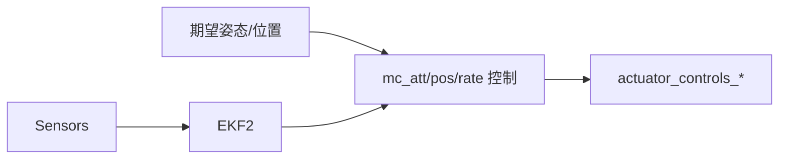

# 控制器（多旋翼/固定翼）

多旋翼姿态与位置控制模块位于 `src/modules/mc_*`；固定翼控制位于 `src/modules/fw_*` 与 `src/lib/tecs` 配合。

- 多旋翼姿态控制初始化与参数更新：`src/modules/mc_att_control/mc_att_control_main.cpp:77-101`
- 位置/速度/率控制模块：`mc_pos_control`、`mc_rate_control`
- 固定翼横纵向控制与模式管理：`fw_*` 系列模块

建议：
- 结合仿真快速验证控制器参数（最大角速度/倾角/推力曲线），并观察 `actuator_controls_*` 输出。

