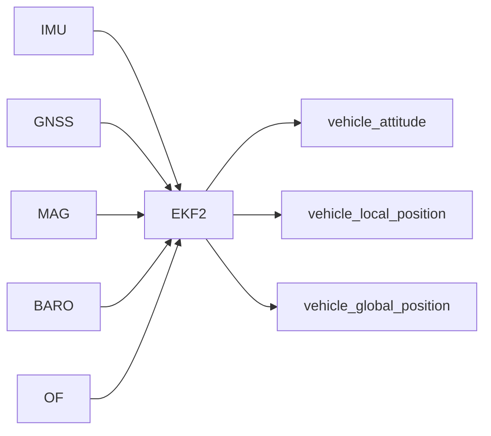

# EKF2 估计

融合 IMU、GNSS、磁力计、气压计、光流等，输出姿态与位置估计。

- 主循环：`src/modules/ekf2/EKF2.cpp:435-481` 处理参数更新、话题广告、回调注册与滤波更新。
- 话题广告（多实例一致性）：`src/modules/ekf2/EKF2.cpp:229-382`
- 参数集与约束：`EKF2.cpp` 中 `_param_ekf2_*` 成员映射到 `px4_parameters.hpp`

上位机视角：
- 通过 `vehicle_odometry` 与 `estimator_*` 主题获取估计状态与创新数据，便于调参与诊断。
- 外部视觉/定位可通过 `VEHICLE_CMD_EXTERNAL_POSITION_ESTIMATE` 注入：`EKF2.cpp:534-558`

