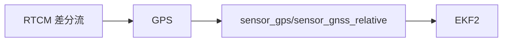

# GPS/RTK

支持多协议（UBX/NMEA/SBF 等）与差分数据注入，形成高精度定位。

- 驱动入口与发布：`src/drivers/gps/gps.cpp:115-160, 190-198`
- 协议设备层：`src/drivers/gps/devices/src/{ubx.h, nmea.h, rtcm.h, sbf.h}`
- 差分注入话题：`msg/GpsInjectData.msg`

建议：
- 上位机通过 MAVLink 或 DDS 注入 RTCM，监控 `sensor_gps` 质量指标与 `estimator_gps_status`。

