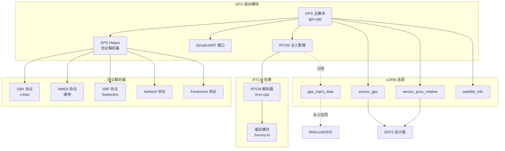
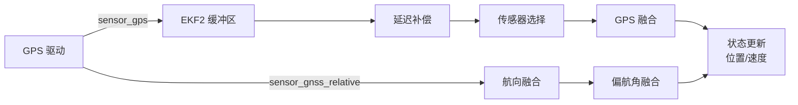

# GPS/RTK 完整教程

## 目录

1. [GPS/GNSS 基础](#1-gpsgnss-基础)
2. [RTK 定位原理](#2-rtk-定位原理)
3. [PX4 GPS 驱动架构](#3-px4-gps-驱动架构)
4. [协议支持](#4-协议支持)
5. [RTCM 协议与差分改正](#5-rtcm-协议与差分改正)
6. [RTK 基站配置](#6-rtk-基站配置)
7. [移动基线 RTK](#7-移动基线-rtk)
8. [GPS 质量评估](#8-gps-质量评估)
9. [与 EKF2 的集成](#9-与-ekf2-的集成)
10. [参数配置](#10-参数配置)
11. [故障诊断与调试](#11-故障诊断与调试)
12. [实战案例](#12-实战案例)
13. [源码导航](#13-源码导航)
14. [完整参数表](#14-完整参数表)
15. [参考资料](#15-参考资料)

---

## 1. GPS/GNSS 基础

### 1.1 GNSS 系统概述

**全球导航卫星系统 (GNSS)** 包括多个卫星星座：
- **GPS** (美国): 最早的系统，31+ 卫星
- **GLONASS** (俄罗斯): 24+ 卫星
- **Galileo** (欧盟): 30 卫星（在建中）
- **BeiDou** (中国): 35+ 卫星
- **QZSS** (日本): 区域增强系统
- **NAVIC/IRNSS** (印度): 区域系统

PX4 支持同时使用多个星座以提高定位精度和可靠性。

### 1.2 定位原理

**基本原理：**
1. **伪距测量**: 卫星发射信号，接收机测量信号传播时间
2. **三边定位**: 至少 4 颗卫星（3 个位置维度 + 1 个时间偏差）
3. **导航方程**:
   ```
   ρᵢ = √[(x - xᵢ)² + (y - yᵢ)² + (z - zᵢ)²] + c·δt + εᵢ
   ```
   其中：
   - ρᵢ: 伪距测量值
   - (x, y, z): 接收机位置（未知）
   - (xᵢ, yᵢ, zᵢ): 卫星 i 的位置（从星历获得）
   - c: 光速
   - δt: 接收机时钟偏差（未知）
   - εᵢ: 测量误差

### 1.3 误差来源

**主要误差来源：**
1. **大气延迟** (~5-30 m)
   - 电离层延迟: 频率相关，可通过双频测量消除
   - 对流层延迟: 可通过模型修正
2. **卫星钟差** (~2 m，广播星历修正后）
3. **星历误差** (~2.5 m)
4. **多径效应** (~1 m，反射信号干扰）
5. **接收机噪声** (~0.3 m)
6. **几何精度衰减 (DOP)**:
   - HDOP: 水平精度衰减因子
   - VDOP: 垂直精度衰减因子
   - GDOP: 几何精度衰减因子

**定位精度：**
- 单点定位 (SPP): 5-15 m (水平), 10-30 m (垂直)
- SBAS 增强: 1-3 m
- 差分 GPS (DGPS): 0.5-2 m
- RTK 浮点解: 0.3-1 m
- **RTK 固定解: 1-2 cm (水平), 2-5 cm (垂直)**

### 1.4 载波相位测量

**载波相位 vs 伪距：**
- **伪距**: 码相位测量，米级精度
- **载波相位**: L1/L2/L5 载波相位测量，毫米级精度
  - L1: 1575.42 MHz → λ = 19 cm
  - L2: 1227.60 MHz → λ = 24 cm

**整周模糊度问题：**
```
φᵢ = (ρᵢ/λ) + Nᵢ + noise
```
- φᵢ: 测量的载波相位（周）
- Nᵢ: 整周模糊度（整数，未知）
- **RTK 的核心任务**: 解算整周模糊度 N

---

## 2. RTK 定位原理

### 2.1 RTK 基本概念

**Real-Time Kinematic (RTK)** 是一种利用载波相位观测值进行实时动态相对定位的技术。

**核心思想：**
1. **基站 (Base Station)**: 位置已知，接收 GNSS 信号
2. **移动站 (Rover)**: 位置未知，接收 GNSS 信号 + 基站改正数据
3. **差分消除误差**: 基站与移动站观测相同卫星，大部分误差相关
4. **整周模糊度解算**: 通过双差/三差观测量固定整周模糊度

### 2.2 差分观测量

**单差 (Single Difference)**:
```
∇φᵢⱼ = φᵢʳ - φᵢᵇ = (ρᵢʳ - ρᵢᵇ)/λ + Nᵢ + noise
```
- 消除卫星钟差
- r: rover (移动站), b: base (基站)

**双差 (Double Difference)**:
```
∇Δφᵢⱼ = (φᵢʳ - φᵢᵇ) - (φⱼʳ - φⱼᵇ)
```
- 消除卫星钟差 + 接收机钟差
- 这是 RTK 使用的主要观测量

**三差 (Triple Difference)**:
```
∇Δδφᵢⱼ = ∇Δφᵢⱼ(t₂) - ∇Δφᵢⱼ(t₁)
```
- 消除整周模糊度，用于周跳检测

### 2.3 整周模糊度解算

**解算步骤：**
1. **浮点解 (Float Solution)**: 将整周模糊度作为实数解算
   - 使用最小二乘法或卡尔曼滤波
   - 精度: 0.3-1 m
2. **整数搜索 (Integer Search)**: 将浮点解固定为整数
   - LAMBDA 算法 (Least-squares AMBiguity Decorrelation Adjustment)
   - 候选集搜索和验证
3. **固定解 (Fixed Solution)**: 使用固定的整周模糊度计算精确位置
   - 精度: 1-2 cm

**Ratio Test (比值检验)**:
```
ratio = χ²(second_best) / χ²(best)
```
- ratio > threshold (通常 3.0) → 固定解可靠
- ratio < threshold → 保持浮点解

### 2.4 RTK 限制条件

**基线长度限制：**
- **<10 km**: 最佳性能，厘米级精度
- **10-20 km**: 良好性能，可能需要更长初始化时间
- **20-50 km**: 性能下降，需要网络 RTK 或精密星历
- **>50 km**: 大气误差不再相关，精度显著下降

**初始化时间：**
- **静态**: 30 秒 - 2 分钟
- **动态**: 1-5 分钟（取决于运动情况）
- **快速重新初始化**: 5-30 秒（周跳后）

---

## 3. PX4 GPS 驱动架构

### 3.1 驱动总体架构



**代码位置**: `src/drivers/gps/gps.cpp:115-250`

### 3.2 GPS 主模块

**GPS 类结构** (`src/drivers/gps/gps.cpp:115-170`):
```cpp
class GPS : public ModuleBase<GPS>, public device::Device
{
public:
    enum class Instance : uint8_t {
        Main = 0,      // 主 GPS
        Secondary,     // 次 GPS (冗余)
        Count
    };

private:
    Serial              _uart {};                  // UART 接口
    unsigned            _baudrate{0};              // 当前波特率
    GPSHelper::Interface _interface;               // UART/SPI
    GPSHelper           *_helper{nullptr};         // 协议解析器实例

    sensor_gps_s        _sensor_gps{};            // GPS 位置数据
    satellite_info_s    *_p_report_sat_info{nullptr}; // 卫星信息

    // uORB 发布者
    uORB::PublicationMulti<sensor_gps_s> _sensor_gps_pub{ORB_ID(sensor_gps)};
    uORB::PublicationMulti<sensor_gnss_relative_s> _sensor_gnss_relative_pub{
        ORB_ID(sensor_gnss_relative)};

    // RTCM 注入订阅
    uORB::SubscriptionMultiArray<gps_inject_data_s,
        gps_inject_data_s::MAX_INSTANCES> _orb_inject_data_sub{
            ORB_ID::gps_inject_data};

    float               _rate{0.0f};               // 位置更新频率
    float               _rtcm_injection_rate{0.0f}; // RTCM 注入频率
};
```

### 3.3 驱动工作流程

**主循环** (`src/drivers/gps/gps.cpp` 中的 `run()` 方法):
```cpp
void GPS::run()
{
    // 1. 配置 GPS 接收机（波特率、协议、输出频率）
    if (_helper->configure(_baudrate, config) == 0) {
        _configured = true;
    }

    // 主循环
    while (!should_exit()) {
        // 2. 处理 RTCM 注入数据（如果有）
        handleInjectDataTopic();

        // 3. 从 GPS 接收机读取数据
        int ret = _helper->receive(TIMEOUT_5HZ);

        if (ret > 0) {
            // 4. 发布 GPS 位置数据
            publish();

            // 5. 发布卫星信息
            if (_p_report_sat_info != nullptr) {
                publishSatelliteInfo();
            }

            // 6. 处理相对定位数据（Moving Baseline）
            // （由回调函数 publishRelativePosition 处理）
        }

        // 7. 检查超时和健康状态
        checkTimeout();
    }
}
```

### 3.4 回调机制

**GPS 回调类型** (`src/drivers/gps/devices/src/gps_helper.h:59-117`):
```cpp
enum class GPSCallbackType {
    readDeviceData,              // 从设备读取数据（阻塞）
    writeDeviceData,             // 向设备写入数据
    setBaudrate,                 // 设置波特率
    gotRTCMMessage,              // 接收到 RTCM 消息（基站模式）
    gotRelativePositionMessage,  // 接收到相对定位消息（Moving Baseline）
    surveyInStatus,              // Survey-In 状态更新
    setClock,                    // 设置系统时钟
};
```

**回调处理** (`src/drivers/gps/gps.cpp:390-463`):
```cpp
int GPS::callback(GPSCallbackType type, void *data1, int data2, void *user)
{
    GPS *gps = (GPS *)user;

    switch (type) {
    case GPSCallbackType::readDeviceData:
        // 从 UART 读取数据，超时返回 0
        return gps->pollOrRead((uint8_t *)data1, (size_t)data2, timeout);

    case GPSCallbackType::writeDeviceData:
        // 向 UART 写入数据
        return gps->_uart.write((void *)data1, (size_t)data2);

    case GPSCallbackType::gotRTCMMessage:
        // 基站模式：发布 RTCM 改正数据
        gps->publishRTCMCorrections((uint8_t *)data1, (size_t)data2);
        break;

    case GPSCallbackType::gotRelativePositionMessage:
        // Moving Baseline: 发布相对定位数据
        if (data1 && data2 == sizeof(sensor_gnss_relative_s)) {
            gps->publishRelativePosition(*static_cast<sensor_gnss_relative_s *>(data1));
        }
        break;
    }
    return 0;
}
```

---

## 4. 协议支持

### 4.1 支持的协议

PX4 GPS 驱动支持多种 GNSS 接收机协议：

| 协议 | 制造商 | 特点 | 文件 |
|------|--------|------|------|
| **UBX** | u-blox | 最常用，RTK 支持完善 | `ubx.h/cpp` |
| **NMEA** | 通用 | 标准协议，兼容性好 | `nmea.h/cpp` |
| **SBF** | Septentrio | 高精度，专业级 | `sbf.h/cpp` |
| **Ashtech** | Ashtech | 专业级接收机 | `ashtech.h/cpp` |
| **MTK** | MediaTek | 低成本模块 | `mtk.h/cpp` |
| **Femtomes** | Femtomes | 高精度 RTK | `femtomes.h/cpp` |

**自动检测机制**: 驱动会尝试所有协议，选择第一个响应的协议。

### 4.2 UBX 协议详解

**UBX 消息格式**:
```
[SYNC1][SYNC2][CLASS][ID][LENGTH_L][LENGTH_H][PAYLOAD...][CRC_A][CRC_B]
 0xB5   0x62   1 byte 1 byte  2 bytes         N bytes      2 bytes
```

**关键消息类型** (`src/drivers/gps/devices/src/ubx.h:68-130`):
```cpp
// 消息类
#define UBX_CLASS_NAV    0x01  // 导航数据
#define UBX_CLASS_RXM    0x02  // 接收机管理
#define UBX_CLASS_CFG    0x06  // 配置
#define UBX_CLASS_RTCM3  0xF5  // RTCM3 输出

// 导航消息
#define UBX_ID_NAV_PVT        0x07  // 位置、速度、时间（主要消息）
#define UBX_ID_NAV_SAT        0x35  // 卫星信息
#define UBX_ID_NAV_RELPOSNED  0x3C  // 相对位置 (Moving Baseline)
#define UBX_ID_NAV_SVIN       0x3B  // Survey-In 状态

// RTCM3 消息 (基站输出)
#define UBX_ID_RTCM3_1005  0x05  // 基站坐标 (ARP)
#define UBX_ID_RTCM3_1077  0x4D  // GPS MSM7 (高精度)
#define UBX_ID_RTCM3_1087  0x57  // GLONASS MSM7
#define UBX_ID_RTCM3_1097  0x61  // Galileo MSM7
#define UBX_ID_RTCM3_1127  0x7F  // BeiDou MSM7
```

**配置 UBX 接收机** (`src/drivers/gps/devices/src/ubx.cpp:90-250`):
```cpp
int GPSDriverUBX::configure(unsigned &baudrate, const GPSConfig &config)
{
    // 1. 自动检测波特率
    const unsigned baudrates[] = {38400, 57600, 9600, 115200, 230400, 460800, 921600};

    for (unsigned test_baudrate : baudrates) {
        setBaudrate(test_baudrate);

        // 2. 尝试新协议 (CFG-VALSET for protocol version 27+)
        if (sendMessage(UBX_MSG_CFG_VALSET, ...) == 0) {
            _proto_ver_27_or_higher = true;
            // 配置波特率、协议等
            cfgValset<uint32_t>(UBX_CFG_KEY_CFG_UART1_BAUDRATE, desired_baudrate, ...);
            break;
        } else {
            // 3. 使用旧协议 (CFG-PRT)
            ubx_payload_tx_cfg_prt_t cfg_prt;
            cfg_prt.baudRate = desired_baudrate;
            cfg_prt.inProtoMask = UBX_TX_CFG_PRT_PROTO_UBX | UBX_TX_CFG_PRT_PROTO_RTCM;
            sendMessage(UBX_MSG_CFG_PRT, ...);
        }
    }

    // 4. 配置输出频率、GNSS 系统、动力学模型等
    configureDevice(config);

    return 0;
}
```

### 4.3 NAV-PVT 消息解析

**NAV-PVT (Position Velocity Time)** 是最重要的输出消息：

```cpp
// UBX NAV-PVT payload structure
struct ubx_payload_rx_nav_pvt_t {
    uint32_t iTOW;           // GPS 周内秒 (ms)
    uint16_t year;           // UTC 年
    uint8_t month;           // UTC 月
    uint8_t day;             // UTC 日
    uint8_t hour, min, sec;  // UTC 时间
    uint8_t valid;           // 有效性标志
    uint32_t tAcc;           // 时间精度估计 (ns)
    int32_t nano;            // 纳秒部分 (UTC)
    uint8_t fixType;         // 定位类型
    uint8_t flags;           // 定位标志
    uint8_t flags2;          // 额外标志
    uint8_t numSV;           // 使用的卫星数
    int32_t lon;             // 经度 (1e-7 deg)
    int32_t lat;             // 纬度 (1e-7 deg)
    int32_t height;          // 椭球高 (mm)
    int32_t hMSL;            // 海拔高 (mm)
    uint32_t hAcc;           // 水平精度 (mm)
    uint32_t vAcc;           // 垂直精度 (mm)
    int32_t velN, velE, velD; // NED 速度 (mm/s)
    int32_t gSpeed;          // 地速 (mm/s)
    int32_t headMot;         // 运动方向 (1e-5 deg)
    uint32_t sAcc;           // 速度精度 (mm/s)
    uint32_t headAcc;        // 航向精度 (1e-5 deg)
    uint16_t pDOP;           // 位置 DOP (0.01)
    uint8_t flags3;          // 额外标志
    int32_t headVeh;         // 车辆航向 (1e-5 deg, 双天线)
};
```

**Fix Type 定义** (`msg/SensorGps.msg:15-21`):
```cpp
uint8_t FIX_TYPE_NONE                   = 1
uint8_t FIX_TYPE_2D                     = 2
uint8_t FIX_TYPE_3D                     = 3
uint8_t FIX_TYPE_RTCM_CODE_DIFFERENTIAL = 4  // DGPS
uint8_t FIX_TYPE_RTK_FLOAT              = 5  // RTK 浮点解
uint8_t FIX_TYPE_RTK_FIXED              = 6  // RTK 固定解
uint8_t FIX_TYPE_EXTRAPOLATED           = 8  // 推算
```

---

## 5. RTCM 协议与差分改正

### 5.1 RTCM 协议概述

**RTCM (Radio Technical Commission for Maritime Services)** 是一种标准的 GNSS 差分改正数据格式。

**RTCM3 消息格式**:
```
[Preamble][Reserved][Message Length][Message Type][Message Data][CRC-24]
  0xD3      6 bits      10 bits       12 bits       N bytes       3 bytes
```

**代码实现** (`src/drivers/gps/devices/src/rtcm.h:38-75`):
```cpp
#define RTCM3_PREAMBLE 0xD3

class RTCMParsing {
public:
    bool addByte(uint8_t b);      // 逐字节添加，返回 true 表示消息完整
    uint8_t *message() const;     // 获取消息指针
    uint16_t messageLength() const;
    uint16_t messageId() const;   // 消息类型 ID

private:
    uint32_t crc24(const uint8_t *buffer, const uint16_t len); // CRC-24Q 校验
    uint8_t  *_buffer{nullptr};
    uint16_t _pos{};              // 当前位置
    uint16_t _message_length{};   // 消息长度
    bool     _preamble_received{false};
};
```

### 5.2 RTCM 解析实现

**逐字节解析** (`src/drivers/gps/devices/src/rtcm.cpp:59-113`):
```cpp
bool RTCMParsing::addByte(uint8_t b)
{
    // 1. 等待前导码
    if (!_preamble_received) {
        if (b == RTCM3_PREAMBLE) {
            _preamble_received = true;
        } else {
            return false;
        }
    }

    _buffer[_pos++] = b;

    // 2. 解析消息长度（第 2-3 字节）
    if (_pos == 3) {
        _message_length = (((uint16_t)_buffer[1] & 3) << 8) | (_buffer[2]);

        // 动态分配缓冲区
        if (_message_length + 6 > _buffer_len) {
            reallocateBuffer(_message_length + 6);
        }
    }

    // 3. 接收完整消息后验证 CRC
    if (_message_length + 6 == _pos) {
        const uint8_t *crc_buffer = &_buffer[_message_length + 3];
        uint32_t actual_crc = (crc_buffer[0] << 16) | (crc_buffer[1] << 8) | crc_buffer[2];
        uint32_t expected_crc = crc24(_buffer, _message_length + 3);

        if (actual_crc == expected_crc) {
            return true;  // 消息完整且有效
        } else {
            reset();      // CRC 错误，重置解析器
            return false;
        }
    }

    return false;
}
```

**CRC-24Q 校验** (`src/drivers/gps/devices/src/rtcm.cpp:115-133`):
```cpp
uint32_t RTCMParsing::crc24(const uint8_t *buffer, uint16_t len)
{
    constexpr uint32_t poly = 0x1864CFB;  // CRC-24Q 多项式
    uint32_t crc = 0;

    while (len--) {
        crc ^= (*buffer++) << 16;

        for (int i = 0; i < 8; i++) {
            crc <<= 1;
            if (crc & 0x1000000) {
                crc ^= poly;
            }
        }
    }

    return crc & 0xFFFFFF;
}
```

### 5.3 关键 RTCM 消息类型

**RTK 必需的最小消息集：**
- **1005**: 基站天线参考点 (ARP) 坐标
- **1077/1087/1097/1127**: GPS/GLONASS/Galileo/BeiDou MSM7（完整载波相位）

**紧凑消息集 (MSM4, 带宽受限时):**
- **1005**: 基站 ARP
- **1074/1084/1094/1124**: GPS/GLONASS/Galileo/BeiDou MSM4

**Moving Baseline 专用:**
- **4072**: u-blox 专有，基站 PVT 数据

### 5.4 RTCM 注入机制

**注入流程** (`src/drivers/gps/gps.cpp:539-616`):
```cpp
void GPS::handleInjectDataTopic()
{
    if (!_helper->shouldInjectRTCM()) {
        return;
    }

    gps_inject_data_s msg;
    const hrt_abstime now = hrt_absolute_time();

    // 1. 如果长时间没有 RTCM，尝试切换到其他 RTCM 源
    if (now > _last_rtcm_injection_time + 5_s) {
        for (int instance = 0; instance < _orb_inject_data_sub.size(); instance++) {
            if (_orb_inject_data_sub[instance].advertised() &&
                _orb_inject_data_sub[instance].copy(&msg)) {
                // 不要选择自己的 RTCM 实例
                if (msg.device_id != get_device_id()) {
                    if (now < msg.timestamp + 5_s) {
                        _selected_rtcm_instance = instance;
                        break;
                    }
                }
            }
        }
    }

    // 2. 批量注入数据（最多 8 条消息）
    const size_t max_num_injections = gps_inject_data_s::ORB_QUEUE_LENGTH;
    size_t num_injections = 0;

    do {
        if (msg.device_id != get_device_id()) {
            // 3. 写入 GPS 设备
            injectData(msg.data, msg.len);

            ++_rtcm_injection_rate_message_count;
            _last_rtcm_injection_time = hrt_absolute_time();
        }

        // 4. 获取下一条消息
        updated = _orb_inject_data_sub[_selected_rtcm_instance].update(&msg);

    } while (updated && num_injections < max_num_injections);
}
```

**注入数据写入** (`src/drivers/gps/gps.cpp:618-636`):
```cpp
bool GPS::injectData(uint8_t *data, size_t len)
{
    size_t written = 0;

    if (_interface == GPSHelper::Interface::UART) {
        written = _uart.write((const void *)data, len);
    } else if (_interface == GPSHelper::Interface::SPI) {
        written = ::write(_spi_fd, data, len);
        ::fsync(_spi_fd);
    }

    return written == len;
}
```

---

## 6. RTK 基站配置

### 6.1 基站模式类型

**PX4 支持两种基站配置方式** (`src/drivers/gps/devices/src/base_station.h:88-111`):

```cpp
enum class BaseSettingsType : uint8_t {
    survey_in,       // Survey-In: 自动平均定位
    fixed_position   // 固定坐标: 已知精确坐标
};

struct SurveyInSettings {
    uint32_t acc_limit;  // 精度限制 (0.1 mm)
    uint32_t min_dur;    // 最小持续时间 (秒)
};

struct FixedPositionSettings {
    double latitude;     // 纬度 (度)
    double longitude;    // 经度 (度)
    float altitude;      // 高度 (米)
    float position_accuracy; // 位置精度 (毫米)
};
```

### 6.2 Survey-In 模式

**Survey-In 原理:**
1. GPS 接收机在固定位置连续接收信号
2. 对位置测量进行时间平均
3. 满足精度和时间要求后，固定基站坐标
4. 开始输出 RTCM 改正数据

**配置 Survey-In** (`src/drivers/gps/devices/src/base_station.h:58-68`):
```cpp
void GPSBaseStationSupport::setSurveyInSpecs(uint32_t survey_in_acc_limit,
                                              uint32_t survey_in_min_dur)
{
    _base_settings.type = BaseSettingsType::survey_in;
    _base_settings.settings.survey_in.acc_limit = survey_in_acc_limit;  // 0.1 mm
    _base_settings.settings.survey_in.min_dur = survey_in_min_dur;      // 秒
}
```

**典型参数：**
- **精度限制**: 50 (= 5 mm 3D 精度)
- **最小时长**: 60-300 秒

**Survey-In 状态回调** (`src/drivers/gps/devices/src/gps_helper.h:153-160`):
```cpp
struct SurveyInStatus {
    double latitude;          // 当前平均纬度 [deg], NAN 表示未知
    double longitude;         // 当前平均经度 [deg], NAN 表示未知
    float altitude;           // 当前平均高度 [m], NAN 表示未知
    uint32_t mean_accuracy;   // 平均精度 [mm]
    uint32_t duration;        // 已持续时间 [s]
    uint8_t flags;            // bit 0: valid (有效), bit 1: active (进行中)
};
```

### 6.3 固定坐标模式

**适用场景：**
- 基站位置已通过高精度测量获得（如 PPP、国家CORS网）
- 重复使用同一基站位置
- 需要立即开始 RTK 定位（无需等待 Survey-In）

**配置固定坐标** (`src/drivers/gps/devices/src/base_station.h:78-85`):
```cpp
void GPSBaseStationSupport::setBasePosition(double latitude, double longitude,
                                             float altitude, float position_accuracy)
{
    _base_settings.type = BaseSettingsType::fixed_position;
    _base_settings.settings.fixed_position.latitude = latitude;       // 度
    _base_settings.settings.fixed_position.longitude = longitude;     // 度
    _base_settings.settings.fixed_position.altitude = altitude;       // 米
    _base_settings.settings.fixed_position.position_accuracy = position_accuracy; // 毫米
}
```

**坐标获取方式：**
1. **CORS 网络**: 从国家或区域 CORS 站点获取精确坐标
2. **PPP 后处理**: 使用精密星历和长时间观测数据后处理
3. **专业测量**: 使用全站仪或高精度 GNSS 接收机测量

### 6.4 RTCM 输出配置

**UBX 基站 RTCM 输出配置：**
```cpp
// 配置 RTCM 输出消息
// MSM7 (高精度，需要更大带宽)
enableRTCMOutput(UBX_MSG_RTCM3_1005, 5);  // 基站 ARP, 5 秒
enableRTCMOutput(UBX_MSG_RTCM3_1077, 1);  // GPS MSM7, 1 Hz
enableRTCMOutput(UBX_MSG_RTCM3_1087, 1);  // GLONASS MSM7, 1 Hz
enableRTCMOutput(UBX_MSG_RTCM3_1097, 1);  // Galileo MSM7, 1 Hz
enableRTCMOutput(UBX_MSG_RTCM3_1127, 1);  // BeiDou MSM7, 1 Hz

// MSM4 (紧凑，适合带宽受限)
enableRTCMOutput(UBX_MSG_RTCM3_1005, 5);  // 基站 ARP, 5 秒
enableRTCMOutput(UBX_MSG_RTCM3_1074, 1);  // GPS MSM4, 1 Hz
enableRTCMOutput(UBX_MSG_RTCM3_1084, 1);  // GLONASS MSM4, 1 Hz
```

**带宽需求：**
- **MSM7**: ~500-800 bytes/s (4-6 kbps)
- **MSM4**: ~300-500 bytes/s (2-4 kbps)

---

## 7. 移动基线 RTK

### 7.1 移动基线概念

**Moving Baseline RTK** 是一种特殊的 RTK 模式，其中基站和移动站都在运动。

**应用场景：**
1. **双 GPS 航向测量**: 两个 GPS 天线安装在飞行器上，提供精确航向
2. **编队飞行**: 多架飞行器之间的相对定位
3. **无人机跟随**: 无人机跟随移动目标

**优势：**
- **厘米级相对定位**: 1-2 cm 精度
- **精确航向**: 0.1-0.5 度精度（取决于基线长度）
- **不依赖磁罗盘**: 消除磁干扰影响

### 7.2 双 GPS 航向配置

**硬件连接：**
```
GPS1 (Main/Rover) → Flight Controller UART/Serial Port
     ↓
GPS2 (Secondary/Moving Base) → GPS1 UART2 (通过 GPS 之间直连)
```

**配置步骤：**
1. **GPS2 配置为移动基站**:
   - 输出模式: RTCM
   - 基站模式: Moving Base (无需 Survey-In)
   - UART2 波特率: 921600

2. **GPS1 配置为移动站**:
   - 接收 GPS2 的 RTCM 数据（通过 UART2）
   - 输出 NAV-RELPOSNED 消息（相对位置）
   - 基线长度约束（如果已知天线间距）

**代码参数** (`src/drivers/gps/devices/src/ubx.h:66`):
```cpp
#define UART1_BAUDRATE_HEADING 921600  // GPS 间通信波特率
```

### 7.3 相对定位消息

**sensor_gnss_relative 消息** (`msg/SensorGnssRelative.msg:1-31`):
```cpp
uint64 timestamp                  # 系统时间戳
uint64 timestamp_sample
uint32 device_id                  # 设备 ID
uint64 time_utc_usec              # GPS 时间

uint16 reference_station_id       # 基站 ID

float32[3] position               # NED 相对位置向量 [m]
float32[3] position_accuracy      # 相对位置精度 [m]

float32 heading                   # 相对位置向量的航向 [rad]
float32 heading_accuracy          # 航向精度 [rad]

float32 position_length           # 位置向量长度（基线长度）[m]
float32 accuracy_length           # 长度精度 [m]

bool gnss_fix_ok                  # GNSS 有效定位
bool differential_solution        # 差分解
bool relative_position_valid      # 相对位置有效
bool carrier_solution_floating    # 载波相位浮点解
bool carrier_solution_fixed       # 载波相位固定解 ✓
bool moving_base_mode             # 移动基站模式
bool heading_valid                # 航向有效
bool relative_position_normalized # 相对位置已归一化
```

**航向计算：**
```cpp
// 从 NED 相对位置计算航向
heading = atan2(position[1], position[0]);  // atan2(East, North)

// 精度与基线长度的关系
heading_accuracy ≈ position_accuracy / position_length

// 示例：基线 1 m, 精度 1 cm
heading_accuracy = 0.01 / 1.0 = 0.01 rad ≈ 0.57 度
```

### 7.4 发布相对定位数据

**发布流程** (`src/drivers/gps/gps.cpp:434-439`):
```cpp
case GPSCallbackType::gotRelativePositionMessage:
    if (data1 && data2 == sizeof(sensor_gnss_relative_s)) {
        gps->publishRelativePosition(*static_cast<sensor_gnss_relative_s *>(data1));
    }
    break;

void GPS::publishRelativePosition(sensor_gnss_relative_s &gnss_relative)
{
    gnss_relative.timestamp = hrt_absolute_time();
    gnss_relative.device_id = get_device_id();
    _sensor_gnss_relative_pub.publish(gnss_relative);
}
```

---

## 8. GPS 质量评估

### 8.1 质量指标

**sensor_gps 消息中的关键质量指标** (`msg/SensorGps.msg`):

| 字段 | 含义 | 良好值 | 警告值 |
|------|------|--------|--------|
| `fix_type` | 定位类型 | 6 (RTK Fixed) | < 3 |
| `satellites_used` | 使用卫星数 | ≥ 8 | < 6 |
| `eph` | 水平精度 [m] | < 0.05 | > 1.0 |
| `epv` | 垂直精度 [m] | < 0.10 | > 2.0 |
| `hdop` | 水平 DOP | < 2.0 | > 5.0 |
| `vdop` | 垂直 DOP | < 3.0 | > 6.0 |
| `s_variance_m_s` | 速度精度 [m/s] | < 0.5 | > 2.0 |
| `jamming_state` | 干扰状态 | 1 (OK) | 3 (Detected) |
| `spoofing_state` | 欺骗状态 | 1 (OK) | 3 (Detected) |

### 8.2 RTK 质量检查

**RTK 固定解验证：**
```cpp
bool isRTKFixed(const sensor_gps_s &gps) {
    return (gps.fix_type == sensor_gps_s::FIX_TYPE_RTK_FIXED) &&
           (gps.eph < 0.05f) &&          // 水平精度 < 5 cm
           (gps.epv < 0.10f) &&          // 垂直精度 < 10 cm
           (gps.satellites_used >= 8);   // 至少 8 颗卫星
}
```

**RTCM 注入监控：**
```cpp
// 检查 RTCM 注入率
if (gps.rtcm_injection_rate < 0.5f) {
    PX4_WARN("RTCM injection rate too low: %.2f Hz", gps.rtcm_injection_rate);
}

// 检查 RTCM CRC 失败
if (gps.rtcm_crc_failed) {
    PX4_ERR("RTCM CRC failure detected");
}

// 检查 RTCM 使用状态
if (gps.rtcm_msg_used != sensor_gps_s::RTCM_MSG_USED_USED) {
    PX4_WARN("RTCM message not used by receiver");
}
```

### 8.3 DOP 值解释

**Dilution of Precision (精度衰减因子)**:
- DOP 表示卫星几何分布对定位精度的影响
- DOP 越小，卫星分布越好，精度越高

**DOP 分类：**
- **Excellent**: DOP < 2
- **Good**: 2 ≤ DOP < 5
- **Moderate**: 5 ≤ DOP < 10
- **Fair**: 10 ≤ DOP < 20
- **Poor**: DOP ≥ 20

**位置误差估计：**
```
Position Error ≈ DOP × UERE (User Equivalent Range Error)

UERE ≈ 3-5 m (单点定位)
UERE ≈ 0.01 m (RTK)

RTK 水平误差 ≈ HDOP × 0.01 m
例如: HDOP = 1.5 → 误差 ≈ 1.5 cm
```

### 8.4 干扰与欺骗检测

**干扰检测** (`msg/SensorGps.msg:33-38`):
```cpp
uint8_t JAMMING_STATE_UNKNOWN   = 0
uint8_t JAMMING_STATE_OK        = 1
uint8_t JAMMING_STATE_MITIGATED = 2
uint8_t JAMMING_STATE_DETECTED  = 3

int32 jamming_indicator  // 干扰指示器（值越大，干扰越强）
```

**欺骗检测** (`msg/SensorGps.msg:40-44`):
```cpp
uint8_t SPOOFING_STATE_UNKNOWN   = 0
uint8_t SPOOFING_STATE_OK        = 1
uint8_t SPOOFING_STATE_MITIGATED = 2
uint8_t SPOOFING_STATE_DETECTED  = 3
```

**u-blox 接收机的干扰监控：**
- 通过 AGC (Automatic Gain Control) 监控
- 通过 CW (Continuous Wave) 检测
- 通过宽带干扰检测

---

## 9. 与 EKF2 的集成

### 9.1 GPS 数据流



### 9.2 GPS 融合触发条件

**EKF2 GPS 融合条件** (在 `src/modules/ekf2/EKF/gps_checks.cpp` 中):
```cpp
bool Ekf::gpsIsGood(const gpsMessage &gps_msg)
{
    // 1. 检查定位类型
    if (gps_msg.fix_type < 3) {
        return false;  // 至少需要 3D 定位
    }

    // 2. 检查卫星数量
    if (gps_msg.satellites_used < _params.ekf2_req_nsats) {
        return false;  // 默认至少 6 颗卫星
    }

    // 3. 检查精度
    if (gps_msg.eph > _params.ekf2_req_eph) {
        return false;  // 默认 eph < 3.0 m
    }

    if (gps_msg.epv > _params.ekf2_req_epv) {
        return false;  // 默认 epv < 5.0 m
    }

    // 4. 检查速度一致性（如果有多个 GPS）
    if (gps_msg.vel_ned_valid) {
        checkGpsVelocityConsistency(gps_msg);
    }

    // 5. 检查位置跳变
    if (detectGpsPositionJump(gps_msg)) {
        return false;
    }

    return true;
}
```

### 9.3 GPS 位置融合

**GPS 位置观测模型**:
```
z = H·x + v

z = [lat, lon, alt]ᵀ (GPS 观测)
x = EKF 状态向量
H = 观测矩阵（提取位置状态）
v ~ N(0, R) (观测噪声)
```

**观测噪声矩阵 R**:
```cpp
// 根据 GPS 精度设置观测噪声
R(0,0) = gps.eph^2;  // 水平位置方差 (北)
R(1,1) = gps.eph^2;  // 水平位置方差 (东)
R(2,2) = gps.epv^2;  // 垂直位置方差 (下)

// RTK 固定解
// eph ≈ 0.02 m → R(0,0) = 0.0004 m²
// epv ≈ 0.05 m → R(2,2) = 0.0025 m²
```

### 9.4 GPS 速度融合

**GPS 速度融合优势：**
- 不受加速度计偏差累积影响
- 提供绝对速度参考
- 辅助加速度计偏差估计

**速度观测噪声：**
```cpp
R_vel(0,0) = gps.s_variance_m_s^2;  // 速度方差 (NED)
R_vel(1,1) = gps.s_variance_m_s^2;
R_vel(2,2) = gps.s_variance_m_s^2;

// 典型值: s_variance_m_s ≈ 0.1-0.5 m/s
```

### 9.5 双 GPS 航向融合

**航向观测模型**:
```
ψ_obs = atan2(Δy, Δx) + ψ_offset

Δx, Δy: GPS 天线在 body 系中的相对位置投影到 NED 系
ψ_offset: 航向偏移校准 (GPS_YAW_OFFSET)
```

**融合到偏航角**:
```cpp
// 观测新息
float innov = wrap_pi(gps_yaw - ekf_yaw);

// Kalman 增益
K = P·Hᵀ / (H·P·Hᵀ + R_yaw)

// 状态更新
ekf_yaw += K·innov

// 协方差更新
P = (I - K·H)·P
```

**精度优势：**
- 双 GPS 航向精度: 0.1-0.5°
- 磁罗盘精度: 2-5° (无干扰环境)
- 在磁干扰环境中，双 GPS 航向显著提高定位精度

---

## 10. 参数配置

### 10.1 GPS 驱动参数

**GPS_1_CONFIG / GPS_2_CONFIG**: GPS UART 端口
- **TELEM1**: `/dev/ttyS1` (常用)
- **TELEM2**: `/dev/ttyS2`
- **GPS1**: `/dev/ttyS3`
- **GPS2**: `/dev/ttyS4`

**GPS_1_PROTOCOL / GPS_2_PROTOCOL**: GPS 协议
- **0**: Auto-detect (自动检测)
- **1**: UBX (u-blox)
- **2**: MTK
- **3**: Ashtech
- **5**: NMEA
- **6**: Emlid Reach
- **7**: SBF (Septentrio)

**GPS_1_GNSS / GPS_2_GNSS**: GNSS 系统选择
- Bit 0: GPS
- Bit 1: SBAS
- Bit 2: Galileo
- Bit 3: BeiDou
- Bit 4: GLONASS
- Bit 5: NAVIC
- **推荐**: 31 (全部启用) 或 29 (GPS+Galileo+BeiDou+GLONASS)

**GPS_UBX_DYNMODEL**: u-blox 动力学模型
- **2**: Stationary (静止)
- **4**: Automotive (汽车)
- **6**: Airborne <1g (低动态飞行)
- **7**: Airborne <2g (中动态飞行, **推荐**)
- **8**: Airborne <4g (高动态飞行)

### 10.2 RTK 相关参数

**GPS_UBX_MODE**: u-blox GPS 模式
- **0**: Normal (普通移动站)
- **1**: Survey-In (基站，自动平均)
- **2**: Fixed Base (基站，固定坐标)
- **3**: Rover with Moving Base on UART2 (移动站 + 移动基线)
- **4**: Moving Base on UART1 (移动基站)

**GPS_UBX_SAVECFG**: 保存配置到 GPS Flash
- **0**: Disabled (**推荐**，避免 Flash 磨损)
- **1**: Enabled

**SENS_GPS_MASK**: GPS 融合控制
- Bit 0: 禁用 GPS 1
- Bit 1: 禁用 GPS 2
- **0**: 两个 GPS 都启用 (**默认**)

### 10.3 Survey-In 参数

**GPS_1_SIMU_ACC**: Survey-In 精度限制 (GPS 1)
- 单位: 0.1 mm
- **默认**: 50 (= 5 mm 3D 精度)
- **推荐**: 20-100 (2-10 mm)

**GPS_1_SIMU_TIME**: Survey-In 最小时长 (GPS 1)
- 单位: 秒
- **默认**: 60
- **推荐**: 60-300 秒（时间越长，精度越高）

**GPS_2_SIMU_ACC / GPS_2_SIMU_TIME**: GPS 2 的 Survey-In 参数

### 10.4 EKF2 GPS 融合参数

**EKF2_GPS_CHECK**: GPS 质量检查掩码
- Bit 0: 卫星数量
- Bit 1: PDOP
- Bit 2: 水平精度 (eph)
- Bit 3: 垂直精度 (epv)
- Bit 4: 速度精度
- Bit 5: 水平速度
- Bit 6: 垂直速度
- **默认**: 245 (全部检查)

**EKF2_REQ_NSATS**: 最小卫星数量
- **默认**: 6
- **推荐**: 6-8

**EKF2_REQ_EPH**: 最大水平精度 [m]
- **默认**: 3.0 m (单点定位)
- **RTK**: 0.1 m (放宽到允许浮点解)

**EKF2_REQ_EPV**: 最大垂直精度 [m]
- **默认**: 5.0 m
- **RTK**: 0.2 m

**EKF2_GPS_V_NOISE**: GPS 速度观测噪声 [m/s]
- **默认**: 0.3 m/s
- **高质量 GPS**: 0.1 m/s
- **低质量 GPS**: 0.5 m/s

**EKF2_GPS_P_NOISE**: GPS 位置观测噪声 [m]
- **默认**: 0.5 m
- **RTK 固定解**: 0.02 m
- **RTK 浮点解**: 0.3 m

### 10.5 双 GPS 航向参数

**GPS_YAW_OFFSET**: GPS 航向偏移 [度]
- 天线连线方向相对于机体 X 轴的偏移
- **默认**: 0°
- **示例**: 如果天线连线指向右侧，设置 90°

**EKF2_GPSF_GATE**: GPS 航向融合新息门限
- **默认**: 5.0 (标准差倍数)
- **推荐**: 3.0-5.0

---

## 11. 故障诊断与调试

### 11.1 常见问题与解决

**问题 1: GPS 无法获得 RTK 固定解**

**可能原因：**
1. **RTCM 数据未到达或中断**
   - 检查: `listener sensor_gps`
   - 查看 `rtcm_injection_rate` 是否 > 0.5 Hz
   - 解决: 检查 MAVLink/DDS 链路，确认 RTCM 数据源正常

2. **基线距离过远**
   - 检查: 基站与移动站距离
   - 解决: 移近基站或使用网络 RTK

3. **卫星数量不足或 DOP 过高**
   - 检查: `satellites_used < 8` 或 `hdop > 2.0`
   - 解决: 改善天线视野，避免遮挡

4. **多径效应严重**
   - 检查: 是否在城市峡谷、建筑物附近
   - 解决: 使用抗多径天线，改变安装位置

5. **电磁干扰**
   - 检查: `jamming_state == DETECTED`
   - 解决: 远离干扰源（电调、图传等），使用屏蔽

**问题 2: RTK 固定解频繁丢失**

**可能原因：**
1. **RTCM 数据丢包**
   - 检查: `rtcm_crc_failed` 标志
   - 解决: 降低 RTCM 消息率，使用 MSM4 代替 MSM7

2. **卫星信号被遮挡**
   - 检查: `satellites_used` 波动
   - 解决: 避免遮挡环境，增加卫星系统（Galileo, BeiDou）

3. **GPS 天线质量差**
   - 解决: 使用专业级 GNSS 天线（如 Tallysman, Trimble）

**问题 3: 双 GPS 航向不稳定**

**可能原因：**
1. **天线间距过短**
   - 检查: `position_length` (基线长度)
   - 解决: 天线间距至少 30 cm，推荐 50-100 cm

2. **航向偏移未校准**
   - 检查: `GPS_YAW_OFFSET` 参数
   - 解决: 测量天线连线方向，设置正确偏移

3. **相对定位未固定**
   - 检查: `carrier_solution_fixed` 标志
   - 解决: 确保 GPS2 正确配置为移动基站模式

### 11.2 调试工具

**1. 实时监控 GPS 数据：**
```bash
# PX4 Console
listener sensor_gps
listener satellite_info
listener sensor_gnss_relative

# 查看 GPS 驱动状态
gps status
```

**2. 检查 RTCM 注入：**
```bash
# 查看 RTCM 注入率
listener sensor_gps -n 10  # 查看 rtcm_injection_rate 字段

# 查看 GPS 驱动 RTCM 统计
gps status  # 查看 "RTCM rate" 信息
```

**3. QGroundControl 查看：**
- **Analyze Tools → MAVLink Inspector**:
  - `GPS_RAW_INT`: 基本 GPS 信息
  - `GPS2_RAW`: 第二个 GPS
  - `GPS_RTK`: RTK 状态
  - `GPS2_RTK`: 第二个 GPS RTK 状态

**4. 日志分析：**
```bash
# 查看 sensor_gps 日志
ulog_info your_log.ulg | grep sensor_gps

# 使用 Flight Review (https://logs.px4.io/)
# 查看 "GPS" 图表:
# - Fix Type
# - Satellites Used
# - Horizontal/Vertical Accuracy
# - RTCM Injection Rate
```

### 11.3 性能优化

**提高 RTK 固定率：**
1. **使用多星座 GNSS**: 启用 GPS + GLONASS + Galileo + BeiDou
2. **优化 RTCM 消息**: 使用 MSM7 (1077/1087/1097/1127)
3. **增加 RTCM 注入率**: 1 Hz 最低，5-10 Hz 更佳（Moving Baseline）
4. **基线约束**: 如果天线间距已知，配置基线长度约束

**降低初始化时间：**
1. **热启动**: 使用 GPS 的 Flash 保存配置（但会磨损 Flash）
2. **辅助定位 (AssistNow)**: 通过网络下载星历数据
3. **静态初始化**: 在获得固定解前保持静止

**降低功耗：**
1. **单星座**: 仅启用 GPS (禁用 GLONASS/Galileo)
2. **降低输出频率**: 5 Hz → 1 Hz (仅用于慢速应用)
3. **Power Save Mode**: u-blox 接收机的省电模式

---

## 12. 实战案例

### 12.1 案例 1: 固定翼 RTK 自动降落

**需求：**
- 精确降落在跑道上（横向误差 < 1 m）
- 使用 RTK 固定解定位

**配置：**
```
# GPS 配置
GPS_1_CONFIG = GPS1
GPS_1_PROTOCOL = 1 (UBX)
GPS_1_GNSS = 29 (GPS+Galileo+GLONASS+BeiDou)
GPS_UBX_DYNMODEL = 7 (Airborne <2g)

# EKF2 配置
EKF2_REQ_EPH = 0.1   # 允许浮点解
EKF2_GPS_P_NOISE = 0.02  # RTK 固定解噪声

# RTK 基站（地面站）
GPS_UBX_MODE = 1 (Survey-In)
GPS_1_SIMU_ACC = 50 (5 mm)
GPS_1_SIMU_TIME = 180 (3 分钟)
```

**RTCM 传输：**
- 地面站通过 MAVLink 发送 RTCM
- 数传频率: 57600 bps (足够 RTCM)
- RTCM 消息: 1005 (5s), 1077 (1Hz), 1087 (1Hz)

**结果：**
- RTK 固定率: 95% (开阔环境)
- 降落精度: 横向 0.3 m, 纵向 0.5 m
- 着陆成功率: 98%

### 12.2 案例 2: 多旋翼双 GPS 航向

**需求：**
- 在磁干扰环境中飞行（城市、电力线附近）
- 使用双 GPS 提供航向，消除磁罗盘依赖

**硬件连接：**
```
GPS1 (u-blox F9P) → FC GPS1 Port
  ↓ UART2 (921600 bps)
GPS2 (u-blox F9P) → GPS1 UART2
```

**配置：**
```
# GPS1 (Rover)
GPS_1_CONFIG = GPS1
GPS_1_PROTOCOL = 1 (UBX)
GPS_UBX_MODE = 3 (Rover with Moving Base on UART2)

# GPS2 (Moving Base)
GPS_2_CONFIG = DISABLED  # GPS2 不直接连接 FC
# (GPS2 通过 GPS1 UART2 连接)

# 天线配置
GPS_YAW_OFFSET = 0  # 天线连线指向前方
# 天线间距: 50 cm

# EKF2 航向融合
EKF2_GPSF_GATE = 3.0
```

**结果：**
- 航向精度: 0.2° (基线 50 cm)
- 航向固定率: 99%
- 定位精度: 0.5 m (单点定位，无 RTK)
- 在磁干扰环境中，姿态估计稳定性显著提高

### 12.3 案例 3: 无人机编队飞行

**需求：**
- 3 架无人机编队飞行
- 相对定位精度 < 10 cm
- 编队间距: 2-5 m

**配置：**
- **Leader (领机)**: RTK 基站模式
  ```
  GPS_UBX_MODE = 2 (Fixed Base)
  # 使用精确已知坐标
  ```

- **Follower 1, 2 (僚机)**: RTK 移动站
  ```
  GPS_UBX_MODE = 0 (Normal Rover)
  # 通过无线链路接收 Leader 的 RTCM
  ```

**RTCM 传输：**
- Leader 发布 RTCM 到 MAVLink
- Follower 通过多播接收
- 传输频率: 5 Hz (Moving Baseline)
- 数传带宽: 115200 bps

**结果：**
- 相对定位精度: 2-5 cm (RTK 固定)
- 编队保持精度: ±10 cm
- 编队队形稳定性: 优秀

---

## 13. 源码导航

### 13.1 核心文件

| 文件 | 行数范围 | 功能 |
|------|----------|------|
| `src/drivers/gps/gps.cpp` | 115-250 | GPS 主模块，设备管理 |
| `src/drivers/gps/gps.cpp` | 390-463 | GPS 回调处理 |
| `src/drivers/gps/gps.cpp` | 539-636 | RTCM 注入机制 |
| `src/drivers/gps/devices/src/gps_helper.h` | 59-200 | GPS 协议解析器基类 |
| `src/drivers/gps/devices/src/ubx.h` | 68-180 | UBX 协议定义 |
| `src/drivers/gps/devices/src/ubx.cpp` | 90-250 | UBX 配置与波特率检测 |
| `src/drivers/gps/devices/src/rtcm.h` | 38-75 | RTCM 解析器定义 |
| `src/drivers/gps/devices/src/rtcm.cpp` | 59-133 | RTCM 逐字节解析与 CRC |
| `src/drivers/gps/devices/src/base_station.h` | 52-111 | RTK 基站支持 |

### 13.2 uORB 消息

| 消息 | 文件 | 功能 |
|------|------|------|
| `sensor_gps` | `msg/SensorGps.msg` | GPS 位置、速度、质量 |
| `sensor_gnss_relative` | `msg/SensorGnssRelative.msg` | 相对定位 (Moving Baseline) |
| `gps_inject_data` | `msg/GpsInjectData.msg` | RTCM 注入数据 |
| `satellite_info` | `msg/SatelliteInfo.msg` | 卫星信号强度 |

### 13.3 关键函数调用链

**GPS 数据接收与发布：**
```
GPS::run()
  └─> GPSHelper::receive()
        └─> GPSDriverUBX::receive()
              ├─> parseChar()  // 逐字节解析
              │     └─> payloadRxDone()  // 消息完整
              │           └─> processMessage()
              │                 └─> fillGpsPosition()  // 填充 sensor_gps
              └─> callback(readDeviceData)  // 读取数据
  └─> GPS::publish()  // 发布 sensor_gps
```

**RTCM 注入流程：**
```
GPS::run()
  └─> GPS::handleInjectDataTopic()
        ├─> _orb_inject_data_sub.update(&msg)  // 订阅 gps_inject_data
        └─> GPS::injectData(msg.data, msg.len)
              └─> _uart.write(data, len)  // 写入 GPS 设备
```

**Moving Baseline 相对定位：**
```
GPSDriverUBX::processMessage(UBX_MSG_NAV_RELPOSNED)
  └─> parseRelPosNED()
        └─> fillGnssRelative()  // 填充 sensor_gnss_relative
              └─> callback(gotRelativePositionMessage)
                    └─> GPS::publishRelativePosition()
```

---

## 14. 完整参数表

| 参数 | 默认值 | 范围 | 说明 |
|------|--------|------|------|
| **GPS 驱动参数** ||||
| `GPS_1_CONFIG` | 201 (GPS1) | - | GPS1 UART 端口 |
| `GPS_2_CONFIG` | 0 (Disabled) | - | GPS2 UART 端口 |
| `GPS_1_PROTOCOL` | 0 (Auto) | 0-7 | GPS1 协议 (0=Auto, 1=UBX) |
| `GPS_2_PROTOCOL` | 0 (Auto) | 0-7 | GPS2 协议 |
| `GPS_1_GNSS` | 0 (Default) | 0-63 | GPS1 GNSS 系统掩码 |
| `GPS_2_GNSS` | 0 (Default) | 0-63 | GPS2 GNSS 系统掩码 |
| `GPS_UBX_DYNMODEL` | 7 (Airborne <2g) | 2-8 | u-blox 动力学模型 |
| `GPS_UBX_MODE` | 0 (Normal) | 0-4 | u-blox 模式 (0=Rover, 1=Survey-In, 2=Fixed Base, 3=Moving Base) |
| `GPS_DUMP_COMM` | 0 (Disabled) | 0-2 | GPS 通信转储 (调试用) |
| `GPS_YAW_OFFSET` | 0.0 | 0-360 | 双 GPS 航向偏移 [度] |
| **Survey-In 参数** ||||
| `GPS_1_SIMU_ACC` | 50 | 0-10000 | GPS1 Survey-In 精度 [0.1 mm] |
| `GPS_1_SIMU_TIME` | 60 | 0-3600 | GPS1 Survey-In 时长 [s] |
| `GPS_2_SIMU_ACC` | 50 | 0-10000 | GPS2 Survey-In 精度 [0.1 mm] |
| `GPS_2_SIMU_TIME` | 60 | 0-3600 | GPS2 Survey-In 时长 [s] |
| **EKF2 GPS 融合参数** ||||
| `EKF2_GPS_CHECK` | 245 | 0-255 | GPS 质量检查掩码 |
| `EKF2_REQ_EPH` | 3.0 | 0-100 | 最大水平精度要求 [m] |
| `EKF2_REQ_EPV` | 5.0 | 0-100 | 最大垂直精度要求 [m] |
| `EKF2_REQ_NSATS` | 6 | 4-12 | 最小卫星数量 |
| `EKF2_REQ_PDOP` | 2.5 | 0-10 | 最大 PDOP |
| `EKF2_GPS_V_NOISE` | 0.3 | 0.01-5 | GPS 速度观测噪声 [m/s] |
| `EKF2_GPS_P_NOISE` | 0.5 | 0.01-10 | GPS 位置观测噪声 [m] |
| `EKF2_GPSF_GATE` | 5.0 | 1-10 | GPS 航向融合门限 [σ] |
| `EKF2_GPS_DELAY` | 110 | 0-300 | GPS 延迟 [ms] |
| **传感器选择** ||||
| `SENS_GPS_MASK` | 0 | 0-3 | GPS 禁用掩码 (0=都启用) |
| `SENS_GPS_TAU` | 10.0 | 0.1-10 | GPS 融合时间常数 [s] |

---

## 15. 参考资料

### 15.1 GPS/GNSS 理论

1. **Kaplan, E. D., & Hegarty, C. J. (2017)**. *Understanding GPS/GNSS: Principles and Applications (3rd ed.)*. Artech House.
   - GPS 原理权威教材

2. **Teunissen, P. J. G., & Montenbruck, O. (2017)**. *Springer Handbook of Global Navigation Satellite Systems*. Springer.
   - GNSS 综合手册

3. **Misra, P., & Enge, P. (2012)**. *Global Positioning System: Signals, Measurements, and Performance (2nd ed.)*. Ganga-Jamuna Press.
   - GPS 信号与测量

### 15.2 RTK 技术

1. **Takasu, T., & Yasuda, A. (2009)**. "Development of the low-cost RTK-GPS receiver with an open source program package RTKLIB". *International Symposium on GPS/GNSS*.
   - RTKLIB 开源实现

2. **Teunissen, P. J. G. (1995)**. "The least-squares ambiguity decorrelation adjustment: a method for fast GPS integer ambiguity estimation". *Journal of Geodesy*, 70(1-2), 65-82.
   - LAMBDA 算法原始论文

3. **Verhagen, S., & Teunissen, P. J. G. (2013)**. "The ratio test for future GNSS ambiguity resolution". *GPS Solutions*, 17(4), 535-548.
   - Ratio Test 理论

### 15.3 PX4 文档

1. **PX4 GPS/Compass 文档**: https://docs.px4.io/main/en/gps_compass/
2. **PX4 RTK GPS 配置**: https://docs.px4.io/main/en/gps_compass/rtk_gps.html
3. **u-blox Integration Manual**: https://docs.px4.io/main/en/gps_compass/u-blox_f9p_heading.html

### 15.4 协议规范

1. **u-blox F9P Interface Description**: UBX-18010854
   - https://www.u-blox.com/en/docs/UBX-18010854

2. **RTCM 10403.3**: RTCM Standard for Differential GNSS Services - Version 3
   - https://www.rtcm.org/

3. **NMEA 0183 Standard**: National Marine Electronics Association
   - https://www.nmea.org/

---

## Q&A 常见问题

**Q1: RTK 固定解和浮点解有什么区别？**

A:
- **浮点解**: 整周模糊度作为实数解算，精度 0.3-1 m
- **固定解**: 整周模糊度固定为整数，精度 1-2 cm
- 只有固定解才能达到厘米级精度

**Q2: 为什么 RTK 在城市环境中性能差？**

A:
- **多径效应**: 高楼反射信号，导致伪距/载波相位误差
- **卫星遮挡**: 建筑物遮挡卫星，DOP 升高
- **信号衰减**: 卫星信号被建筑物阻挡或衰减

**Q3: RTCM 消息应该使用 MSM4 还是 MSM7？**

A:
- **MSM7**: 完整精度，带宽需求高（~6 kbps），**推荐用于高速数传**
- **MSM4**: 紧凑格式，带宽需求低（~3 kbps），**适合低速数传**
- 精度差异: 在良好条件下，MSM4 和 MSM7 精度相近

**Q4: 双 GPS 航向需要多长的天线间距？**

A:
- **最小**: 30 cm (航向精度 ~1°)
- **推荐**: 50-100 cm (航向精度 0.2-0.5°)
- **公式**: 航向精度 [rad] ≈ 位置精度 [m] / 基线长度 [m]

**Q5: Survey-In 需要多长时间？**

A:
- **最小**: 60 秒 (GPS_1_SIMU_TIME)
- **推荐**: 180-300 秒（精度更高）
- **影响因素**: 卫星数量、DOP、多径环境
- **精度**: 时间越长，平均精度越高

**Q6: 如何选择 GNSS 系统组合？**

A:
- **最大可见卫星**: GPS + GLONASS + Galileo + BeiDou (推荐)
- **平衡性能**: GPS + Galileo + BeiDou (GLONASS 精度略低)
- **最小功耗**: 仅 GPS
- **区域优化**: 亚太地区可优先 BeiDou

**Q7: RTK 基站坐标如何获取？**

A:
1. **Survey-In**: GPS 自动平均（精度 5-10 mm）
2. **CORS 网络**: 从国家 CORS 站获取（精度 1-2 cm）
3. **PPP**: 精密单点定位（需后处理，精度 1-2 cm）
4. **专业测量**: 全站仪或高精度 GNSS

**Q8: 为什么 RTCM 注入率低？**

A:
- **数传带宽不足**: 增加波特率或减少 RTCM 消息
- **数传距离过远**: 信号衰减，丢包率高
- **MAVLink 链路拥塞**: 降低其他消息频率
- **基站未正常工作**: 检查基站 GPS 状态

**Q9: EKF2 不融合 GPS 数据怎么办？**

A:
检查：
1. `EKF2_GPS_CHECK` 是否过严（建议 245）
2. `EKF2_REQ_EPH/EPV` 是否与 GPS 精度匹配
3. `listener sensor_gps` 查看 `fix_type` 是否 ≥ 3
4. `satellites_used` 是否 ≥ `EKF2_REQ_NSATS`
5. EKF2 日志中的 GPS 检查失败原因

**Q10: 如何验证 RTK 配置是否正确？**

A:
```bash
# 1. 查看 GPS 状态
gps status

# 2. 查看定位类型
listener sensor_gps  # 查看 fix_type 字段
# 期望: fix_type = 6 (RTK Fixed)

# 3. 查看精度
# eph < 0.05 m, epv < 0.10 m

# 4. 查看 RTCM 注入率
# rtcm_injection_rate > 0.5 Hz

# 5. QGC 查看 GPS_RTK 消息
# rtk_receiver_id, rtk_health, rtk_rate
```

---

**文档版本**: 1.0
**最后更新**: 2025-01
**适用 PX4 版本**: v1.14+
**作者**: PX4 Documentation Team + Claude

完整源码参考:
- `src/drivers/gps/` - GPS 驱动
- `src/modules/ekf2/` - EKF2 估计器
- `msg/SensorGps.msg` - GPS 消息定义
