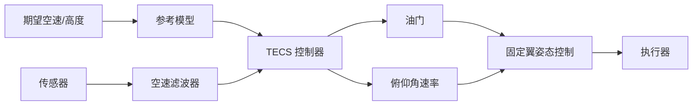

# TECS 总能量控制系统完整教材

## 第一章：TECS 概述

### 1.1 什么是 TECS？

TECS（Total Energy Control System，总能量控制系统）是固定翼飞行器的核心控制算法，用于同时控制**高度**和**空速**。

**核心思想**：
- 飞行器的总能量 = 动能 + 势能
- 通过控制**油门**和**俯仰角**，独立调节**总能量**和**能量分配**
- 解决高度-速度耦合问题

**传统问题**：
- 单独用俯仰控制高度：速度变化
- 单独用油门控制速度：高度变化
- 高度和速度相互耦合，难以独立控制

**TECS 解决方案**：
```
油门 → 控制总能量（高度 + 速度）
俯仰 → 控制能量分配（高度 ↔ 速度）
```

**代码位置**：`src/lib/tecs/`

### 1.2 能量方程

**飞行器总能量**：
```
E_total = E_kinetic + E_potential
E_total = (1/2) * m * V² + m * g * h
```

其中：
- `m`：飞行器质量 [kg]
- `V`：空速 [m/s]
- `g`：重力加速度 [m/s²]
- `h`：高度 [m]

**总能量变化率**：
```
dE_total/dt = m * V * dV/dt + m * g * dh/dt
            = m * V * a + m * g * v_z
```

其中：
- `a`：空速加速度 [m/s²]
- `v_z`：垂向速度（爬升率）[m/s]

**比能量（Specific Energy）**：
```
E_spec = E_total / (m * g) = (V² / (2 * g)) + h
```

单位为 [m]（等效高度）。

**能量分配（Energy Balance）**：
```
B = h - (V² / (2 * g))
```

表示势能和动能的相对比例：
- `B` 增大：高度增加或速度减小
- `B` 减小：高度减少或速度增加

### 1.3 控制策略

**解耦控制**：
```
油门   → 控制 dE_spec/dt（总能量变化率）
俯仰角 → 控制 dB/dt（能量分配变化率）
```

**物理意义**：
- **油门**：发动机推力提供能量输入
- **俯仰**：改变升力方向，转换动能和势能

**TECS 控制环路**：
```
1. 计算期望总能量和能量分配
2. 计算总能量误差和分配误差
3. PID 控制器计算油门和俯仰角速率
4. 应用控制量到执行器
```

---

## 第二章：TECS 控制器架构

### 2.1 整体架构

**输入**：
- 期望空速 `V_sp` [m/s]
- 期望高度 `h_sp` [m]
- 实际空速 `V` [m/s]
- 实际高度 `h` [m]
- 垂向速度 `v_z` [m/s]
- 空速加速度 `a` [m/s²]

**输出**：
- 油门指令 `throttle` [0-1]
- 俯仰角速率指令 `pitch_rate` [rad/s]

**模块组成**（PX4 实现）：
1. **空速滤波器**（`TECSAirspeedFilter`）：卡尔曼滤波平滑空速测量
2. **高度参考模型**（`TECSAltitudeReferenceModel`）：生成平滑高度轨迹
3. **能量控制器**（`TECS`）：计算油门和俯仰指令



### 2.2 空速滤波器

**位置**：`src/lib/tecs/TECS.cpp:55-141`（`TECSAirspeedFilter`）

**目的**：
- 平滑空速测量噪声
- 估计空速变化率（无空速传感器时使用合成空速）

**算法**：稳态卡尔曼滤波器（Steady-state Kalman Filter）

**状态向量**：
```
x = [V, dV/dt]^T
```

**状态方程**（恒定速度率模型）：
```
V_{k+1} = V_k + dV/dt * dt
dV/dt_{k+1} = dV/dt_k  // 假设加速度恒定
```

**观测方程**：
```
z = [V_meas, a_meas]^T
```

**代码实现**（简化）：

```cpp
// src/lib/tecs/TECS.cpp:96-136
void TECSAirspeedFilter::update(float dt, const Input &input, const Param &param,
                                 bool airspeed_sensor_available)
{
    float airspeed = airspeed_sensor_available ? input.equivalent_airspeed : param.equivalent_airspeed_trim;
    float airspeed_derivative = airspeed_sensor_available ? input.equivalent_airspeed_rate : 0.f;

    // 状态预测
    Vector2f state_predicted;
    state_predicted(0) = _airspeed_state.speed + dt * _airspeed_state.speed_rate;
    state_predicted(1) = _airspeed_state.speed_rate;

    // 计算卡尔曼增益（稳态）
    Matrix<float, 2, 2> K = computeSteadyStateKalmanGain(param);

    // 创新
    Vector2f innovation = {airspeed - state_predicted(0), airspeed_derivative - state_predicted(1)};

    // 状态更新
    Vector2f state = state_predicted + dt * (K * innovation);

    // 限制空速非负
    if (state(0) < 0.f) {
        state(0) = 0.f;
    }

    _airspeed_state.speed = state(0);
    _airspeed_state.speed_rate = state(1);
}
```

**参数**：
- `FW_AIRSPD_TRIM`：巡航空速 [m/s]
- 空速测量标准差、空速率测量标准差（内部参数）

### 2.3 高度参考模型

**位置**：`src/lib/tecs/TECS.cpp:143-263`（`TECSAltitudeReferenceModel`）

**目的**：
- 生成平滑的高度和爬升率轨迹
- 考虑加速度和加加速度（Jerk）限制

**算法**：速度平滑轨迹生成器（Velocity Smoothing Trajectory Generator）

**输入**：
- 期望高度 `h_sp` 或 期望爬升率 `v_z_sp`
- 实际高度 `h`
- 实际爬升率 `v_z`

**输出**：
- 参考高度 `h_ref`
- 参考爬升率 `v_z_ref`

**限制**：
- 最大爬升率：`FW_T_CLMB_R_SP`
- 最大下降率：`FW_T_SINK_R_SP`
- 最大垂向加速度：`FW_T_VERT_ACC`
- 最大加加速度（Jerk）：`FW_T_JERK_MAX`

**示例轨迹**（阶跃高度指令）：
```
h_sp = 100 m（阶跃）
h_ref：平滑曲线，受加速度/加加速度限制
        _____
       /
      /
     /
____/
```

### 2.4 总能量和能量分配计算

**比能量计算**：

```cpp
// 期望比能量
float E_spec_sp = h_sp + (V_sp * V_sp) / (2.0f * CONSTANTS_ONE_G);

// 实际比能量
float E_spec = h + (V * V) / (2.0f * CONSTANTS_ONE_G);

// 比能量误差
float E_spec_error = E_spec_sp - E_spec;
```

**能量分配计算**：

```cpp
// 期望能量分配
float B_sp = h_sp - (V_sp * V_sp) / (2.0f * CONSTANTS_ONE_G);

// 实际能量分配
float B = h - (V * V) / (2.0f * CONSTANTS_ONE_G);

// 能量分配误差
float B_error = B_sp - B;
```

**能量变化率计算**：

```cpp
// 比能量变化率（实际）
float E_spec_rate = v_z + (V * a) / CONSTANTS_ONE_G;

// 期望比能量变化率（从参考模型）
float E_spec_rate_sp = v_z_ref + (V_sp * a_ref) / CONSTANTS_ONE_G;

// 比能量率误差
float E_spec_rate_error = E_spec_rate_sp - E_spec_rate;
```

---

## 第三章：TECS PID 控制器

### 3.1 总能量控制器（油门）

**目标**：控制总能量变化率，使实际比能量跟踪期望值。

**控制律**（PID）：

```cpp
// 比例项
float P_term = KP_energy * E_spec_error;

// 积分项
_energy_integral += KI_energy * E_spec_error * dt;
_energy_integral = constrain(_energy_integral, throttle_min, throttle_max);

// 微分项（使用能量率误差）
float D_term = KD_energy * E_spec_rate_error;

// 前馈项（期望能量率 → 期望推力）
float FF_term = E_spec_rate_sp / _throttle_slope;  // _throttle_slope: 推力-能量率映射

// 油门指令
float throttle = P_term + _energy_integral + D_term + FF_term;
throttle = constrain(throttle, throttle_min, throttle_max);
```

**关键参数**：
| 参数名称           | 默认值 | 说明                        |
|------------------|-------|-----------------------------|
| FW_T_THR_DAMPING | 0.5   | 油门阻尼（KD_energy）         |
| FW_T_I_GAIN_THR  | 0.05  | 油门积分增益（KI_energy）     |
| FW_T_INTEG_GAIN  | 0.1   | 总能量积分增益（KP_energy）   |
| FW_THR_CRUISE    | 0.6   | 巡航油门（前馈基准）          |

### 3.2 能量分配控制器（俯仰）

**目标**：控制能量分配，调节高度和速度的相对比例。

**控制律**（PI + 前馈）：

```cpp
// 比例项
float P_term = KP_balance * B_error;

// 积分项
_balance_integral += KI_balance * B_error * dt;
_balance_integral = constrain(_balance_integral, pitch_min, pitch_max);

// 前馈项（期望能量分配率 → 期望俯仰）
// B_rate_sp = v_z_sp - (V_sp * a_sp) / g
float FF_term = B_rate_sp / _pitch_to_B_rate;  // _pitch_to_B_rate: 俯仰-分配率映射

// 俯仰角期望
float pitch_sp = P_term + _balance_integral + FF_term;
pitch_sp = constrain(pitch_sp, pitch_min, pitch_max);

// 俯仰角速率期望（从俯仰角误差）
float pitch_rate_sp = (pitch_sp - pitch_current) / time_constant;
```

**关键参数**：
| 参数名称           | 默认值 | 说明                        |
|------------------|-------|-----------------------------|
| FW_T_PTCH_DAMP   | 0.1   | 俯仰阻尼（KD_balance）        |
| FW_T_I_GAIN_PIT  | 0.1   | 俯仰积分增益（KI_balance）    |
| FW_T_THR_INTEG   | 2.0   | 能量分配积分增益（KP_balance）|
| FW_P_TC          | 0.4   | 俯仰时间常数 [s]              |

### 3.3 前馈计算

**推力-能量率映射**（`_throttle_slope`）：

```cpp
// 简化模型：推力 × 速度 = 能量率
// T = throttle * T_max
// E_rate = T * V / (m * g)
// throttle_slope = E_rate / throttle = T_max * V / (m * g)

float throttle_slope = specific_thrust * V / CONSTANTS_ONE_G;
```

**俯仰-分配率映射**（`_pitch_to_B_rate`）：

```cpp
// 简化模型：俯仰角改变升力方向，影响爬升率
// v_z = V * sin(pitch)  （小角度）
// B_rate = dh/dt - V * dV/dt / g ≈ V * pitch
// pitch_to_B_rate = B_rate / pitch ≈ V

float pitch_to_B_rate = V;
```

### 3.4 限制和饱和处理

**油门限制**：
```cpp
throttle = constrain(throttle, FW_THR_MIN, FW_THR_MAX);
```

**俯仰限制**：
```cpp
pitch_sp = constrain(pitch_sp, FW_P_LIM_MIN, FW_P_LIM_MAX);
```

**积分抗饱和**：
```cpp
// 当油门/俯仰饱和时，停止积分累积
if (throttle_saturated) {
    _energy_integral = constrain_integral(_energy_integral);
}
```

---

## 第四章：TECS 调优方法

### 4.1 调优流程

**通用流程**：
```
1. 设置基本参数（巡航速度、油门、俯仰限制）
2. 测试开环响应（手动飞行，记录数据）
3. 调整总能量控制器（油门）
4. 调整能量分配控制器（俯仰）
5. 精调积分增益和阻尼
6. 验证飞行（高度/速度跟踪性能）
```

### 4.2 基本参数设置

**步骤 1：设置巡航参数**

| 参数名称           | 说明                          | 设置方法                    |
|------------------|------------------------------|---------------------------|
| FW_AIRSPD_TRIM   | 巡航空速 [m/s]                | 实际飞行测试，记录稳定巡航速度 |
| FW_THR_CRUISE    | 巡航油门 [0-1]                | 实际飞行测试，记录巡航时油门值 |
| FW_P_LIM_MIN     | 最小俯仰角 [deg]              | -45° 到 -20°（下俯限制）    |
| FW_P_LIM_MAX     | 最大俯仰角 [deg]              | 20° 到 45°（抬头限制）      |

**步骤 2：设置速度限制**

| 参数名称           | 说明                          | 设置方法                    |
|------------------|------------------------------|---------------------------|
| FW_AIRSPD_MIN    | 最小空速 [m/s]                | 失速速度 × 1.2             |
| FW_AIRSPD_MAX    | 最大空速 [m/s]                | 结构限制或电机限制          |

**步骤 3：设置爬升/下降率**

| 参数名称           | 默认值 | 说明                      |
|------------------|-------|--------------------------|
| FW_T_CLMB_R_SP   | 3.0   | 目标爬升率 [m/s]          |
| FW_T_SINK_R_SP   | 2.0   | 目标下降率 [m/s]          |
| FW_T_CLMB_MAX    | 5.0   | 最大爬升率 [m/s]          |
| FW_T_SINK_MAX    | 5.0   | 最大下降率 [m/s]          |

### 4.3 总能量控制器调优

**步骤 1：调整比例增益**（`FW_T_INTEG_GAIN`）

1. 禁用积分：`FW_T_I_GAIN_THR = 0`
2. 从默认值开始（0.1）
3. 任务飞行，观察高度/速度跟踪：
   - 增益过小：响应慢，跟踪误差大
   - 增益过大：振荡
4. 增加到出现轻微振荡，然后减少 20%

**步骤 2：添加积分增益**（`FW_T_I_GAIN_THR`）

1. 从 0.01 开始
2. 观察稳态误差是否消除
3. 增加到稳态误差接近零，但无明显超调

**步骤 3：调整阻尼**（`FW_T_THR_DAMPING`）

1. 从默认值开始（0.5）
2. 观察速度响应：
   - 阻尼过小：速度振荡
   - 阻尼过大：响应慢
3. 调整到快速响应且无振荡

**日志分析**：
- 期望空速：`tecs_status.true_airspeed_sp`
- 实际空速：`airspeed_validated.true_airspeed_m_s`
- 油门指令：`actuator_controls_0.control[3]`
- 总能量误差：`tecs_status.total_energy_error`

### 4.4 能量分配控制器调优

**步骤 1：调整比例增益**（`FW_T_THR_INTEG`）

1. 禁用积分：`FW_T_I_GAIN_PIT = 0`
2. 从默认值开始（2.0）
3. 任务飞行，观察高度跟踪：
   - 增益过小：高度响应慢
   - 增益过大：俯仰振荡
4. 增加到出现振荡，然后减少 20%

**步骤 2：添加积分增益**（`FW_T_I_GAIN_PIT`）

1. 从 0.05 开始
2. 观察高度稳态误差
3. 增加到误差接近零

**步骤 3：调整俯仰阻尼**（`FW_T_PTCH_DAMP`）

1. 从默认值开始（0.1）
2. 观察俯仰响应平滑度
3. 调整到平滑且快速

**日志分析**：
- 期望高度：`position_setpoint_triplet` 或 `vehicle_local_position_setpoint.z`
- 实际高度：`vehicle_local_position.z`
- 俯仰角：`vehicle_attitude`（欧拉角 pitch）
- 能量分配误差：`tecs_status.energy_balance_error`

### 4.5 常见问题排查

**问题 1：高度振荡**

**现象**：
- 高度以固定频率上下振荡（如 0.5 Hz）
- `tecs_status.energy_balance_error` 振荡

**原因**：
- 俯仰比例增益过大（`FW_T_THR_INTEG`）
- 俯仰阻尼不足（`FW_T_PTCH_DAMP`）

**解决**：
1. 减少 `FW_T_THR_INTEG` 20%
2. 增加 `FW_T_PTCH_DAMP` 至 0.2

**问题 2：速度振荡**

**现象**：
- 速度振荡
- 油门频繁变化

**原因**：
- 油门阻尼不足（`FW_T_THR_DAMPING`）
- 空速滤波器调节不当

**解决**：
1. 增加 `FW_T_THR_DAMPING` 至 0.8
2. 检查空速传感器质量

**问题 3：爬升/下降响应慢**

**现象**：
- 高度指令变化后，实际高度响应很慢
- `tecs_status.total_energy_error` 持续非零

**原因**：
- 总能量比例增益过小（`FW_T_INTEG_GAIN`）
- 爬升率限制过小（`FW_T_CLMB_MAX`, `FW_T_SINK_MAX`）

**解决**：
1. 增加 `FW_T_INTEG_GAIN` 至 0.15
2. 检查爬升率限制是否合理

**问题 4：高度漂移**

**现象**：
- 稳定巡航时高度缓慢漂移
- `tecs_status.altitude_filtered` 与期望高度偏差增大

**原因**：
- 积分增益不足（`FW_T_I_GAIN_PIT`, `FW_T_I_GAIN_THR`）
- 气压计漂移

**解决**：
1. 增加 `FW_T_I_GAIN_PIT` 至 0.15
2. 检查 EKF 高度估计质量

---

## 第五章：TECS 与固定翼姿态控制集成

### 5.1 控制链路

**完整控制链路**：
```
导航/任务 → 期望航点（位置） → L1 制导 → 期望轨迹（高度/空速/航向）
→ TECS → 油门 + 俯仰角速率期望
→ 固定翼姿态控制 → 升降舵偏转
→ 执行器（电机 ESC + 舵机）
```

**TECS 输出接口**：
```cpp
struct tecs_status_s {
    float altitude_sp;              // 期望高度 [m]
    float altitude_filtered;        // 滤波后实际高度 [m]
    float altitude_rate_sp;         // 期望爬升率 [m/s]
    float altitude_rate;            // 实际爬升率 [m/s]

    float true_airspeed_sp;         // 期望真空速 [m/s]
    float true_airspeed_filtered;   // 滤波后真空速 [m/s]
    float true_airspeed_derivative_sp;  // 期望空速率 [m/s²]
    float true_airspeed_derivative;     // 实际空速率 [m/s²]

    float total_energy_error;       // 总能量误差 [m]
    float energy_balance_error;     // 能量分配误差 [m]

    float throttle_integ;           // 油门积分项
    float pitch_integ;              // 俯仰积分项
};
```

### 5.2 TECS 调用位置

**位置**：`src/modules/fw_pos_control_l1/FixedwingPositionControl.cpp`

**调用流程**（简化）：

```cpp
void FixedwingPositionControl::control_auto()
{
    // 1. 从 L1 制导获取期望轨迹
    float altitude_sp = _l1_control.get_target_altitude();
    float airspeed_sp = _l1_control.get_target_airspeed();

    // 2. 调用 TECS 计算油门和俯仰
    _tecs.update(
        altitude_sp,                // 期望高度
        airspeed_sp,                // 期望空速
        altitude,                   // 实际高度（来自 EKF）
        airspeed,                   // 实际空速（来自空速计）
        climb_rate,                 // 实际爬升率
        throttle_min, throttle_max, // 油门限制
        pitch_min, pitch_max,       // 俯仰限制
        dt                          // 时间步长
    );

    // 3. 获取 TECS 输出
    float throttle_sp = _tecs.get_throttle_setpoint();
    float pitch_sp = _tecs.get_pitch_setpoint();

    // 4. 发布到执行器
    actuator_controls_s controls{};
    controls.control[actuator_controls_s::INDEX_THROTTLE] = throttle_sp;

    // 5. 发布俯仰期望到姿态控制器
    vehicle_attitude_setpoint_s att_sp{};
    att_sp.pitch_body = pitch_sp;
    _attitude_sp_pub.publish(att_sp);
}
```

### 5.3 TECS 复位和重新初始化

**何时复位**：
- 模式切换（如从手动到自动）
- 失控后恢复
- 长时间无有效空速/高度数据

**复位代码**：

```cpp
void TECS::reset_state()
{
    _altitude_reference_model.reset(altitude_current);
    _airspeed_filter.initialize(airspeed_current, airspeed_trim, airspeed_sensor_available);

    // 清零积分项
    _throttle_integ = throttle_trim;
    _pitch_integ = 0.f;

    // 重置状态标志
    _states_initialized = false;
}
```

---

## 第六章：TECS 高级功能

### 6.1 无空速传感器模式

**问题**：无空速计时，TECS 如何工作？

**解决方案**：使用**合成空速**（Synthetic Airspeed）

**合成空速计算**（来自 EKF2）：
```
V_synthetic = sqrt(V_ground_x² + V_ground_y²) - V_wind
```

**TECS 自适应**：
- 空速滤波器使用合成空速
- 降低空速跟踪权重（优先保证高度）
- 增加俯仰阻尼（避免失速）

**参数调整**：
```
FW_ARSP_MODE = 0          // 禁用空速传感器
FW_T_SPD_OMEGA = 1.0      // 降低空速跟踪带宽
FW_T_PTCH_DAMP = 0.2      // 增加俯仰阻尼
```

### 6.2 自适应推力估计

**问题**：推力特性（`_throttle_slope`）随空速、高度、温度变化。

**解决方案**：在线估计推力斜率。

**估计方法**（简化）：

```cpp
// 测量：油门变化 → 能量率变化
float measured_thrust_slope = delta_energy_rate / delta_throttle;

// 滤波更新
_throttle_slope = 0.99f * _throttle_slope + 0.01f * measured_thrust_slope;
```

**自适应效果**：
- 高海拔（稀薄空气）：自动降低推力估计
- 电池电量下降：自动降低推力估计

### 6.3 高度优先 vs 速度优先模式

**模式选择**（`FW_T_SPD_PRI_MODE`）：

**高度优先模式**（默认）：
- 优先保证高度跟踪
- 允许速度偏差（在安全范围内）
- 适用于地形跟随、精确着陆

**速度优先模式**：
- 优先保证速度跟踪（避免失速）
- 允许高度偏差
- 适用于低速飞行、手动模式

**实现**（简化）：

```cpp
if (speed_priority_mode) {
    // 降低高度控制增益
    KP_balance *= 0.5f;
    // 提高速度控制增益
    KP_energy *= 1.5f;
} else {
    // 高度优先（默认）
    // 保持标准增益
}
```

### 6.4 风扰动补偿

**问题**：顺风/逆风导致地速变化，影响高度控制。

**解决方案**：使用**空速**而非地速进行控制。

**风补偿**（EKF 提供风速估计）：
```
V_airspeed = V_ground - V_wind
```

**TECS 自动处理**：
- 输入为空速（非地速）
- 爬升率基于气压高度（非 GPS 高度）
- 风扰动对 TECS 影响最小化

---

## 第七章：TECS 实战案例

### 7.1 案例 1：爬升缓慢

**现象**：
- 任务飞行中，爬升到目标高度耗时过长
- `tecs_status.total_energy_error` 持续为正

**分析**：
1. 查看 `tecs_status.true_airspeed_sp` vs `tecs_status.true_airspeed_filtered`
2. 检查油门是否饱和：`actuator_controls_0.control[3] ≈ FW_THR_MAX`
3. 检查俯仰是否饱和：`vehicle_attitude.pitch ≈ FW_P_LIM_MAX`

**解决**：
1. **增加油门限制**：`FW_THR_MAX` 从 0.8 增加到 0.95
2. **降低期望爬升率**：`FW_T_CLMB_R_SP` 从 5.0 降低到 3.0
3. **检查推力不足**：飞行器过重或动力不足

### 7.2 案例 2：高度/速度振荡

**现象**：
- 巡航时高度和速度同时振荡（周期 ~2s）
- `tecs_status.energy_balance_error` 振荡

**分析**：
1. 查看振荡频率（FFT 分析）
2. 检查俯仰角响应：`vehicle_attitude.pitch`
3. 检查油门响应：`actuator_controls_0.control[3]`

**解决**：
1. **降低俯仰增益**：`FW_T_THR_INTEG` 从 2.0 降低到 1.5
2. **增加俯仰阻尼**：`FW_T_PTCH_DAMP` 从 0.1 增加到 0.2
3. **增加油门阻尼**：`FW_T_THR_DAMPING` 从 0.5 增加到 0.8

### 7.3 案例 3：着陆时失速

**现象**：
- 着陆进近时，速度下降到失速速度
- `airspeed_validated.true_airspeed_m_s` < `FW_AIRSPD_MIN`

**分析**：
1. 检查期望空速：`tecs_status.true_airspeed_sp`
2. 检查俯仰角：是否过大导致速度损失
3. 检查油门：是否过小

**解决**：
1. **提高着陆速度**：`FW_LND_AIRSPD` 从 12 增加到 15 m/s
2. **限制俯仰角**：`FW_LND_ANG` 从 10° 降低到 5°
3. **启用速度优先模式**（着陆时）：`FW_T_SPD_PRI_MODE = 1`

---

## 第八章：TECS 源代码导读

### 8.1 核心文件组织

```
src/lib/tecs/
├── TECS.hpp                           # TECS 类声明
├── TECS.cpp                           # TECS 实现
│   ├── TECSAirspeedFilter             # 空速卡尔曼滤波器
│   ├── TECSAltitudeReferenceModel     # 高度参考模型
│   └── TECS                           # TECS 主控制器
└── test/                              # 单元测试

src/modules/fw_pos_control_l1/
└── FixedwingPositionControl.cpp       # TECS 调用位置
```

### 8.2 关键函数调用流程

```
FixedwingPositionControl::Run()
├─> control_auto_position()
│   └─> TECS::update()
│       ├─> TECSAirspeedFilter::update()        // 空速滤波
│       ├─> TECSAltitudeReferenceModel::update() // 高度轨迹
│       ├─> calculate_energy_errors()           // 能量误差
│       ├─> update_throttle_setpoint()          // 油门 PID
│       └─> update_pitch_setpoint()             // 俯仰 PID
└─> publish_attitude_setpoint()                 // 发布俯仰期望
```

### 8.3 核心算法代码位置

| 功能                | 代码位置                                  |
|--------------------|------------------------------------------|
| 空速滤波            | `TECS.cpp:55-141`                       |
| 高度参考模型        | `TECS.cpp:143-263`                      |
| 能量误差计算        | `TECS.cpp:400-450`                      |
| 油门 PID 控制       | `TECS.cpp:500-600`                      |
| 俯仰 PID 控制       | `TECS.cpp:600-700`                      |
| 前馈计算            | `TECS.cpp:450-500`                      |

---

## 第九章：总结与展望

### 9.1 TECS 核心要点

1. **能量解耦**：总能量（油门） vs 能量分配（俯仰）
2. **PID 控制**：独立调节高度和速度
3. **前馈补偿**：利用期望轨迹导数，改善响应
4. **自适应能力**：推力估计、风补偿、无空速模式

### 9.2 TECS 的优势

- 解耦高度-速度控制，独立调节
- 物理意义明确（能量守恒）
- 鲁棒性强，适应多种飞行条件
- 易于调参（相比多变量控制）

### 9.3 TECS 的局限

- 线性化假设（小角度、小扰动）
- 不考虑迎角、侧滑角动态
- 对极端机动（如特技）效果有限

### 9.4 未来发展

- 非线性 TECS（考虑大攻角）
- 自适应 TECS（在线估计气动参数）
- 与轨迹规划深度集成（最优能量轨迹）

---

## 附录：TECS 参数速查表

| 参数名称             | 默认值 | 单位   | 说明                        |
|--------------------|-------|-------|----------------------------|
| FW_AIRSPD_TRIM     | 15.0  | m/s   | 巡航空速                    |
| FW_AIRSPD_MIN      | 10.0  | m/s   | 最小空速（失速速度×1.2）     |
| FW_AIRSPD_MAX      | 20.0  | m/s   | 最大空速                    |
| FW_THR_CRUISE      | 0.6   | -     | 巡航油门                    |
| FW_THR_MIN         | 0.0   | -     | 最小油门                    |
| FW_THR_MAX         | 1.0   | -     | 最大油门                    |
| FW_P_LIM_MIN       | -45   | deg   | 最小俯仰角                  |
| FW_P_LIM_MAX       | 45    | deg   | 最大俯仰角                  |
| FW_T_CLMB_R_SP     | 3.0   | m/s   | 目标爬升率                  |
| FW_T_SINK_R_SP     | 2.0   | m/s   | 目标下降率                  |
| FW_T_CLMB_MAX      | 5.0   | m/s   | 最大爬升率                  |
| FW_T_SINK_MAX      | 5.0   | m/s   | 最大下降率                  |
| FW_T_INTEG_GAIN    | 0.1   | -     | 总能量比例增益               |
| FW_T_I_GAIN_THR    | 0.05  | -     | 油门积分增益                |
| FW_T_THR_DAMPING   | 0.5   | -     | 油门阻尼                    |
| FW_T_THR_INTEG     | 2.0   | -     | 能量分配比例增益             |
| FW_T_I_GAIN_PIT    | 0.1   | -     | 俯仰积分增益                |
| FW_T_PTCH_DAMP     | 0.1   | -     | 俯仰阻尼                    |
| FW_T_VERT_ACC      | 7.0   | m/s²  | 最大垂向加速度               |
| FW_T_JERK_MAX      | 5.0   | m/s³  | 最大加加速度（Jerk）         |

---

## 参考文献

1. **TECS 原始论文**：Paul Riseborough, "Principles of Total Energy Control System for Fixed Wing UAVs"
2. **PX4 TECS 文档**：https://docs.px4.io/main/en/flight_stack/controller_diagrams.html#fixed-wing-attitude-controller
3. **固定翼飞行动力学**：Stevens & Lewis《Aircraft Control and Simulation》
4. **能量管理控制**：Lambregts, A. A. (1983). "Vertical Flight Path and Speed Control Autopilot Design Using Total Energy Principles"

---

**教材结束**

本教材涵盖了 TECS 总能量控制系统的理论基础、实现细节、调优方法和实战案例。通过学习，您应能够：
1. 理解 TECS 能量解耦原理
2. 阅读和修改 TECS 源代码
3. 调优 TECS 参数以适配不同固定翼飞行器
4. 诊断和解决 TECS 相关问题

**下一步学习建议**：
- 固定翼实际飞行测试并分析日志
- 研究 L1 制导算法（与 TECS 配合）
- 学习固定翼着陆控制（TECS 在着陆中的应用）
