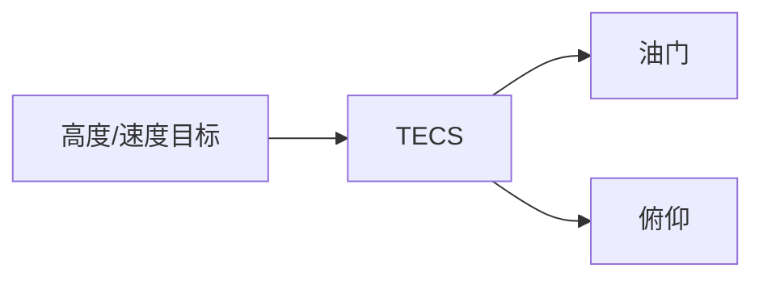

# TECS（固定翼总能量控制）

TECS 通过能量平衡实现爬升/下降与速度控制。

```mermaid
flowchart LR
  Targets[高度/速度目标] --> TECS
  TECS --> Throttle[油门]
  TECS --> Pitch[俯仰]
```

- 速度滤波与状态更新：`src/lib/tecs/TECS.cpp:55-136`
- 高度参考与轨迹生成：`src/lib/tecs/TECS.cpp:143-200`

建议：
- 与固定翼控制器协同调整爬升/下降速率限幅与能量模型参数，避免饱和与振荡。

