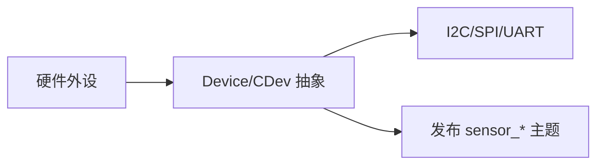

# 设备驱动

驱动在 `src/drivers/*`，通过设备抽象统一 I2C/SPI/UART，并将数据发布到 uORB。

- 抽象与基类：`src/lib/drivers/device/Device.hpp`、`CDev.*`
- GPS 驱动示例：`src/drivers/gps/gps.cpp:115-160, 190-198` 发布 `sensor_gps`/`sensor_gnss_relative`
- 典型传感器：`src/drivers/imu/*`、`barometer/*`、`magnetometer/*`、`optical_flow/*` 等
- 通信总线与外部接口：`uavcan/*`、`cyphal/*`、`osd/*`、`telemetry/*`

开发建议：
- 新设备优先复用现有总线封装与 `uORB` 发布模式，确保线程安全与队列深度合理。
- 在 `.px4board` 中通过 `Kconfig` 条目选择性启用，便于不同产品裁剪。

