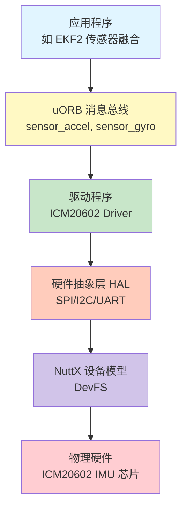
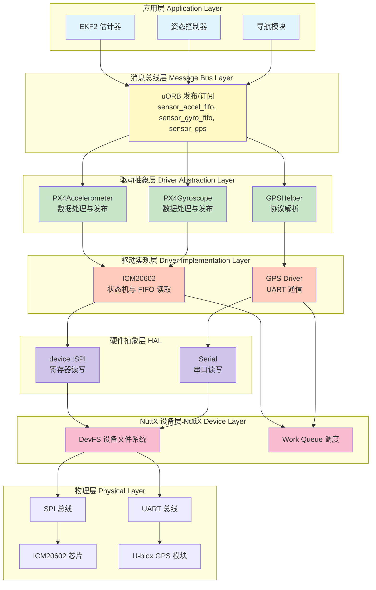
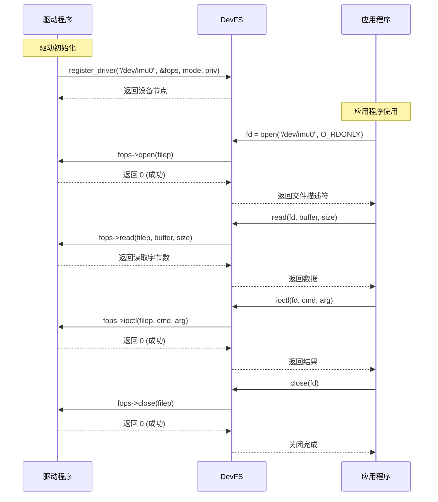
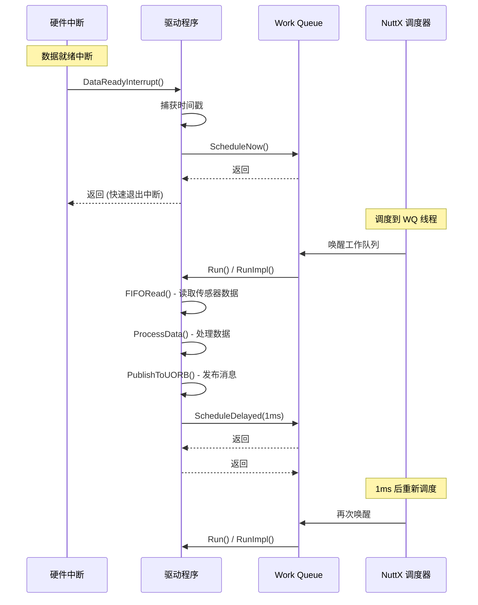
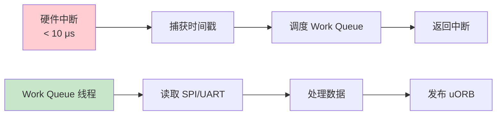
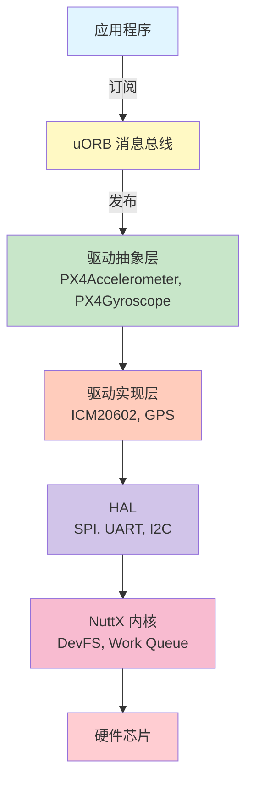

# NuttX 驱动开发完全指南：从硬件到应用层的完整链路

> 本文详细介绍在 NuttX RTOS 中如何开发硬件驱动程序,以 IMU 和 GPS 为实例,从底层硬件抽象到上层数据发布的完整流程。

---

## 目录

- [总览：硬件抽象与驱动架构](#总览硬件抽象与驱动架构)
- [第一部分：NuttX 驱动基础架构](#第一部分nuttx-驱动基础架构)
- [第二部分：IMU 驱动开发实战](#第二部分imu-驱动开发实战)
- [第三部分：GPS 驱动开发实战](#第三部分gps-驱动开发实战)
- [第四部分：Work Queue 集成](#第四部分work-queue-集成)
- [第五部分：驱动注册与初始化](#第五部分驱动注册与初始化)
- [第六部分：调试与最佳实践](#第六部分调试与最佳实践)
- [总结：驱动开发核心要点](#总结驱动开发核心要点)

---

## 总览：硬件抽象与驱动架构

### 为什么需要驱动程序？

在嵌入式系统中,我们**不直接操作硬件寄存器**,而是通过**驱动程序**作为中间层。这样做有以下关键优势:



**关键概念:**

1. **硬件抽象 (Hardware Abstraction)**
   - 应用层无需知道硬件细节(寄存器地址、时序要求)
   - 驱动程序封装所有硬件特定操作
   - 便于移植:更换硬件时只需修改驱动,应用层代码不变

2. **设备模型 (Device Model)**
   - NuttX 使用 DevFS (设备文件系统)
   - 所有硬件设备注册为设备节点
   - 提供统一的 open/read/write/ioctl 接口

3. **驱动 vs 直接操作硬件**

| 方面 | 直接操作硬件 | 使用驱动程序 |
|------|-------------|-------------|
| **复杂度** | 每个应用都要处理寄存器、时序 | 应用只需调用标准接口 |
| **可维护性** | 硬件变更需修改所有应用 | 只需修改驱动层 |
| **并发安全** | 需手动加锁,容易出错 | 驱动统一管理资源 |
| **错误处理** | 分散在各处,难以统一 | 集中在驱动层 |
| **调试能力** | 难以追踪硬件访问 | 驱动提供统一日志和性能计数 |
| **代码复用** | 几乎无法复用 | 驱动可在不同项目中使用 |

### PX4 中的驱动架构分层

在 PX4 Autopilot 中,驱动程序采用**多层架构**:



**各层职责:**

- **应用层**: 使用传感器数据,不关心硬件细节
- **消息总线层 (uORB)**: 发布/订阅解耦,支持多对多通信
- **驱动抽象层**: 数据预处理、坐标转换、单位转换
- **驱动实现层**: 硬件特定逻辑(状态机、FIFO 管理、协议解析)
- **HAL**: 总线级操作(SPI/I2C/UART 传输)
- **NuttX 设备层**: 设备注册、调度、资源管理
- **物理层**: 实际硬件芯片

### 本文学习路径

我们将深入两个典型驱动:

1. **IMU 驱动 (ICM20602)**
   - **通信方式**: SPI 高速总线
   - **数据特点**: 高频采样 (8kHz)、FIFO 批处理
   - **中断模式**: 数据就绪中断驱动
   - **复杂度**: 状态机管理、FIFO 溢出处理、时间戳同步

2. **GPS 驱动 (U-blox)**
   - **通信方式**: UART 串口
   - **数据特点**: 低频更新 (1-10Hz)、变长消息
   - **轮询模式**: 主动读取 + 回调解析
   - **复杂度**: 多协议支持、RTCM 注入、RTK 模式

通过这两个实例,你将学会:
- ✅ 如何设计驱动程序架构
- ✅ 如何与 NuttX 设备模型集成
- ✅ 如何使用 Work Queue 进行任务调度
- ✅ 如何处理中断与实时性
- ✅ 如何通过 uORB 发布数据
- ✅ 如何调试和优化驱动性能

---

## 第一部分：NuttX 驱动基础架构

### 1.1 NuttX 设备模型概述

NuttX 采用**类 Unix 的设备模型**,所有硬件设备都通过 **DevFS (Device File System)** 注册为设备节点。

#### 设备类型

NuttX 支持以下设备类型:

```c
/* NuttX 设备类型 (nuttx/include/nuttx/fs/fs.h) */
enum device_type_e {
    DTYPE_UNKNOWN = 0,      // 未知设备
    DTYPE_CHR,              // 字符设备 (Character Device)
    DTYPE_BLK,              // 块设备 (Block Device)
    DTYPE_PIPE,             // 管道
    DTYPE_MTDRIVER,         // MTD 驱动
    DTYPE_FILE,             // 文件
    DTYPE_DIRECTORY,        // 目录
};
```

**PX4 中的设备主要使用:**
- **字符设备 (Character Device)**: IMU, GPS, 磁力计等传感器
- **块设备 (Block Device)**: SD 卡、Flash 存储

#### 设备文件操作结构

每个字符设备必须实现 `file_operations` 结构体:

```c
/* 设备文件操作接口 (nuttx/include/nuttx/fs/fs.h) */
struct file_operations {
    /* open() - 打开设备 */
    int (*open)(FAR struct file *filep);

    /* close() - 关闭设备 */
    int (*close)(FAR struct file *filep);

    /* read() - 读取数据 */
    ssize_t (*read)(FAR struct file *filep, FAR char *buffer, size_t buflen);

    /* write() - 写入数据 */
    ssize_t (*write)(FAR struct file *filep, FAR const char *buffer, size_t buflen);

    /* seek() - 定位 (传感器通常不实现) */
    off_t (*seek)(FAR struct file *filep, off_t offset, int whence);

    /* ioctl() - 设备控制 (配置、校准等) */
    int (*ioctl)(FAR struct file *filep, int cmd, unsigned long arg);

    /* poll() - 轮询事件 (检查数据是否就绪) */
    int (*poll)(FAR struct file *filep, FAR struct pollfd *fds, bool setup);
};
```

**实际使用示例:**

```c
/* uORB 设备操作函数表 (示例) */
const struct file_operations uorb_fops = {
    .open  = uorb_device_open,
    .close = uorb_device_close,
    .read  = uorb_device_read,
    .write = uorb_device_write,
    .seek  = nullptr,
    .ioctl = uorb_device_ioctl,
    .poll  = uorb_device_poll,
};

/* 注册设备到 DevFS */
register_driver("/dev/uorb", &uorb_fops, 0666, NULL);
```

#### 设备注册流程



### 1.2 PX4 驱动框架

PX4 在 NuttX 设备模型基础上,构建了更高级的驱动框架,主要通过以下基类:

#### Device 基类

所有 PX4 设备的基础类:

```cpp
/* platforms/common/include/px4_platform_common/px4_work_queue/WorkItem.hpp */
/* src/lib/drivers/device/Device.hpp */

namespace device {

class __EXPORT Device
{
public:
    enum DeviceBusType {
        DeviceBusType_UNKNOWN = 0,
        DeviceBusType_I2C,
        DeviceBusType_SPI,
        DeviceBusType_UAVCAN,
        DeviceBusType_SERIAL,
        DeviceBusType_MAVLINK,
        DeviceBusType_SIMULATION,
    };

    Device(const char *name, DeviceBusType bus_type, uint8_t bus_number);
    virtual ~Device();

    virtual int init() = 0;                    // 初始化设备
    virtual ssize_t read(void *buffer, size_t buflen);
    virtual ssize_t write(const void *buffer, size_t buflen);
    virtual int ioctl(unsigned long cmd, unsigned long arg);

    const char *get_devname() const { return _devname; }
    uint32_t get_device_id() const { return _device_id.devid; }
    uint8_t get_device_bus() const { return _device_id.devid_s.bus; }
    uint8_t get_device_type() const { return _device_id.devid_s.devtype; }

protected:
    const char *_devname;                      // 设备名称

    union device_id {
        struct {
            uint8_t devtype;                   // 设备类型
            uint8_t address;                   // I2C 地址或 SPI CS
            uint8_t bus_type;                  // 总线类型
            uint8_t bus;                       // 总线编号
        } devid_s;
        uint32_t devid;
    };

    union device_id _device_id;                // 设备唯一 ID
};

} // namespace device
```

#### SPI 设备基类

继承自 `Device`,提供 SPI 总线操作:

```cpp
/* src/lib/drivers/device/spi.h */

namespace device {

class __EXPORT SPI : public Device
{
public:
    SPI(uint8_t device_type,
        const char *name,
        int bus,
        uint32_t device,
        enum spi_mode_e mode,
        uint32_t frequency);

    virtual ~SPI();

    virtual int init() override;

protected:
    // SPI 传输接口
    int transfer(uint8_t *send, uint8_t *recv, unsigned len);
    int transferhword(uint16_t *send, uint16_t *recv, unsigned len);

    // 便捷的寄存器读写
    uint8_t read_reg(uint8_t reg);
    void write_reg(uint8_t reg, uint8_t value);
    void modify_reg(uint8_t reg, uint8_t clearbits, uint8_t setbits);

    // SPI 总线配置
    void set_frequency(uint32_t frequency);

private:
    int _fd{-1};                               // SPI 设备文件描述符
    uint32_t _device;                          // 片选信号
    enum spi_mode_e _mode;                     // SPI 模式
    uint32_t _frequency;                       // SPI 频率
};

} // namespace device
```

#### I2CSPIDriver 框架

PX4 提供的统一驱动框架,整合了工作队列和总线管理:

```cpp
/* src/lib/drivers/device/i2c_spi_buses.h */

template<class T>
class I2CSPIDriver : public I2CSPIDriverBase
{
public:
    // 模块启动入口
    static int module_start(const BusCLIArguments &cli, BusInstanceIterator &iterator)
    {
        return I2CSPIDriverBase::module_start(cli, iterator, &T::print_usage,
                                              InstantiateHelper<T>::m);
    }

    // 模块停止
    static int module_stop(BusInstanceIterator &iterator)
    {
        return I2CSPIDriverBase::module_stop(iterator);
    }

    // 模块状态
    static int module_status(BusInstanceIterator &iterator)
    {
        return I2CSPIDriverBase::module_status(iterator);
    }

protected:
    // Work queue 回调 - 调用子类的 RunImpl()
    virtual void Run() final
    {
        static_cast<T *>(this)->RunImpl();  // 多态调用

        if (should_exit()) {
            exit_and_cleanup();
        }
    }
};
```

**关键优势:**
- 自动管理多总线/多实例
- 集成 Work Queue 调度
- 统一的命令行接口 (start/stop/status)
- 简化驱动开发

### 1.3 Work Queue 与驱动调度

在 NuttX 中,驱动程序不应在中断上下文中执行耗时操作。PX4 使用 **Work Queue** 机制将任务延迟到线程上下文执行。

#### Work Queue 层次

PX4 定义了多个优先级的 Work Queue:

```cpp
/* platforms/nuttx/src/px4/common/WorkQueueManager.cpp */

// 高优先级工作队列 (IMU、陀螺仪等高频传感器)
static constexpr wq_config_t wq_hp_default{"wq:hp_default", 2336, -7};

// SPI 总线工作队列
static constexpr wq_config_t wq_SPI0{"wq:SPI0", 2336, -8};
static constexpr wq_config_t wq_SPI1{"wq:SPI1", 2336, -9};

// I2C 总线工作队列
static constexpr wq_config_t wq_I2C0{"wq:I2C0", 2336, -10};

// 低优先级工作队列 (GPS 等低频设备)
static constexpr wq_config_t wq_lp_default{"wq:lp_default", 1728, -50};

// 导航工作队列
static constexpr wq_config_t wq_nav_and_controllers{"wq:nav_and_controllers", 1728, -5};
```

#### ScheduledWorkItem 基类

驱动通过继承 `ScheduledWorkItem` 集成 Work Queue:

```cpp
/* platforms/common/include/px4_platform_common/px4_work_queue/ScheduledWorkItem.hpp */

class ScheduledWorkItem : public WorkItem
{
public:
    explicit ScheduledWorkItem(const char *name, const wq_config_t &config);
    virtual ~ScheduledWorkItem();

    // 立即调度执行
    void ScheduleNow();

    // 延迟调度 (微秒)
    void ScheduleDelayed(uint32_t delay_us);

    // 周期性调度
    void ScheduleOnInterval(uint32_t interval_us, uint32_t delay_us = 0);

    // 取消调度
    void ScheduleClear();

    // 子类必须实现的工作函数
    virtual void Run() = 0;

protected:
    const wq_config_t &_work_queue;
};
```

**使用示例:**

```cpp
class ICM20602 : public device::SPI,
                 public I2CSPIDriver<ICM20602>
{
public:
    void RunImpl()  // 被 Work Queue 调度调用
    {
        switch (_state) {
        case STATE::RESET:
            // 执行设备复位
            RegisterWrite(Register::PWR_MGMT_1, PWR_MGMT_1_BIT::DEVICE_RESET);
            _state = STATE::WAIT_FOR_RESET;
            ScheduleDelayed(2_ms);  // 2ms 后重新调度
            break;

        case STATE::CONFIGURE:
            // 配置设备
            Configure();
            _state = STATE::FIFO_READ;
            ScheduleOnInterval(1_ms);  // 每 1ms 调度一次
            break;

        case STATE::FIFO_READ:
            // 读取 FIFO 数据
            FIFORead();
            // 保持周期性调度
            break;
        }
    }
};
```

#### 调度时序图



### 1.4 uORB 数据发布接口

驱动读取并处理硬件数据后,需要通过 **uORB 消息总线**发布给应用程序。

#### PublicationMulti 类

支持多实例发布的 uORB 发布者:

```cpp
/* platforms/common/uORB/PublicationMulti.hpp */

namespace uORB {

template<typename T>
class PublicationMulti
{
public:
    explicit PublicationMulti(ORB_ID id, uint8_t instance = 0, uint8_t priority = 20)
        : _orb_id(id), _instance(instance), _priority(priority)
    {
    }

    ~PublicationMulti()
    {
        unadvertise();
    }

    // 发布数据
    bool publish(const T &data)
    {
        if (_handle < 0) {
            // 首次发布 - 注册主题
            _handle = orb_advertise_multi(_orb_id, &data, &_instance, _priority);
        }

        if (_handle >= 0) {
            return (orb_publish(_orb_id, _handle, &data) == PX4_OK);
        }

        return false;
    }

    // 更新数据 (别名)
    bool update(const T &data) { return publish(data); }

    uint8_t get_instance() const { return _instance; }

private:
    const ORB_ID _orb_id;
    orb_advert_t _handle{nullptr};
    uint8_t _instance;
    uint8_t _priority;
};

} // namespace uORB
```

**使用示例:**

```cpp
#include <uORB/topics/sensor_accel.h>
#include <uORB/PublicationMulti.hpp>

class MyIMUDriver
{
public:
    MyIMUDriver()
        : _accel_pub(ORB_ID(sensor_accel))  // 初始化发布者
    {
    }

    void PublishAccelData(float ax, float ay, float az)
    {
        sensor_accel_s accel{};
        accel.timestamp = hrt_absolute_time();  // 当前时间戳
        accel.x = ax;
        accel.y = ay;
        accel.z = az;
        accel.temperature = _temperature;
        accel.error_count = _error_count;
        accel.device_id = get_device_id();

        _accel_pub.publish(accel);  // 发布到 uORB
    }

private:
    uORB::PublicationMulti<sensor_accel_s> _accel_pub;
};
```

---

## 第二部分：IMU 驱动开发实战

### 2.1 ICM20602 硬件概述

**ICM20602** 是 InvenSense 生产的 6 轴惯性测量单元 (IMU),包含:
- 3 轴加速度计 (±2/±4/±8/±16g)
- 3 轴陀螺仪 (±250/±500/±1000/±2000 °/s)
- 内置温度传感器
- **通信接口**: SPI (最高 10MHz) 或 I2C (400kHz)
- **数据输出**: 512 字节 FIFO
- **中断**: 数据就绪中断 (INT)

#### 关键特性

| 特性 | 规格 |
|------|------|
| 陀螺仪采样率 | 最高 8kHz |
| 加速度计采样率 | 最高 4kHz |
| FIFO 深度 | 512 字节 (约 42 组数据) |
| 数据格式 | 16-bit 整数 |
| SPI 速度 | 10MHz (读取), 20MHz (写入) |
| 中断延迟 | < 4 μs |

### 2.2 驱动文件结构

ICM20602 驱动位于 `src/drivers/imu/invensense/icm20602/`:

```
icm20602/
├── ICM20602.hpp                   # 驱动类声明
├── ICM20602.cpp                   # 驱动实现
├── icm20602_main.cpp              # 模块入口
├── InvenSense_ICM20602_registers.hpp  # 寄存器定义
└── CMakeLists.txt                 # 编译配置
```

### 2.3 驱动类定义

#### 类继承关系

```cpp
/* ICM20602.hpp */

class ICM20602 : public device::SPI,           // SPI 通信基类
                 public I2CSPIDriver<ICM20602> // PX4 驱动框架
{
public:
    ICM20602(const I2CSPIDriverConfig &config);
    ~ICM20602() override;

    static void print_usage();

    void RunImpl();                            // Work Queue 回调

    int init() override;                       // 初始化设备
    void print_status() override;              // 打印状态

private:
    // 状态机
    enum class STATE : uint8_t {
        RESET,
        WAIT_FOR_RESET,
        CONFIGURE,
        FIFO_READ,
    };

    STATE _state{STATE::RESET};

    // 寄存器读写
    uint8_t RegisterRead(Register reg);
    void RegisterWrite(Register reg, uint8_t value);
    void RegisterSetAndClearBits(Register reg, uint8_t setbits, uint8_t clearbits);

    // FIFO 操作
    uint16_t FIFOReadCount();
    bool FIFORead(const hrt_abstime &timestamp_sample, uint8_t samples);
    void FIFOReset();

    // 数据处理
    bool ProcessAccel(const hrt_abstime &timestamp_sample,
                      const FIFO::DATA fifo[], const uint8_t samples);
    void ProcessGyro(const hrt_abstime &timestamp_sample,
                     const FIFO::DATA fifo[], const uint8_t samples);
    bool ProcessTemperature(const FIFO::DATA fifo[], const uint8_t samples);

    // 中断处理
    int DataReadyInterruptCallback(int irq, void *context, void *arg);
    void DataReady();
    bool DataReadyInterruptConfigure();
    bool DataReadyInterruptDisable();

    // 配置
    bool Configure();
    void ConfigureAccel();
    void ConfigureGyro();
    void ConfigureSampleRate(int sample_rate);

    // 成员变量
    PX4Accelerometer _px4_accel;               // 加速度计发布者
    PX4Gyroscope _px4_gyro;                    // 陀螺仪发布者

    const spi_drdy_gpio_t _drdy_gpio;          // 数据就绪 GPIO
    px4::atomic<hrt_abstime> _drdy_timestamp_sample{0};  // 中断时间戳

    uint32_t _fifo_empty_interval_us{1000};    // FIFO 读取间隔
    uint8_t _fifo_gyro_samples{8};             // FIFO 样本数

    bool _data_ready_interrupt_enabled{false};

    // 性能计数器
    perf_counter_t _bad_register_perf{nullptr};
    perf_counter_t _bad_transfer_perf{nullptr};
    perf_counter_t _fifo_empty_perf{nullptr};
    perf_counter_t _fifo_overflow_perf{nullptr};
    perf_counter_t _fifo_reset_perf{nullptr};
    perf_counter_t _drdy_missed_perf{nullptr};
};
```

### 2.4 寄存器定义

```cpp
/* InvenSense_ICM20602_registers.hpp */

namespace InvenSense_ICM20602 {

// 寄存器地址
enum class Register : uint8_t {
    CONFIG           = 0x1A,
    GYRO_CONFIG      = 0x1B,
    ACCEL_CONFIG     = 0x1C,
    ACCEL_CONFIG2    = 0x1D,

    LP_MODE_CFG      = 0x1E,
    FIFO_EN          = 0x23,

    INT_PIN_CFG      = 0x37,
    INT_ENABLE       = 0x38,
    INT_STATUS       = 0x3A,

    TEMP_OUT_H       = 0x41,
    TEMP_OUT_L       = 0x42,

    GYRO_XOUT_H      = 0x43,
    GYRO_XOUT_L      = 0x44,
    GYRO_YOUT_H      = 0x45,
    GYRO_YOUT_L      = 0x46,
    GYRO_ZOUT_H      = 0x47,
    GYRO_ZOUT_L      = 0x48,

    ACCEL_XOUT_H     = 0x3B,
    ACCEL_XOUT_L     = 0x3C,
    ACCEL_YOUT_H     = 0x3D,
    ACCEL_YOUT_L     = 0x3E,
    ACCEL_ZOUT_H     = 0x3F,
    ACCEL_ZOUT_L     = 0x40,

    USER_CTRL        = 0x6A,
    PWR_MGMT_1       = 0x6B,
    PWR_MGMT_2       = 0x6C,

    FIFO_COUNTH      = 0x72,
    FIFO_COUNTL      = 0x73,
    FIFO_R_W         = 0x74,

    WHO_AM_I         = 0x75,
};

// 设备 ID
static constexpr uint8_t WHOAMI = 0x12;

// SPI 读写位
static constexpr uint8_t DIR_READ = 0x80;
static constexpr uint8_t DIR_WRITE = 0x00;

// FIFO 数据结构 (12 字节/组)
namespace FIFO {
    struct DATA {
        uint8_t ACCEL_XOUT_H;
        uint8_t ACCEL_XOUT_L;
        uint8_t ACCEL_YOUT_H;
        uint8_t ACCEL_YOUT_L;
        uint8_t ACCEL_ZOUT_H;
        uint8_t ACCEL_ZOUT_L;
        uint8_t TEMP_OUT_H;
        uint8_t TEMP_OUT_L;
        uint8_t GYRO_XOUT_H;
        uint8_t GYRO_XOUT_L;
        uint8_t GYRO_YOUT_H;
        uint8_t GYRO_YOUT_L;
    };

    static constexpr size_t SIZE = 512;  // FIFO 总大小
}

} // namespace InvenSense_ICM20602
```

### 2.5 初始化流程

#### 构造函数

```cpp
ICM20602::ICM20602(const I2CSPIDriverConfig &config) :
    SPI(config),
    I2CSPIDriver(config),
    _drdy_gpio(config.drdy_gpio),
    _px4_accel(get_device_id(), config.rotation),
    _px4_gyro(get_device_id(), config.rotation)
{
    // 设置 SPI 频率和模式
    setSPISpeed(SPI_SPEED);  // 10MHz

    // 分配性能计数器
    _bad_register_perf = perf_alloc(PC_COUNT, MODULE_NAME": bad register");
    _bad_transfer_perf = perf_alloc(PC_COUNT, MODULE_NAME": bad transfer");
    _fifo_empty_perf = perf_alloc(PC_COUNT, MODULE_NAME": FIFO empty");
    _fifo_overflow_perf = perf_alloc(PC_COUNT, MODULE_NAME": FIFO overflow");
    _fifo_reset_perf = perf_alloc(PC_COUNT, MODULE_NAME": FIFO reset");

    if (_drdy_gpio != 0) {
        _drdy_missed_perf = perf_alloc(PC_COUNT, MODULE_NAME": DRDY missed");
    }

    // 配置采样率
    ConfigureSampleRate(_px4_gyro.get_max_rate_hz());  // 8000 Hz
}
```

#### init() 方法

```cpp
int ICM20602::init()
{
    // 初始化 SPI 总线
    int ret = SPI::init();

    if (ret != PX4_OK) {
        DEVICE_DEBUG("SPI::init failed (%i)", ret);
        return ret;
    }

    // 启动设备复位状态机
    return Reset() ? 0 : -1;
}

bool ICM20602::Reset()
{
    _state = STATE::RESET;
    ScheduleClear();
    ScheduleNow();  // 立即调度执行
    return true;
}
```

### 2.6 状态机实现

`RunImpl()` 是驱动的核心,由 Work Queue 周期性调用:

```cpp
void ICM20602::RunImpl()
{
    const hrt_abstime now = hrt_absolute_time();

    switch (_state) {
    case STATE::RESET:
        // 第 1 步: 发送设备复位命令
        RegisterWrite(Register::PWR_MGMT_1, PWR_MGMT_1_BIT::DEVICE_RESET);
        _reset_timestamp = now;
        _failure_count = 0;
        _state = STATE::WAIT_FOR_RESET;
        ScheduleDelayed(2_ms);  // 等待 2ms
        break;

    case STATE::WAIT_FOR_RESET:
        // 第 2 步: 验证设备复位完成
        if ((RegisterRead(Register::WHO_AM_I) == WHOAMI) &&
            (RegisterRead(Register::PWR_MGMT_1) == 0x01))
        {
            // 复位成功
            PX4_DEBUG("Reset complete");
            _state = STATE::CONFIGURE;
            ScheduleDelayed(35_ms);  // 等待稳定
        } else if (now - _reset_timestamp > 1000_ms) {
            // 超时 - 重试
            PX4_WARN("Reset timeout");
            _state = STATE::RESET;
            ScheduleDelayed(100_ms);
        } else {
            // 继续等待
            ScheduleDelayed(10_ms);
        }
        break;

    case STATE::CONFIGURE:
        // 第 3 步: 配置设备
        if (Configure()) {
            // 配置成功,进入 FIFO 读取模式
            _state = STATE::FIFO_READ;

            // 尝试启用数据就绪中断
            if (DataReadyInterruptConfigure()) {
                _data_ready_interrupt_enabled = true;
                PX4_INFO("Data ready interrupt enabled");
                ScheduleDelayed(100_ms);  // 备份定时器
            } else {
                // 中断失败,使用轮询模式
                PX4_WARN("Interrupt not available, using polling");
                _data_ready_interrupt_enabled = false;
                ScheduleOnInterval(_fifo_empty_interval_us);  // 周期性轮询
            }
        } else {
            // 配置失败 - 重试
            PX4_WARN("Configuration failed");
            if (++_failure_count > 5) {
                // 多次失败 - 重置设备
                _state = STATE::RESET;
                ScheduleDelayed(1000_ms);
            } else {
                ScheduleDelayed(100_ms);
            }
        }
        break;

    case STATE::FIFO_READ:
        // 第 4 步: 读取 FIFO 数据
        hrt_abstime timestamp_sample = now;
        uint8_t samples = 0;

        if (_data_ready_interrupt_enabled) {
            // 中断模式 - 使用中断时间戳
            const hrt_abstime drdy_timestamp = _drdy_timestamp_sample.fetch_and_and(0);

            if ((now - drdy_timestamp) < _fifo_empty_interval_us) {
                timestamp_sample = drdy_timestamp;
                samples = _fifo_gyro_samples;  // 已知样本数
            } else {
                perf_count(_drdy_missed_perf);
            }

            // 设置看门狗定时器
            ScheduleDelayed(_fifo_empty_interval_us * 2);
        }

        if (samples == 0) {
            // 轮询模式 - 查询 FIFO 计数
            const uint16_t fifo_count = FIFOReadCount();

            if (fifo_count >= sizeof(FIFO::DATA)) {
                samples = fifo_count / sizeof(FIFO::DATA);

                if (samples > _fifo_gyro_samples) {
                    // FIFO 积压 - 增加轮询频率
                    perf_count(_fifo_overflow_perf);
                    FIFOReset();
                    samples = 0;
                }
            } else {
                perf_count(_fifo_empty_perf);
            }

            // 下次调度时间
            ScheduleDelayed(_fifo_empty_interval_us);
        }

        if (samples > 0) {
            FIFORead(timestamp_sample, samples);
        }
        break;
    }
}
```

### 2.7 SPI 通信实现

#### 寄存器读取

```cpp
uint8_t ICM20602::RegisterRead(Register reg)
{
    uint8_t cmd[2] {};
    cmd[0] = static_cast<uint8_t>(reg) | DIR_READ;  // 设置读取位

    // SPI 全双工传输
    transfer(cmd, cmd, sizeof(cmd));

    return cmd[1];  // 返回数据在第二个字节
}
```

#### 寄存器写入

```cpp
void ICM20602::RegisterWrite(Register reg, uint8_t value)
{
    uint8_t cmd[2] { static_cast<uint8_t>(reg), value };

    transfer(cmd, cmd, sizeof(cmd));
}
```

#### 位操作

```cpp
void ICM20602::RegisterSetAndClearBits(Register reg, uint8_t setbits, uint8_t clearbits)
{
    const uint8_t orig_val = RegisterRead(reg);
    const uint8_t new_val = (orig_val & ~clearbits) | setbits;

    if (orig_val != new_val) {
        RegisterWrite(reg, new_val);
    }
}
```

### 2.8 FIFO 读取

#### FIFO 计数

```cpp
uint16_t ICM20602::FIFOReadCount()
{
    uint8_t cmd[3] {};
    cmd[0] = static_cast<uint8_t>(Register::FIFO_COUNTH) | DIR_READ;

    transfer(cmd, cmd, sizeof(cmd));

    return combine(cmd[1], cmd[2]);  // 高字节 << 8 | 低字节
}
```

#### FIFO 批量读取

```cpp
bool ICM20602::FIFORead(const hrt_abstime &timestamp_sample, uint8_t samples)
{
    FIFOTransferBuffer buffer{};
    const size_t transfer_size = math::min(samples * sizeof(FIFO::DATA) + 3, FIFO::SIZE);

    // SPI 批量读取
    buffer.cmd = static_cast<uint8_t>(Register::FIFO_R_W) | DIR_READ;

    if (transfer((uint8_t *)&buffer, (uint8_t *)&buffer, transfer_size) != PX4_OK) {
        perf_count(_bad_transfer_perf);
        return false;
    }

    // 验证数据质量
    if (ProcessTemperature(buffer.f, samples)) {
        // 处理陀螺仪数据
        ProcessGyro(timestamp_sample, buffer.f, samples);

        // 处理加速度计数据
        return ProcessAccel(timestamp_sample, buffer.f, samples);
    }

    return false;
}

struct FIFOTransferBuffer {
    uint8_t cmd;               // 寄存器地址
    uint8_t pad[2];            // 对齐
    FIFO::DATA f[FIFO::SIZE / sizeof(FIFO::DATA)];
};
```

### 2.9 数据处理与发布

#### 陀螺仪数据处理

```cpp
void ICM20602::ProcessGyro(const hrt_abstime &timestamp_sample,
                           const FIFO::DATA fifo[], const uint8_t samples)
{
    sensor_gyro_fifo_s gyro{};
    gyro.timestamp_sample = timestamp_sample;
    gyro.samples = samples;
    gyro.dt = FIFO_SAMPLE_DT;  // 125 us (8000 Hz)

    // 解析 FIFO 中的所有陀螺仪样本
    for (int i = 0; i < samples; i++) {
        const int16_t gyro_x = combine(fifo[i].GYRO_XOUT_H, fifo[i].GYRO_XOUT_L);
        const int16_t gyro_y = combine(fifo[i].GYRO_YOUT_H, fifo[i].GYRO_YOUT_L);
        const int16_t gyro_z = combine(fifo[i].GYRO_ZOUT_H, fifo[i].GYRO_ZOUT_L);

        // 坐标转换: 传感器坐标系 -> PX4 坐标系
        // 传感器: +x 前, +y 左, +z 上
        // PX4:    +x 前, +y 右, +z 下
        gyro.x[i] = gyro_x;
        gyro.y[i] = (gyro_y == INT16_MIN) ? INT16_MAX : -gyro_y;
        gyro.z[i] = (gyro_z == INT16_MIN) ? INT16_MAX : -gyro_z;
    }

    // 设置错误计数
    _px4_gyro.set_error_count(perf_event_count(_bad_register_perf) +
                              perf_event_count(_bad_transfer_perf) +
                              perf_event_count(_fifo_empty_perf) +
                              perf_event_count(_fifo_overflow_perf));

    // 发布到 uORB
    _px4_gyro.updateFIFO(gyro);
}
```

#### 加速度计数据处理

```cpp
bool ICM20602::ProcessAccel(const hrt_abstime &timestamp_sample,
                            const FIFO::DATA fifo[], const uint8_t samples)
{
    sensor_accel_fifo_s accel{};
    accel.timestamp_sample = timestamp_sample;
    accel.samples = 0;
    accel.dt = FIFO_SAMPLE_DT * SAMPLES_PER_TRANSFER;  // 加速度计降采样

    bool bad_data = false;

    // 解析加速度计样本 (可能降采样)
    for (int i = _accel_first_sample; i < samples; i += SAMPLES_PER_TRANSFER) {
        int16_t accel_x = combine(fifo[i].ACCEL_XOUT_H, fifo[i].ACCEL_XOUT_L);
        int16_t accel_y = combine(fifo[i].ACCEL_YOUT_H, fifo[i].ACCEL_YOUT_L);
        int16_t accel_z = combine(fifo[i].ACCEL_ZOUT_H, fifo[i].ACCEL_ZOUT_L);

        // 检测无效数据 (全 0 或全 1)
        if (accel_x == 0 && accel_y == 0 && accel_z == 0) {
            bad_data = true;
            continue;
        }
        if (accel_x == INT16_MIN && accel_y == INT16_MIN && accel_z == INT16_MIN) {
            bad_data = true;
            continue;
        }

        // 坐标转换
        accel.x[accel.samples] = accel_x;
        accel.y[accel.samples] = (accel_y == INT16_MIN) ? INT16_MAX : -accel_y;
        accel.z[accel.samples] = (accel_z == INT16_MIN) ? INT16_MAX : -accel_z;
        accel.samples++;
    }

    _px4_accel.set_error_count(perf_event_count(_bad_register_perf) +
                               perf_event_count(_bad_transfer_perf) +
                               perf_event_count(_fifo_empty_perf) +
                               perf_event_count(_fifo_overflow_perf));

    // 发布到 uORB
    if (accel.samples > 0) {
        _px4_accel.updateFIFO(accel);
    }

    return !bad_data;
}
```

### 2.10 中断处理

#### 中断配置

```cpp
bool ICM20602::DataReadyInterruptConfigure()
{
    if (_drdy_gpio == 0) {
        return false;  // 无中断 GPIO
    }

    // 配置 INT 引脚为推挽输出、低电平有效、脉冲模式
    RegisterWrite(Register::INT_PIN_CFG,
                  INT_PIN_CFG_BIT::INT_LEVEL | INT_PIN_CFG_BIT::LATCH_INT_EN);

    // 使能数据就绪中断
    RegisterWrite(Register::INT_ENABLE, INT_ENABLE_BIT::DATA_RDY_INT_EN);

    // 注册 GPIO 中断
    return px4_arch_gpiosetevent(_drdy_gpio,
                                 false,  // 非电平触发
                                 true,   // 下降沿
                                 true,   // 上升沿
                                 &DataReadyInterruptCallback,
                                 this) == 0;
}
```

#### 中断回调 (静态函数)

```cpp
int ICM20602::DataReadyInterruptCallback(int irq, void *context, void *arg)
{
    // 静态回调,从 arg 恢复 this 指针
    static_cast<ICM20602 *>(arg)->DataReady();
    return 0;
}
```

#### 中断处理 (实例方法)

```cpp
void ICM20602::DataReady()
{
    // 捕获时间戳 (原子操作)
    _drdy_timestamp_sample.store(hrt_absolute_time());

    // 立即调度 Work Queue 读取数据
    ScheduleNow();
}
```

**中断处理要点:**
- ✅ 中断上下文中**只捕获时间戳**和**调度工作队列**
- ✅ 实际数据读取在 Work Queue 线程中执行
- ✅ 使用原子变量 (`px4::atomic`) 避免竞态条件
- ✅ 中断回调必须快速返回 (< 10 μs)

### 2.11 配置设置

```cpp
bool ICM20602::Configure()
{
    // 配置寄存器数组
    const struct {
        Register reg;
        uint8_t set_bits;
        uint8_t clear_bits;
    } _register_cfg[] = {
        // 陀螺仪配置: ±2000 °/s, 8kHz
        { Register::GYRO_CONFIG, GYRO_FS_SEL_2000_DPS, 0 },

        // 加速度计配置: ±16g
        { Register::ACCEL_CONFIG, ACCEL_FS_SEL_16G, 0 },

        // 加速度计低通滤波: 1046 Hz
        { Register::ACCEL_CONFIG2, ACCEL_FCHOICE_1046HZ, 0 },

        // 使能 FIFO
        { Register::USER_CTRL, USER_CTRL_BIT::FIFO_EN, 0 },

        // FIFO 包含陀螺仪 + 加速度计 + 温度
        { Register::FIFO_EN, FIFO_EN_BIT::TEMP_FIFO_EN |
                             FIFO_EN_BIT::GYRO_XOUT |
                             FIFO_EN_BIT::GYRO_YOUT |
                             FIFO_EN_BIT::GYRO_ZOUT |
                             FIFO_EN_BIT::ACCEL, 0 },

        // 电源管理: 自动选择最佳时钟源
        { Register::PWR_MGMT_1, PWR_MGMT_1_BIT::CLKSEL_AUTO, 0 },
    };

    // 写入所有配置寄存器
    for (const auto &r : _register_cfg) {
        RegisterSetAndClearBits(r.reg, r.set_bits, r.clear_bits);
    }

    // 验证配置 (读回寄存器检查)
    for (const auto &r : _register_cfg) {
        if (!RegisterCheck(r.reg, r.set_bits, r.clear_bits)) {
            PX4_ERR("Register 0x%02X check failed", (uint8_t)r.reg);
            return false;
        }
    }

    // 配置量程
    ConfigureAccel();
    ConfigureGyro();

    return true;
}

void ICM20602::ConfigureAccel()
{
    const uint8_t ACCEL_FS_SEL = RegisterRead(Register::ACCEL_CONFIG) & 0x18;

    switch (ACCEL_FS_SEL) {
    case ACCEL_FS_SEL_16G:
        _px4_accel.set_scale(CONSTANTS_ONE_G / 2048.f);  // LSB/g
        _px4_accel.set_range(16.f * CONSTANTS_ONE_G);    // m/s²
        break;
    case ACCEL_FS_SEL_8G:
        _px4_accel.set_scale(CONSTANTS_ONE_G / 4096.f);
        _px4_accel.set_range(8.f * CONSTANTS_ONE_G);
        break;
    // ... 其他量程
    }
}

void ICM20602::ConfigureGyro()
{
    const uint8_t GYRO_FS_SEL = RegisterRead(Register::GYRO_CONFIG) & 0x18;

    switch (GYRO_FS_SEL) {
    case GYRO_FS_SEL_2000_DPS:
        _px4_gyro.set_scale(math::radians(1.f / 16.384f));  // LSB/(°/s) -> rad/s
        _px4_gyro.set_range(math::radians(2000.f));         // rad/s
        break;
    case GYRO_FS_SEL_1000_DPS:
        _px4_gyro.set_scale(math::radians(1.f / 32.768f));
        _px4_gyro.set_range(math::radians(1000.f));
        break;
    // ... 其他量程
    }
}
```

### 2.12 模块入口

```cpp
/* icm20602_main.cpp */

extern "C" __EXPORT int icm20602_main(int argc, char *argv[])
{
    using ThisDriver = ICM20602;
    BusCLIArguments cli{false, true};  // 支持 SPI, 不支持 I2C
    cli.default_spi_frequency = SPI_SPEED;

    const char *verb = cli.parseDefaultArguments(argc, argv);

    if (!verb) {
        ThisDriver::print_usage();
        return -1;
    }

    BusInstanceIterator iterator(MODULE_NAME, cli, DRV_IMU_DEVTYPE_ICM20602);

    if (!strcmp(verb, "start")) {
        return ThisDriver::module_start(cli, iterator);
    }

    if (!strcmp(verb, "stop")) {
        return ThisDriver::module_stop(iterator);
    }

    if (!strcmp(verb, "status")) {
        return ThisDriver::module_status(iterator);
    }

    ThisDriver::print_usage();
    return -1;
}
```

**使用命令:**

```bash
# 启动 SPI1 上的 ICM20602
icm20602 start -s -b 1

# 查看状态
icm20602 status

# 停止驱动
icm20602 stop
```

---

## 第三部分：GPS 驱动开发实战

### 3.1 GPS 硬件概述

GPS 驱动与 IMU 驱动有显著差异:

| 特性 | IMU (ICM20602) | GPS (U-blox) |
|------|----------------|--------------|
| **通信接口** | SPI (高速,10MHz) | UART (串口,9600-460800 baud) |
| **数据速率** | 8000 Hz (高频) | 1-10 Hz (低频) |
| **数据格式** | 固定长度寄存器/FIFO | 变长二进制消息 |
| **中断** | 硬件中断驱动 | 软件轮询 + 回调 |
| **状态机** | 简单 (RESET/CONFIG/READ) | 复杂 (协议自动检测) |
| **数据处理** | 简单坐标转换 | 复杂协议解析、校验和验证 |

### 3.2 GPS 驱动文件结构

GPS 驱动位于 `src/drivers/gps/`:

```
gps/
├── gps.cpp                        # 主驱动 (1590 行)
├── gps.hpp                        # 驱动类声明
├── devices/
│   └── src/
│       ├── gps_helper.h           # 协议基类
│       ├── gps_helper.cpp         # 协议基类实现
│       ├── ubx.h                  # U-blox 协议
│       ├── ubx.cpp                # U-blox 实现
│       ├── nmea.h/nmea.cpp        # NMEA 协议
│       ├── mtk.h/mtk.cpp          # MediaTek 协议
│       └── ...                    # 其他协议
└── CMakeLists.txt
```

### 3.3 驱动类定义

```cpp
/* gps.hpp */

class GPS : public ModuleBase<GPS>, public device::Device
{
public:
    GPS(const char *path,                      // 串口路径
        gps_driver_mode_t mode,                // 驱动模式
        GPSHelper::Interface interface,        // 接口类型
        bool enable_sat_info,                  // 卫星信息
        uint32_t target_update_rate_hz);       // 目标更新率

    ~GPS() override;

    static int task_spawn(int argc, char *argv[]);
    static int custom_command(int argc, char *argv[]);
    static int print_usage(const char *reason = nullptr);

    int init() override;
    int print_status() override;

private:
    void run();                                // 主循环

    // 串口配置
    int setBaudrate(unsigned baud);
    void setOutputMode(GPSHelper::OutputMode mode);

    // 协议处理
    int pollOrRead(uint8_t *buf, size_t buf_length, int timeout);
    int receive(unsigned timeout);

    // RTCM 注入
    void injectRTCMData(uint8_t *data, size_t len);

    // 数据发布
    void publishSensorGps(const sensor_gps_s &msg);
    void publishSatelliteInfo(const satellite_info_s &msg);

    // 静态回调 (给协议驱动使用)
    static int callback(GPSCallbackType type, void *data1, int data2, void *user);

    // 成员变量
    Serial _uart;                              // 串口对象
    GPSHelper *_helper{nullptr};               // 协议驱动实例
    GPSHelper::Interface _interface;           // 接口类型
    gps_driver_mode_t _mode;                   // 驱动模式

    sensor_gps_s _last_sensor_gps{};
    satellite_info_s _last_satellite_info{};

    uORB::PublicationMulti<sensor_gps_s> _sensor_gps_pub{ORB_ID(sensor_gps)};
    uORB::PublicationMulti<satellite_info_s> _satellite_info_pub{ORB_ID(satellite_info)};
    uORB::PublicationMulti<sensor_gnss_relative_s> _sensor_gnss_relative_pub{ORB_ID(sensor_gnss_relative)};

    uORB::Subscription _gps_inject_data_sub{ORB_ID(gps_inject_data)};

    uint32_t _target_update_rate_hz{5};       // 目标更新率
    bool _enable_sat_info{false};             // 卫星信息开关

    // 性能统计
    uint64_t _last_rate_measurement{0};
    unsigned _rate_count_lat_lon{0};
    float _rate{0.0f};
};
```

### 3.4 协议基类 GPSHelper

```cpp
/* devices/src/gps_helper.h */

class GPSHelper
{
public:
    enum class Interface {
        UART,
        SPI,
    };

    enum class OutputMode {
        GPS,           // 标准 GPS 输出
        RTCM,          // 仅 RTCM 基站模式
        GPSAndRTCM,    // GPS + RTCM
    };

    // 回调类型
    enum GPSCallbackType {
        readDeviceData,        // 读取设备数据
        writeDeviceData,       // 写入设备数据
        setBaudrate,           // 设置波特率
        gotRTCMMessage,        // 收到 RTCM 消息
        setClock,              // 设置系统时钟
    };

    typedef int (*GPSCallbackPtr)(GPSCallbackType type, void *data1, int data2, void *user);

    GPSHelper(GPSCallbackPtr callback, void *callback_user);
    virtual ~GPSHelper();

    // 子类必须实现
    virtual int configure(unsigned &baudrate, OutputMode output_mode) = 0;
    virtual int receive(unsigned timeout) = 0;

    // 可选实现
    virtual int reset(GPSRestartType restart_type) { return -1; }
    virtual bool isConfigured() { return true; }

    // 获取数据
    sensor_gps_s &getSensorGpsData() { return _sensor_gps_data; }
    satellite_info_s &getSatelliteInfo() { return _satellite_info; }
    sensor_gnss_relative_s &getGnssRelativeData() { return _gnss_relative_data; }

protected:
    // 辅助函数
    int readDeviceData(uint8_t *buf, int len, int timeout_ms);
    int writeDeviceData(const uint8_t *buf, int len);
    void storeSatelliteInfo(const satellite_info_s *info);

    // 数据结构
    sensor_gps_s _sensor_gps_data{};
    satellite_info_s _satellite_info{};
    sensor_gnss_relative_s _gnss_relative_data{};

    GPSCallbackPtr _callback;
    void *_callback_user;
};
```

### 3.5 U-blox 协议驱动

U-blox GPS 使用自定义二进制协议 **UBX**:

#### UBX 消息格式

```
+----------+----------+-------+----+--------+---------+----------+----------+
| SYNC1    | SYNC2    | CLASS | ID | LENGTH | PAYLOAD | CK_A     | CK_B     |
| (0xB5)   | (0x62)   | (1B)  |(1B)| (2B)   | (var)   | (1B)     | (1B)     |
+----------+----------+-------+----+--------+---------+----------+----------+
```

**示例: NAV-PVT 消息 (导航位置速度时间)**

```
B5 62       # Sync
01 07       # Class 0x01 (NAV), ID 0x07 (PVT)
5C 00       # Length = 92 字节
...         # 92 字节 payload
xx xx       # 校验和
```

#### UBX 驱动类

```cpp
/* devices/src/ubx.h */

class GPSDriverUBX : public GPSHelper
{
public:
    GPSDriverUBX(GPSCallbackPtr callback, void *callback_user,
                 sensor_gps_s *gps_position, satellite_info_s *satellite_info,
                 UBXMode mode = UBXMode::Normal);

    ~GPSDriverUBX() override;

    int configure(unsigned &baudrate, OutputMode output_mode) override;
    int receive(unsigned timeout) override;
    int reset(GPSRestartType restart_type) override;

private:
    // 解码状态机
    enum class DecodeState {
        Uninit,
        GotSync1,
        GotSync2,
        GotClass,
        GotId,
        GotLength1,
        GotLength2,
        GotPayload,
        GotCkA,
    };

    DecodeState _decode_state{DecodeState::Uninit};

    // 当前消息
    uint8_t _rx_msg_class{0};
    uint8_t _rx_msg_id{0};
    uint16_t _rx_payload_length{0};
    uint16_t _rx_payload_index{0};
    uint8_t _rx_ck_a{0};
    uint8_t _rx_ck_b{0};

    uint8_t _rx_buffer[UBX_MAX_PAYLOAD_LENGTH];

    // 消息处理
    int parseChar(uint8_t c);
    int payloadRxDone();
    int payloadRxAdd(uint8_t c);

    void addByteToChecksum(uint8_t c);
    void calcChecksum(const uint8_t *buffer, uint16_t length,
                      uint8_t &ck_a, uint8_t &ck_b);

    // 配置
    int configureUblox();
    int setSurveyInSpecs(uint32_t survey_in_acc_limit, uint32_t survey_in_min_dur);
    int setDynamicModel(UBXDynamicModel model);

    // NAV 消息处理
    int handleNAV_PVT(const uint8_t *payload, uint16_t length);
    int handleNAV_SAT(const uint8_t *payload, uint16_t length);
    int handleNAV_RELPOSNED(const uint8_t *payload, uint16_t length);

    UBXMode _mode;
    uint32_t _survey_in_start{0};
    bool _configured{false};
};
```

### 3.6 初始化与配置

#### 驱动初始化

```cpp
GPS::GPS(const char *path, gps_driver_mode_t mode,
         GPSHelper::Interface interface, bool enable_sat_info,
         uint32_t target_update_rate_hz) :
    Device(MODULE_NAME, DeviceBusType_SERIAL, extract_bus_number(path)),
    _interface(interface),
    _mode(mode),
    _enable_sat_info(enable_sat_info),
    _target_update_rate_hz(target_update_rate_hz)
{
    // 配置串口
    _uart.setPort(path);
    _uart.setBaudrate(GPS_DEFAULT_BAUDRATE);  // 9600
}

int GPS::init()
{
    // 打开串口
    if (!_uart.open()) {
        PX4_ERR("Failed to open %s", _uart.getPort());
        return PX4_ERROR;
    }

    PX4_INFO("Opened %s successfully", _uart.getPort());

    // 启动主任务
    int ret = task_spawn(_argc, _argv);

    return ret;
}
```

#### 主循环

```cpp
void GPS::run()
{
    // 创建协议驱动实例
    switch (_mode) {
    case gps_driver_mode_t::UBX:
        _helper = new GPSDriverUBX(callback, this, &_last_sensor_gps,
                                    _enable_sat_info ? &_last_satellite_info : nullptr);
        break;
    case gps_driver_mode_t::MTK:
        _helper = new GPSDriverMTK(callback, this, &_last_sensor_gps);
        break;
    case gps_driver_mode_t::NMEA:
        _helper = new GPSDriverNMEA(callback, this, &_last_sensor_gps,
                                     _enable_sat_info ? &_last_satellite_info : nullptr);
        break;
    // ... 其他协议
    default:
        PX4_ERR("Unknown GPS mode");
        return;
    }

    // 配置 GPS
    unsigned baudrate = GPS_DEFAULT_BAUDRATE;
    _helper->configure(baudrate, GPSHelper::OutputMode::GPS);

    // 主接收循环
    while (!should_exit()) {
        // 轮询并接收数据
        int ret = receive(TIMEOUT_5HZ);

        if (ret > 0) {
            // 检查接收到的消息类型
            if (ret & 1) {
                publishSensorGps(_helper->getSensorGpsData());
            }
            if (ret & 2) {
                publishSatelliteInfo(_helper->getSatelliteInfo());
            }
            if (ret & 4) {
                publishGnssRelative(_helper->getGnssRelativeData());
            }
        }

        // 检查 RTCM 注入数据
        gps_inject_data_s inject_data;
        if (_gps_inject_data_sub.update(&inject_data)) {
            injectRTCMData(inject_data.data, inject_data.len);
        }
    }

    delete _helper;
    _helper = nullptr;
}
```

### 3.7 UART 通信

#### Serial 类接口

```cpp
/* platforms/common/include/px4_platform_common/Serial.hpp */

class Serial
{
public:
    Serial();
    ~Serial();

    bool setPort(const char *port);
    const char *getPort() const { return _port; }

    bool setBaudrate(uint32_t baudrate);
    uint32_t getBaudrate() const { return _baudrate; }

    bool setBytesize(ByteSize bytesize);
    bool setParity(Parity parity);
    bool setStopbits(StopBits stopbits);
    bool setFlowcontrol(FlowControl flowcontrol);

    bool open();
    bool isOpen() const { return _fd >= 0; }
    bool close();

    ssize_t read(uint8_t *buffer, size_t size);
    ssize_t readAtLeast(uint8_t *buffer, size_t size,
                        size_t min_read, int timeout_us);
    ssize_t write(const uint8_t *buffer, size_t size);

    uint32_t bytesAvailable();

private:
    int _fd{-1};
    char _port[32]{};
    uint32_t _baudrate{9600};
    ByteSize _bytesize{ByteSize::EightBits};
    Parity _parity{Parity::None};
    StopBits _stopbits{StopBits::One};
    FlowControl _flowcontrol{FlowControl::Disabled};
};
```

#### 读取数据

```cpp
int GPS::pollOrRead(uint8_t *buf, size_t buf_length, int timeout)
{
    // 在读取前检查是否有 RTCM 数据需要注入
    if (_uart.bytesAvailable() < AVAILABLE_BYTES_THRESHOLD) {
        gps_inject_data_s inject_data;
        if (_gps_inject_data_sub.update(&inject_data)) {
            injectRTCMData(inject_data.data, inject_data.len);
        }
    }

    // 至少读取 32 字节或超时
    return _uart.readAtLeast(buf, buf_length, 32, timeout);
}

int GPS::receive(unsigned timeout)
{
    uint8_t buf[GPS_READ_BUFFER_SIZE];

    // 读取数据
    int ret = pollOrRead(buf, sizeof(buf), timeout);

    if (ret > 0) {
        // 调用协议驱动解析数据
        return _helper->receive(timeout);
    }

    return ret;
}
```

### 3.8 UBX 协议解析

#### 字节级解码状态机

```cpp
int GPSDriverUBX::parseChar(uint8_t c)
{
    int ret = 0;

    switch (_decode_state) {
    case DecodeState::Uninit:
        if (c == UBX_SYNC1) {
            _decode_state = DecodeState::GotSync1;
        }
        break;

    case DecodeState::GotSync1:
        if (c == UBX_SYNC2) {
            _decode_state = DecodeState::GotSync2;
            _rx_ck_a = 0;
            _rx_ck_b = 0;
        } else {
            _decode_state = DecodeState::Uninit;
        }
        break;

    case DecodeState::GotSync2:
        _rx_msg_class = c;
        addByteToChecksum(c);
        _decode_state = DecodeState::GotClass;
        break;

    case DecodeState::GotClass:
        _rx_msg_id = c;
        addByteToChecksum(c);
        _decode_state = DecodeState::GotId;
        break;

    case DecodeState::GotId:
        _rx_payload_length = c;
        addByteToChecksum(c);
        _decode_state = DecodeState::GotLength1;
        break;

    case DecodeState::GotLength1:
        _rx_payload_length |= (c << 8);
        addByteToChecksum(c);

        if (_rx_payload_length > UBX_MAX_PAYLOAD_LENGTH) {
            _decode_state = DecodeState::Uninit;  // 无效长度
        } else {
            _rx_payload_index = 0;
            _decode_state = (_rx_payload_length > 0) ?
                            DecodeState::GotLength2 : DecodeState::GotPayload;
        }
        break;

    case DecodeState::GotLength2:
        _rx_buffer[_rx_payload_index++] = c;
        addByteToChecksum(c);

        if (_rx_payload_index >= _rx_payload_length) {
            _decode_state = DecodeState::GotPayload;
        }
        break;

    case DecodeState::GotPayload:
        if (c == _rx_ck_a) {
            _decode_state = DecodeState::GotCkA;
        } else {
            _decode_state = DecodeState::Uninit;  // 校验和错误
        }
        break;

    case DecodeState::GotCkA:
        if (c == _rx_ck_b) {
            ret = payloadRxDone();  // 消息完整
        }
        _decode_state = DecodeState::Uninit;
        break;
    }

    return ret;
}

void GPSDriverUBX::addByteToChecksum(uint8_t c)
{
    _rx_ck_a += c;
    _rx_ck_b += _rx_ck_a;
}
```

#### NAV-PVT 消息处理

```cpp
int GPSDriverUBX::handleNAV_PVT(const uint8_t *payload, uint16_t length)
{
    // NAV-PVT 消息结构 (92 字节)
    struct ubx_nav_pvt_t {
        uint32_t iTOW;          // GPS 周内秒 (ms)
        uint16_t year;
        uint8_t month;
        uint8_t day;
        uint8_t hour;
        uint8_t min;
        uint8_t sec;
        uint8_t valid;          // 有效标志
        uint32_t tAcc;          // 时间精度 (ns)
        int32_t nano;           // 纳秒部分
        uint8_t fixType;        // 定位类型
        uint8_t flags;
        uint8_t flags2;
        uint8_t numSV;          // 卫星数
        int32_t lon;            // 经度 (1e-7 度)
        int32_t lat;            // 纬度 (1e-7 度)
        int32_t height;         // 椭球高度 (mm)
        int32_t hMSL;           // 海拔高度 (mm)
        uint32_t hAcc;          // 水平精度 (mm)
        uint32_t vAcc;          // 垂直精度 (mm)
        int32_t velN;           // 北向速度 (mm/s)
        int32_t velE;           // 东向速度 (mm/s)
        int32_t velD;           // 地向速度 (mm/s)
        int32_t gSpeed;         // 地速 (mm/s)
        int32_t headMot;        // 航向 (1e-5 度)
        uint32_t sAcc;          // 速度精度 (mm/s)
        uint32_t headAcc;       // 航向精度 (1e-5 度)
        uint16_t pDOP;          // 位置 DOP (0.01)
        // ... 更多字段
    } __attribute__((packed));

    if (length < sizeof(ubx_nav_pvt_t)) {
        return 0;
    }

    const ubx_nav_pvt_t *pvt = (const ubx_nav_pvt_t *)payload;

    // 填充 sensor_gps_s 结构
    sensor_gps_s &gps = _sensor_gps_data;

    gps.timestamp = hrt_absolute_time();
    gps.time_utc_usec = 0;  // 需要转换

    // 位置
    gps.lat = pvt->lat;     // 1e-7 度
    gps.lon = pvt->lon;
    gps.alt = pvt->hMSL;    // mm
    gps.alt_ellipsoid = pvt->height;

    // 精度
    gps.eph = (float)pvt->hAcc / 1000.0f;  // mm -> m
    gps.epv = (float)pvt->vAcc / 1000.0f;
    gps.s_variance_m_s = (float)pvt->sAcc / 1000.0f;

    // 速度
    gps.vel_n_m_s = (float)pvt->velN / 1000.0f;  // mm/s -> m/s
    gps.vel_e_m_s = (float)pvt->velE / 1000.0f;
    gps.vel_d_m_s = (float)pvt->velD / 1000.0f;
    gps.vel_m_s = (float)pvt->gSpeed / 1000.0f;
    gps.cog_rad = (float)pvt->headMot * 1e-5f * M_DEG_TO_RAD_F;

    // 定位质量
    gps.fix_type = pvt->fixType;
    gps.satellites_used = pvt->numSV;

    // 设备 ID
    gps.device_id = get_device_id();

    return 1;  // 返回 1 表示有新的位置数据
}
```

### 3.9 RTCM 数据注入

RTCM (Radio Technical Commission for Maritime Services) 是 RTK 差分定位使用的校正数据格式。

```cpp
void GPS::injectRTCMData(uint8_t *data, size_t len)
{
    // 将 RTCM 数据写入 GPS 模块
    size_t written = 0;

    while (written < len) {
        ssize_t ret = _uart.write(data + written, len - written);

        if (ret > 0) {
            written += ret;
        } else {
            PX4_ERR("RTCM injection failed");
            break;
        }
    }

    if (written == len) {
        PX4_DEBUG("Injected %zu bytes of RTCM data", len);
    }
}
```

### 3.10 数据发布

```cpp
void GPS::publishSensorGps(const sensor_gps_s &msg)
{
    _sensor_gps_pub.publish(msg);

    // 更新速率统计
    _rate_count_lat_lon++;

    const uint64_t now = hrt_absolute_time();

    if (now - _last_rate_measurement > 1_s) {
        _rate = (float)_rate_count_lat_lon / ((float)(now - _last_rate_measurement) / 1e6f);
        _last_rate_measurement = now;
        _rate_count_lat_lon = 0;

        PX4_DEBUG("GPS update rate: %.1f Hz", (double)_rate);
    }
}

void GPS::publishSatelliteInfo(const satellite_info_s &msg)
{
    _satellite_info_pub.publish(msg);
}
```

### 3.11 回调机制

GPS 协议驱动通过回调函数与主驱动通信,避免直接依赖:

```cpp
int GPS::callback(GPSCallbackType type, void *data1, int data2, void *user)
{
    GPS *gps = static_cast<GPS *>(user);

    switch (type) {
    case GPSCallbackType::readDeviceData: {
        uint8_t *buf = (uint8_t *)data1;
        int timeout = data2;
        return gps->pollOrRead(buf, GPS_READ_BUFFER_SIZE, timeout);
    }

    case GPSCallbackType::writeDeviceData: {
        const uint8_t *buf = (const uint8_t *)data1;
        int len = data2;
        return gps->_uart.write(buf, len);
    }

    case GPSCallbackType::setBaudrate: {
        unsigned baudrate = data2;
        gps->_uart.setBaudrate(baudrate);
        return 0;
    }

    case GPSCallbackType::gotRTCMMessage: {
        // RTCM 消息已接收 (用于基站模式)
        rtcm_message_s *rtcm_msg = (rtcm_message_s *)data1;
        gps->_rtcm_pub.publish(*rtcm_msg);
        return 0;
    }

    case GPSCallbackType::setClock: {
        // 设置系统时钟
        timespec tv;
        tv.tv_sec = data2;
        tv.tv_nsec = 0;
        return px4_clock_settime(CLOCK_REALTIME, &tv);
    }

    default:
        return -1;
    }
}
```

---

## 第四部分：Work Queue 集成

### 4.1 为什么需要 Work Queue?

在实时系统中,**中断上下文**必须快速返回,不能执行耗时操作:

| 操作类型 | 允许在中断中? | 原因 |
|---------|--------------|------|
| 捕获时间戳 | ✅ 允许 | 非常快速 (< 1 μs) |
| 设置标志位 | ✅ 允许 | 原子操作 |
| SPI 传输 | ❌ 禁止 | 可能阻塞 (> 100 μs) |
| 数据处理 | ❌ 禁止 | 耗时不确定 |
| uORB 发布 | ❌ 禁止 | 涉及锁、内存分配 |
| 打印日志 | ❌ 禁止 | 串口输出很慢 |

**Work Queue 解决方案:**



### 4.2 Work Queue 优先级选择

PX4 提供多个工作队列,根据实时性要求选择:

```cpp
/* platforms/nuttx/src/px4/common/WorkQueueManager.cpp */

// 优先级从高到低:
// -7:  高优先级默认 (IMU、陀螺仪、高频传感器)
static constexpr wq_config_t wq_hp_default{"wq:hp_default", 2336, -7};

// -8/-9: SPI 总线专用 (避免总线竞争)
static constexpr wq_config_t wq_SPI0{"wq:SPI0", 2336, -8};
static constexpr wq_config_t wq_SPI1{"wq:SPI1", 2336, -9};

// -10: I2C 总线专用
static constexpr wq_config_t wq_I2C0{"wq:I2C0", 2336, -10};

// -50: 低优先级 (GPS、磁力计、低频传感器)
static constexpr wq_config_t wq_lp_default{"wq:lp_default", 1728, -50};

// -5:  导航和控制 (估计器、控制器)
static constexpr wq_config_t wq_nav_and_controllers{"wq:nav_and_controllers", 1728, -5};
```

**选择原则:**

| 设备类型 | 采样率 | 推荐队列 | 原因 |
|---------|-------|---------|------|
| IMU | > 1kHz | `wq:SPI1` | 高频、实时性要求高、SPI 隔离 |
| GPS | 1-10Hz | `wq:lp_default` | 低频、对延迟不敏感 |
| 磁力计 | 10-100Hz | `wq:I2C0` | 中频、I2C 隔离 |
| 气压计 | 50-100Hz | `wq:hp_default` | 中频、SPI 共享 |
| 控制器 | 250Hz+ | `wq:nav_and_controllers` | 专用队列、避免传感器干扰 |

### 4.3 调度模式

#### 立即调度 (中断驱动)

```cpp
void ICM20602::DataReady()
{
    // 硬件中断回调
    _drdy_timestamp_sample.store(hrt_absolute_time());

    // 立即调度 Work Queue 执行
    ScheduleNow();  // 唤醒工作队列线程
}
```

#### 延迟调度 (一次性定时器)

```cpp
void ICM20602::RunImpl()
{
    switch (_state) {
    case STATE::RESET:
        RegisterWrite(Register::PWR_MGMT_1, PWR_MGMT_1_BIT::DEVICE_RESET);
        _state = STATE::WAIT_FOR_RESET;

        // 2ms 后调度
        ScheduleDelayed(2_ms);
        break;
    }
}
```

#### 周期性调度 (轮询模式)

```cpp
void ICM20602::RunImpl()
{
    switch (_state) {
    case STATE::CONFIGURE:
        Configure();
        _state = STATE::FIFO_READ;

        // 每 1ms 调度一次
        ScheduleOnInterval(1_ms);
        break;

    case STATE::FIFO_READ:
        FIFORead();
        // 保持周期性调度 (不需要再次调用 ScheduleOnInterval)
        break;
    }
}
```

#### 动态调度 (自适应)

```cpp
void MyDriver::RunImpl()
{
    uint16_t fifo_count = FIFOReadCount();

    if (fifo_count > FIFO_THRESHOLD_HIGH) {
        // FIFO 积压 - 增加轮询频率
        ScheduleDelayed(500_us);
    } else if (fifo_count == 0) {
        // FIFO 空 - 降低轮询频率
        ScheduleDelayed(2_ms);
    } else {
        // 正常 - 标准间隔
        ScheduleDelayed(1_ms);
    }
}
```

### 4.4 Work Queue 性能优化

#### 批量处理

```cpp
bool ICM20602::FIFORead(const hrt_abstime &timestamp_sample, uint8_t samples)
{
    // 一次读取多个样本 (8 个)
    FIFOTransferBuffer buffer{};
    const size_t transfer_size = samples * sizeof(FIFO::DATA) + 3;

    if (transfer((uint8_t *)&buffer, (uint8_t *)&buffer, transfer_size) != PX4_OK) {
        return false;
    }

    // 批量发布到 uORB (sensor_gyro_fifo 包含 8 个样本)
    _px4_gyro.updateFIFO(gyro_fifo);
    _px4_accel.updateFIFO(accel_fifo);

    return true;
}
```

**优势:**
- 减少 SPI 传输次数
- 减少 uORB 发布次数
- 降低 CPU 唤醒次数
- 提高缓存利用率

#### 避免不必要的调度

```cpp
void MyDriver::RunImpl()
{
    if (_state == STATE::IDLE) {
        // 空闲状态 - 取消周期性调度
        ScheduleClear();
        return;
    }

    // 活跃状态才调度
    ScheduleDelayed(1_ms);
}
```

---

## 第五部分：驱动注册与初始化

### 5.1 CMakeLists.txt 配置

#### IMU 驱动

```cmake
# src/drivers/imu/invensense/icm20602/CMakeLists.txt

px4_add_module(
    MODULE drivers__imu__invensense__icm20602
    MAIN icm20602                                   # 模块名称
    SRCS
        ICM20602.cpp                                # 驱动实现
        ICM20602.hpp
        icm20602_main.cpp                           # 入口函数
        InvenSense_ICM20602_registers.hpp           # 寄存器定义
    DEPENDS
        drivers_accelerometer                       # PX4Accelerometer 类
        drivers_gyroscope                           # PX4Gyroscope 类
        px4_work_queue                              # Work Queue 框架
)
```

#### GPS 驱动

```cmake
# src/drivers/gps/CMakeLists.txt

px4_add_module(
    MODULE drivers__gps
    MAIN gps
    COMPILE_FLAGS
        ${MAX_CUSTOM_OPT_LEVEL}
    SRCS
        gps.cpp                                     # 主驱动
        gps.hpp
        devices/src/gps_helper.cpp                  # 协议基类
        devices/src/ubx.cpp                         # U-blox 协议
        devices/src/mtk.cpp                         # MTK 协议
        devices/src/nmea.cpp                        # NMEA 协议
        devices/src/ashtech.cpp                     # Ashtech 协议
        devices/src/emlid_reach.cpp
        devices/src/femtomes.cpp
        devices/src/unicore.cpp
        devices/src/rtcm.cpp                        # RTCM 解析
    DEPENDS
        conversion                                  # 坐标转换
        mathlib                                     # 数学库
        drivers_device                              # Device 基类
)
```

### 5.2 板级配置

驱动必须在板级配置文件中启用:

```cmake
# boards/px4/fmu-v6x/default.px4board

CONFIG_DRIVERS_IMU_INVENSENSE_ICM20602=y           # 启用 ICM20602
CONFIG_DRIVERS_IMU_INVENSENSE_ICM42688P=y          # 启用 ICM42688P
CONFIG_DRIVERS_IMU_BOSCH_BMI088=y                  # 启用 BMI088

CONFIG_DRIVERS_GPS=y                               # 启用 GPS

CONFIG_COMMON_SENSORS=y                            # 启用传感器支持
CONFIG_DRIVERS_ACCELEROMETER=y
CONFIG_DRIVERS_GYROSCOPE=y
CONFIG_DRIVERS_MAGNETOMETER=y
CONFIG_DRIVERS_BAROMETER=y
```

### 5.3 启动脚本集成

驱动在启动脚本中初始化:

```bash
# ROMFS/px4fmu_common/init.d/rcS

# IMU 驱动启动 (通常在 rc.sensors 中)
icm20602 start -s -b 1 -R 0                        # SPI1, 无旋转
icm42688p start -s -b 2 -R 0                       # SPI2

# GPS 驱动启动
gps start -d /dev/ttyS3 -b 115200 -p ubx           # UART3, UBX 协议
```

**参数说明:**
- `-s`: SPI 模式
- `-b N`: 总线编号
- `-R N`: 旋转角度 (0/90/180/270)
- `-d /dev/ttyX`: 设备路径
- `-b BAUD`: 波特率
- `-p PROTOCOL`: 协议类型

### 5.4 多实例支持

PX4 支持同时运行多个相同驱动实例:

```bash
# 启动两个 ICM20602 (SPI1 和 SPI4)
icm20602 start -s -b 1
icm20602 start -s -b 4

# 启动两个 GPS (UART3 和 UART7)
gps start -d /dev/ttyS3 -i 0
gps start -d /dev/ttyS7 -i 1
```

**uORB 多实例发布:**

```cpp
// 实例 0
uORB::PublicationMulti<sensor_accel_s> _accel_pub{ORB_ID(sensor_accel), 0};

// 实例 1
uORB::PublicationMulti<sensor_accel_s> _accel_pub{ORB_ID(sensor_accel), 1};
```

**订阅者可以选择实例:**

```cpp
// 订阅实例 0
uORB::Subscription _accel_sub{ORB_ID(sensor_accel), 0};

// 订阅实例 1
uORB::Subscription _accel_sub{ORB_ID(sensor_accel), 1};

// 订阅所有实例 (自动选择)
uORB::SubscriptionMultiArray<sensor_accel_s> _accel_subs{ORB_ID::sensor_accel};
```

---

## 第六部分：调试与最佳实践

### 6.1 性能计数器

使用 `perf_counter` 跟踪性能指标:

```cpp
/* 驱动中定义 */
perf_counter_t _sample_perf;
perf_counter_t _read_perf;
perf_counter_t _error_perf;
perf_counter_t _interval_perf;

/* 构造函数中分配 */
_sample_perf = perf_alloc(PC_ELAPSED, MODULE_NAME": sample");
_read_perf = perf_alloc(PC_ELAPSED, MODULE_NAME": read");
_error_perf = perf_alloc(PC_COUNT, MODULE_NAME": errors");
_interval_perf = perf_alloc(PC_INTERVAL, MODULE_NAME": interval");

/* 使用 */
void MyDriver::RunImpl()
{
    perf_begin(_sample_perf);

    perf_count(_interval_perf);  // 记录间隔时间

    perf_begin(_read_perf);
    int ret = ReadSensor();
    perf_end(_read_perf);

    if (ret < 0) {
        perf_count(_error_perf);
    }

    ProcessData();

    perf_end(_sample_perf);
}

/* 查看统计 */
void MyDriver::print_status()
{
    PX4_INFO("Performance counters:");
    perf_print_counter(_sample_perf);
    perf_print_counter(_read_perf);
    perf_print_counter(_error_perf);
    perf_print_counter(_interval_perf);
}
```

**PX4 控制台输出:**

```
nsh> icm20602 status
Performance counters:
  sample: 8000 events, 125us avg, 110us min, 250us max
  read: 8000 events, 45us avg, 40us min, 100us max
  errors: 5 events
  interval: 8000 events, 125us avg, 123us min, 130us max
```

### 6.2 常用调试命令

#### 查看 uORB 主题

```bash
# 列出所有活跃主题
uorb top

# 监听特定主题
listener sensor_accel
listener sensor_gyro
listener sensor_gps

# 查看主题发布频率
uorb top | grep sensor_accel
```

#### 查看驱动状态

```bash
# IMU 驱动状态
icm20602 status

# GPS 驱动状态
gps status

# 所有传感器状态
sensors status
```

#### 性能分析

```bash
# 查看所有性能计数器
perf

# 查看特定模块
perf | grep icm20602

# 重置计数器
perf reset
```

#### Work Queue 监控

```bash
# 查看工作队列状态
work_queue status

# 查看所有任务
top
```

### 6.3 常见问题排查

#### 问题 1: 驱动启动失败

```bash
nsh> icm20602 start -s -b 1
ERROR [icm20602] SPI::init failed (-1)
```

**排查步骤:**

1. 检查 SPI 总线配置
```bash
# 查看 SPI 设备
ls -l /dev/spi*
```

2. 检查硬件连接
- 确认 SPI 引脚连接正确
- 检查片选 (CS) 信号
- 测试 SPI 通信

3. 读取 WHO_AM_I 寄存器
```cpp
uint8_t whoami = RegisterRead(Register::WHO_AM_I);
PX4_INFO("WHO_AM_I: 0x%02X (expected: 0x%02X)", whoami, WHOAMI);
```

#### 问题 2: 数据更新率低

```bash
nsh> uorb top
sensor_accel: 50 Hz  (expected: 8000 Hz)
```

**排查步骤:**

1. 检查 Work Queue 调度间隔
```cpp
PX4_INFO("FIFO interval: %u us", _fifo_empty_interval_us);
```

2. 检查 FIFO 配置
```cpp
uint16_t fifo_count = FIFOReadCount();
PX4_INFO("FIFO count: %u bytes", fifo_count);
```

3. 检查中断是否触发
```cpp
perf_print_counter(_drdy_missed_perf);  // 中断丢失次数
```

#### 问题 3: GPS 无定位

```bash
nsh> listener sensor_gps
  fix_type: 0  (no fix)
  satellites_used: 0
```

**排查步骤:**

1. 检查串口连接
```bash
# 查看串口设备
ls -l /dev/tty*

# 测试串口读取
cat /dev/ttyS3
```

2. 检查波特率
```cpp
PX4_INFO("Baudrate: %u", _uart.getBaudrate());
```

3. 检查 GPS 模块配置
```cpp
// 使能调试输出
_helper->setDebugLevel(2);
```

4. 查看原始 NMEA 输出
```bash
# 临时启用 NMEA 调试
gps start -d /dev/ttyS3 -p nmea -v
```

### 6.4 最佳实践总结

#### 驱动设计原则

| 原则 | 说明 | 示例 |
|------|------|------|
| **单一职责** | 驱动只负责硬件交互,不做业务逻辑 | IMU 驱动不做传感器融合 |
| **最小化中断时间** | 中断中只捕获时间戳和调度 WQ | `DataReady()` < 10 μs |
| **批量处理** | 尽可能批量读取和发布数据 | FIFO 一次读取 8 个样本 |
| **错误处理** | 所有硬件操作都要检查返回值 | `if (ret != PX4_OK) { ... }` |
| **性能监控** | 使用 `perf_counter` 跟踪关键路径 | 读取时间、间隔、错误次数 |
| **可配置性** | 通过参数支持不同硬件配置 | 旋转、量程、采样率 |

#### 代码规范

```cpp
// ✅ 好的实践
uint8_t ICM20602::RegisterRead(Register reg)
{
    uint8_t cmd[2] {};
    cmd[0] = static_cast<uint8_t>(reg) | DIR_READ;

    if (transfer(cmd, cmd, sizeof(cmd)) != PX4_OK) {
        perf_count(_bad_transfer_perf);
        return 0;
    }

    return cmd[1];
}

// ❌ 不好的实践
uint8_t ICM20602::RegisterRead(uint8_t reg)
{
    uint8_t cmd[2];
    cmd[0] = reg | 0x80;  // 魔法数字
    transfer(cmd, cmd, 2);  // 未检查返回值
    return cmd[1];
}
```

#### 资源管理

```cpp
class MyDriver
{
public:
    MyDriver()
    {
        // ✅ 构造函数中分配资源
        _sample_perf = perf_alloc(PC_ELAPSED, MODULE_NAME": sample");
    }

    ~MyDriver()
    {
        // ✅ 析构函数中释放资源
        perf_free(_sample_perf);

        if (_data_buffer) {
            delete[] _data_buffer;
        }
    }

    int init()
    {
        // ✅ init() 中初始化硬件
        return SPI::init();
    }

private:
    perf_counter_t _sample_perf{nullptr};
    uint8_t *_data_buffer{nullptr};
};
```

---

## 总结：驱动开发核心要点

### 关键概念回顾

#### 1. 硬件抽象层次



**核心思想**: 每一层只依赖下一层的接口,实现解耦和可移植性。

#### 2. IMU vs GPS 对比

| 维度 | IMU (ICM20602) | GPS (U-blox) |
|------|----------------|--------------|
| **通信** | SPI (10MHz 全双工) | UART (115200 半双工) |
| **频率** | 8000 Hz | 1-10 Hz |
| **中断** | 硬件 GPIO 中断 | 无 (轮询) |
| **数据** | 固定 12 字节/组 FIFO | 变长二进制消息 (100+ 字节) |
| **解析** | 简单字节组合 | 复杂状态机 + 校验和 |
| **实时性** | 严格 (< 125 μs) | 宽松 (< 100 ms) |
| **Work Queue** | `wq:SPI1` (高优先级) | `wq:lp_default` (低优先级) |

#### 3. 驱动开发检查清单

**设计阶段:**
- [ ] 确定通信接口 (SPI/I2C/UART/CAN)
- [ ] 选择合适的 Work Queue
- [ ] 设计状态机 (RESET/CONFIG/RUN/ERROR)
- [ ] 定义 uORB 消息类型

**实现阶段:**
- [ ] 继承正确的基类 (`device::SPI`, `device::Device`)
- [ ] 实现 `init()` 方法
- [ ] 实现 `RunImpl()` 状态机
- [ ] 实现硬件 I/O (寄存器读写、数据解析)
- [ ] 配置中断 (如果需要)
- [ ] 实现数据处理和 uORB 发布
- [ ] 添加性能计数器

**集成阶段:**
- [ ] 编写 `CMakeLists.txt`
- [ ] 添加到板级配置 (`.px4board`)
- [ ] 编写启动脚本 (`rcS`, `rc.sensors`)
- [ ] 实现命令行接口 (start/stop/status)

**测试阶段:**
- [ ] 测试驱动启动
- [ ] 验证数据更新率 (`uorb top`)
- [ ] 检查性能计数器 (`perf`)
- [ ] 监听 uORB 主题 (`listener`)
- [ ] 压力测试 (长时间运行)

### 实战技巧

#### 技巧 1: 快速原型验证

在正式开发前,先验证硬件通信:

```cpp
// 最小可行驱动
class MinimalIMU : public device::SPI
{
public:
    MinimalIMU() : SPI("MINIMU", "/dev/minimu", 1, 0, SPIDEV_MODE3, 10000000) {}

    int init() override
    {
        if (SPI::init() != OK) return ERROR;

        uint8_t whoami = read_reg(0x75);
        PX4_INFO("WHO_AM_I: 0x%02X", whoami);

        return OK;
    }
};
```

#### 技巧 2: 渐进式开发

按以下顺序逐步完善:

1. **阶段 1**: 驱动启动 + 读取 ID
2. **阶段 2**: 配置寄存器
3. **阶段 3**: 轮询读取单个样本
4. **阶段 4**: FIFO 批量读取
5. **阶段 5**: 中断驱动
6. **阶段 6**: 性能优化

#### 技巧 3: 日志级别控制

```cpp
// 开发阶段: 详细日志
#define MODULE_DEBUG_LEVEL 3

#if MODULE_DEBUG_LEVEL >= 3
    PX4_DEBUG("FIFO count: %u", fifo_count);
#endif

// 生产阶段: 最小日志
#define MODULE_DEBUG_LEVEL 1
```

### 进阶主题

完成基础驱动后,可以探索:

1. **传感器校准**: 温度补偿、偏置校准、比例因子校准
2. **故障检测**: 自检、数据有效性检测、看门狗
3. **电源管理**: 休眠模式、低功耗模式
4. **总线优化**: DMA 传输、批量传输
5. **多传感器融合**: 传感器仲裁、冗余管理

### 参考资源

**PX4 文档:**
- [Driver Development](https://docs.px4.io/main/en/development/drivers.html)
- [Work Queue](https://docs.px4.io/main/en/development/middleware_uorb.html)
- [uORB Messaging](https://docs.px4.io/main/en/middleware/uorb.html)

**NuttX 文档:**
- [NuttX Device Drivers](https://nuttx.apache.org/docs/latest/components/drivers/character/index.html)
- [NuttX Work Queue](https://nuttx.apache.org/docs/latest/components/drivers/special/workqueue.html)

**硬件数据手册:**
- [ICM-20602 Datasheet](https://invensense.tdk.com/products/motion-tracking/6-axis/icm-20602/)
- [u-blox Protocol Specification](https://www.u-blox.com/en/docs/UBX-13003221)

---

**恭喜!** 你现在掌握了 NuttX 驱动开发的完整知识体系。从硬件寄存器到 uORB 发布,从中断处理到 Work Queue 调度,从 IMU 到 GPS,你已经具备了开发高质量驱动程序的能力。

**下一步建议:**
1. 选择一个实际硬件模块
2. 按照本教程的步骤实现驱动
3. 在 SITL 或真实硬件上测试
4. 贡献代码到 PX4 社区!

Happy Coding! 🚀
