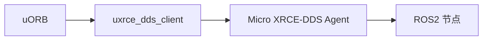

# DDS/ROS2 桥接（uXRCE-DDS）

将 uORB 主题桥接到 ROS 2 DDS 网络，支持串口/UDP 传输与时间同步。

- 客户端初始化与传输：`src/modules/uxrce_dds_client/uxrce_dds_client.cpp:114-175, 177-200`
- 时间同步与请求处理：`uxrce_dds_client.cpp:58-74, 75-88`
- 主题生成与翻译：`src/modules/uxrce_dds_client/dds_topics.yaml`、`generate_dds_topics.py`

建议：
- 根据带宽与实时性选择串口或 UDP；适配命名空间与代理配置，关注时间同步稳定性。

