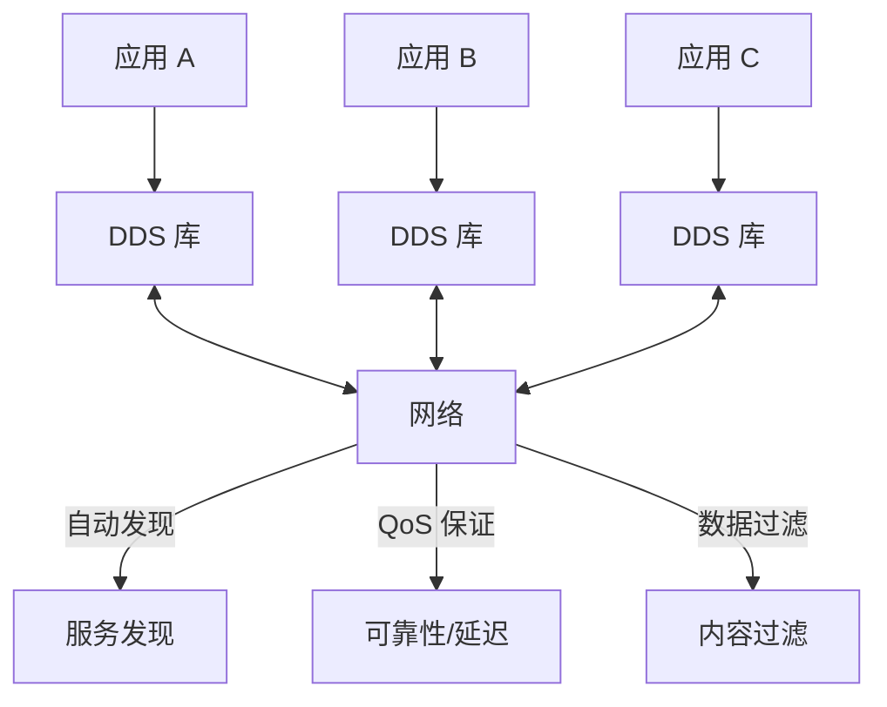
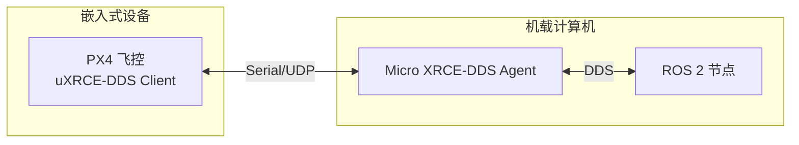
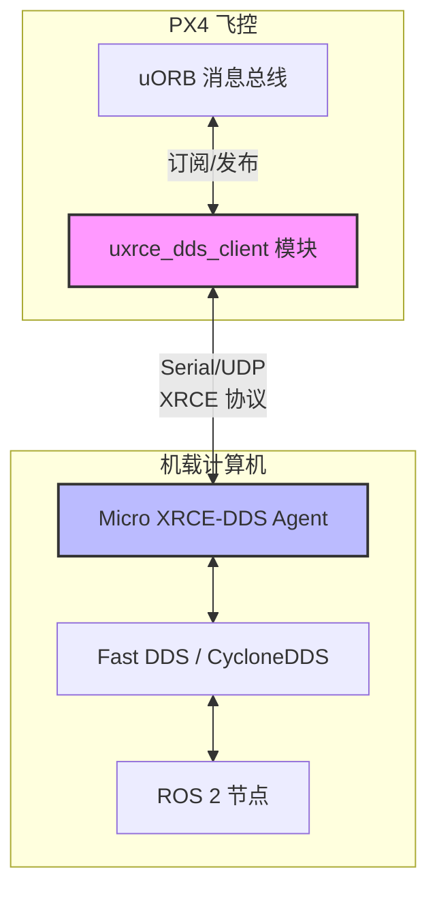
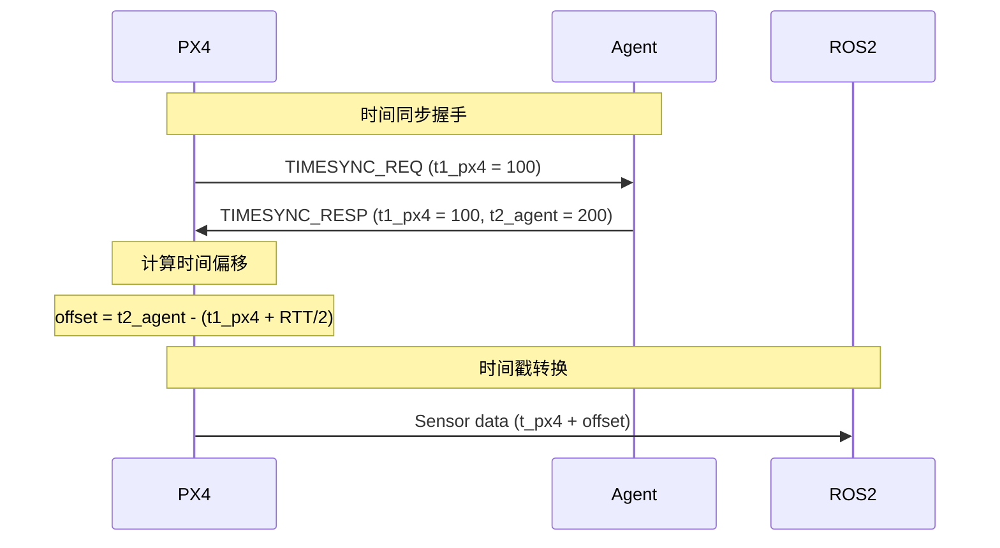
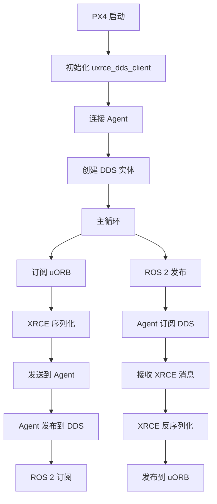

# DDS/ROS 2 桥接（uXRCE-DDS）

本文档深入讲解 PX4 与 ROS 2 的 DDS 桥接机制，基于 Micro XRCE-DDS 协议实现 uORB 消息与 ROS 2 话题的双向通信。

---

## 目录

1. [DDS 与 ROS 2 概述](#1-dds-与-ros-2-概述)
2. [uXRCE-DDS 架构](#2-uxrce-dds-架构)
3. [客户端实现](#3-客户端实现)
4. [话题映射与代码生成](#4-话题映射与代码生成)
5. [传输层配置](#5-传输层配置)
6. [时间同步](#6-时间同步)
7. [QoS 配置](#7-qos-配置)
8. [性能优化](#8-性能优化)
9. [ROS 2 集成实践](#9-ros-2-集成实践)
10. [故障排查](#10-故障排查)
11. [总结](#11-总结)

---

## 1. DDS 与 ROS 2 概述

### 1.1 什么是 DDS

**DDS (Data Distribution Service)** 是一个用于分布式实时系统的发布-订阅中间件标准：



**DDS 核心特性**：
- **数据中心模型**：以数据为中心，而非服务调用
- **QoS (Quality of Service)**：灵活的服务质量配置（可靠性、延迟、持久性）
- **自动发现**：无需中央代理，节点自动发现彼此
- **类型安全**：强类型数据结构（通过 IDL 定义）
- **实时性**：适用于时间关键型系统

### 1.2 ROS 2 与 DDS

**ROS 2** 底层使用 DDS 作为通信中间件，替代 ROS 1 的自定义 TCPROS 协议：

| 特性 | ROS 1 | ROS 2 |
|------|-------|-------|
| **中间件** | TCPROS (自定义) | DDS (标准协议) |
| **通信模式** | Master 中心化 | 去中心化 (自动发现) |
| **实时性** | ❌ 无保证 | ✅ 支持 RCLCPP Executor |
| **安全性** | ❌ 无加密 | ✅ DDS-Security |
| **跨语言** | 有限支持 | ✅ 任何支持 DDS 的语言 |
| **跨平台** | Linux/macOS | ✅ Linux/macOS/Windows/RTOS |

**ROS 2 支持的 DDS 实现**：
- **Fast DDS** (eProsima) - 默认，性能优异
- **CycloneDDS** (Eclipse) - 轻量高效
- **Connext DDS** (RTI) - 商业级，功能最全
- **CoreDX DDS** (TwinOaks) - 嵌入式优化

### 1.3 Micro XRCE-DDS

**Micro XRCE-DDS** 是 DDS 的轻量级版本，专为资源受限的嵌入式设备设计：



**Micro XRCE-DDS vs 完整 DDS**：
| 特性 | 完整 DDS | Micro XRCE-DDS |
|------|----------|----------------|
| **内存占用** | 数 MB | < 100 KB |
| **CPU 需求** | 高 | 极低 |
| **通信模式** | 对等 (Peer-to-Peer) | 客户端-代理 (Client-Agent) |
| **协议** | RTPS | XRCE (极简二进制) |
| **服务发现** | 自动发现 | 通过代理 |
| **适用场景** | 服务器/工作站 | 单片机/RTOS |

---

## 2. uXRCE-DDS 架构

### 2.1 整体架构



**核心组件**：
1. **uXRCE-DDS Client** (PX4 侧)
   - 嵌入在 PX4 固件中
   - 桥接 uORB 消息到 DDS 网络
   - 内存占用 < 50 KB

2. **Micro XRCE-DDS Agent** (机载计算机侧)
   - 运行在 Linux/Windows
   - 协议转换：XRCE ↔ DDS
   - 支持多客户端连接

3. **ROS 2 节点** (用户应用)
   - 标准 ROS 2 API (rclcpp/rclpy)
   - 通过 DDS 与 Agent 通信
   - 无需关心底层 XRCE 细节

### 2.2 数据流

**PX4 → ROS 2 (发布)**：
```
uORB 发布 → uxrce_dds_client 订阅 → XRCE 序列化 →
Serial/UDP 传输 → Agent 接收 → DDS 发布 → ROS 2 订阅
```

**ROS 2 → PX4 (订阅)**：
```
ROS 2 发布 → DDS 订阅 → Agent 接收 → XRCE 序列化 →
Serial/UDP 传输 → uxrce_dds_client 接收 → uORB 发布
```

### 2.3 关键文件

**PX4 侧**：
- `src/modules/uxrce_dds_client/` - 客户端模块
- `src/modules/uxrce_dds_client/dds_topics.yaml` - 话题映射配置
- `msg/*.msg` - uORB 消息定义

**代码生成**：
- `src/modules/uxrce_dds_client/generate_dds_topics.py` - 自动生成桥接代码
- `build/*/src/modules/uxrce_dds_client/*_publisher.cpp` - 生成的发布者
- `build/*/src/modules/uxrce_dds_client/*_subscriber.cpp` - 生成的订阅者

**外部依赖**：
- `Micro-XRCE-DDS-Client` (子模块，C 库)
- `Micro-XRCE-DDS-Agent` (独立程序，需单独安装)

---

## 3. 客户端实现

### 3.1 模块启动

```cpp
// src/modules/uxrce_dds_client/uxrce_dds_client.cpp:114-175

class UxrceddsClient : public ModuleBase<UxrceddsClient>, public ModuleParams, public px4::ScheduledWorkItem
{
public:
    UxrceddsClient();
    ~UxrceddsClient() override;

    static int task_spawn(int argc, char *argv[]);
    bool init();

private:
    void Run() override;  // 主循环

    // XRCE 会话
    uxrSession _session;
    uxrUDPTransport _udp_transport;  // UDP 传输
    uxrSerialTransport _serial_transport;  // 串口传输

    // DDS 实体
    uxrObjectId _participant_id;  // DDS Participant
    uxrObjectId _topic_id;        // DDS Topic
    uxrObjectId _publisher_id;    // DDS Publisher
    uxrObjectId _subscriber_id;   // DDS Subscriber
    uxrObjectId _datawriter_id;   // DDS DataWriter
    uxrObjectId _datareader_id;   // DDS DataReader

    // 时间同步
    uint64_t _time_offset_us{0};
};
```

**启动命令**：
```bash
# UDP 模式 (默认)
uxrce_dds_client start -t udp -p 8888 -h 192.168.1.100

# 串口模式
uxrce_dds_client start -t serial -d /dev/ttyS3 -b 921600

# 参数说明：
# -t <type>    : 传输类型 (udp, serial, custom)
# -p <port>    : UDP 端口
# -h <host>    : Agent IP 地址
# -d <device>  : 串口设备
# -b <baudrate>: 串口波特率
# -n <namespace>: ROS 2 命名空间
```

### 3.2 XRCE 会话初始化

```cpp
// src/modules/uxrce_dds_client/uxrce_dds_client.cpp (简化)

bool UxrceddsClient::init()
{
    // 1. 初始化传输层
    if (_param_uxrce_dds_ptcl.get() == 0) {  // UDP
        if (!uxr_init_udp_transport(&_udp_transport, UXR_IPv4,
                                     _param_uxrce_dds_ag_ip.get(),
                                     _param_uxrce_dds_pu.get())) {
            PX4_ERR("UDP transport init failed");
            return false;
        }
        uxr_init_session(&_session, &_udp_transport.comm, _key);
    } else {  // Serial
        if (!uxr_init_serial_transport(&_serial_transport, open_serial_transport(_param_uxrce_dds_dom_id.get()),
                                        0, 0)) {
            PX4_ERR("Serial transport init failed");
            return false;
        }
        uxr_init_session(&_session, &_serial_transport.comm, _key);
    }

    // 2. 设置超时与流控
    uxr_set_topic_callback(&_session, on_topic_callback, this);
    uxr_set_request_callback(&_session, on_request_callback, this);
    uxr_set_status_callback(&_session, on_status_callback, this);

    // 3. 创建 DDS Participant
    uxrObjectId participant_id = uxr_object_id(0, UXR_PARTICIPANT_ID);
    const char *participant_ref = "px4_participant";
    uint16_t participant_req = uxr_buffer_create_participant_ref(&_session, _reliable_out_stream_id,
                               participant_id, 0, participant_ref, UXR_REPLACE);

    // 4. 等待确认
    uint8_t status[STATUS_SIZE];
    if (!uxr_run_session_until_confirm_delivery(&_session, 1000, &participant_req, status, 1)) {
        PX4_ERR("Participant creation failed");
        return false;
    }

    return true;
}
```

### 3.3 主循环

```cpp
// src/modules/uxrce_dds_client/uxrce_dds_client.cpp (简化)

void UxrceddsClient::Run()
{
    // 1. 检查会话状态
    if (!uxr_run_session_time(&_session, 0)) {
        // 会话断开，尝试重连
        reconnect();
        return;
    }

    // 2. 发布 uORB 消息到 DDS
    if (_sensor_combined_sub.updated()) {
        sensor_combined_s data;
        _sensor_combined_sub.copy(&data);

        // 调用生成的发布函数
        publish_sensor_combined(&data);
    }

    // 3. 处理 DDS 订阅回调 (从 Agent 接收)
    // 在 on_topic_callback 中处理

    // 4. 时间同步
    send_timesync_request();

    // 5. 调度下次运行 (100 Hz)
    ScheduleDelayed(10000);  // 10 ms
}
```

---

## 4. 话题映射与代码生成

### 4.1 dds_topics.yaml 配置

```yaml
# src/modules/uxrce_dds_client/dds_topics.yaml

publications:
  # PX4 → ROS 2 (发布)
  - topic: /fmu/out/sensor_combined
    type: sensor_combined
    dds_type: px4_msgs::msg::SensorCombined

  - topic: /fmu/out/vehicle_attitude
    type: vehicle_attitude
    dds_type: px4_msgs::msg::VehicleAttitude

  - topic: /fmu/out/vehicle_local_position
    type: vehicle_local_position
    dds_type: px4_msgs::msg::VehicleLocalPosition

subscriptions:
  # ROS 2 → PX4 (订阅)
  - topic: /fmu/in/trajectory_setpoint
    type: trajectory_setpoint
    dds_type: px4_msgs::msg::TrajectorySetpoint

  - topic: /fmu/in/vehicle_command
    type: vehicle_command
    dds_type: px4_msgs::msg::VehicleCommand

  - topic: /fmu/in/offboard_control_mode
    type: offboard_control_mode
    dds_type: px4_msgs::msg::OffboardControlMode
```

**配置字段说明**：
- `topic`: ROS 2 话题名称（加 `/fmu/out` 或 `/fmu/in` 前缀）
- `type`: uORB 消息类型
- `dds_type`: ROS 2 消息类型 (通常在 `px4_msgs` 包中)

### 4.2 代码生成流程

```bash
# 构建时自动调用
python3 src/modules/uxrce_dds_client/generate_dds_topics.py \
    --dds-topics-file src/modules/uxrce_dds_client/dds_topics.yaml \
    --msg-dir msg/ \
    --template-dir src/modules/uxrce_dds_client/templates/ \
    --output-dir build/px4_fmu-v6x/src/modules/uxrce_dds_client/
```

**生成的文件**：
```
build/*/src/modules/uxrce_dds_client/
├── sensor_combined_publisher.cpp         # 发布者实现
├── sensor_combined_publisher.hpp
├── trajectory_setpoint_subscriber.cpp    # 订阅者实现
├── trajectory_setpoint_subscriber.hpp
├── dds_topics.hpp                        # 汇总头文件
└── ...
```

### 4.3 生成的发布者示例

```cpp
// build/*/src/modules/uxrce_dds_client/sensor_combined_publisher.cpp (简化)

class SensorCombinedPublisher : public Publisher
{
public:
    SensorCombinedPublisher(uxrSession *session, uxrStreamId stream_id)
        : _session(session), _stream_id(stream_id)
    {
        // 创建 DDS Topic
        _topic_id = uxr_object_id(0, UXR_TOPIC_ID);
        const char *topic_xml = "<dds><topic><name>rt/fmu/out/sensor_combined</name>"
                                "<dataType>px4_msgs::msg::dds_::SensorCombined_</dataType></topic></dds>";
        uxr_buffer_create_topic_xml(_session, _stream_id, _topic_id, _participant_id, topic_xml, UXR_REPLACE);

        // 创建 DDS DataWriter
        _datawriter_id = uxr_object_id(0, UXR_DATAWRITER_ID);
        const char *writer_xml = "<dds><data_writer><topic><kind>NO_KEY</kind>"
                                 "<name>rt/fmu/out/sensor_combined</name><dataType>px4_msgs::msg::dds_::SensorCombined_</dataType>"
                                 "<historyQos><kind>KEEP_LAST</kind><depth>5</depth></historyQos></data_writer></dds>";
        uxr_buffer_create_datawriter_xml(_session, _stream_id, _datawriter_id, _publisher_id, writer_xml, UXR_REPLACE);
    }

    bool publish(const sensor_combined_s *data)
    {
        // 序列化 uORB 消息到 ucdrBuffer
        ucdrBuffer ub;
        uint8_t buffer[BUFFER_SIZE];
        ucdr_init_buffer(&ub, buffer, BUFFER_SIZE);

        // 字段序列化
        ucdr_serialize_uint64_t(&ub, data->timestamp);
        ucdr_serialize_array_float(&ub, data->gyro_rad, 3);
        ucdr_serialize_array_float(&ub, data->accel_m_s2, 3);
        // ...

        // 发送
        return uxr_buffer_request_data(_session, _stream_id, _datawriter_id, &ub) != 0;
    }

private:
    uxrSession *_session;
    uxrStreamId _stream_id;
    uxrObjectId _topic_id;
    uxrObjectId _datawriter_id;
};
```

### 4.4 生成的订阅者示例

```cpp
// build/*/src/modules/uxrce_dds_client/trajectory_setpoint_subscriber.cpp (简化)

class TrajectorySetpointSubscriber : public Subscriber
{
public:
    TrajectorySetpointSubscriber(uxrSession *session, uxrStreamId stream_id)
        : _session(session), _stream_id(stream_id)
    {
        // 创建 DDS DataReader
        _datareader_id = uxr_object_id(0, UXR_DATAREADER_ID);
        const char *reader_xml = "<dds><data_reader><topic><kind>NO_KEY</kind>"
                                 "<name>rt/fmu/in/trajectory_setpoint</name><dataType>px4_msgs::msg::dds_::TrajectorySetpoint_</dataType>"
                                 "<reliabilityQos><kind>RELIABLE</kind></reliabilityQos></data_reader></dds>";
        uxr_buffer_create_datareader_xml(_session, _stream_id, _datareader_id, _subscriber_id, reader_xml, UXR_REPLACE);

        // 注册回调
        uxr_buffer_request_data(_session, _stream_id, _datareader_id, _stream_id, &_delivery_control);
    }

    static void on_topic(uxrSession *session, uxrObjectId object_id, uint16_t request_id, uxrStreamId stream_id,
                         ucdrBuffer *ub, uint16_t length, void *args)
    {
        TrajectorySetpointSubscriber *self = static_cast<TrajectorySetpointSubscriber *>(args);

        // 反序列化 DDS 消息
        trajectory_setpoint_s data{};
        ucdr_deserialize_uint64_t(ub, &data.timestamp);
        ucdr_deserialize_array_float(ub, data.position, 3);
        ucdr_deserialize_array_float(ub, data.velocity, 3);
        // ...

        // 发布到 uORB
        self->_trajectory_setpoint_pub.publish(data);
    }

private:
    uxrSession *_session;
    uxrStreamId _stream_id;
    uxrObjectId _datareader_id;
    uORB::Publication<trajectory_setpoint_s> _trajectory_setpoint_pub{ORB_ID(trajectory_setpoint)};
};
```

---

## 5. 传输层配置

### 5.1 UDP 传输

**优点**：
- 无需额外硬件（以太网/WiFi）
- 支持组播（一对多）
- 配置简单

**缺点**：
- 无保证送达（不可靠）
- 网络抖动影响大
- 防火墙可能阻止

**配置示例**：
```bash
# PX4 侧
uxrce_dds_client start -t udp -h 192.168.1.100 -p 8888

# Agent 侧 (机载计算机)
MicroXRCEAgent udp4 -p 8888
```

**参数**：
- `UXRCE_DDS_AG_IP`: Agent IP 地址 (默认 127.0.0.1)
- `UXRCE_DDS_PRT`: Agent UDP 端口 (默认 8888)
- `UXRCE_DDS_DOM_ID`: DDS Domain ID (默认 0)

### 5.2 串口传输

**优点**：
- 可靠传输（硬件流控）
- 抗干扰能力强
- 延迟低

**缺点**：
- 需要物理连接
- 带宽受限（通常 921600 bps）
- 配置复杂（波特率、流控）

**配置示例**：
```bash
# PX4 侧 (NuttX 飞控)
uxrce_dds_client start -t serial -d /dev/ttyS3 -b 921600

# Agent 侧 (机载计算机)
MicroXRCEAgent serial --dev /dev/ttyUSB0 -b 921600
```

**串口硬件流控**：
```cpp
// src/modules/uxrce_dds_client/uxrce_dds_client.cpp (简化)
int open_serial_transport(const char *device, uint32_t baudrate)
{
    int fd = open(device, O_RDWR | O_NOCTTY | O_NONBLOCK);
    if (fd < 0) return -1;

    struct termios config;
    tcgetattr(fd, &config);

    // 波特率
    cfsetispeed(&config, baudrate);
    cfsetospeed(&config, baudrate);

    // 8N1 无奇偶校验
    config.c_cflag |= (CLOCAL | CREAD | CS8);
    config.c_cflag &= ~(PARENB | CSTOPB | CSIZE | CRTSCTS);

    // 启用硬件流控 (RTS/CTS)
    #if defined(CRTSCTS)
    config.c_cflag |= CRTSCTS;
    #endif

    tcsetattr(fd, TCSANOW, &config);
    return fd;
}
```

**参数**：
- `UXRCE_DDS_DEV`: 串口设备 (如 /dev/ttyS3)
- `UXRCE_DDS_BAUD`: 波特率 (921600 推荐)

### 5.3 传输层对比

| 特性 | UDP | Serial |
|------|-----|--------|
| **带宽** | 100 Mbps (以太网) / 54 Mbps (WiFi) | 0.9 Mbps (921600 bps) |
| **延迟** | 1-5 ms (局域网) | 0.1-1 ms |
| **可靠性** | ❌ 不保证送达 | ✅ 硬件流控保证 |
| **连接** | 无线/有线 | ✅ 有线物理连接 |
| **配置复杂度** | ✅ 简单 | ⚠️ 需配置波特率/流控 |
| **适用场景** | SITL / 高带宽 | 生产环境 / 可靠性优先 |

---

## 6. 时间同步

### 6.1 为何需要时间同步

**问题**：PX4 和 ROS 2 运行在不同设备上，时钟不同步会导致：
- **时间戳不对齐**：无法融合来自不同源的数据（如 VIO + GPS）
- **TF 变换失败**：ROS 2 TF 树要求严格的时间一致性
- **数据关联错误**：无法匹配对应时刻的传感器数据

**解决方案**：通过 TIMESYNC 消息同步 PX4 与 ROS 2 的时钟偏移。

### 6.2 时间同步机制



**时间偏移计算**：
```
RTT = (t3_px4 - t1_px4) - (t2_agent - t1_px4)
offset = t2_agent - (t1_px4 + RTT / 2)
```

### 6.3 时间同步实现

```cpp
// src/modules/uxrce_dds_client/uxrce_dds_client.cpp (简化)

void UxrceddsClient::send_timesync_request()
{
    // 1. 构造 TIMESYNC 请求
    timesync_s ts{};
    ts.timestamp = hrt_absolute_time();  // t1_px4
    ts.tc1 = ts.timestamp * 1000;  // us → ns
    ts.ts1 = 0;  // 请求时为 0

    // 2. 发布到 DDS (Agent 会响应)
    _timesync_pub.publish(ts);
}

void UxrceddsClient::on_timesync_topic(const timesync_s *data)
{
    // 3. 接收 Agent 响应
    uint64_t now_ns = hrt_absolute_time() * 1000;

    if (data->tc1 > 0 && data->ts1 > 0) {
        // 4. 计算往返时延与偏移
        int64_t rtt_ns = now_ns - data->tc1 - (data->ts1 - data->tc1);
        int64_t offset_ns = data->ts1 - (data->tc1 + rtt_ns / 2);

        // 5. 滤波更新偏移
        _time_offset_ns = (_time_offset_ns * 0.95) + (offset_ns * 0.05);

        // 6. 应用偏移到所有发布的消息
        _time_offset_us = _time_offset_ns / 1000;
    }
}

// 使用偏移调整时间戳
uint64_t UxrceddsClient::get_synchronized_timestamp()
{
    return hrt_absolute_time() + _time_offset_us;
}
```

**参数**：
- `UXRCE_DDS_SYNCT`: 启用时间同步 (0=禁用, 1=启用)
- `UXRCE_DDS_SYNCC`: 时间同步周期 (默认 10 Hz)

---

## 7. QoS 配置

### 7.1 DDS QoS 策略

**QoS (Quality of Service)** 定义了数据传输的可靠性与性能特征：

| QoS 策略 | 可选值 | 说明 |
|----------|--------|------|
| **Reliability** | RELIABLE / BEST_EFFORT | 可靠传输 vs 尽力而为 |
| **Durability** | VOLATILE / TRANSIENT_LOCAL / PERSISTENT | 历史数据持久化 |
| **History** | KEEP_LAST(n) / KEEP_ALL | 保留最近 n 条 vs 全部 |
| **Deadline** | period (ms) | 消息发布周期保证 |
| **Lifespan** | duration (ms) | 消息有效期 |
| **Liveliness** | AUTOMATIC / MANUAL | 发布者存活检测 |

### 7.2 QoS 模板

**传感器数据** (高频、可丢失)：
```xml
<data_reader>
    <reliabilityQos><kind>BEST_EFFORT</kind></reliabilityQos>
    <durabilityQos><kind>VOLATILE</kind></durabilityQos>
    <historyQos><kind>KEEP_LAST</kind><depth>1</depth></historyQos>
</data_reader>
```

**控制命令** (关键、不可丢失)：
```xml
<data_writer>
    <reliabilityQos><kind>RELIABLE</kind></reliabilityQos>
    <durabilityQos><kind>TRANSIENT_LOCAL</kind></durabilityQos>
    <historyQos><kind>KEEP_LAST</kind><depth>10</depth></historyQos>
</data_writer>
```

### 7.3 自定义 QoS

**修改 dds_topics.yaml**：
```yaml
publications:
  - topic: /fmu/out/vehicle_command_ack
    type: vehicle_command_ack
    dds_type: px4_msgs::msg::VehicleCommandAck
    qos:
      reliability: RELIABLE
      durability: TRANSIENT_LOCAL
      history: KEEP_LAST
      depth: 5
```

---

## 8. 性能优化

### 8.1 带宽优化

**问题**：默认配置下，所有 uORB 话题都桥接到 DDS，带宽浪费严重。

**优化方案**：
1. **仅桥接必要话题**
   ```yaml
   # dds_topics.yaml - 仅保留必要话题
   publications:
     - topic: /fmu/out/vehicle_local_position  # 位置估计 (必须)
     - topic: /fmu/out/vehicle_attitude        # 姿态估计 (必须)
     - topic: /fmu/out/vehicle_status          # 飞行状态 (必须)
     # 删除不必要的话题 (如 sensor_combined, sensor_gyro 等)
   ```

2. **降低发布频率**
   ```cpp
   // 在生成的发布者中添加速率限制
   class VehicleAttitudePublisher {
       uint64_t _last_pub_time{0};

       bool publish(const vehicle_attitude_s *data) {
           uint64_t now = hrt_absolute_time();
           if (now - _last_pub_time < 50000) {  // 限制 20 Hz
               return false;
           }
           _last_pub_time = now;
           // ... 发布逻辑
       }
   };
   ```

### 8.2 延迟优化

**问题**：XRCE 协议开销 + 网络延迟导致端到端延迟过高。

**优化方案**：
1. **使用串口传输** (延迟 < 1 ms)
2. **禁用时间同步** (如果不需要精确时间戳对齐)
3. **BEST_EFFORT QoS** (牺牲可靠性换取低延迟)

### 8.3 内存优化

**问题**：多话题桥接导致 RAM 占用过高。

**优化方案**：
```cpp
// 配置更小的流缓冲区
#define STREAM_HISTORY  4  // 默认 8
#define BUFFER_SIZE     512  // 默认 1024
```

---

## 9. ROS 2 集成实践

### 9.1 安装依赖

```bash
# 安装 Micro-XRCE-DDS-Agent
git clone https://github.com/eProsima/Micro-XRCE-DDS-Agent.git
cd Micro-XRCE-DDS-Agent
mkdir build && cd build
cmake ..
make
sudo make install

# 安装 px4_msgs (ROS 2 消息定义)
cd ~/ros2_ws/src
git clone https://github.com/PX4/px4_msgs.git
cd ~/ros2_ws
colcon build --packages-select px4_msgs
source install/setup.bash
```

### 9.2 启动 Agent

```bash
# UDP 模式
MicroXRCEAgent udp4 -p 8888

# 串口模式
MicroXRCEAgent serial --dev /dev/ttyUSB0 -b 921600

# 查看连接的客户端
# Agent 输出: [==== 微 XRCE-DDS Agent ====]
# [INFO] New client connected: 0x0001
```

### 9.3 ROS 2 订阅 PX4 话题

```python
# ~/ros2_ws/src/px4_offboard/px4_offboard/subscriber_example.py
import rclpy
from rclpy.node import Node
from px4_msgs.msg import VehicleLocalPosition

class PX4Subscriber(Node):
    def __init__(self):
        super().__init__('px4_subscriber')
        self.subscription = self.create_subscription(
            VehicleLocalPosition,
            '/fmu/out/vehicle_local_position',
            self.listener_callback,
            10)

    def listener_callback(self, msg):
        self.get_logger().info(f'Position: x={msg.x:.2f} y={msg.y:.2f} z={msg.z:.2f}')

def main(args=None):
    rclpy.init(args=args)
    node = PX4Subscriber()
    rclpy.spin(node)
    node.destroy_node()
    rclpy.shutdown()

if __name__ == '__main__':
    main()
```

```bash
# 运行节点
ros2 run px4_offboard subscriber_example
```

### 9.4 ROS 2 发布到 PX4

```python
# ~/ros2_ws/src/px4_offboard/px4_offboard/publisher_example.py
import rclpy
from rclpy.node import Node
from px4_msgs.msg import TrajectorySetpoint, OffboardControlMode, VehicleCommand

class OffboardControl(Node):
    def __init__(self):
        super().__init__('offboard_control')

        # 发布者
        self.trajectory_pub = self.create_publisher(
            TrajectorySetpoint, '/fmu/in/trajectory_setpoint', 10)
        self.offboard_mode_pub = self.create_publisher(
            OffboardControlMode, '/fmu/in/offboard_control_mode', 10)
        self.vehicle_command_pub = self.create_publisher(
            VehicleCommand, '/fmu/in/vehicle_command', 10)

        # 定时器 (100 Hz)
        self.timer = self.create_timer(0.01, self.timer_callback)
        self.counter = 0

    def timer_callback(self):
        # 1. 发布 Offboard 控制模式
        offboard_msg = OffboardControlMode()
        offboard_msg.timestamp = int(self.get_clock().now().nanoseconds / 1000)
        offboard_msg.position = True
        offboard_msg.velocity = False
        offboard_msg.acceleration = False
        self.offboard_mode_pub.publish(offboard_msg)

        # 2. 发布轨迹设定点
        traj_msg = TrajectorySetpoint()
        traj_msg.timestamp = int(self.get_clock().now().nanoseconds / 1000)
        traj_msg.position = [0.0, 0.0, -5.0]  # NED 坐标，-5m = 5m 高度
        traj_msg.yaw = 1.57  # 90 度
        self.trajectory_pub.publish(traj_msg)

        # 3. 首次进入 Offboard 模式
        if self.counter == 10:
            self.publish_vehicle_command(VehicleCommand.VEHICLE_CMD_DO_SET_MODE, 1.0, 6.0)
            self.get_logger().info('Entering Offboard mode')

        # 4. 解锁
        if self.counter == 30:
            self.publish_vehicle_command(VehicleCommand.VEHICLE_CMD_COMPONENT_ARM_DISARM, 1.0)
            self.get_logger().info('Arming')

        self.counter += 1

    def publish_vehicle_command(self, command, param1=0.0, param2=0.0):
        msg = VehicleCommand()
        msg.timestamp = int(self.get_clock().now().nanoseconds / 1000)
        msg.command = command
        msg.param1 = param1
        msg.param2 = param2
        msg.target_system = 1
        msg.target_component = 1
        msg.source_system = 1
        msg.source_component = 1
        msg.from_external = True
        self.vehicle_command_pub.publish(msg)

def main(args=None):
    rclpy.init(args=args)
    node = OffboardControl()
    rclpy.spin(node)
    node.destroy_node()
    rclpy.shutdown()

if __name__ == '__main__':
    main()
```

---

## 10. 故障排查

### 10.1 连接问题

**问题**：Agent 无法连接到 PX4

**检查清单**：
```bash
# 1. 确认 PX4 侧模块启动
nsh> uxrce_dds_client status
# 应显示: Running

# 2. 确认 Agent 运行
ps aux | grep MicroXRCEAgent

# 3. 检查网络连通性 (UDP 模式)
ping 192.168.1.100

# 4. 检查串口设备 (Serial 模式)
ls -l /dev/ttyUSB0
# 确认权限: sudo chmod 666 /dev/ttyUSB0

# 5. 查看 Agent 日志
MicroXRCEAgent serial --dev /dev/ttyUSB0 -b 921600 -v 6  # 详细日志
```

### 10.2 话题不可见

**问题**：`ros2 topic list` 看不到 PX4 话题

**解决方案**：
```bash
# 1. 确认 DDS Domain ID 一致
# PX4: UXRCE_DDS_DOM_ID = 0
# ROS 2:
export ROS_DOMAIN_ID=0

# 2. 检查命名空间
ros2 topic list  # 应显示 /fmu/out/*, /fmu/in/*

# 3. 查看 Agent 输出
# 应显示: [INFO] Matched topic: /fmu/out/vehicle_attitude

# 4. 检查 dds_topics.yaml 配置
cat src/modules/uxrce_dds_client/dds_topics.yaml
```

### 10.3 时间戳异常

**问题**：ROS 2 收到的消息时间戳不对

**解决方案**：
```bash
# 1. 启用时间同步
param set UXRCE_DDS_SYNCT 1
param set UXRCE_DDS_SYNCC 10  # 10 Hz

# 2. 检查时间同步状态
listener timesync_status
# 观察 observed_offset 是否收敛

# 3. ROS 2 侧使用 stamp 字段
# 确保使用 msg.timestamp，而非 ros2 clock
```

---

## 11. 总结

### 11.1 核心概念回顾

| 组件 | 职责 | 关键文件 |
|------|------|----------|
| **uxrce_dds_client** | PX4 DDS 客户端模块 | `uxrce_dds_client.cpp` |
| **Micro-XRCE-DDS-Agent** | 协议转换代理 (XRCE ↔ DDS) | 独立程序 |
| **dds_topics.yaml** | 话题映射配置 | `dds_topics.yaml` |
| **generate_dds_topics.py** | 自动生成桥接代码 | `generate_dds_topics.py` |
| **px4_msgs** | ROS 2 消息包 | 外部 Git 仓库 |

### 11.2 关键流程



### 11.3 开发检查清单

- [ ] 确定传输类型 (UDP/Serial)
- [ ] 配置 Agent IP/端口 或 串口设备/波特率
- [ ] 编辑 `dds_topics.yaml` 添加/删除话题
- [ ] 重新编译 PX4 (触发代码生成)
- [ ] 安装 `px4_msgs` ROS 2 包
- [ ] 启动 Micro-XRCE-DDS-Agent
- [ ] 启动 PX4 `uxrce_dds_client`
- [ ] 验证话题可见性 (`ros2 topic list`)
- [ ] 测试数据流 (`ros2 topic echo`)
- [ ] 配置 QoS (如需可靠性保证)
- [ ] 启用时间同步 (如需精确时间戳)

### 11.4 延伸阅读

- **Micro XRCE-DDS 规范**: https://micro-xrce-dds.docs.eprosima.com/
- **PX4 ROS 2 用户指南**: https://docs.px4.io/main/en/ros/ros2_comm.html
- **eProsima Fast DDS**: https://fast-dds.docs.eprosima.com/
- **ROS 2 QoS 设计**: https://design.ros2.org/articles/qos.html
- **px4_msgs 仓库**: https://github.com/PX4/px4_msgs

---

**文档版本**: v1.0
**最后更新**: 基于 PX4 main 分支 (2025-01)
**维护者**: PX4 开发团队
**反馈**: 提交 Issue 到 `PX4-Autopilot` 仓库
