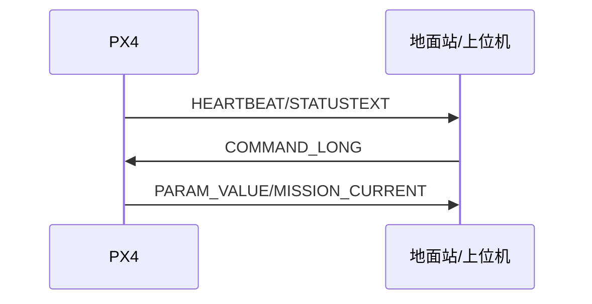

# MAVLink 接口

与地面站/上位机的标准通信协议，支持参数、任务、日志、时间同步等。

- 模块入口与主类：`src/modules/mavlink/mavlink_main.cpp:95-139, 185-197, 199-243`
- 接收与流：`mavlink_receiver.*`、`mavlink_stream.*`
- FTP/日志/时间同步：`mavlink_ftp.*`、`mavlink_ulog.*`、`mavlink_timesync.*`

上位机建议：
- 优先使用标准消息与扩展字段，必要时通过 `STATUSTEXT`/事件机制同步状态：`mavlink_main.cpp:85-93`

