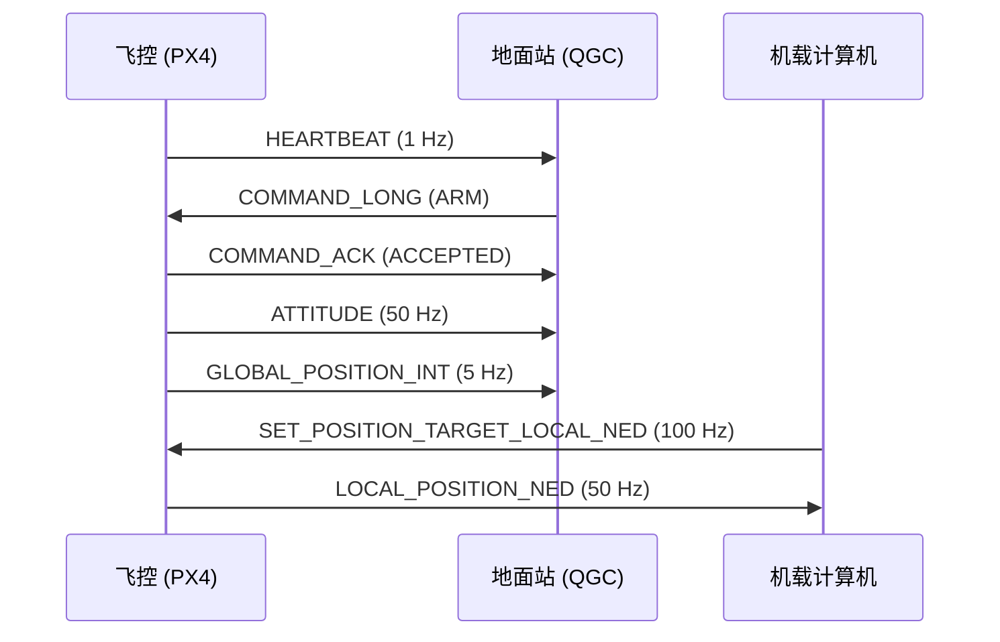
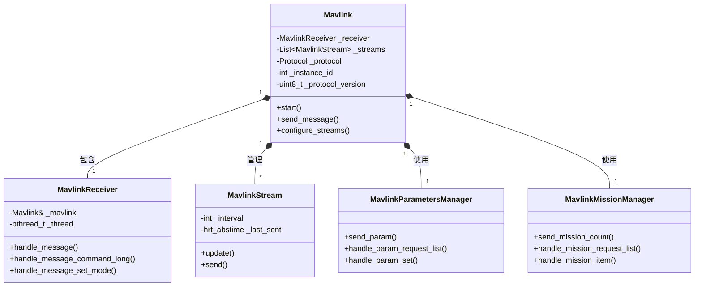
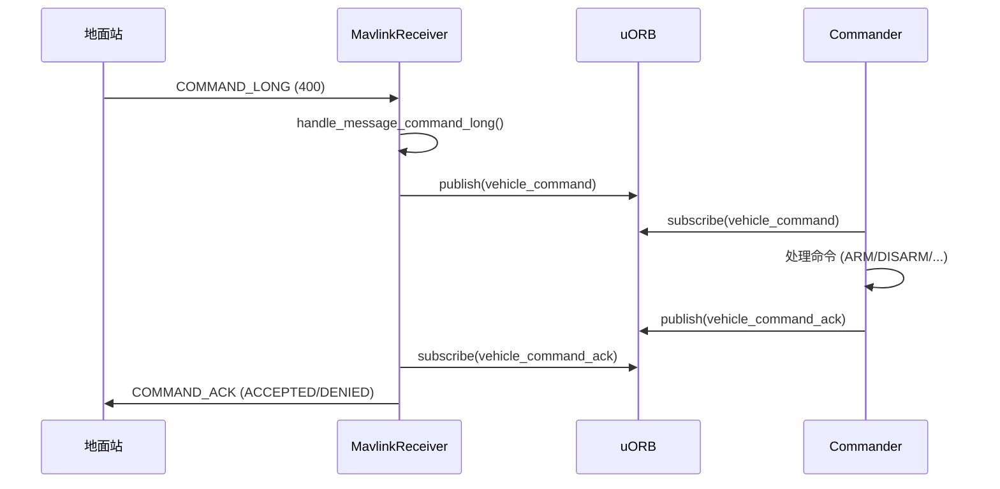
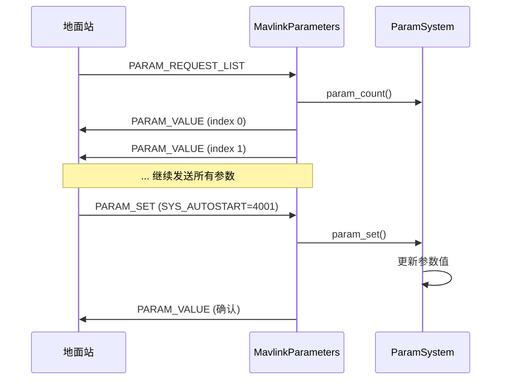
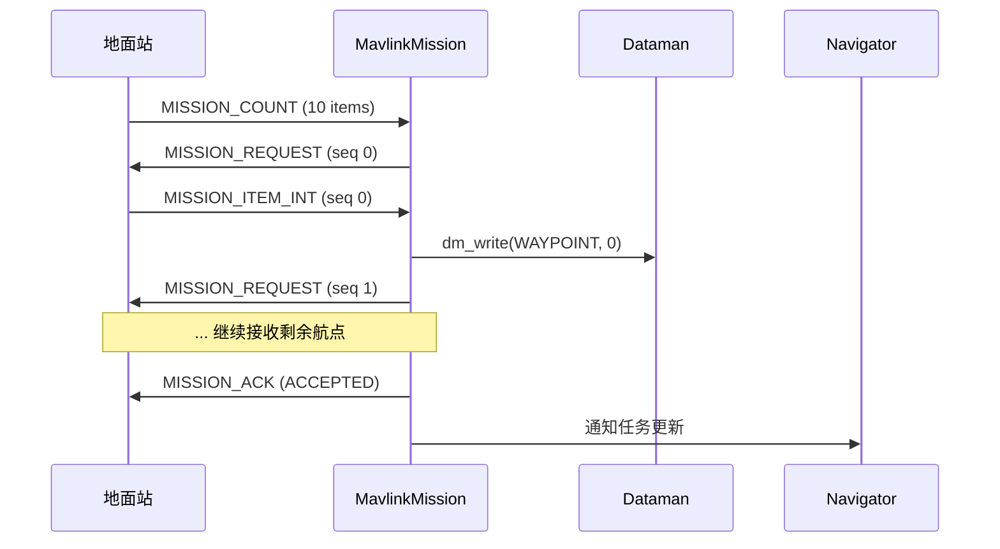
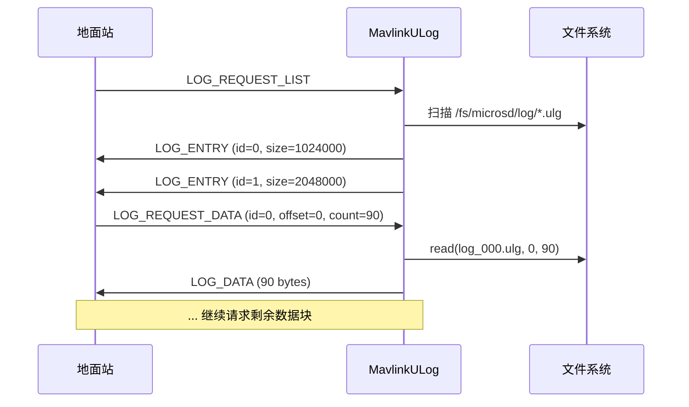
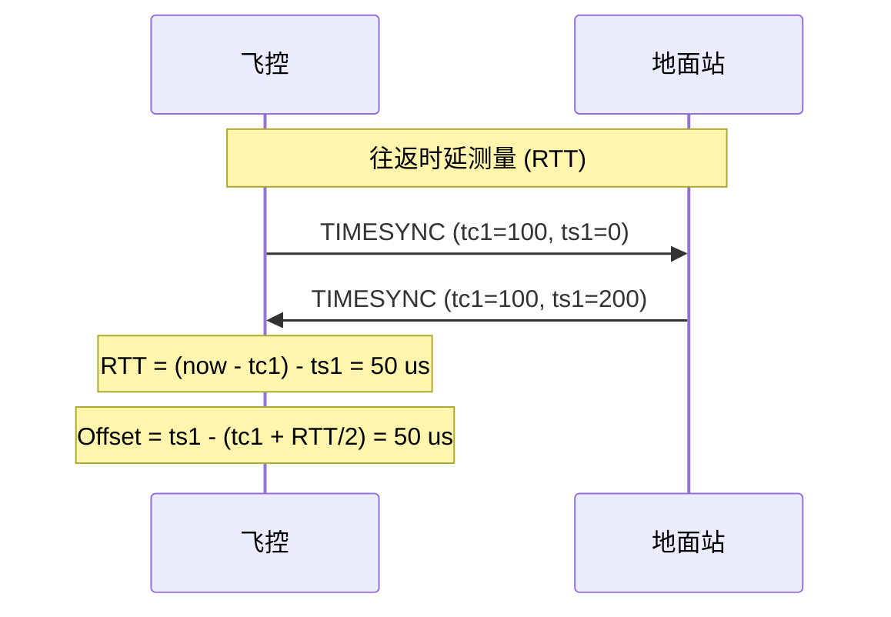
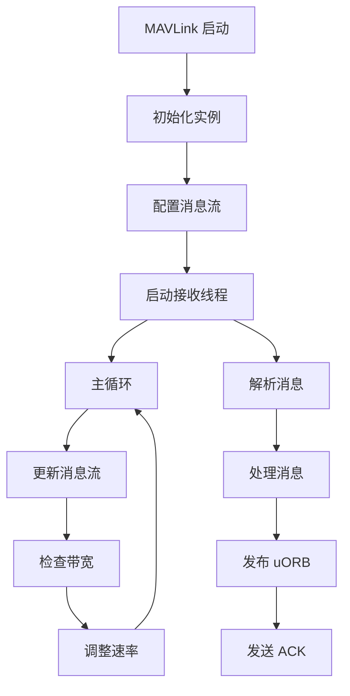

# MAVLink 接口

本文档深入讲解 PX4 的 MAVLink 通信协议实现，包括消息流机制、命令处理、参数同步、任务传输、FTP、日志下载、时间同步等核心功能。

---

## 目录

1. [MAVLink 概述](#1-mavlink-概述)
2. [模块架构](#2-模块架构)
3. [消息流机制](#3-消息流机制)
4. [命令处理](#4-命令处理)
5. [参数协议](#5-参数协议)
6. [任务协议](#6-任务协议)
7. [FTP 文件传输](#7-ftp-文件传输)
8. [日志下载](#8-日志下载)
9. [时间同步](#9-时间同步)
10. [多实例与路由](#10-多实例与路由)
11. [性能优化](#11-性能优化)
12. [实践指南](#12-实践指南)
13. [总结](#13-总结)

---

## 1. MAVLink 概述

### 1.1 什么是 MAVLink

**MAVLink (Micro Air Vehicle Link)** 是一个为无人机和地面站设计的轻量级消息协议：



**核心特性**：
- **二进制协议**：高效紧凑，适合低带宽链路（如 57600 波特串口）
- **CRC 校验**：每个消息带 CRC-16 校验码，包含消息 ID 和结构体定义的 `CRC_EXTRA`
- **版本兼容**：MAVLink 1.0 (最大 255 字节) 和 MAVLink 2.0 (最大 65535 字节，支持消息签名)
- **多系统/多组件**：`system_id` + `component_id` 标识网络中的每个节点

### 1.2 PX4 MAVLink 实现位置

**关键文件**：
- `src/modules/mavlink/` - MAVLink 模块主目录
- `mavlink/v2.0/` - MAVLink 协议库（Git submodule）
- `msg/vehicle_command.msg` - uORB 命令消息（MAVLink → uORB 转换）
- `msg/vehicle_status.msg` - 飞行状态（uORB → MAVLink 转换）

**编译配置**：
```cmake
# boards/px4/fmu-v6x/default.px4board
CONFIG_MODULES_MAVLINK=y
CONFIG_COMMON_MAVLINK=y  # 启用 MAVLink 库
```

### 1.3 启动命令示例

```bash
# 串口实例 (默认 ttyS1, 57600 波特率)
mavlink start -d /dev/ttyS1 -b 57600 -m onboard -r 10000

# UDP 实例 (SITL 常用)
mavlink start -u 14550 -m onboard -r 4000000

# 多实例 (遥测 + 机载计算机)
mavlink start -d /dev/ttyS1 -b 57600 -m normal -r 1200  # 遥测链路
mavlink start -d /dev/ttyS2 -b 921600 -m onboard -r 10000  # 机载链路

# 参数说明：
# -d <device>  : 串口设备路径
# -b <baudrate>: 波特率 (57600, 115200, 921600, ...)
# -u <port>    : UDP 端口
# -m <mode>    : 消息流模式 (normal, custom, onboard, osd, magic, config, minimal, extvision, extvisionmin, gimbal)
# -r <rate>    : 最大数据率 (bytes/s)
```

**常用模式说明**：
| 模式 | 数据率 | 适用场景 | 关键消息 |
|------|--------|----------|----------|
| **normal** | 1200 B/s | 遥测链路 (57600 波特) | ATTITUDE, GPS, BATTERY, RC |
| **onboard** | 10000 B/s | 机载计算机 (921600 波特/以太网) | LOCAL_POSITION, ATTITUDE (高频) |
| **extvision** | 6000 B/s | 外部视觉定位 (VIO/SLAM) | VISION_POSITION_ESTIMATE, ODOMETRY |
| **minimal** | 400 B/s | 低带宽链路 (如 LoRa) | HEARTBEAT, GPS, BATTERY |
| **custom** | 自定义 | 通过 `mavlink stream` 命令动态配置 | 按需添加 |

---

## 2. 模块架构

### 2.1 核心类结构



### 2.2 Mavlink 主类

```cpp
// src/modules/mavlink/mavlink_main.h:108-150
class Mavlink final : public ModuleParams
{
public:
    Mavlink();
    ~Mavlink();

    static int start(int argc, char *argv[]);  // 启动实例

    // 实例管理
    static Mavlink *get_instance_for_device(const char *device_name);
    static int instance_count();

    // 消息发送
    mavlink_message_t *get_buffer() { return &_mavlink_buffer; }
    mavlink_status_t *get_status() { return &_mavlink_status; }

    // 协议版本
    void setProtocolVersion(uint8_t version);  // 1 或 2
    uint8_t getProtocolVersion() const { return _protocol_version; }

    // 消息转发 (多实例路由)
    static void forward_message(const mavlink_message_t *msg, Mavlink *self);

private:
    MavlinkReceiver _receiver;  // 接收线程
    List<MavlinkStream *> _streams;  // 消息流列表

    Protocol _protocol;  // SERIAL or UDP
    int _instance_id;  // 实例 ID (0-5)
    uint8_t _protocol_version;  // 1 or 2

    int _uart_fd{-1};  // 串口文件描述符
    #ifdef MAVLINK_UDP
    int _socket_fd{-1};  // UDP socket
    #endif

    mavlink_message_t _mavlink_buffer;  // 发送缓冲区
    mavlink_status_t _mavlink_status;  // 解析状态
};
```

### 2.3 初始化流程

```cpp
// src/modules/mavlink/mavlink_main.cpp:101-138
Mavlink::Mavlink() :
    ModuleParams(nullptr),
    _receiver(*this)  // 创建接收器
{
    // 1. 更新参数缓存
    mavlink_update_parameters();

    // 2. 设置 System ID 和 Component ID
    int sys_id = _param_mav_sys_id.get();  // MAV_SYS_ID (默认 1)
    if (sys_id > 0 && sys_id < 255) {
        mavlink_system.sysid = sys_id;
    }

    int comp_id = _param_mav_comp_id.get();  // MAV_COMP_ID (默认 1)
    if (comp_id > 0 && comp_id < 255) {
        mavlink_system.compid = comp_id;
    }

    // 3. 记录首次启动时间
    if (_first_start_time == 0) {
        _first_start_time = hrt_absolute_time();
    }

    // 4. 预创建 uORB topic (避免首次发布丢失)
    if (orb_exists(ORB_ID(vehicle_command), 0) == PX4_ERROR) {
        orb_advertise(ORB_ID(vehicle_command), nullptr);
    }

    // 5. 订阅命令和事件
    _vehicle_command_sub.subscribe();
    _event_sub.subscribe();

    // 6. 发布遥测状态
    _telemetry_status_pub.advertise();
}
```

---

## 3. 消息流机制

### 3.1 MavlinkStream 基类

```cpp
// src/modules/mavlink/mavlink_stream.h:50-100
class MavlinkStream : public ListNode<MavlinkStream *>
{
public:
    MavlinkStream(Mavlink *mavlink);
    virtual ~MavlinkStream() = default;

    // 设置发送间隔 (微秒)
    void set_interval(const int interval) { _interval = interval; }
    int get_interval() { return _interval; }

    // 更新并发送消息 (如果达到间隔时间)
    int update(const hrt_abstime &t);

    // 子类必须实现
    virtual const char *get_name() const = 0;  // 消息名称
    virtual uint16_t get_id() = 0;  // MAVLink 消息 ID
    virtual unsigned get_size() = 0;  // 消息大小 (字节)

    // 按需发送 (响应 MAV_CMD_REQUEST_MESSAGE)
    virtual bool request_message(float param2 = 0.0, ...) {
        return send();  // 默认行为：立即发送
    }

protected:
    virtual bool send() = 0;  // 子类实现具体发送逻辑

    Mavlink *_mavlink;  // 所属 Mavlink 实例
    int _interval{-1};  // 发送间隔 (us)
    hrt_abstime _last_sent{0};  // 上次发送时间
};
```

### 3.2 消息流示例：ATTITUDE

```cpp
// src/modules/mavlink/mavlink_messages.cpp (简化示例)
class MavlinkStreamAttitude : public MavlinkStream
{
public:
    const char *get_name() const override { return "ATTITUDE"; }
    uint16_t get_id() override { return MAVLINK_MSG_ID_ATTITUDE; }
    unsigned get_size() override { return MAVLINK_MSG_ID_ATTITUDE_LEN + MAVLINK_NUM_NON_PAYLOAD_BYTES; }

protected:
    bool send() override {
        // 1. 订阅 uORB 消息
        vehicle_attitude_s att;
        if (!_att_sub.update(&att)) {
            return false;  // 无更新，不发送
        }

        // 2. 转换为 MAVLink 消息
        mavlink_attitude_t msg{};
        msg.time_boot_ms = att.timestamp / 1000;  // us → ms

        // 四元数 → 欧拉角
        matrix::Eulerf euler = matrix::Quatf(att.q);
        msg.roll = euler.phi();
        msg.pitch = euler.theta();
        msg.yaw = euler.psi();

        msg.rollspeed = att.rollspeed;
        msg.pitchspeed = att.pitchspeed;
        msg.yawspeed = att.yawspeed;

        // 3. 发送
        mavlink_msg_attitude_send_struct(_mavlink->get_channel(), &msg);
        return true;
    }

private:
    uORB::Subscription _att_sub{ORB_ID(vehicle_attitude)};
};
```

### 3.3 消息流配置与速率限制

**配置流速率**：
```bash
# 设置 ATTITUDE 消息为 50 Hz (20000 us 间隔)
mavlink stream -d /dev/ttyS1 -s ATTITUDE -r 50

# 禁用某个消息
mavlink stream -d /dev/ttyS1 -s BATTERY_STATUS -r 0

# 查看当前配置
mavlink status streams
```

**速率限制算法**：
```cpp
// src/modules/mavlink/mavlink_rate_limiter.cpp (简化)
int MavlinkStream::update(const hrt_abstime &t)
{
    if (_interval <= 0) {
        return -1;  // 未配置间隔，不发送
    }

    // 检查是否达到发送间隔
    if (t - _last_sent < _interval) {
        return -1;  // 时间未到
    }

    // 发送消息
    if (send()) {
        _last_sent = t;  // 更新发送时间
        return 0;
    }

    return -1;
}
```

---

## 4. 命令处理

### 4.1 命令接收流程



### 4.2 COMMAND_LONG 处理

```cpp
// src/modules/mavlink/mavlink_receiver.cpp (简化)
void MavlinkReceiver::handle_message_command_long(mavlink_message_t *msg)
{
    mavlink_command_long_t cmd_mavlink;
    mavlink_msg_command_long_decode(msg, &cmd_mavlink);

    // 1. 转换为 uORB vehicle_command
    vehicle_command_s vcmd{};
    vcmd.timestamp = hrt_absolute_time();
    vcmd.command = cmd_mavlink.command;  // MAV_CMD_*
    vcmd.param1 = cmd_mavlink.param1;
    vcmd.param2 = cmd_mavlink.param2;
    vcmd.param3 = cmd_mavlink.param3;
    vcmd.param4 = cmd_mavlink.param4;
    vcmd.param5 = cmd_mavlink.param5;  // x
    vcmd.param6 = cmd_mavlink.param6;  // y
    vcmd.param7 = cmd_mavlink.param7;  // z
    vcmd.target_system = cmd_mavlink.target_system;
    vcmd.target_component = cmd_mavlink.target_component;
    vcmd.source_system = msg->sysid;
    vcmd.source_component = msg->compid;
    vcmd.confirmation = cmd_mavlink.confirmation;
    vcmd.from_external = true;

    // 2. 发布到 uORB
    _vehicle_command_pub.publish(vcmd);
}
```

### 4.3 常用命令示例

**解锁 (ARM)**：
```cpp
// MAV_CMD_COMPONENT_ARM_DISARM (400)
// param1 = 1.0 (ARM), 0.0 (DISARM)
// param2 = 21196.0 (force flag, 绕过安全检查)

vcmd.command = vehicle_command_s::VEHICLE_CMD_COMPONENT_ARM_DISARM;
vcmd.param1 = 1.0f;  // ARM
vcmd.param2 = 0.0f;  // 不强制
```

**切换模式 (SET_MODE)**：
```cpp
// MAV_CMD_DO_SET_MODE (176)
// param1 = MAV_MODE_FLAG_CUSTOM_MODE_ENABLED
// param2 = custom_mode (PX4_CUSTOM_MAIN_MODE_* | PX4_CUSTOM_SUB_MODE_*)

vcmd.command = vehicle_command_s::VEHICLE_CMD_DO_SET_MODE;
vcmd.param1 = 1.0f;  // CUSTOM_MODE
vcmd.param2 = (PX4_CUSTOM_MAIN_MODE_POSCTL << 16);  // POSCTL 模式
```

**起飞 (TAKEOFF)**：
```cpp
// MAV_CMD_NAV_TAKEOFF (22)
// param7 = altitude (m)

vcmd.command = vehicle_command_s::VEHICLE_CMD_NAV_TAKEOFF;
vcmd.param7 = 10.0f;  // 10 米高度
```

---

## 5. 参数协议

### 5.1 参数协议流程



### 5.2 参数请求列表

```cpp
// src/modules/mavlink/mavlink_parameters.cpp (简化)
void MavlinkParametersManager::handle_param_request_list()
{
    // 1. 获取参数总数
    int param_count = param_count();

    // 2. 逐个发送参数
    for (int i = 0; i < param_count; i++) {
        param_t param = param_for_index(i);

        // 3. 构造 PARAM_VALUE 消息
        mavlink_param_value_t msg{};
        msg.param_count = param_count;
        msg.param_index = i;

        // 参数名称 (最多 16 字符)
        const char *name = param_name(param);
        strncpy(msg.param_id, name, MAVLINK_MSG_PARAM_VALUE_FIELD_PARAM_ID_LEN);

        // 参数值与类型
        param_type_t type;
        if (param_get(param, &msg.param_value) == 0) {
            param_type(param, &type);
            msg.param_type = mavlink_param_type(type);  // INT32, FLOAT, ...

            mavlink_msg_param_value_send_struct(_mavlink->get_channel(), &msg);
        }
    }
}
```

### 5.3 参数设置

```cpp
// src/modules/mavlink/mavlink_parameters.cpp (简化)
void MavlinkParametersManager::handle_param_set(const mavlink_param_set_t *set)
{
    // 1. 查找参数
    param_t param = param_find(set->param_id);
    if (param == PARAM_INVALID) {
        return;  // 参数不存在
    }

    // 2. 类型转换与设置
    param_type_t type;
    param_type(param, &type);

    switch (type) {
        case PARAM_TYPE_INT32: {
            int32_t value = (int32_t)set->param_value;
            param_set(param, &value);
            break;
        }
        case PARAM_TYPE_FLOAT: {
            float value = set->param_value;
            param_set(param, &value);
            break;
        }
        // ...
    }

    // 3. 发送确认 (PARAM_VALUE)
    send_param(param);
}
```

---

## 6. 任务协议

### 6.1 任务上传流程



### 6.2 任务数据结构

```cpp
// msg/mission.msg (简化)
uint16 command  # MAV_CMD_NAV_WAYPOINT, MAV_CMD_NAV_TAKEOFF, ...
float32 param1  # Hold time (s) / Pitch angle (deg)
float32 param2  # Acceptance radius (m) / Empty
float32 param3  # Pass radius (m) / Empty
float32 param4  # Yaw angle (deg)
float64 latitude  # 纬度 (deg * 1e7)
float64 longitude  # 经度 (deg * 1e7)
float32 altitude  # 高度 (m, AMSL/AGL)

uint8 frame  # MAV_FRAME_GLOBAL, MAV_FRAME_GLOBAL_RELATIVE_ALT, ...
bool autocontinue  # 自动继续到下一个航点
```

### 6.3 任务接收处理

```cpp
// src/modules/mavlink/mavlink_mission.cpp (简化)
void MavlinkMissionManager::handle_mission_item_int(const mavlink_mission_item_int_t *item)
{
    // 1. 转换为 PX4 mission 格式
    mission_s mission{};
    mission.command = item->command;
    mission.param1 = item->param1;
    mission.param2 = item->param2;
    mission.param3 = item->param3;
    mission.param4 = item->param4;
    mission.latitude = item->x / 1e7;  // int32 → double
    mission.longitude = item->y / 1e7;
    mission.altitude = item->z;
    mission.frame = item->frame;
    mission.autocontinue = item->autocontinue;

    // 2. 写入 Dataman (持久化存储)
    int ret = dm_write(DM_KEY_WAYPOINTS_OFFBOARD_0, item->seq,
                       DM_PERSIST_POWER_ON_RESET, &mission, sizeof(mission));

    if (ret == sizeof(mission)) {
        // 3. 请求下一个航点
        send_mission_request(_transfer_seq + 1);
    } else {
        // 写入失败，发送 NACK
        send_mission_ack(MAV_MISSION_ERROR);
    }
}
```

---

## 7. FTP 文件传输

### 7.1 MAVLink FTP 协议

**MAVLink FTP** 通过 `FILE_TRANSFER_PROTOCOL` 消息 (ID 110) 实现文件传输：

```cpp
// mavlink/v2.0/common/common.h
typedef struct __mavlink_file_transfer_protocol_t {
    uint8_t target_network;
    uint8_t target_system;
    uint8_t target_component;
    uint8_t payload[251];  // FTP 数据包
} mavlink_file_transfer_protocol_t;
```

**FTP 操作码**：
| Opcode | 名称 | 功能 |
|--------|------|------|
| 1 | None | 无操作 (ACK/NACK) |
| 2 | TerminateSession | 终止会话 |
| 3 | ResetSessions | 重置所有会话 |
| 4 | ListDirectory | 列出目录 |
| 5 | OpenFileRO | 只读打开文件 |
| 6 | ReadFile | 读取文件数据 |
| 7 | CreateFile | 创建文件 |
| 8 | WriteFile | 写入文件数据 |
| 9 | RemoveFile | 删除文件 |
| 10 | CreateDirectory | 创建目录 |
| 11 | RemoveDirectory | 删除目录 |
| 12 | OpenFileWO | 只写打开文件 |
| 13 | TruncateFile | 截断文件 |
| 14 | Rename | 重命名文件/目录 |
| 15 | CalcFileCRC32 | 计算文件 CRC32 |
| 16 | BurstReadFile | 突发读取文件 |

### 7.2 文件读取示例

```cpp
// src/modules/mavlink/mavlink_ftp.cpp (简化)
void MavlinkFTP::handle_request(const mavlink_file_transfer_protocol_t *ftp_req)
{
    PayloadHeader *payload = (PayloadHeader *)ftp_req->payload;

    switch (payload->opcode) {
        case kCmdOpenFileRO: {
            // 1. 打开文件
            const char *path = (const char *)&payload->data[0];
            int fd = open(path, O_RDONLY);
            if (fd < 0) {
                send_nack(kErrFailErrno);
                return;
            }

            // 2. 分配会话
            uint8_t session = allocate_session(fd);
            send_ack(session, sizeof(uint32_t), &file_size);
            break;
        }

        case kCmdReadFile: {
            // 1. 查找会话
            Session *session = get_session(payload->session);
            if (!session) {
                send_nack(kErrInvalidSession);
                return;
            }

            // 2. 定位文件偏移
            lseek(session->fd, payload->offset, SEEK_SET);

            // 3. 读取数据 (最多 239 字节)
            uint8_t data[239];
            ssize_t bytes_read = read(session->fd, data, sizeof(data));

            // 4. 发送数据
            send_ack(payload->session, bytes_read, data);
            break;
        }

        // ... 其他操作
    }
}
```

---

## 8. 日志下载

### 8.1 ULog 下载流程



### 8.2 日志列表请求

```cpp
// src/modules/mavlink/mavlink_ulog.cpp (简化)
void MavlinkULog::handle_log_request_list(const mavlink_log_request_list_t *req)
{
    // 1. 扫描日志目录
    DIR *dir = opendir(PX4_LOG_DIRECTORY);  // /fs/microsd/log
    if (!dir) return;

    uint16_t log_id = 0;
    struct dirent *entry;

    while ((entry = readdir(dir)) != nullptr) {
        // 2. 过滤 .ulg 文件
        if (strstr(entry->d_name, ".ulg") == nullptr) {
            continue;
        }

        // 3. 获取文件信息
        char path[128];
        snprintf(path, sizeof(path), "%s/%s", PX4_LOG_DIRECTORY, entry->d_name);

        struct stat st;
        if (stat(path, &st) == 0) {
            // 4. 发送 LOG_ENTRY
            mavlink_log_entry_t log_entry{};
            log_entry.id = log_id++;
            log_entry.num_logs = 0;  // 稍后更新
            log_entry.last_log_num = 0;
            log_entry.time_utc = st.st_mtime;
            log_entry.size = st.st_size;

            mavlink_msg_log_entry_send_struct(_mavlink->get_channel(), &log_entry);
        }
    }

    closedir(dir);
}
```

### 8.3 日志数据传输

```cpp
// src/modules/mavlink/mavlink_ulog.cpp (简化)
void MavlinkULog::handle_log_request_data(const mavlink_log_request_data_t *req)
{
    // 1. 打开日志文件
    if (_current_log_fd < 0) {
        char path[128];
        get_log_path(req->id, path, sizeof(path));
        _current_log_fd = open(path, O_RDONLY);

        if (_current_log_fd < 0) {
            send_log_data_denied();
            return;
        }
    }

    // 2. 定位偏移
    lseek(_current_log_fd, req->ofs, SEEK_SET);

    // 3. 读取数据 (最多 90 字节，适应低带宽链路)
    mavlink_log_data_t log_data{};
    log_data.id = req->id;
    log_data.ofs = req->ofs;
    log_data.count = read(_current_log_fd, log_data.data,
                          math::min(req->count, 90u));

    // 4. 发送
    mavlink_msg_log_data_send_struct(_mavlink->get_channel(), &log_data);

    // 5. 如果读取完成，关闭文件
    if (log_data.count < req->count) {
        close(_current_log_fd);
        _current_log_fd = -1;
    }
}
```

---

## 9. 时间同步

### 9.1 TIMESYNC 协议

**目的**：同步飞控与地面站/机载计算机的时间，用于精确时间戳对齐（如视觉定位）。



### 9.2 时间同步实现

```cpp
// src/modules/mavlink/mavlink_timesync.cpp (简化)
void MavlinkTimesync::handle_message(const mavlink_message_t *msg)
{
    mavlink_timesync_t tsync;
    mavlink_msg_timesync_decode(msg, &tsync);

    uint64_t now_ns = hrt_absolute_time() * 1000;  // us → ns

    if (tsync.tc1 == 0) {
        // 初始请求，返回时间戳
        send_timesync_msg(tsync.ts1, now_ns);
    } else if (tsync.ts1 > 0) {
        // 计算往返时延 (RTT) 与时间偏移
        int64_t rtt_ns = now_ns - tsync.tc1 - tsync.ts1;
        int64_t offset_ns = tsync.ts1 - (tsync.tc1 + rtt_ns / 2);

        // 更新滤波后的偏移
        _time_offset_ns = (_time_offset_ns * 0.9) + (offset_ns * 0.1);

        // 发布时间偏移到 uORB
        timesync_status_s status{};
        status.timestamp = hrt_absolute_time();
        status.remote_timestamp = tsync.ts1 / 1000;  // ns → us
        status.observed_offset = _time_offset_ns;
        status.round_trip_time = rtt_ns;

        _timesync_status_pub.publish(status);
    }
}

void MavlinkTimesync::send_timesync_msg(uint64_t tc1, uint64_t ts1)
{
    mavlink_timesync_t msg{};
    msg.tc1 = tc1;
    msg.ts1 = ts1;

    mavlink_msg_timesync_send_struct(_mavlink->get_channel(), &msg);
}
```

---

## 10. 多实例与路由

### 10.1 多实例管理

PX4 支持最多 **6 个 MAVLink 实例** 同时运行（`MAVLINK_COMM_NUM_BUFFERS = 6`）：

```cpp
// src/modules/mavlink/mavlink_main.cpp:87
static Mavlink *mavlink_module_instances[MAVLINK_COMM_NUM_BUFFERS] {};

// 实例注册
bool Mavlink::set_channel()
{
    for (unsigned i = 0; i < MAVLINK_COMM_NUM_BUFFERS; i++) {
        if (mavlink_module_instances[i] == nullptr) {
            _instance_id = i;
            mavlink_module_instances[i] = this;
            return true;
        }
    }
    return false;  // 已达上限
}
```

**典型多实例配置**：
```bash
# 实例 0: 遥测链路 (ttyS1, 57600)
mavlink start -d /dev/ttyS1 -b 57600 -m normal

# 实例 1: 机载计算机 (ttyS2, 921600)
mavlink start -d /dev/ttyS2 -b 921600 -m onboard

# 实例 2: UDP (SITL/WiFi)
mavlink start -u 14550 -m onboard -r 4000000
```

### 10.2 消息路由 (Forwarding)

**路由规则**：
- 接收到的消息如果目标是**其他 system_id**，则转发到所有其他 MAVLink 实例
- 用于支持 **MAVLink 路由器** 功能（如地面站 ↔ 飞控 ↔ 云台）

```cpp
// src/modules/mavlink/mavlink_main.cpp (简化)
void Mavlink::forward_message(const mavlink_message_t *msg, Mavlink *self)
{
    // 1. 检查是否需要转发 (非本机 system_id)
    if (msg->sysid == mavlink_system.sysid) {
        return;  // 本机消息，不转发
    }

    // 2. 转发到所有其他实例
    for (Mavlink *inst : mavlink_module_instances) {
        if (inst && inst != self) {
            // 3. 写入发送缓冲区
            inst->pass_message(msg);
        }
    }
}
```

---

## 11. 性能优化

### 11.1 带宽管理

**数据率限制**：
```cpp
// src/modules/mavlink/mavlink_main.cpp
void Mavlink::adjust_stream_rates(float multiplier)
{
    for (MavlinkStream *stream : _streams) {
        int interval = stream->get_interval();
        if (interval > 0) {
            // 根据当前带宽利用率动态调整间隔
            stream->set_interval(interval * multiplier);
        }
    }
}

// 示例：带宽过载时降低频率
if (_datarate > _datarate_max) {
    adjust_stream_rates(1.1f);  // 增加 10% 间隔 (降低频率)
} else if (_datarate < _datarate_max * 0.9f) {
    adjust_stream_rates(0.95f);  // 减少 5% 间隔 (提高频率)
}
```

### 11.2 流控机制

**硬件流控**：
```cpp
// src/modules/mavlink/mavlink_main.cpp
int Mavlink::configure_streams_to_default(const char *configure_single_stream)
{
    // 串口启用硬件流控 (RTS/CTS)
    if (_protocol == Protocol::SERIAL) {
        struct termios uart_config;
        tcgetattr(_uart_fd, &uart_config);

        #if defined(CRTSCTS)
        uart_config.c_cflag |= CRTSCTS;  // 启用硬件流控
        #endif

        tcsetattr(_uart_fd, TCSANOW, &uart_config);
    }
}
```

### 11.3 消息优先级

**高优先级消息** (即使带宽受限也发送)：
- `HEARTBEAT` (1 Hz)
- `SYS_STATUS` (1 Hz)
- `COMMAND_ACK` (立即)
- `STATUSTEXT` (立即)

**低优先级消息** (带宽不足时跳过)：
- `RAW_IMU` (可降低频率)
- `DEBUG` (可禁用)
- `NAMED_VALUE_FLOAT` (可禁用)

---

## 12. 实践指南

### 12.1 添加自定义消息流

**步骤 1：定义消息流类**
```cpp
// src/modules/mavlink/streams/mavlink_msg_my_custom.cpp
#include "../mavlink_messages.h"

class MavlinkStreamMyCustom : public MavlinkStream
{
public:
    const char *get_name() const override { return "MY_CUSTOM_MESSAGE"; }
    uint16_t get_id() override { return MAVLINK_MSG_ID_DEBUG_VECT; }  // 使用 DEBUG_VECT 作为示例
    unsigned get_size() override { return MAVLINK_MSG_ID_DEBUG_VECT_LEN + MAVLINK_NUM_NON_PAYLOAD_BYTES; }

protected:
    bool send() override {
        // 订阅 uORB 消息
        my_custom_data_s data;
        if (!_data_sub.update(&data)) {
            return false;
        }

        // 构造 MAVLink 消息
        mavlink_debug_vect_t msg{};
        msg.time_usec = data.timestamp;
        strncpy(msg.name, "MYCUSTOM", 10);
        msg.x = data.value1;
        msg.y = data.value2;
        msg.z = data.value3;

        mavlink_msg_debug_vect_send_struct(_mavlink->get_channel(), &msg);
        return true;
    }

private:
    uORB::Subscription _data_sub{ORB_ID(my_custom_data)};
};
```

**步骤 2：注册到流列表**
```cpp
// src/modules/mavlink/mavlink_messages.cpp
StreamListItem *streams_list[] = {
    // ... 现有消息
    create_stream_list_item<MavlinkStreamMyCustom>(),
    nullptr
};
```

**步骤 3：启用消息流**
```bash
mavlink stream -d /dev/ttyS1 -s MY_CUSTOM_MESSAGE -r 10  # 10 Hz
```

### 12.2 接收自定义 MAVLink 命令

```cpp
// src/modules/mavlink/mavlink_receiver.cpp
void MavlinkReceiver::handle_message(mavlink_message_t *msg)
{
    switch (msg->msgid) {
        case MAVLINK_MSG_ID_COMMAND_LONG:
            handle_message_command_long(msg);
            break;

        // 添加自定义消息处理
        case MAVLINK_MSG_ID_SET_POSITION_TARGET_LOCAL_NED:
            handle_message_set_position_target_local_ned(msg);
            break;

        // ...
    }
}

void MavlinkReceiver::handle_message_set_position_target_local_ned(mavlink_message_t *msg)
{
    mavlink_set_position_target_local_ned_t target;
    mavlink_msg_set_position_target_local_ned_decode(msg, &target);

    // 转换为 uORB trajectory_setpoint
    trajectory_setpoint_s setpoint{};
    setpoint.timestamp = hrt_absolute_time();
    setpoint.position[0] = target.x;
    setpoint.position[1] = target.y;
    setpoint.position[2] = target.z;
    setpoint.velocity[0] = target.vx;
    setpoint.velocity[1] = target.vy;
    setpoint.velocity[2] = target.vz;
    setpoint.yaw = target.yaw;
    setpoint.yawspeed = target.yaw_rate;

    _trajectory_setpoint_pub.publish(setpoint);
}
```

### 12.3 调试技巧

**查看 MAVLink 状态**：
```bash
nsh> mavlink status
instance #0:
  device: /dev/ttyS1
  baudrate: 57600
  mode: normal
  MAVLink version: 2
  transport protocol: serial
  flow control: enabled
  forwarding: enabled
  datarate: 1180 B/s (max 1200 B/s)
  ping: 23 ms
```

**查看消息流状态**：
```bash
nsh> mavlink status streams
HEARTBEAT: 1.0 Hz
SYS_STATUS: 1.0 Hz
ATTITUDE: 50.0 Hz (49.8 Hz)
GLOBAL_POSITION_INT: 5.0 Hz (4.9 Hz)
```

**抓包分析**：
```bash
# 串口抓包 (Linux)
cat /dev/ttyUSB0 | mavproxy.py --master=/dev/stdin --out=udp:127.0.0.1:14550

# UDP 抓包 (Wireshark)
# 过滤器: udp.port == 14550
```

---

## 13. 总结

### 13.1 核心概念回顾

| 组件 | 职责 | 关键文件 |
|------|------|----------|
| **Mavlink** | 主模块，管理实例、流、路由 | `mavlink_main.cpp` |
| **MavlinkReceiver** | 接收线程，MAVLink → uORB | `mavlink_receiver.cpp` |
| **MavlinkStream** | 消息流基类，uORB → MAVLink | `mavlink_stream.h` |
| **MavlinkParameters** | 参数协议 (PARAM_*) | `mavlink_parameters.cpp` |
| **MavlinkMission** | 任务协议 (MISSION_*) | `mavlink_mission.cpp` |
| **MavlinkFTP** | 文件传输 (FTP) | `mavlink_ftp.cpp` |
| **MavlinkULog** | 日志下载 (LOG_*) | `mavlink_ulog.cpp` |
| **MavlinkTimesync** | 时间同步 (TIMESYNC) | `mavlink_timesync.cpp` |

### 13.2 关键流程



### 13.3 开发检查清单

- [ ] 确定通信链路类型 (串口/UDP/TCP)
- [ ] 配置波特率与数据率 (匹配带宽)
- [ ] 选择合适的消息流模式 (`-m normal/onboard/extvision`)
- [ ] 实现自定义消息流 (继承 `MavlinkStream`)
- [ ] 处理自定义命令 (在 `MavlinkReceiver::handle_message`)
- [ ] 启用硬件流控 (高速串口，如 921600)
- [ ] 测试多实例路由 (如需要)
- [ ] 优化带宽使用 (禁用不必要的消息)
- [ ] 验证时间同步 (如需精确时间戳)
- [ ] 日志记录与抓包分析

### 13.4 延伸阅读

- **MAVLink 协议规范**: https://mavlink.io/en/
- **PX4 MAVLink 模块**: `src/modules/mavlink/`
- **QGroundControl 开发文档**: https://dev.qgroundcontrol.com/
- **MAVSDK (MAVLink SDK)**: https://mavsdk.mavlink.io/
- **PX4 uORB 消息**: `msg/*.msg`

---

**文档版本**: v1.0
**最后更新**: 基于 PX4 main 分支 (2025-01)
**维护者**: PX4 开发团队
**反馈**: 提交 Issue 到 `PX4-Autopilot` 仓库
