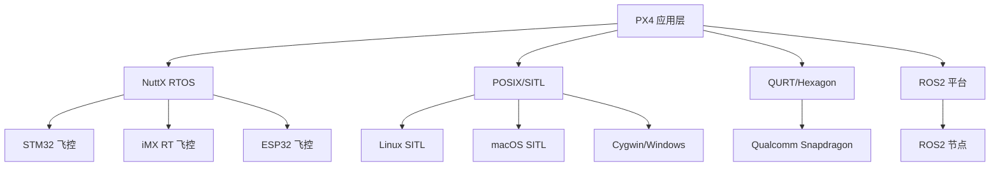
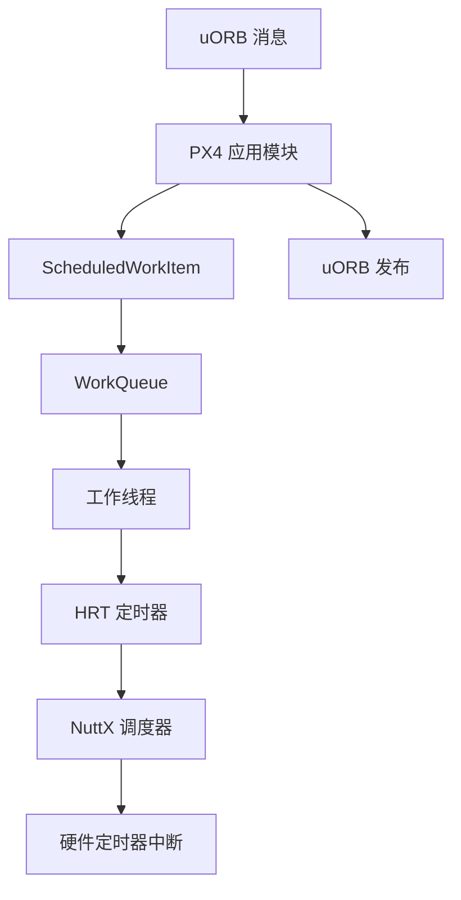

# 实时系统与平台层

本文档深入讲解 PX4 实时系统架构、为何选择 NuttX RTOS、平台抽象层设计、工作队列机制、高精度定时器、板级初始化流程，以及如何编写跨平台模块。

---

## 目录

1. [概述与选型理由](#1-概述与选型理由)
2. [平台抽象层设计](#2-平台抽象层设计)
3. [NuttX 任务与调度](#3-nuttx-任务与调度)
4. [工作队列架构](#4-工作队列架构)
5. [高精度定时器 HRT](#5-高精度定时器-hrt)
6. [平台初始化流程](#6-平台初始化流程)
7. [板级初始化](#7-板级初始化)
8. [模块开发模式](#8-模块开发模式)
9. [实时性能优化](#9-实时性能优化)
10. [调试与性能分析](#10-调试与性能分析)
11. [最佳实践](#11-最佳实践)
12. [总结](#12-总结)

---

## 1. 概述与选型理由

### 1.1 PX4 支持的平台

PX4 支持多种实时操作系统和平台：



**关键文件**：
- `platforms/nuttx/` - NuttX 平台实现
- `platforms/posix/` - POSIX 平台实现（SITL）
- `platforms/qurt/` - QURT 平台实现
- `platforms/common/` - 跨平台通用代码

### 1.2 为何选择 NuttX 而非 FreeRTOS

| 特性 | NuttX | FreeRTOS |
|------|-------|----------|
| **POSIX 兼容性** | ✅ 完整的 POSIX API (open/close/read/write/ioctl) | ❌ 需额外 POSIX 包装层 |
| **设备抽象** | ✅ 统一设备节点 `/dev/xxx` | ❌ 需自行实现设备管理 |
| **文件系统** | ✅ 内置 FAT、procfs、binfs、romfs | ⚠️ 需第三方移植 (FatFS) |
| **任务 vs 线程** | ✅ 完整的进程/任务模型 | ❌ 仅线程 (共享地址空间) |
| **模块化** | ✅ 内核/用户空间分离 (可选 PROTECTED/KERNEL build) | ❌ 单一地址空间 |
| **调试支持** | ✅ procfs (`/proc/pid/`), dmesg, top | ⚠️ 需自行实现调试接口 |
| **代码量** | 🔴 较大 (~200 KB ROM) | ✅ 轻量 (~10 KB ROM) |
| **社区生态** | ✅ Apache 基金会，航空航天级 | ✅ AWS/ST 支持，工业级 |

**PX4 选择 NuttX 的核心原因**：

1. **统一设备抽象**：uORB 可以作为 `/dev/uorb/*` 设备节点注册，驱动也遵循标准设备接口
   ```cpp
   // platforms/common/uORB/uORBManager.cpp:63-66
   // 注册 uORB 为字符设备
   register_driver(TOPIC_MASTER_DEVICE_PATH, &uorb_ops, 0666, nullptr);
   ```

2. **类 POSIX 接口降低移植成本**：SITL 可直接在 Linux/macOS 上运行，无需大量条件编译

3. **成熟的板级支持包**：NuttX 原生支持 STM32F4/F7/H7、iMX RT、ESP32 等 PX4 常用 MCU

4. **确定性调度**：支持 FIFO 和 Round-Robin 调度策略，满足飞控实时性要求

**代码示例：跨平台任务创建**
```cpp
// platforms/common/include/px4_platform_common/tasks.h:47-58
#if defined(__PX4_NUTTX)
typedef int px4_task_t;
#define SCHED_DEFAULT  SCHED_FIFO  // NuttX 使用 FIFO 调度

#elif defined(__PX4_POSIX)
typedef int px4_task_t;
#define SCHED_DEFAULT  SCHED_FIFO  // POSIX 也用 FIFO 模拟

#endif

// platforms/nuttx/src/px4/common/tasks.cpp:58-87
int px4_task_spawn_cmd(const char *name, int scheduler, int priority,
                       int stack_size, main_t entry, char *const argv[])
{
    sched_lock();
    clearenv();  // 清理环境变量释放 RAM

    int pid = task_create(name, priority, stack_size, entry, argv);

    if (pid > 0) {
        struct sched_param param = { .sched_priority = priority };
        sched_setscheduler(pid, scheduler, &param);  // 设置调度策略
    }

    sched_unlock();
    return pid;
}
```

---

## 2. 平台抽象层设计

### 2.1 平台抽象原则

PX4 通过平台抽象层 (Platform Abstraction Layer, PAL) 实现一次编写、多平台运行：

```
应用层 (src/modules/*)
    ↓
平台公共接口 (platforms/common/include/px4_platform_common/*)
    ↓
平台特定实现 (platforms/{nuttx,posix,qurt}/src/*)
    ↓
操作系统 API (NuttX/Linux/QURT)
```

**关键头文件**：
- `px4_platform_common/tasks.h` - 任务创建与管理
- `px4_platform_common/time.h` - 时间与延迟
- `px4_platform_common/posix.h` - 信号量/互斥锁
- `px4_platform_common/defines.h` - 平台特定宏定义
- `px4_platform_common/log.h` - 日志输出

### 2.2 编译时平台选择

**宏定义区分平台**：
```cpp
// platforms/common/include/px4_platform_common/defines.h
#if defined(__PX4_NUTTX)
    #include <nuttx/config.h>
    #define __EXPORT __attribute__((visibility("default")))

#elif defined(__PX4_POSIX)
    #define __EXPORT __attribute__((visibility("default")))

#elif defined(__PX4_QURT)
    #define __EXPORT

#endif
```

**CMake 平台集成钩子**：
```cmake
# platforms/nuttx/cmake/px4_impl_os.cmake:51-99
function(px4_os_add_flags)
    # 添加 NuttX 头文件路径
    include_directories(BEFORE SYSTEM
        ${PX4_SOURCE_DIR}/platforms/nuttx/NuttX/nuttx/include
        ${PX4_SOURCE_DIR}/platforms/nuttx/NuttX/nuttx/arch/${CONFIG_ARCH}/src/${CONFIG_ARCH_FAMILY}
    )

    # C++ 编译标志
    add_compile_options($<$<COMPILE_LANGUAGE:CXX>:-fno-exceptions>)
    add_compile_options($<$<COMPILE_LANGUAGE:CXX>:-fno-rtti>)
    add_compile_options($<$<COMPILE_LANGUAGE:CXX>:-fno-threadsafe-statics>)
    add_compile_options($<$<COMPILE_LANGUAGE:CXX>:-nostdinc++>)  # 使用 NuttX C++ 库
endfunction()
```

### 2.3 调度策略抽象

```cpp
// platforms/common/include/px4_platform_common/tasks.h:53-58
#if defined(__PX4_NUTTX)
    #if CONFIG_RR_INTERVAL > 0
        #define SCHED_DEFAULT  SCHED_RR  // Round-Robin (时间片轮转)
    #else
        #define SCHED_DEFAULT  SCHED_FIFO  // First-In-First-Out (优先级抢占)
    #endif

#elif defined(__PX4_POSIX)
    #define SCHED_DEFAULT  SCHED_FIFO
#endif
```

**调度策略说明**：
- **SCHED_FIFO**：相同优先级任务不会被抢占，适合确定性实时任务
- **SCHED_RR**：相同优先级任务按时间片轮转，避免饿死
- **SCHED_OTHER**：分时调度，非实时 (PX4 不使用)

---

## 3. NuttX 任务与调度

### 3.1 任务创建与生命周期

**NuttX 任务 API**：
```cpp
// platforms/nuttx/src/px4/common/tasks.cpp:58-87
int px4_task_spawn_cmd(const char *name, int scheduler, int priority,
                       int stack_size, main_t entry, char *const argv[])
{
    sched_lock();  // 锁调度器，防止创建过程中被打断

    #if !defined(CONFIG_DISABLE_ENVIRON)
    clearenv();  // 清理环境变量，释放 RAM (NuttX 默认继承父任务环境)
    #endif

    #if !defined(__KERNEL__)
    int pid = task_create(name, priority, stack_size, entry, argv);
    #else
    int pid = kthread_create(name, priority, stack_size, entry, argv);
    #endif

    if (pid > 0) {
        struct sched_param param = { .sched_priority = priority };
        sched_setscheduler(pid, scheduler, &param);  // 设置调度策略
    }

    sched_unlock();
    return pid;
}
```

**任务栈大小推荐**：
| 任务类型 | 栈大小 | 示例 |
|----------|--------|------|
| 轻量级驱动 | 1200-1800 字节 | SPI/I2C 设备驱动 |
| 传感器处理 | 2000-3000 字节 | IMU 数据处理 |
| 控制器 | 4000-8000 字节 | mc_rate_control, fw_att_control |
| 大型模块 | 8000-16000 字节 | navigator, ekf2 |

### 3.2 优先级分配策略

**NuttX 优先级范围**：0-255（数字越小优先级越高）

**PX4 优先级分配**：
```cpp
// platforms/nuttx 典型优先级分配
#define SCHED_PRIORITY_MAX 255
#define SCHED_PRIORITY_MIN 0

// PX4 实际分配 (数字越大优先级越高，注意与 NuttX 相反！)
// 这是 PX4 内部抽象，实际传给 NuttX 时会转换
#define PX4_MAX_PRIORITY 255
#define PX4_MIN_PRIORITY 0

// 工作队列优先级 (platforms/common/include/px4_platform_common/px4_work_queue/WorkQueueManager.hpp)
// 配置通过 KConfig 设置，典型值：
// CONFIG_WQ_RATE_CTRL_PRIORITY = 120  (最高优先级，飞控核心)
// CONFIG_WQ_INS0_PRIORITY = 110       (惯导融合)
// CONFIG_WQ_NAV_AND_CONTROLLERS_PRIORITY = 100  (导航与控制器)
// CONFIG_WQ_SPI0_PRIORITY = 90        (SPI 总线驱动)
// CONFIG_WQ_I2C0_PRIORITY = 80        (I2C 总线驱动)
// CONFIG_WQ_HP_DEFAULT_PRIORITY = 50  (高优先级默认)
// CONFIG_WQ_LP_DEFAULT_PRIORITY = 10  (低优先级默认)
```

**优先级倒置与优先级继承**：
```cpp
// NuttX 支持优先级继承协议防止优先级倒置
// platforms/common/px4_work_queue/WorkQueue.cpp:61-65
px4_sem_init(&_process_lock, 0, 0);
px4_sem_setprotocol(&_process_lock, SEM_PRIO_INHERIT);  // 启用优先级继承

px4_sem_init(&_exit_lock, 0, 1);
px4_sem_setprotocol(&_exit_lock, SEM_PRIO_NONE);  // 不继承优先级
```

### 3.3 任务名称与调试

```cpp
// platforms/nuttx/src/px4/common/tasks.cpp:94-103
const char *px4_get_taskname(void)
{
#if CONFIG_TASK_NAME_SIZE > 0 && (defined(__KERNEL__) || defined(CONFIG_BUILD_FLAT))
    FAR struct tcb_s *thisproc = nxsched_self();  // 获取当前任务 TCB
    return thisproc->name;
#else
    return "app";
#endif
}
```

**调试命令**：
```bash
# NuttX console
nsh> ps        # 查看所有任务
nsh> top       # 实时 CPU 使用率
nsh> free      # 内存使用情况
nsh> dmesg     # 内核日志
```

---

## 4. 工作队列架构

### 4.1 为何使用工作队列而非裸任务

**传统方式问题**：
```cpp
// ❌ 不推荐：每个模块创建独立任务
// 问题：任务切换开销大，栈内存浪费
int my_module_main(int argc, char *argv[]) {
    while (!should_exit) {
        usleep(10000);  // 10ms 周期
        process_data();
    }
}
```

**工作队列优势**：
```cpp
// ✅ 推荐：使用工作队列
// 优势：共享任务线程，按需调度，零栈内存浪费
class MyModule : public px4::ScheduledWorkItem {
    void Run() override {
        process_data();
        ScheduleDelayed(10000);  // 10ms 后再次调度
    }
};
```

**内存与性能对比**：
| 方案 | 任务数 | 栈内存 | 上下文切换 |
|------|--------|--------|------------|
| 裸任务 (50个模块) | 50 | 50 × 3KB = 150KB | ~1000/s |
| 工作队列 (10个队列) | 10 | 10 × 2KB = 20KB | ~300/s |

### 4.2 工作队列配置

**预定义工作队列**：
```cpp
// platforms/common/include/px4_platform_common/px4_work_queue/WorkQueueManager.hpp:44-99

struct wq_config_t {
    const char *name;
    uint16_t stacksize;
    int8_t relative_priority;  // 相对于最大优先级的偏移
};

namespace wq_configurations {

// 飞控核心工作队列
static constexpr wq_config_t rate_ctrl{
    "wq:rate_ctrl",
    CONFIG_WQ_RATE_CTRL_STACKSIZE,      // 典型 2000 字节
    (int8_t)CONFIG_WQ_RATE_CTRL_PRIORITY // 典型 120 (最高)
};

// SPI 总线工作队列 (每条总线独立队列，避免竞争)
static constexpr wq_config_t SPI0{"wq:SPI0", CONFIG_WQ_SPI_STACKSIZE, (int8_t)CONFIG_WQ_SPI0_PRIORITY};
static constexpr wq_config_t SPI1{"wq:SPI1", CONFIG_WQ_SPI_STACKSIZE, (int8_t)CONFIG_WQ_SPI1_PRIORITY};
// ...

// I2C 总线工作队列
static constexpr wq_config_t I2C0{"wq:I2C0", CONFIG_WQ_I2C_STACKSIZE, (int8_t)CONFIG_WQ_I2C0_PRIORITY};
static constexpr wq_config_t I2C1{"wq:I2C1", CONFIG_WQ_I2C_STACKSIZE, (int8_t)CONFIG_WQ_I2C1_PRIORITY};
// ...

// 导航与控制器 (姿态、位置控制器)
static constexpr wq_config_t nav_and_controllers{
    "wq:nav_and_controllers",
    CONFIG_WQ_NAV_AND_CONTROLLERS_STACKSIZE,
    (int8_t)CONFIG_WQ_NAV_AND_CONTROLLERS_PRIORITY
};

// 惯导工作队列 (每个 IMU 实例独立队列)
static constexpr wq_config_t INS0{"wq:INS0", CONFIG_WQ_INS_STACKSIZE, (int8_t)CONFIG_WQ_INS0_PRIORITY};
static constexpr wq_config_t INS1{"wq:INS1", CONFIG_WQ_INS_STACKSIZE, (int8_t)CONFIG_WQ_INS1_PRIORITY};
// ...

// 串口工作队列 (MAVLink、GPS)
static constexpr wq_config_t ttyS0{"wq:ttyS0", CONFIG_WQ_TTY_STACKSIZE, (int8_t)CONFIG_WQ_TTY_S0_PRIORITY};
static constexpr wq_config_t ttyS1{"wq:ttyS1", CONFIG_WQ_TTY_STACKSIZE, (int8_t)CONFIG_WQ_TTY_S1_PRIORITY};
// ...

// 高/低优先级默认队列
static constexpr wq_config_t hp_default{"wq:hp_default", CONFIG_WQ_HP_DEFAULT_STACKSIZE, (int8_t)CONFIG_WQ_HP_DEFAULT_PRIORITY};
static constexpr wq_config_t lp_default{"wq:lp_default", CONFIG_WQ_LP_DEFAULT_STACKSIZE, (int8_t)CONFIG_WQ_LP_DEFAULT_PRIORITY};

}  // namespace wq_configurations
```

**工作队列选择策略**：
```cpp
// platforms/common/px4_work_queue/WorkQueueManager.cpp:124-160
const wq_config_t &device_bus_to_wq(uint32_t device_id_int)
{
    union device::Device::DeviceId device_id;
    device_id.devid = device_id_int;

    const device::Device::DeviceBusType bus_type = device_id.devid_s.bus_type;
    const uint8_t bus = device_id.devid_s.bus;

    // 根据设备总线类型自动分配工作队列
    if (bus_type == device::Device::DeviceBusType_I2C) {
        switch (bus) {
            case 0: return wq_configurations::I2C0;
            case 1: return wq_configurations::I2C1;
            // ...
        }
    } else if (bus_type == device::Device::DeviceBusType_SPI) {
        switch (bus) {
            case 0: return wq_configurations::SPI0;
            case 1: return wq_configurations::SPI1;
            // ...
        }
    }

    return wq_configurations::hp_default;  // 默认高优先级队列
}
```

### 4.3 工作队列实现原理

**WorkQueue 核心数据结构**：
```cpp
// platforms/common/px4_work_queue/WorkQueue.cpp:47-83
class WorkQueue {
private:
    const wq_config_t _config;         // 配置 (名称、栈大小、优先级)
    List<WorkItem *> _work_items;      // 已注册的 WorkItem 列表
    BlockingQueue<WorkItem *> _q;      // 待执行的 WorkItem 队列

    px4_sem_t _process_lock;           // 信号量，用于唤醒工作线程
    px4_sem_t _exit_lock;              // 用于同步退出

public:
    WorkQueue(const wq_config_t &config);

    // 添加 WorkItem 到待执行队列
    void Add(WorkItem *item) {
        work_lock();
        _q.push(item);           // 入队
        work_unlock();
        SignalWorkerThread();    // 唤醒工作线程
    }

    // 工作线程主循环
    void Run() {
        while (!should_exit()) {
            px4_sem_wait(&_process_lock);  // 等待信号量 (阻塞)

            work_lock();
            WorkItem *work = _q.pop();  // 出队
            work_unlock();

            if (work) {
                work->Run();  // 执行 WorkItem::Run()
            }
        }
    }
};
```

**WorkQueueManager 管理器**：
```cpp
// platforms/common/px4_work_queue/WorkQueueManager.cpp:67-121
static BlockingList<WorkQueue *> *_wq_manager_wqs_list{nullptr};  // 全局工作队列列表
static BlockingQueue<const wq_config_t *, 1> *_wq_manager_create_queue{nullptr};  // 创建请求队列

WorkQueue *WorkQueueFindOrCreate(const wq_config_t &new_wq)
{
    // 1. 查找已存在的工作队列
    WorkQueue *wq = FindWorkQueueByName(new_wq.name);

    // 2. 如果不存在，加入创建队列
    if (wq == nullptr) {
        _wq_manager_create_queue->push(&new_wq);  // 通知管理器创建

        // 3. 等待创建完成 (最多 10 秒)
        uint64_t t = 0;
        while (wq == nullptr && t < 10_s) {
            px4_usleep(1_ms);
            wq = FindWorkQueueByName(new_wq.name);
        }
    }

    return wq;
}
```

### 4.4 ScheduledWorkItem：定时工作项

```cpp
// platforms/common/include/px4_platform_common/px4_work_queue/ScheduledWorkItem.hpp:43-91
class ScheduledWorkItem : public WorkItem {
public:
    // 延迟调度 (一次性)
    void ScheduleDelayed(uint32_t delay_us);

    // 周期调度 (重复)
    void ScheduleOnInterval(uint32_t interval_us, uint32_t delay_us = 0);

    // 在指定时间调度
    void ScheduleAt(hrt_abstime time_us);

    // 取消调度
    void ScheduleClear();

protected:
    virtual void Run() override = 0;  // 子类必须实现

private:
    hrt_call _call{};  // 高精度定时器回调
};

// platforms/common/px4_work_queue/ScheduledWorkItem.cpp:47-66
void ScheduledWorkItem::schedule_trampoline(void *arg)
{
    ScheduledWorkItem *dev = static_cast<ScheduledWorkItem *>(arg);
    dev->ScheduleNow();  // 添加到工作队列
}

void ScheduledWorkItem::ScheduleDelayed(uint32_t delay_us)
{
    hrt_call_after(&_call, delay_us,
                   (hrt_callout)&ScheduledWorkItem::schedule_trampoline, this);
}

void ScheduledWorkItem::ScheduleOnInterval(uint32_t interval_us, uint32_t delay_us)
{
    hrt_call_every(&_call, delay_us, interval_us,
                   (hrt_callout)&ScheduledWorkItem::schedule_trampoline, this);
}
```

---

## 5. 高精度定时器 HRT

### 5.1 HRT 概述

**HRT (High-Resolution Timer)** 提供微秒级精度的定时与时间戳，是 PX4 实时性的核心：

```cpp
// drivers/drv_hrt.h - HRT API
hrt_abstime hrt_absolute_time(void);  // 获取系统启动后微秒数

// 定时回调
void hrt_call_after(struct hrt_call *entry, hrt_abstime delay,
                    hrt_callout callout, void *arg);  // 延迟调用

void hrt_call_every(struct hrt_call *entry, hrt_abstime delay,
                    hrt_abstime interval, hrt_callout callout, void *arg);  // 周期调用

void hrt_call_at(struct hrt_call *entry, hrt_abstime time,
                 hrt_callout callout, void *arg);  // 绝对时间调用

void hrt_cancel(struct hrt_call *entry);  // 取消回调
```

### 5.2 HRT 实现原理 (POSIX 参考)

```cpp
// platforms/posix/src/px4/common/drv_hrt.cpp:59-100

// 定时回调队列
static struct sq_queue_s callout_queue;  // 单链表队列

// 延迟基准与实际值 (用于延迟统计)
static uint64_t latency_baseline;
static uint64_t latency_actual;

// 延迟直方图统计
static uint32_t latency_counters[LATENCY_BUCKET_COUNT + 1];

static px4_sem_t _hrt_lock;   // 保护 callout_queue
static struct work_s _hrt_work;  // 工作队列回调

// 锁定与解锁 HRT 队列
static void hrt_lock() {
    do {} while (px4_sem_wait(&_hrt_lock) != 0);  // 循环等待 (信号中断重试)
}

static void hrt_unlock() {
    px4_sem_post(&_hrt_lock);
}
```

**NuttX HRT 实现**：
- NuttX 平台通过硬件定时器 (如 STM32 TIM2/TIM5) 提供微秒精度
- 使用定时器中断驱动回调队列
- 参考 `platforms/nuttx/src/px4/stm/stm32_common/hrt/drvhrt.c` (实际路径可能因板子不同而变化)

### 5.3 时间戳统一

**uORB 消息时间戳规范**：
```cpp
// msg/sensor_accel.msg - 所有消息必须包含 timestamp
uint64 timestamp  # 系统启动后微秒数 (hrt_absolute_time)

float32[3] x  # m/s^2
float32[3] y
float32[3] z

uint32 error_count
```

**时间戳同步**：
```cpp
// 发布消息时必须设置 timestamp
sensor_accel_s accel{};
accel.timestamp = hrt_absolute_time();  // 当前时间
accel.x = read_accel_x();
accel.y = read_accel_y();
accel.z = read_accel_z();

_accel_pub.publish(accel);
```

---

## 6. 平台初始化流程

### 6.1 NuttX 启动序列

```
1. Bootloader (可选)
   ├─ 检查更新固件
   └─ 跳转到主固件

2. NuttX 内核初始化
   ├─ CPU 时钟配置 (STM32: 480 MHz)
   ├─ MMU/MPU 配置 (PROTECTED/KERNEL build)
   ├─ 中断向量表设置
   └─ 内存管理初始化

3. 板级硬件初始化
   ├─ board_app_initialize() (boards/px4/fmu-v6x/src/init.cpp)
   ├─ GPIO 配置 (LED、传感器电源、PWM)
   ├─ SPI/I2C/UART 初始化
   └─ ADC、DMA、定时器配置

4. PX4 平台初始化
   ├─ px4_platform_init() (platforms/nuttx/src/px4/common/px4_init.cpp)
   ├─ 控制台缓冲区初始化
   ├─ HRT 定时器初始化
   ├─ 工作队列管理器启动
   ├─ 参数系统初始化
   └─ uORB 初始化

5. NSH Shell 启动
   ├─ 挂载 SD 卡 (/fs/microsd)
   ├─ 执行启动脚本 (ROMFS/px4fmu_common/init.d/rcS)
   └─ 启动 PX4 应用模块
```

### 6.2 px4_platform_init 详解

```cpp
// platforms/nuttx/src/px4/common/px4_init.cpp:125-198

int px4_platform_init()
{
    // 1. C++ 静态构造函数初始化 (PROTECTED/KERNEL build)
    #if !defined(CONFIG_BUILD_FLAT)
    cxx_initialize();  // 调用全局对象构造函数
    kernel_ioctl_initialize();  // 初始化内核-用户空间 ioctl 接口
    #endif

    // 2. 控制台缓冲区初始化
    int ret = px4_console_buffer_init();  // 创建 /dev/console_buf
    if (ret < 0) return ret;

    // 3. 重定向 stdout 到缓冲控制台 (避免阻塞)
    int fd_buf = open(CONSOLE_BUFFER_DEVICE, O_WRONLY);
    if (fd_buf >= 0) {
        dup2(fd_buf, 1);  // stdout → /dev/console_buf
        close(fd_buf);
    }

    // 4. 加密库初始化 (可选)
    #if defined(PX4_CRYPTO)
    PX4Crypto::px4_crypto_init();
    #endif

    // 5. HRT 高精度定时器初始化
    hrt_init();

    // 6. HRT/Events ioctl 接口注册 (PROTECTED/KERNEL build)
    #if !defined(CONFIG_BUILD_FLAT)
    hrt_ioctl_init();
    events_ioctl_init();
    #endif

    // 7. CPU 负载统计初始化
    #ifdef CONFIG_SCHED_INSTRUMENTATION
    cpuload_initialize_once();
    #endif

    // 8. I2C 总线初始化与软复位
    #if defined(CONFIG_I2C) && !defined(BOARD_I2C_LATEINIT)
    px4_platform_i2c_init();  // 发送 I2C 总线 0x06 软复位命令
    #endif

    // 9. 挂载 procfs 文件系统 (/proc)
    #if defined(CONFIG_FS_PROCFS)
    mount(nullptr, "/proc", "procfs", 0, nullptr);
    #endif

    // 10. 挂载 binfs 文件系统 (/bin)
    #if defined(CONFIG_FS_BINFS)
    nx_mount(nullptr, "/bin", "binfs", 0, nullptr);
    #endif

    // 11. 启动工作队列管理器
    px4::WorkQueueManagerStart();

    // 12. 参数系统初始化
    param_init();

    // 13. uORB 初始化
    uorb_start();

    // 14. 日志系统初始化
    px4_log_initialize();

    return PX4_OK;
}
```

**I2C 软复位详解**：
```cpp
// platforms/nuttx/src/px4/common/px4_init.cpp:94-121
void px4_platform_i2c_init()
{
    I2CBusIterator i2c_bus_iterator{I2CBusIterator::FilterType::All};

    while (i2c_bus_iterator.next()) {
        i2c_master_s *i2c_dev = px4_i2cbus_initialize(i2c_bus_iterator.bus().bus);

        #if defined(CONFIG_I2C_RESET)
        I2C_RESET(i2c_dev);  // 硬件复位 I2C 总线
        #endif

        // 发送 I2C 通用调用地址 (0x00) 的软复位命令 (0x06)
        uint8_t buf[1] = {0x06};  // SWRST 命令
        i2c_msg_s msg{};
        msg.frequency = I2C_SPEED_STANDARD;  // 100 kHz
        msg.addr = 0x00;  // 通用调用地址
        msg.buffer = &buf[0];
        msg.length = 1;

        I2C_TRANSFER(i2c_dev, &msg, 1);

        px4_i2cbus_uninitialize(i2c_dev);
    }
}
```

---

## 7. 板级初始化

### 7.1 板级初始化入口

```cpp
// boards/px4/fmu-v6x/src/init.cpp:104-234 (示例)

__EXPORT void board_peripheral_reset(int ms)
{
    // 1. 关闭外设电源
    VDD_5V_PERIPH_EN(false);  // 5V 外设电源
    board_control_spi_sensors_power(false, 0xffff);  // SPI 传感器电源
    VDD_3V3_SENSORS4_EN(false);  // 3.3V 传感器电源

    // 2. 等待电源完全放电
    usleep(ms * 1000);

    // 3. 重新上电
    VDD_3V3_SENSORS4_EN(true);
    board_control_spi_sensors_power(true, 0xffff);
    VDD_5V_PERIPH_EN(true);
}

__EXPORT void board_on_reset(int status)
{
    // 1. 配置 PWM 引脚为低电平 (ESC 断电)
    for (int i = 0; i < DIRECT_PWM_OUTPUT_CHANNELS; ++i) {
        px4_arch_configgpio(io_timer_channel_get_gpio_output(i));
    }

    // 2. 输出低电平到 PWM 引脚
    if (status >= 0) {
        for (int i = 0; i < DIRECT_PWM_OUTPUT_CHANNELS; ++i) {
            px4_arch_gpiowrite(io_timer_channel_get_gpio_output(i), false);
        }
    }
}
```

### 7.2 SPI 总线配置

```cpp
// boards/px4/fmu-v6x/src/spi.cpp (示例)

__EXPORT void board_spi_reset(int ms, int bus_mask)
{
    // 1. 禁用 SPI 总线
    for (int bus = 0; bus < SPI_BUS_MAX_BUS_ITEMS; ++bus) {
        if (px4_spi_buses[bus].bus != -1 && (bus_mask & (1 << bus))) {
            // 配置 CS 引脚为输出高电平
            for (int cs = 0; cs < SPI_BUS_MAX_DEVICES; ++cs) {
                if (px4_spi_buses[bus].devices[cs].cs_gpio != 0) {
                    px4_arch_configgpio(px4_spi_buses[bus].devices[cs].cs_gpio);
                    px4_arch_gpiowrite(px4_spi_buses[bus].devices[cs].cs_gpio, 1);
                }
            }
        }
    }

    // 2. 关闭传感器电源
    board_control_spi_sensors_power(false, bus_mask);
    usleep(ms * 1000);

    // 3. 重新上电
    board_control_spi_sensors_power(true, bus_mask);
}
```

### 7.3 GPIO 配置示例

```cpp
// boards/px4/fmu-v6x/board_config.h (示例)

// LED GPIO 定义
#define GPIO_LED_RED        (GPIO_OUTPUT|GPIO_PUSHPULL|GPIO_SPEED_2MHz|GPIO_PORTB|GPIO_PIN11)
#define GPIO_LED_GREEN      (GPIO_OUTPUT|GPIO_PUSHPULL|GPIO_SPEED_2MHz|GPIO_PORTB|GPIO_PIN1)
#define GPIO_LED_BLUE       (GPIO_OUTPUT|GPIO_PUSHPULL|GPIO_SPEED_2MHz|GPIO_PORTB|GPIO_PIN3)

// 传感器电源控制
#define VDD_3V3_SENSORS4_EN(on_true) px4_arch_gpiowrite(GPIO_VDD_3V3_SENSORS4_EN, (on_true))
#define VDD_5V_PERIPH_EN(on_true)    px4_arch_gpiowrite(GPIO_VDD_5V_PERIPH_EN, (on_true))

// SPI CS 引脚
#define GPIO_SPI1_CS_ICM42688P  (GPIO_OUTPUT|GPIO_PUSHPULL|GPIO_SPEED_50MHz|GPIO_PORTA|GPIO_PIN15)
#define GPIO_SPI1_CS_ICM20602   (GPIO_OUTPUT|GPIO_PUSHPULL|GPIO_SPEED_50MHz|GPIO_PORTC|GPIO_PIN15)
```

---

## 8. 模块开发模式

### 8.1 基于 ScheduledWorkItem 的模块模板

```cpp
// src/modules/my_module/MyModule.hpp
#pragma once

#include <px4_platform_common/px4_work_queue/ScheduledWorkItem.hpp>
#include <uORB/Subscription.hpp>
#include <uORB/Publication.hpp>
#include <uORB/topics/sensor_accel.h>
#include <uORB/topics/vehicle_attitude.h>

class MyModule : public px4::ScheduledWorkItem
{
public:
    MyModule();
    ~MyModule() override;

    bool init();  // 初始化

private:
    void Run() override;  // 工作队列回调

    // uORB 订阅
    uORB::Subscription _accel_sub{ORB_ID(sensor_accel)};

    // uORB 发布
    uORB::Publication<vehicle_attitude_s> _attitude_pub{ORB_ID(vehicle_attitude)};

    // 参数 (可选)
    DEFINE_PARAMETERS(
        (ParamFloat<px4::params::MY_PARAM>) _param_my_param
    )
};

// src/modules/my_module/MyModule.cpp
#include "MyModule.hpp"

MyModule::MyModule()
    : ScheduledWorkItem("my_module", px4::wq_configurations::hp_default)  // 使用高优先级工作队列
{
}

bool MyModule::init()
{
    // 启动周期调度 (100 Hz)
    ScheduleOnInterval(10000);  // 10000 us = 10 ms = 100 Hz
    return true;
}

void MyModule::Run()
{
    // 1. 检查订阅更新
    if (_accel_sub.updated()) {
        sensor_accel_s accel;
        _accel_sub.copy(&accel);

        // 2. 处理数据
        process_accel(accel);
    }

    // 3. 发布结果
    vehicle_attitude_s attitude{};
    attitude.timestamp = hrt_absolute_time();
    attitude.q[0] = 1.0f;  // 单位四元数
    attitude.q[1] = 0.0f;
    attitude.q[2] = 0.0f;
    attitude.q[3] = 0.0f;

    _attitude_pub.publish(attitude);
}

// 模块主函数
extern "C" __EXPORT int my_module_main(int argc, char *argv[])
{
    return MyModule::main(argc, argv);  // ModuleBase 提供的通用 main
}
```

### 8.2 模块注册到构建系统

```cmake
# src/modules/my_module/CMakeLists.txt
px4_add_module(
    MODULE modules__my_module
    MAIN my_module
    SRCS
        MyModule.cpp
    DEPENDS
        # 依赖其他模块 (可选)
    )
```

**启用模块**：
```bash
# boards/px4/fmu-v6x/default.px4board
CONFIG_MODULES_MY_MODULE=y
```

### 8.3 跨平台注意事项

**平台条件编译**：
```cpp
#if defined(__PX4_NUTTX)
    // NuttX 特定代码
    #include <nuttx/config.h>

#elif defined(__PX4_POSIX)
    // POSIX 特定代码 (SITL)
    #include <sys/time.h>

#elif defined(__PX4_QURT)
    // QURT 特定代码 (Snapdragon)

#endif
```

**避免直接调用 OS API**：
```cpp
// ❌ 不推荐
#include <nuttx/sched.h>
struct tcb_s *tcb = nxsched_self();

// ✅ 推荐
#include <px4_platform_common/tasks.h>
const char *name = px4_get_taskname();
```

---

## 9. 实时性能优化

### 9.1 工作队列优先级调优

**典型问题**：控制器延迟导致飞行不稳定

**诊断**：
```bash
nsh> work_queue status
wq:rate_ctrl      : 250.0 Hz (avg 249.8 Hz)  # ✅ 正常
wq:nav_and_controllers : 100.0 Hz (avg 85.3 Hz)  # ❌ 频率不足
```

**优化方案**：
1. 提高工作队列优先级
   ```cmake
   # 修改 boards/px4/fmu-v6x/default.px4board
   CONFIG_WQ_NAV_AND_CONTROLLERS_PRIORITY=110  # 原 100 → 110
   ```

2. 减少同队列中的 WorkItem 数量
   ```cpp
   // 将某些模块移到低优先级队列
   MyModule() : ScheduledWorkItem("my_module", px4::wq_configurations::lp_default)  // hp_default → lp_default
   ```

3. 增加栈大小（如果栈溢出）
   ```cmake
   CONFIG_WQ_NAV_AND_CONTROLLERS_STACKSIZE=8000  # 原 4000 → 8000
   ```

### 9.2 减少上下文切换

**优化前**：
```cpp
// ❌ 每个传感器独立任务 (50 次上下文切换/秒)
void imu1_main() { while(1) { usleep(20000); read_imu(); } }
void imu2_main() { while(1) { usleep(20000); read_imu(); } }
// ... 10 个传感器 = 500 次切换/秒
```

**优化后**：
```cpp
// ✅ 统一 INS 工作队列 (50 次切换/秒)
class IMU1 : public ScheduledWorkItem {
    IMU1() : ScheduledWorkItem("imu1", px4::wq_configurations::INS0) {}
};
class IMU2 : public ScheduledWorkItem {
    IMU2() : ScheduledWorkItem("imu2", px4::wq_configurations::INS0) {}  // 共享 INS0 队列
};
```

### 9.3 避免长时间阻塞

**问题代码**：
```cpp
// ❌ 阻塞整个工作队列
void Run() override {
    usleep(50000);  // 阻塞 50ms，其他 WorkItem 无法执行
}
```

**解决方案**：
```cpp
// ✅ 使用延迟调度
void Run() override {
    process_data();
    ScheduleDelayed(50000);  // 50ms 后再次调度，期间工作队列可执行其他任务
}
```

---

## 10. 调试与性能分析

### 10.1 工作队列状态监控

```bash
nsh> work_queue status
wq:rate_ctrl
  threads: 1
  stack:   2000 / 1234 (61%)
  rate:    250.0 Hz (avg 249.8 Hz)
  items:
    - mc_rate_control : 250.0 Hz

wq:SPI0
  threads: 1
  stack:   1800 / 987 (54%)
  rate:    1000.0 Hz (avg 998.2 Hz)
  items:
    - icm42688p_spi0  : 500.0 Hz
    - icm20602_spi0   : 500.0 Hz
```

### 10.2 CPU 负载分析

```bash
nsh> top
PID  COMMAND           CPU%  STACK  PRI
  1  init              0.1%  1024   100
 10  wq:rate_ctrl     25.3%  2000   120  # ✅ 高 CPU，但优先级最高
 11  wq:SPI0          15.2%  1800   90
 12  wq:nav_and_cont  10.1%  4000   100
 20  mavlink          5.0%   3000   60

Total CPU: 55.7%  # ✅ 正常 (< 80%)
```

### 10.3 延迟直方图

```bash
nsh> hrt_latency
HRT latency histogram (us):
  <  1us:  125847  (94.5%)  # ✅ 大部分回调延迟 < 1us
  <  2us:   5234  (3.9%)
  <  5us:   1456  (1.1%)
  < 10us:    523  (0.4%)
  < 20us:    123  (0.1%)
  < 50us:      5  (0.0%)  # ⚠️ 少量大延迟
```

### 10.4 栈溢出检测

**编译时启用栈检查**：
```cmake
# boards/px4/fmu-v6x/default.px4board
CONFIG_ARMV7M_STACKCHECK=y  # ARM Cortex-M 栈检查
CONFIG_STACK_COLORATION=y   # 栈填充魔数
```

**运行时检查**：
```bash
nsh> work_queue status
wq:rate_ctrl
  stack:   2000 / 1987 (99%)  # ❌ 栈使用 99%，即将溢出！
```

**解决方案**：
```cmake
CONFIG_WQ_RATE_CTRL_STACKSIZE=3000  # 增加栈大小
```

---

## 11. 最佳实践

### 11.1 选择合适的工作队列

| 模块类型 | 推荐工作队列 | 示例 |
|----------|--------------|------|
| 飞控核心 (250 Hz+) | `rate_ctrl` | mc_rate_control, fw_rate_control |
| 导航与控制器 | `nav_and_controllers` | mc_pos_control, navigator |
| 传感器驱动 | `SPI0-6`, `I2C0-4` | icm42688p, bmi088 |
| 惯导融合 | `INS0-3` | vehicle_imu (IMU 数据处理) |
| MAVLink 通信 | `ttyS0-9` | mavlink 实例 |
| 慢速任务 | `lp_default` | logger, dataman |

### 11.2 周期任务调度原则

```cpp
// ✅ 固定周期 (适合传感器、控制器)
void Run() override {
    process();
    ScheduleOnInterval(10000);  // 固定 10ms
}

// ✅ 按需调度 (适合事件驱动)
void Run() override {
    if (_sub.updated()) {
        process();
        ScheduleNow();  // 立即再次调度
    } else {
        ScheduleDelayed(1000);  // 1ms 后重试
    }
}

// ❌ 避免：不可预测的延迟
void Run() override {
    int delay = random_delay();  // ❌ 实时系统禁止随机延迟
    ScheduleDelayed(delay);
}
```

### 11.3 避免动态内存分配

```cpp
// ❌ 避免在 Run() 中动态分配
void Run() override {
    std::vector<float> data(100);  // ❌ 每次都分配/释放，导致内存碎片
}

// ✅ 使用成员变量预分配
class MyModule {
private:
    float _data[100];  // ✅ 预分配

    void Run() override {
        memset(_data, 0, sizeof(_data));  // ✅ 直接使用
    }
};
```

### 11.4 时间戳一致性

```cpp
// ✅ 推荐：使用输入消息的时间戳
void Run() override {
    sensor_accel_s accel;
    _accel_sub.copy(&accel);

    vehicle_attitude_s att{};
    att.timestamp = accel.timestamp;  // ✅ 继承输入时间戳
    att.timestamp_sample = accel.timestamp;  // ✅ 原始数据时间戳
    _att_pub.publish(att);
}

// ❌ 避免：每次都取当前时间 (引入延迟偏差)
void Run() override {
    vehicle_attitude_s att{};
    att.timestamp = hrt_absolute_time();  // ❌ 处理时间，非采样时间
}
```

---

## 12. 总结

### 12.1 核心概念回顾



| 组件 | 职责 | 关键文件 |
|------|------|----------|
| **NuttX RTOS** | 任务调度、设备抽象、文件系统 | `platforms/nuttx/NuttX/` |
| **平台抽象层** | 统一 API 封装 (任务、时间、信号量) | `platforms/common/include/px4_platform_common/` |
| **工作队列** | 异步任务调度、减少上下文切换 | `platforms/common/px4_work_queue/` |
| **HRT** | 微秒级定时与时间戳 | `drivers/drv_hrt.h` |
| **板级初始化** | 硬件外设配置 (GPIO/SPI/I2C) | `boards/px4/fmu-v6x/src/` |

### 12.2 关键设计决策

1. **选择 NuttX**：POSIX 兼容性 + 设备抽象 + 航空级生态
2. **工作队列架构**：共享任务线程，节省 80% 栈内存
3. **按总线分队列**：SPI0/I2C0 独立队列，避免总线竞争
4. **ScheduledWorkItem**：基于 HRT 的高精度周期调度
5. **优先级分层**：rate_ctrl (120) > INS (110) > nav (100) > 驱动 (80-90) > 低优先级 (10)

### 12.3 开发检查清单

- [ ] 模块继承 `ScheduledWorkItem`，不直接创建任务
- [ ] 选择合适的工作队列 (参考 11.1 表格)
- [ ] `Run()` 方法避免长时间阻塞 (> 1ms)
- [ ] 所有 uORB 消息包含 `timestamp` 字段
- [ ] 避免动态内存分配 (使用成员变量)
- [ ] 优先级合理分配 (不超过 rate_ctrl 优先级)
- [ ] 栈大小充足 (至少剩余 20% 空间)
- [ ] 跨平台兼容 (使用 `px4_*` API，不直接调用 NuttX API)

### 12.4 延伸阅读

- **NuttX 官方文档**: https://nuttx.apache.org/docs/latest/
- **PX4 平台抽象层**: `platforms/common/include/px4_platform_common/`
- **工作队列实现**: `platforms/common/px4_work_queue/`
- **板级配置**: `boards/px4/fmu-v6x/`
- **SITL 平台**: `platforms/posix/src/px4/common/`

---

**文档版本**: v1.0
**最后更新**: 基于 PX4 main 分支 (2025-01)
**维护者**: PX4 开发团队
**反馈**: 提交 Issue 到 `PX4-Autopilot` 仓库
