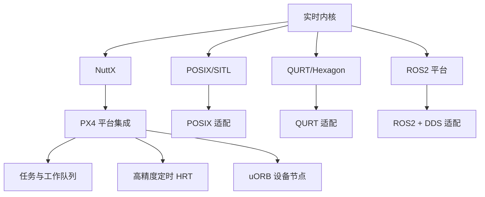

# 实时系统与平台层

内容目标：解释为何选择 NuttX（相较 FreeRTOS）、PX4 在各平台的适配与关键实现，以及对嵌入式 STM32 飞控开发的必要背景补充。

选择 NuttX 的原因（与 FreeRTOS 对比）：
- 丰富的类 POSIX 接口与设备节点抽象，利于统一“文件/设备”模型（驱动与 uORB 均可设备化）。
- 成熟的板级支持与文件系统、进程/任务管理，便于大型项目模块化与可测试性。
- 符合航空级嵌入式的确定性需求与社区生态；PX4 历史上在 STM32 系列上长期验证。
- FreeRTOS 更轻量但原生 POSIX 兼容性不足，统一抽象成本更高；PX4 已在 `platforms/nuttx` 深度集成。

PX4 与平台层关键实现：
- NuttX 集成与任务模型：`platforms/nuttx/src/px4/common/px4_init.cpp`、`tasks.cpp`
- 高精度硬件定时（HRT）：`platforms/posix/src/px4/common/drv_hrt.cpp`（POSIX 参考），NuttX 对应平台实现
- 工作队列：`platforms/common/work_queue/work_queue.c`
- uORB 设备节点与管理：`platforms/common/uORB/uORBDeviceNode.cpp`、`uORBManager.cpp:240-266, 365-376`

关键文件引用：
- 构建注入（NuttX）：`platforms/nuttx/cmake/px4_impl_os.cmake`
- NuttX 板控接口注册：`platforms/common/uORB/uORBManager.cpp:63-66`
- POSIX 平台入口：`platforms/posix/src/px4/common/main.cpp`

嵌入式 STM32 飞控背景补充：
- 任务/中断与工作队列：将高频传感器采样与控制环路置于特定工作队列，避免阻塞与抖动。
- 内存与设备抽象：通过 `CDev`/`Device` 抽象统一 I2C/SPI/UART，结合 `uORB` 做数据分发。
- 板级初始化：`boards/<vendor>/<board>/src/*` 完成时钟、总线、外设 Bring-up，并由 `.px4board` 控制使能。

