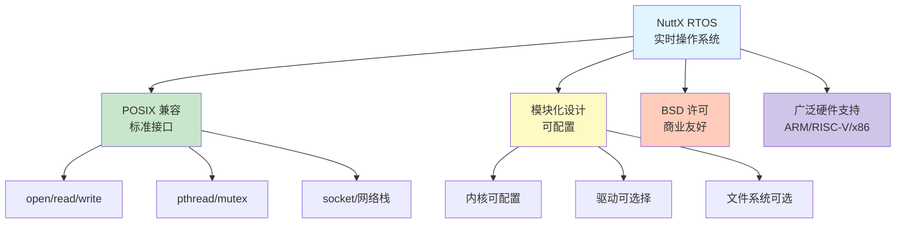
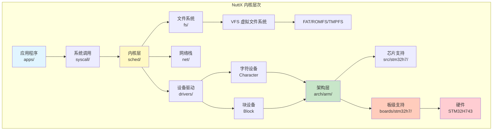
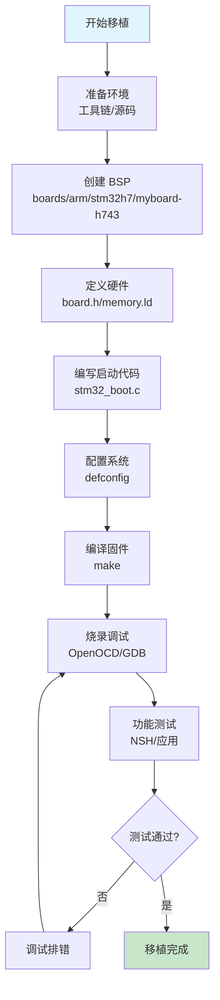

# STM32H743 移植 NuttX 完全指南：从零开始

> 本教程详细讲解如何从头开始将 NuttX RTOS 最新版本移植到 STM32H743 微控制器上，涵盖环境搭建、BSP 开发、系统配置、驱动编写到最终烧录验证的完整流程。

---

## 目录

- [前言：为什么选择 NuttX](#前言为什么选择-nuttx)
- [第一部分：准备工作](#第一部分准备工作)
- [第二部分：理解 NuttX 架构](#第二部分理解-nuttx-架构)
- [第三部分：创建 STM32H743 BSP](#第三部分创建-stm32h743-bsp)
- [第四部分：配置系统](#第四部分配置系统)
- [第五部分：编写启动代码](#第五部分编写启动代码)
- [第六部分：时钟与外设配置](#第六部分时钟与外设配置)
- [第七部分：编译与调试](#第七部分编译与调试)
- [第八部分：功能测试](#第八部分功能测试)
- [第九部分：常见问题排查](#第九部分常见问题排查)
- [总结与进阶](#总结与进阶)

---

## 前言：为什么选择 NuttX

### NuttX RTOS 特点

NuttX 是一个符合 POSIX 标准的实时操作系统，特别适合嵌入式应用：



**核心优势:**

| 特性 | NuttX | FreeRTOS | RT-Thread |
|------|-------|----------|-----------|
| **POSIX 兼容** | ✅ 完整支持 | ❌ 部分支持 | ⚖️ 兼容层 |
| **网络栈** | ✅ 完整 TCP/IP | ❌ 需第三方 | ✅ 内置 |
| **文件系统** | ✅ VFS + 多种 FS | ❌ 需 FatFS | ✅ 内置 |
| **Shell** | ✅ NuttShell (NSH) | ❌ 无 | ✅ FinSH |
| **代码大小** | ⚖️ 中等 (50KB+) | ✅ 小 (10KB+) | ⚖️ 中等 |
| **学习曲线** | ⚖️ 中等 | ✅ 简单 | ⚖️ 中等 |
| **生态系统** | ✅ PX4/Pixhawk | ✅ AWS/Azure | ✅ IoT 设备 |

### STM32H743 硬件特性

**芯片规格:**
- **内核**: ARM Cortex-M7 @ 480MHz
- **Flash**: 2MB
- **RAM**: 1MB (多区域 SRAM)
  - DTCM: 128KB (数据紧耦合)
  - ITCM: 64KB (指令紧耦合)
  - AXI SRAM: 512KB
  - SRAM1/2/3/4: 256KB
- **外设**:
  - 6x UART/USART
  - 6x SPI
  - 4x I2C
  - 2x CAN FD
  - 2x SDMMC
  - 以太网 MAC
  - USB OTG HS/FS
  - 3x ADC (16-bit)

**内存映射:**

```
0x0000 0000 - 0x0000 FFFF   ITCM RAM (64KB)
0x0800 0000 - 0x081F FFFF   Flash (2MB)
0x2000 0000 - 0x2001 FFFF   DTCM RAM (128KB)
0x2400 0000 - 0x2407 FFFF   AXI SRAM (512KB)
0x3000 0000 - 0x3003 FFFF   SRAM1/2/3 (256KB)
0x3800 0000 - 0x3800 FFFF   SRAM4 (64KB)
0x3880 0000 - 0x3880 0FFF   Backup SRAM (4KB)
0x4000 0000 - 0x5FFF FFFF   外设
0x6000 0000 - 0x9FFF FFFF   外部存储器
```

---

## 第一部分：准备工作

### 1.1 开发环境搭建

#### 安装工具链

**Linux (Ubuntu/Debian):**

```bash
# 1. 安装 ARM GCC 工具链
sudo apt-get update
sudo apt-get install -y gcc-arm-none-eabi gdb-multiarch

# 验证安装
arm-none-eabi-gcc --version
# arm-none-eabi-gcc (GNU Arm Embedded Toolchain 10.3-2021.10) 10.3.1

# 2. 安装必要工具
sudo apt-get install -y \
    git \
    make \
    cmake \
    python3 \
    python3-pip \
    kconfig-frontends \
    genromfs \
    xxd

# 3. 安装调试工具
sudo apt-get install -y openocd

# 4. 安装串口工具
sudo apt-get install -y minicom screen
```

**macOS:**

```bash
# 使用 Homebrew
brew install --cask gcc-arm-embedded
brew install openocd kconfig-frontends genromfs
```

**Windows:**

```powershell
# 1. 下载 ARM GCC 工具链
# https://developer.arm.com/tools-and-software/open-source-software/developer-tools/gnu-toolchain/gnu-rm

# 2. 安装 MSYS2
# https://www.msys2.org/

# 3. 在 MSYS2 中安装工具
pacman -S git make gcc python3 kconfig-frontends
```

#### 获取 NuttX 源码

```bash
# 1. 创建工作目录
mkdir -p ~/nuttx-workspace
cd ~/nuttx-workspace

# 2. 克隆 NuttX 仓库
git clone https://github.com/apache/nuttx.git nuttx
git clone https://github.com/apache/nuttx-apps.git apps

# 3. 查看最新版本
cd nuttx
git describe --tags
# nuttx-12.7.0

# 4. 切换到稳定分支 (可选)
git checkout releases/12.7

cd ..
```

**目录结构:**

```
nuttx-workspace/
├── nuttx/                  # NuttX 内核源码
│   ├── arch/               # 架构相关代码
│   ├── boards/             # 板级支持包 (BSP)
│   ├── drivers/            # 设备驱动
│   ├── fs/                 # 文件系统
│   ├── sched/              # 调度器
│   ├── mm/                 # 内存管理
│   ├── net/                # 网络栈
│   ├── libs/               # 库函数
│   └── tools/              # 构建工具
└── apps/                   # 应用程序
    ├── nshlib/             # NuttShell
    ├── system/             # 系统工具
    └── examples/           # 示例程序
```

### 1.2 硬件准备

**必需硬件:**
- STM32H743 开发板 (如 Nucleo-H743ZI 或自制板)
- ST-Link V2/V3 调试器
- USB 转 TTL 串口模块 (3.3V)
- Micro-USB 数据线

**可选硬件:**
- 逻辑分析仪 (调试 SPI/I2C)
- 示波器 (调试时钟)
- J-Link 调试器 (更快)

### 1.3 参考文档准备

下载以下官方文档:

1. **STM32H743 参考手册** (RM0433)
   - https://www.st.com/resource/en/reference_manual/rm0433-stm32h742-stm32h743753-and-stm32h750-value-line-advanced-armbased-32bit-mcus-stmicroelectronics.pdf

2. **STM32H743 数据手册**
   - https://www.st.com/resource/en/datasheet/stm32h743zi.pdf

3. **ARM Cortex-M7 技术参考手册**
   - https://developer.arm.com/documentation/ddi0489/latest/

4. **NuttX 文档**
   - https://nuttx.apache.org/docs/latest/

---

## 第二部分：理解 NuttX 架构

### 2.1 NuttX 源码组织



### 2.2 关键目录说明

#### arch/ - 架构相关代码

```
arch/
├── arm/
│   ├── include/
│   │   ├── stm32h7/       # STM32H7 系列头文件
│   │   │   ├── chip.h     # 芯片定义
│   │   │   ├── irq.h      # 中断定义
│   │   │   └── stm32h7x3xx_irq.h
│   │   └── armv7-m/       # Cortex-M7 架构
│   │       ├── irq.h
│   │       └── nvic.h
│   └── src/
│       ├── stm32h7/       # STM32H7 实现
│       │   ├── stm32_start.c      # 启动代码
│       │   ├── stm32_rcc.c        # 时钟配置
│       │   ├── stm32_gpio.c       # GPIO 驱动
│       │   ├── stm32_serial.c     # 串口驱动
│       │   ├── stm32_spi.c        # SPI 驱动
│       │   └── stm32_i2c.c        # I2C 驱动
│       └── armv7-m/       # Cortex-M7 实现
│           ├── arm_vectors.c      # 中断向量表
│           ├── arm_doirq.c        # 中断处理
│           └── arm_exception.S    # 异常处理
```

#### boards/ - 板级支持包

```
boards/
├── arm/
│   └── stm32h7/
│       ├── nucleo-h743zi/         # 官方 Nucleo 板
│       │   ├── configs/
│       │   │   └── nsh/           # NuttShell 配置
│       │   │       └── defconfig  # 默认配置
│       │   ├── include/
│       │   │   └── board.h        # 板级定义
│       │   ├── scripts/
│       │   │   ├── flash.ld       # Flash 链接脚本
│       │   │   └── memory.ld      # 内存布局
│       │   └── src/
│       │       ├── stm32_boot.c   # 板级初始化
│       │       ├── stm32_bringup.c
│       │       └── stm32_appinit.c
│       └── myboard-h743/          # 我们要创建的
```

### 2.3 配置系统 Kconfig

NuttX 使用 Kconfig 配置系统 (类似 Linux 内核):

```
.config                    # 生成的配置文件
├── CONFIG_ARCH="arm"      # 架构
├── CONFIG_ARCH_CHIP="stm32h7"  # 芯片系列
├── CONFIG_ARCH_CHIP_STM32H743ZI=y  # 具体型号
├── CONFIG_ARCH_CORTEXM7=y      # Cortex-M7
├── CONFIG_ARCH_FPU=y           # 硬件浮点
└── CONFIG_STM32H7_USART1=y     # 启用 UART1
```

**配置流程:**

```bash
# 1. 使用预设配置
cd nuttx
./tools/configure.sh -l nucleo-h743zi:nsh

# 2. 自定义配置
make menuconfig

# 3. 保存配置
make savedefconfig
```

---

## 第三部分：创建 STM32H743 BSP

### 3.1 创建板级目录

假设我们的板名为 **"myboard-h743"**:

```bash
cd ~/nuttx-workspace/nuttx

# 创建板级目录
mkdir -p boards/arm/stm32h7/myboard-h743

cd boards/arm/stm32h7/myboard-h743

# 创建子目录
mkdir -p configs/nsh
mkdir -p include
mkdir -p scripts
mkdir -p src
```

**最终结构:**

```
boards/arm/stm32h7/myboard-h743/
├── configs/
│   └── nsh/
│       └── defconfig          # 默认配置
├── include/
│   └── board.h                # 板级定义
├── scripts/
│   ├── flash.ld               # Flash 链接脚本
│   ├── memory.ld              # 内存布局
│   └── Make.defs              # 构建定义
├── src/
│   ├── Makefile               # 源码构建
│   ├── stm32_boot.c           # 启动代码
│   ├── stm32_bringup.c        # 系统启动
│   ├── stm32_appinit.c        # 应用初始化
│   └── stm32_boardinitialize.c
├── Kconfig                    # 配置选项
└── README.txt                 # 说明文档
```

### 3.2 board.h - 板级定义

**boards/arm/stm32h7/myboard-h743/include/board.h:**

```c
#ifndef __BOARDS_ARM_STM32H7_MYBOARD_H743_INCLUDE_BOARD_H
#define __BOARDS_ARM_STM32H7_MYBOARD_H743_INCLUDE_BOARD_H

/******************************************************************************
 * Included Files
 ******************************************************************************/

#include <nuttx/config.h>
#ifndef __ASSEMBLY__
#  include <stdint.h>
#  include <stdbool.h>
#endif

/******************************************************************************
 * Pre-processor Definitions
 ******************************************************************************/

/* 时钟配置 */

/* HSE 外部高速时钟 - 25MHz 晶振 */
#define STM32_BOARD_XTAL        25000000ul

/* 系统时钟配置
 * VCO = HSE * (PLLN / PLLM) = 25MHz * (192 / 5) = 960MHz
 * SYSCLK = VCO / PLLP = 960MHz / 2 = 480MHz
 * PLL1Q = VCO / PLLQ = 960MHz / 4 = 240MHz (USB, SDMMC)
 * PLL1R = VCO / PLLR = 960MHz / 2 = 480MHz
 */

#define STM32_PLLCFG_PLLSRC     RCC_PLLCKSELR_PLLSRC_HSE
#define STM32_PLLCFG_PLLM       5
#define STM32_PLLCFG_PLLN       192
#define STM32_PLLCFG_PLLP       2
#define STM32_PLLCFG_PLLQ       4
#define STM32_PLLCFG_PLLR       2

/* 总线时钟分频 */
#define STM32_RCC_D1CFGR_HPRE   RCC_D1CFGR_HPRE_SYSCLK      /* HCLK  = 480MHz */
#define STM32_RCC_D1CFGR_D1PPRE RCC_D1CFGR_D1PPRE_HCLK_DIV2 /* PCLK3 = 240MHz */
#define STM32_RCC_D2CFGR_D2PPRE1 RCC_D2CFGR_D2PPRE1_HCLK_DIV2  /* PCLK1 = 240MHz */
#define STM32_RCC_D2CFGR_D2PPRE2 RCC_D2CFGR_D2PPRE2_HCLK_DIV2  /* PCLK2 = 240MHz */
#define STM32_RCC_D3CFGR_D3PPRE  RCC_D3CFGR_D3PPRE_HCLK_DIV2   /* PCLK4 = 240MHz */

/* 系统时钟频率 */
#define STM32_SYSCLK_FREQUENCY  480000000ul
#define STM32_HCLK_FREQUENCY    480000000ul
#define STM32_PCLK1_FREQUENCY   240000000ul
#define STM32_PCLK2_FREQUENCY   240000000ul
#define STM32_PCLK3_FREQUENCY   240000000ul
#define STM32_PCLK4_FREQUENCY   240000000ul

/* LED 定义 */
#define GPIO_LED1       (GPIO_OUTPUT | GPIO_PUSHPULL | GPIO_SPEED_2MHz | \
                         GPIO_OUTPUT_CLEAR | GPIO_PORTB | GPIO_PIN0)
#define GPIO_LED2       (GPIO_OUTPUT | GPIO_PUSHPULL | GPIO_SPEED_2MHz | \
                         GPIO_OUTPUT_CLEAR | GPIO_PORTB | GPIO_PIN7)
#define GPIO_LED3       (GPIO_OUTPUT | GPIO_PUSHPULL | GPIO_SPEED_2MHz | \
                         GPIO_OUTPUT_CLEAR | GPIO_PORTB | GPIO_PIN14)

#define LED_STARTED     0  /* LED1: 启动 */
#define LED_HEAPALLOCATE 1 /* LED2: 堆分配 */
#define LED_IRQSENABLED 2  /* LED3: 中断使能 */
#define LED_STACKCREATED 3 /* LED1: 栈创建 */
#define LED_INIRQ       4  /* LED2: 中断中 */
#define LED_SIGNAL      5  /* LED3: 信号处理 */
#define LED_ASSERTION   6  /* LED1+LED2: 断言失败 */
#define LED_PANIC       7  /* LED1+LED2+LED3: 内核 Panic */

/* 按钮定义 */
#define GPIO_BTN_USER   (GPIO_INPUT | GPIO_FLOAT | GPIO_EXTI | \
                         GPIO_PORTC | GPIO_PIN13)

/* UART 配置 */
#define GPIO_USART1_RX  GPIO_USART1_RX_1    /* PA10 */
#define GPIO_USART1_TX  GPIO_USART1_TX_1    /* PA9 */

#define GPIO_USART3_RX  GPIO_USART3_RX_3    /* PD9 */
#define GPIO_USART3_TX  GPIO_USART3_TX_3    /* PD8 */

/* SPI 配置 */
#define GPIO_SPI1_SCK   GPIO_SPI1_SCK_1     /* PA5 */
#define GPIO_SPI1_MISO  GPIO_SPI1_MISO_1    /* PA6 */
#define GPIO_SPI1_MOSI  GPIO_SPI1_MOSI_1    /* PA7 */

/* I2C 配置 */
#define GPIO_I2C1_SCL   GPIO_I2C1_SCL_1     /* PB6 */
#define GPIO_I2C1_SDA   GPIO_I2C1_SDA_1     /* PB7 */

/******************************************************************************
 * Public Function Prototypes
 ******************************************************************************/

#ifndef __ASSEMBLY__

#ifdef __cplusplus
extern "C"
{
#endif

/******************************************************************************
 * Name: stm32_boardinitialize
 *
 * Description:
 *   板级初始化，在内核初始化之前调用
 *
 ******************************************************************************/

void stm32_boardinitialize(void);

#ifdef __cplusplus
}
#endif

#endif /* __ASSEMBLY__ */
#endif /* __BOARDS_ARM_STM32H7_MYBOARD_H743_INCLUDE_BOARD_H */
```

### 3.3 memory.ld - 内存布局

**boards/arm/stm32h7/myboard-h743/scripts/memory.ld:**

```ld
/****************************************************************************
 * boards/arm/stm32h7/myboard-h743/scripts/memory.ld
 *
 * STM32H743 内存布局定义
 ****************************************************************************/

/* STM32H743ZI 内存配置:
 * Flash: 2MB (0x08000000 - 0x081FFFFF)
 * DTCM:  128KB (0x20000000 - 0x2001FFFF)
 * AXI SRAM: 512KB (0x24000000 - 0x2407FFFF)
 * SRAM1: 128KB (0x30000000 - 0x3001FFFF)
 * SRAM2: 128KB (0x30020000 - 0x3003FFFF)
 * SRAM3: 32KB (0x30040000 - 0x30047FFF)
 * SRAM4: 64KB (0x38000000 - 0x3800FFFF)
 * Backup SRAM: 4KB (0x38800000 - 0x38800FFF)
 */

MEMORY
{
    /* Flash 内存 */
    flash (rx)      : ORIGIN = 0x08000000, LENGTH = 2048K

    /* ITCM RAM - 用于代码 (可选) */
    itcm (rwx)      : ORIGIN = 0x00000000, LENGTH = 64K

    /* DTCM RAM - 用于栈 (最快访问) */
    dtcm (rwx)      : ORIGIN = 0x20000000, LENGTH = 128K

    /* AXI SRAM - 用于堆 (DMA 可访问) */
    axisram (rwx)   : ORIGIN = 0x24000000, LENGTH = 512K

    /* SRAM1 - 用于 .data 和 .bss */
    sram1 (rwx)     : ORIGIN = 0x30000000, LENGTH = 128K

    /* SRAM2 - 备用 */
    sram2 (rwx)     : ORIGIN = 0x30020000, LENGTH = 128K

    /* SRAM3 - 备用 */
    sram3 (rwx)     : ORIGIN = 0x30040000, LENGTH = 32K

    /* SRAM4 - 备用 */
    sram4 (rwx)     : ORIGIN = 0x38000000, LENGTH = 64K

    /* Backup SRAM - 电池供电保持 */
    bkpsram (rwx)   : ORIGIN = 0x38800000, LENGTH = 4K
}

OUTPUT_ARCH(arm)

/* 入口点 */
ENTRY(__start)

/* 定义区域别名，供链接脚本使用 */
REGION_ALIAS("progmem", flash);
REGION_ALIAS("datamem", sram1);
REGION_ALIAS("stackmem", dtcm);
REGION_ALIAS("heapmem", axisram);
```

### 3.4 flash.ld - Flash 链接脚本

**boards/arm/stm32h7/myboard-h743/scripts/flash.ld:**

```ld
/****************************************************************************
 * boards/arm/stm32h7/myboard-h743/scripts/flash.ld
 *
 * Flash 程序链接脚本
 ****************************************************************************/

/* 引入内存布局 */
INCLUDE memory.ld

SECTIONS
{
    /* 代码段 - Flash */
    .text :
    {
        _stext = ABSOLUTE(.);
        *(.vectors)              /* 中断向量表 */
        *(.text .text.*)         /* 代码 */
        *(.fixup)
        *(.gnu.warning)
        *(.rodata .rodata.*)     /* 只读数据 */
        *(.gnu.linkonce.t.*)
        *(.glue_7)
        *(.glue_7t)
        *(.got)
        *(.gcc_except_table)
        *(.gnu.linkonce.r.*)
        _etext = ABSOLUTE(.);
    } > progmem

    /* C++ 构造/析构函数 */
    .init_section :
    {
        _sinit = ABSOLUTE(.);
        KEEP(*(.init_array .init_array.*))
        _einit = ABSOLUTE(.);
    } > progmem

    .ARM.extab :
    {
        *(.ARM.extab*)
    } > progmem

    .ARM.exidx :
    {
        __exidx_start = ABSOLUTE(.);
        *(.ARM.exidx*)
        __exidx_end = ABSOLUTE(.);
    } > progmem

    /* 初始化数据段 (Flash 中) */
    _eronly = ABSOLUTE(.);

    /* 数据段 - SRAM1 (从 Flash 复制) */
    .data :
    {
        _sdata = ABSOLUTE(.);
        *(.data .data.*)
        *(.gnu.linkonce.d.*)
        CONSTRUCTORS
        _edata = ABSOLUTE(.);
    } > datamem AT > progmem

    /* BSS 段 - 未初始化数据 */
    .bss :
    {
        _sbss = ABSOLUTE(.);
        *(.bss .bss.*)
        *(.gnu.linkonce.b.*)
        *(COMMON)
        _ebss = ABSOLUTE(.);
    } > datamem

    /* 栈段 - DTCM (最快) */
    .stack :
    {
        . = ALIGN(8);
        _sstack = ABSOLUTE(.);
        . = . + CONFIG_IDLETHREAD_STACKSIZE;
        _estack = ABSOLUTE(.);
    } > stackmem

    /* 堆段 - AXI SRAM (DMA 可访问) */
    .heap :
    {
        _sheap = ABSOLUTE(.);
    } > heapmem

    /* 丢弃的段 */
    /DISCARD/ :
    {
        *(.note.GNU-stack)
        *(.gnu_debuglink)
        *(.gnu.lto_*)
    }
}
```

### 3.5 Kconfig - 配置选项

**boards/arm/stm32h7/myboard-h743/Kconfig:**

```kconfig
#
# For a description of the syntax of this configuration file,
# see the file kconfig-language.txt in the NuttX tools repository.
#

if ARCH_BOARD_MYBOARD_H743

config BOARD_STM32H7_APPINIT
	bool "Board-specific application initialization"
	default y
	---help---
		Enable board-specific application initialization.

endif # ARCH_BOARD_MYBOARD_H743
```

### 3.6 defconfig - 默认配置

**boards/arm/stm32h7/myboard-h743/configs/nsh/defconfig:**

```makefile
#
# MyBoard STM32H743 NuttShell 配置
#

# 架构配置
CONFIG_ARCH="arm"
CONFIG_ARCH_CHIP="stm32h7"
CONFIG_ARCH_CHIP_STM32H743ZI=y
CONFIG_ARCH_CHIP_STM32H7=y

# ARM Cortex-M7 配置
CONFIG_ARCH_CORTEXM7=y
CONFIG_ARCH_FPU=y
CONFIG_ARCH_DPFPU=y

# 板级配置
CONFIG_ARCH_BOARD="myboard-h743"
CONFIG_ARCH_BOARD_MYBOARD_H743=y

# 时钟配置
CONFIG_STM32H7_HSE_CLOCK=25000000
CONFIG_STM32H7_BOARD_CLOCKCONFIG=y

# 内存配置
CONFIG_RAM_SIZE=524288
CONFIG_RAM_START=0x24000000

# 串口配置
CONFIG_STM32H7_USART1=y
CONFIG_USART1_SERIAL_CONSOLE=y
CONFIG_USART1_RXBUFSIZE=256
CONFIG_USART1_TXBUFSIZE=256
CONFIG_USART1_BAUD=115200
CONFIG_USART1_BITS=8
CONFIG_USART1_PARITY=0
CONFIG_USART1_2STOP=0

# GPIO
CONFIG_STM32H7_HAVE_GPIOA=y
CONFIG_STM32H7_HAVE_GPIOB=y
CONFIG_STM32H7_HAVE_GPIOC=y
CONFIG_STM32H7_HAVE_GPIOD=y

# 调度器
CONFIG_SCHED_HPWORK=y
CONFIG_SCHED_HPWORKPRIORITY=192
CONFIG_SCHED_HPWORKSTACKSIZE=2048

CONFIG_SCHED_LPWORK=y
CONFIG_SCHED_LPWORKPRIORITY=50
CONFIG_SCHED_LPWORKSTACKSIZE=2048

# 文件系统
CONFIG_FS_ROMFS=y
CONFIG_FS_PROCFS=y

# NuttShell (NSH)
CONFIG_NSH_LIBRARY=y
CONFIG_NSH_READLINE=y
CONFIG_NSH_LINELEN=128

# 系统命令
CONFIG_SYSTEM_NSH=y
CONFIG_NSH_ARCHINIT=y
CONFIG_NSH_BUILTIN_APPS=y

# 调试
CONFIG_DEBUG_SYMBOLS=y
CONFIG_DEBUG_NOOPT=y
```

### 3.7 板级初始化代码

**boards/arm/stm32h7/myboard-h743/src/stm32_boot.c:**

```c
/****************************************************************************
 * boards/arm/stm32h7/myboard-h743/src/stm32_boot.c
 ****************************************************************************/

#include <nuttx/config.h>
#include <nuttx/board.h>
#include <arch/board/board.h>

#include "arm_internal.h"
#include "stm32_gpio.h"

/****************************************************************************
 * Name: stm32_boardinitialize
 *
 * Description:
 *   最早的板级初始化，在内核初始化之前调用
 *
 ****************************************************************************/

void stm32_boardinitialize(void)
{
    /* 配置 LED GPIO */
#ifdef CONFIG_ARCH_LEDS
    stm32_configgpio(GPIO_LED1);
    stm32_configgpio(GPIO_LED2);
    stm32_configgpio(GPIO_LED3);
#endif

    /* 配置 SPI 片选引脚 */
#ifdef CONFIG_STM32H7_SPI1
    /* stm32_configgpio(GPIO_SPI1_CS); */
#endif

    /* 配置按钮 */
#ifdef CONFIG_ARCH_BUTTONS
    stm32_configgpio(GPIO_BTN_USER);
#endif
}
```

**boards/arm/stm32h7/myboard-h743/src/stm32_bringup.c:**

```c
/****************************************************************************
 * boards/arm/stm32h7/myboard-h743/src/stm32_bringup.c
 ****************************************************************************/

#include <nuttx/config.h>
#include <syslog.h>
#include <nuttx/fs/fs.h>

/****************************************************************************
 * Public Functions
 ****************************************************************************/

/****************************************************************************
 * Name: stm32_bringup
 *
 * Description:
 *   系统启动，挂载文件系统，初始化驱动
 *
 ****************************************************************************/

int stm32_bringup(void)
{
    int ret = OK;

    syslog(LOG_INFO, "Starting board initialization...\n");

#ifdef CONFIG_FS_PROCFS
    /* 挂载 /proc 文件系统 */
    ret = nx_mount(NULL, "/proc", "procfs", 0, NULL);
    if (ret < 0)
    {
        syslog(LOG_ERR, "ERROR: Failed to mount procfs: %d\n", ret);
    }
#endif

    syslog(LOG_INFO, "Board initialization complete\n");
    return ret;
}
```

**boards/arm/stm32h7/myboard-h743/src/stm32_appinit.c:**

```c
/****************************************************************************
 * boards/arm/stm32h7/myboard-h743/src/stm32_appinit.c
 ****************************************************************************/

#include <nuttx/config.h>
#include <nuttx/board.h>

/****************************************************************************
 * Public Functions
 ****************************************************************************/

/****************************************************************************
 * Name: board_app_initialize
 *
 * Description:
 *   应用程序初始化入口点
 *
 ****************************************************************************/

int board_app_initialize(uintptr_t arg)
{
    return stm32_bringup();
}
```

**boards/arm/stm32h7/myboard-h743/src/Makefile:**

```makefile
############################################################################
# boards/arm/stm32h7/myboard-h743/src/Makefile
############################################################################

include $(TOPDIR)/Make.defs

CSRCS = stm32_boot.c stm32_bringup.c

ifeq ($(CONFIG_BOARDCTL),y)
CSRCS += stm32_appinit.c
endif

ifeq ($(CONFIG_ARCH_LEDS),y)
CSRCS += stm32_autoleds.c
else
CSRCS += stm32_userleds.c
endif

ifeq ($(CONFIG_ARCH_BUTTONS),y)
CSRCS += stm32_buttons.c
endif

include $(TOPDIR)/boards/Board.mk
```

---

## 第四部分：配置系统

### 4.1 配置 NuttX

```bash
cd ~/nuttx-workspace/nuttx

# 使用我们创建的配置
./tools/configure.sh -l myboard-h743:nsh

# 或者使用绝对路径
./tools/configure.sh boards/arm/stm32h7/myboard-h743/configs/nsh

# 查看配置
cat .config
```

### 4.2 定制配置 (menuconfig)

```bash
# 图形化配置界面
make menuconfig

# 主要配置项:
# System Type
#   └─ ARM Configuration
#       └─ STM32H7 Configuration
#           ├─ [*] STM32H743ZI
#           ├─ [*] USART1
#           ├─ [ ] USART2
#           ├─ [*] SPI1
#           └─ [*] I2C1
#
# RTOS Features
#   └─ Tasks and Scheduling
#       ├─ (2048) Stack size of the IDLE task
#       └─ [*] Support CPU load measurement
#
# Device Drivers
#   └─ Serial Driver Support
#       ├─ [*] Serial console
#       └─ (115200) USART1 BAUD
#
# File Systems
#   ├─ [*] ROMFS file system
#   ├─ [*] PROCFS file system
#   └─ [ ] FAT file system
#
# Application Configuration
#   └─ NSH Library
#       ├─ [*] Use readline()
#       └─ [*] Command line history
```

### 4.3 保存自定义配置

```bash
# 保存为 defconfig
make savedefconfig

# 文件保存到:
# boards/arm/stm32h7/myboard-h743/configs/nsh/defconfig

# 验证
diff boards/arm/stm32h7/myboard-h743/configs/nsh/defconfig .config
```

---

## 第五部分：编写启动代码

### 5.1 LED 驱动示例

**boards/arm/stm32h7/myboard-h743/src/stm32_autoleds.c:**

```c
/****************************************************************************
 * boards/arm/stm32h7/myboard-h743/src/stm32_autoleds.c
 ****************************************************************************/

#include <nuttx/config.h>
#include <stdint.h>
#include <stdbool.h>
#include <nuttx/board.h>
#include <arch/board/board.h>

#include "stm32_gpio.h"

/* LED 索引 */
#define BOARD_NLEDS 3

/* LED GPIO 配置 */
static const uint32_t g_ledcfg[BOARD_NLEDS] =
{
    GPIO_LED1,
    GPIO_LED2,
    GPIO_LED3
};

/****************************************************************************
 * Public Functions
 ****************************************************************************/

/****************************************************************************
 * Name: board_autoled_initialize
 ****************************************************************************/

void board_autoled_initialize(void)
{
    int i;

    /* 配置所有 LED GPIO 为输出 */
    for (i = 0; i < BOARD_NLEDS; i++)
    {
        stm32_configgpio(g_ledcfg[i]);
    }
}

/****************************************************************************
 * Name: board_autoled_on
 ****************************************************************************/

void board_autoled_on(int led)
{
    if ((unsigned)led < BOARD_NLEDS)
    {
        stm32_gpiowrite(g_ledcfg[led], true);  /* 点亮 */
    }
}

/****************************************************************************
 * Name: board_autoled_off
 ****************************************************************************/

void board_autoled_off(int led)
{
    if ((unsigned)led < BOARD_NLEDS)
    {
        stm32_gpiowrite(g_ledcfg[led], false);  /* 熄灭 */
    }
}
```

### 5.2 按钮驱动示例

**boards/arm/stm32h7/myboard-h743/src/stm32_buttons.c:**

```c
/****************************************************************************
 * boards/arm/stm32h7/myboard-h743/src/stm32_buttons.c
 ****************************************************************************/

#include <nuttx/config.h>
#include <stdint.h>
#include <nuttx/arch.h>
#include <nuttx/irq.h>
#include <arch/board/board.h>

#include "stm32_gpio.h"

/****************************************************************************
 * Public Functions
 ****************************************************************************/

/****************************************************************************
 * Name: board_button_initialize
 ****************************************************************************/

uint32_t board_button_initialize(void)
{
    /* 配置按钮 GPIO */
    stm32_configgpio(GPIO_BTN_USER);
    return 1;  /* 1 个按钮 */
}

/****************************************************************************
 * Name: board_buttons
 ****************************************************************************/

uint32_t board_buttons(void)
{
    uint32_t ret = 0;

    /* 读取按钮状态 (低电平按下) */
    if (!stm32_gpioread(GPIO_BTN_USER))
    {
        ret |= (1 << 0);
    }

    return ret;
}

/****************************************************************************
 * Name: board_button_irq
 ****************************************************************************/

#ifdef CONFIG_ARCH_IRQBUTTONS
int board_button_irq(int id, xcpt_t irqhandler, FAR void *arg)
{
    if (id == 0)
    {
        return stm32_gpiosetevent(GPIO_BTN_USER, true, true, true,
                                  irqhandler, arg);
    }

    return -EINVAL;
}
#endif
```

---

## 第六部分：时钟与外设配置

### 6.1 时钟树配置

STM32H743 时钟配置在 `arch/arm/src/stm32h7/stm32_rcc.c` 中,由 `board.h` 的宏定义控制。

**验证时钟配置:**

```c
/* 在 board_app_initialize 中添加 */
#include <arch/chip/chip.h>

void show_clock_info(void)
{
    syslog(LOG_INFO, "=== Clock Configuration ===\n");
    syslog(LOG_INFO, "SYSCLK: %lu Hz\n", STM32_SYSCLK_FREQUENCY);
    syslog(LOG_INFO, "HCLK:   %lu Hz\n", STM32_HCLK_FREQUENCY);
    syslog(LOG_INFO, "PCLK1:  %lu Hz\n", STM32_PCLK1_FREQUENCY);
    syslog(LOG_INFO, "PCLK2:  %lu Hz\n", STM32_PCLK2_FREQUENCY);
}
```

### 6.2 外设时钟使能

修改 `arch/arm/src/stm32h7/Kconfig`:

```kconfig
# 确保以下配置存在
config STM32H7_USART1
	bool "USART1"
	default n
	select USART1_SERIALDRIVER

config STM32H7_SPI1
	bool "SPI1"
	default n

config STM32H7_I2C1
	bool "I2C1"
	default n
```

---

## 第七部分：编译与调试

### 7.1 编译固件

```bash
cd ~/nuttx-workspace/nuttx

# 清理之前的构建
make distclean

# 配置
./tools/configure.sh -l myboard-h743:nsh

# 编译 (使用 4 个线程)
make -j4

# 输出:
# ...
# LD: nuttx
#    text	   data	    bss	    dec	    hex	filename
#   98234	   2156	  15680	 116070	  1c596	nuttx
# CP: nuttx.hex
# CP: nuttx.bin
```

**生成的文件:**

```
nuttx                  # ELF 可执行文件 (包含符号)
nuttx.bin              # 二进制固件 (用于烧录)
nuttx.hex              # Intel HEX 格式
System.map             # 符号表
```

### 7.2 使用 OpenOCD 烧录

#### 创建 OpenOCD 配置

**openocd.cfg:**

```tcl
# OpenOCD 配置文件 - STM32H743

# 调试器接口
source [find interface/stlink.cfg]

# 目标芯片
source [find target/stm32h7x.cfg]

# 传输方式
transport select hla_swd

# SWD 频率
adapter speed 4000

# 复位配置
reset_config srst_only

# 初始化
init

# 复位并停止
reset halt

# 烧录固件
program nuttx.bin 0x08000000 verify

# 复位并运行
reset run

# 退出
shutdown
```

#### 烧录命令

```bash
# 方法 1: 使用配置文件
openocd -f openocd.cfg

# 方法 2: 命令行
openocd -f interface/stlink.cfg -f target/stm32h7x.cfg \
    -c "program nuttx.bin 0x08000000 verify reset exit"

# 输出:
# Open On-Chip Debugger 0.12.0
# ...
# target halted due to debug-request, current mode: Thread
# ** Programming Started **
# ** Programming Finished **
# ** Verify Started **
# ** Verified OK **
# ** Resetting Target **
```

### 7.3 GDB 调试

```bash
# 启动 OpenOCD (保持运行)
openocd -f interface/stlink.cfg -f target/stm32h7x.cfg

# 在另一个终端启动 GDB
arm-none-eabi-gdb nuttx

# GDB 命令
(gdb) target extended-remote localhost:3333
Remote debugging using localhost:3333

(gdb) load
Loading section .text, size 0x17eca lma 0x8000000
...
Transfer rate: 47 KB/sec, 6121 bytes/write.

(gdb) monitor reset halt
target halted due to debug-request

(gdb) break os_start
Breakpoint 1 at 0x800a234: file sched/init/nx_start.c, line 345.

(gdb) continue
Continuing.

Breakpoint 1, os_start () at sched/init/nx_start.c:345
345	{

(gdb) next
...

(gdb) info threads
  Id   Target Id                    Frame
* 1    Thread 0 (Name: Idle Task)   os_start () at sched/init/nx_start.c:345

(gdb) bt
#0  os_start () at sched/init/nx_start.c:345
#1  0x08000158 in __start () at arm_head.S:234
```

### 7.4 串口调试

```bash
# 使用 minicom
minicom -D /dev/ttyUSB0 -b 115200

# 或使用 screen
screen /dev/ttyUSB0 115200

# 启动后应看到:
NuttShell (NSH) NuttX-12.7.0
nsh>
```

---

## 第八部分：功能测试

### 8.1 基本命令测试

```bash
nsh> help
help usage:  help [-v] [<cmd>]

  [           cmp         exit        ls          rm          true
  ?           dirname     false       mkdir       set         uname
  basename    echo        free        mw          sh          unset
  break       env         help        ps          sleep       usleep
  cat         exec        hexdump     pwd         test        xd
  cd          exit        kill        readlink    time

Builtin Apps:
  nsh  sh

nsh> uname -a
NuttX 12.7.0 myboard-h743 arm

nsh> free
             total       used       free    largest  nused  nfree
Mem:        524288      15680     508608     508608     12      1

nsh> ps
  PID GROUP PRI POLICY   TYPE    NPX STATE    EVENT     SIGMASK  STACKSIZE  USED   FILLED    COMMAND
    0     0   0 FIFO     Kthread --- Ready              00000000      2048   752    36.7%!  Idle Task
    1     1 100 RR       Task    --- Running            00000000      2048  1024    50.0%!  nsh_main
```

### 8.2 LED 测试

在 NSH 中添加 LED 测试命令:

**apps/examples/leds/leds_main.c:**

```c
#include <nuttx/config.h>
#include <stdio.h>
#include <nuttx/board.h>

int main(int argc, FAR char *argv[])
{
    int led;
    int i;

    printf("LED Test\n");

    for (i = 0; i < 10; i++)
    {
        for (led = 0; led < 3; led++)
        {
            board_autoled_on(led);
            usleep(200000);  /* 200ms */
            board_autoled_off(led);
        }
    }

    printf("LED Test Complete\n");
    return 0;
}
```

```bash
nsh> leds
LED Test
LED Test Complete
```

### 8.3 GPIO 测试

```bash
nsh> cat /proc/gpio
GPIO0: [IN ] [FLOAT ] [EXTI  ] PC13 (BTN_USER)
GPIO1: [OUT] [PUSHPULL] [    ] PB0 (LED1)
GPIO2: [OUT] [PUSHPULL] [    ] PB7 (LED2)
GPIO3: [OUT] [PUSHPULL] [    ] PB14 (LED3)
```

### 8.4 性能测试

**CPU 负载:**

```bash
nsh> top
  PID GROUP PRI POLICY   TYPE    NPX STATE    EVENT     SIGMASK  STACKSIZE  USED   FILLED  CPU    COMMAND
    0     0   0 FIFO     Kthread --- Ready              00000000      2048   752    36.7%    0.0%  Idle Task
    1     1 100 RR       Task    --- Running            00000000      2048  1024    50.0%    0.5%  nsh_main
```

**内存测试:**

```c
#include <stdio.h>
#include <stdlib.h>

int main(void)
{
    void *ptr;
    size_t size;

    for (size = 1024; size <= 65536; size *= 2)
    {
        ptr = malloc(size);
        if (ptr)
        {
            printf("Allocated %zu bytes at %p\n", size, ptr);
            free(ptr);
        }
        else
        {
            printf("Failed to allocate %zu bytes\n", size);
            break;
        }
    }

    return 0;
}
```

---

## 第九部分：常见问题排查

### 9.1 编译错误

#### 问题 1: "arm-none-eabi-gcc: command not found"

```bash
# 解决: 安装工具链
sudo apt-get install gcc-arm-none-eabi

# 或添加到 PATH
export PATH=$PATH:/path/to/gcc-arm-none-eabi/bin
```

#### 问题 2: 链接错误 "undefined reference to `__start`"

```bash
# 检查链接脚本是否正确
cat boards/arm/stm32h7/myboard-h743/scripts/flash.ld

# 确保 ENTRY(__start) 存在
```

#### 问题 3: 内存溢出 "region `flash' overflowed"

```bash
# 检查 .config
grep CONFIG_RAM_SIZE .config
CONFIG_RAM_SIZE=524288

# 减小不必要的功能
make menuconfig
# 禁用: CONFIG_DEBUG_FULLOPT
#       CONFIG_DEBUG_SYMBOLS
```

### 9.2 启动失败

#### 问题 1: 烧录后无反应

**检查清单:**

```bash
# 1. 验证固件完整性
sha256sum nuttx.bin

# 2. 检查烧录地址
# Flash 起始地址必须是 0x08000000

# 3. 验证 BOOT 引脚
# BOOT0 = 0 (从 Flash 启动)

# 4. 检查电源和复位
# 测量 3.3V 电压
# 按 RESET 按钮
```

#### 问题 2: 串口无输出

```bash
# 1. 检查串口连接
# TX -> RX (交叉连接)
# RX -> TX
# GND -> GND

# 2. 验证波特率
# 默认 115200

# 3. 检查 UART 配置
grep USART .config
CONFIG_STM32H7_USART1=y
CONFIG_USART1_SERIAL_CONSOLE=y

# 4. 添加调试输出
# 在 stm32_boot.c 中添加 LED 闪烁
```

#### 问题 3: HardFault 崩溃

```bash
# 启用 GDB 调试
arm-none-eabi-gdb nuttx

(gdb) target extended-remote localhost:3333
(gdb) monitor reset halt
(gdb) continue

# 崩溃后查看调用栈
(gdb) bt
#0  0x0800xxxx in function_name ()
#1  0x0800yyyy in caller_function ()

# 查看寄存器
(gdb) info registers
```

### 9.3 时钟问题

#### 检查 HSE 晶振

```c
/* 在 board_app_initialize 中添加 */
#include <arch/chip/chip.h>

/* 检查 RCC 寄存器 */
uint32_t rcc_cr = getreg32(STM32_RCC_CR);
syslog(LOG_INFO, "RCC_CR: 0x%08x\n", rcc_cr);

/* HSE 就绪标志 */
if (rcc_cr & RCC_CR_HSERDY)
{
    syslog(LOG_INFO, "HSE is ready\n");
}
else
{
    syslog(LOG_ERR, "HSE not ready!\n");
}
```

#### 时钟配置错误

常见错误:
1. **HSE 频率不匹配**: `STM32_BOARD_XTAL` 必须与硬件一致
2. **PLL 参数错误**: VCO 频率必须在 150-960 MHz
3. **总线分频错误**: APB 总线不能超过最大频率

---

## 总结与进阶

### 移植关键步骤回顾



### 核心文件清单

| 文件路径 | 作用 | 关键内容 |
|---------|------|---------|
| `include/board.h` | 板级定义 | 时钟配置、引脚定义 |
| `scripts/memory.ld` | 内存布局 | Flash/RAM 分配 |
| `scripts/flash.ld` | 链接脚本 | 段映射、符号定义 |
| `configs/nsh/defconfig` | 默认配置 | Kconfig 选项 |
| `src/stm32_boot.c` | 启动代码 | 最早初始化 |
| `src/stm32_bringup.c` | 系统启动 | 文件系统、驱动 |
| `src/Makefile` | 构建脚本 | 源文件列表 |

### 进阶方向

#### 1. 添加外设驱动

```c
/* SPI 驱动示例 */
// boards/arm/stm32h7/myboard-h743/src/stm32_spi.c

void stm32_spidev_initialize(void)
{
    /* 配置 SPI1 */
    stm32_configgpio(GPIO_SPI1_SCK);
    stm32_configgpio(GPIO_SPI1_MISO);
    stm32_configgpio(GPIO_SPI1_MOSI);
    stm32_configgpio(GPIO_SPI1_CS);

    /* 注册 SPI 设备 */
    stm32_spi_initialize();
}
```

#### 2. 文件系统支持

```bash
# 启用 FAT 文件系统
make menuconfig
# File Systems -> FAT file system

# SD 卡驱动
# Device Drivers -> MMC/SD Driver Support
```

#### 3. 网络功能

```bash
# 启用以太网
make menuconfig
# System Type -> STM32H7 Peripheral Selection -> Ethernet MAC
```

#### 4. USB 功能

```bash
# 启用 USB Device
make menuconfig
# Device Drivers -> USB Device Driver Support
```

### 学习资源

**官方文档:**
- NuttX 官方文档: https://nuttx.apache.org/docs/latest/
- STM32H7 参考手册: https://www.st.com/resource/en/reference_manual/rm0433.pdf

**社区资源:**
- NuttX 邮件列表: https://nuttx.apache.org/community/
- GitHub Issues: https://github.com/apache/nuttx/issues

**参考板:**
- Nucleo-H743ZI: `boards/arm/stm32h7/nucleo-h743zi/`
- STM32H747I-DISCO: `boards/arm/stm32h7/stm32h747i-disco/`

---

**恭喜!** 您现在已经掌握了从零开始将 NuttX 移植到 STM32H743 的完整流程。

**关键要点:**
- ✅ 理解 NuttX 架构和目录组织
- ✅ 创建完整的板级支持包 (BSP)
- ✅ 配置时钟、内存、外设
- ✅ 编译、烧录、调试技巧
- ✅ 问题排查方法

下一步可以根据实际需求添加更多外设驱动和应用功能。祝您开发顺利! 🚀
