# NuttX 工作队列机制与 PX4 定制深度解析

## 目录

1. [NuttX 任务与工作队列机制](#第一部分nuttx-任务与工作队列机制)
   - [任务 vs 工作队列的区别](#11-任务-vs-工作队列的区别)
   - [工作队列原理](#12-工作队列原理)
   - [代码示例](#13-代码示例)
   - [实时性保证机制](#14-实时性保证机制)
   - [队列调度与优先级](#15-队列调度与优先级)
   - [多队列设计](#16-多队列设计)
   - [如何选择合适的队列](#17-如何选择合适的队列)

2. [PX4 对 NuttX 的定制](#第二部分px4-对-nuttx-的定制)
   - [为什么 PX4 维护 NuttX 分支](#21-为什么-px4-维护-nuttx-分支)
   - [主要改动内容](#22-主要改动内容)
   - [uORB 与 NuttX 的依赖关系](#23-uorb-与-nuttx-的依赖关系)
   - [跨平台移植性](#24-跨平台移植性)

---

## 第一部分：NuttX 任务与工作队列机制

### 1.1 任务 vs 工作队列的区别

#### 任务（Task/Thread）

**定义：** 任务是操作系统中的独立执行单元，拥有自己的上下文和资源。

**特点：**

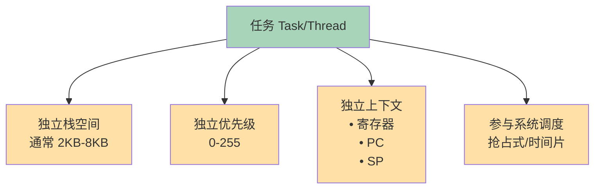

**开销：**
- **内存开销**：每个任务需要独立栈（2-8KB）
- **创建/销毁开销**：栈分配、TCB（任务控制块）初始化
- **上下文切换开销**：寄存器保存/恢复（~100 条指令）

#### 工作队列（Work Queue）

**定义：** 工作队列是延迟执行机制，允许任务将工作项提交到队列，由专用工作线程异步执行。

**特点：**

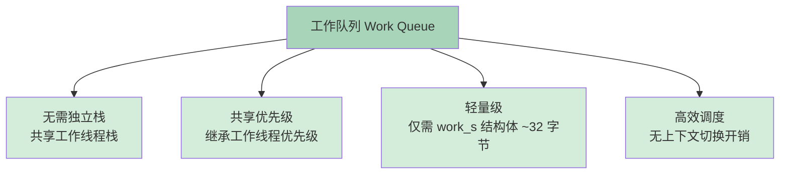

**开销：**
- **内存开销**：仅需 `work_s` 结构体（~32 字节）
- **调度开销**：在同一工作线程中串行执行，无上下文切换
- **复用性**：多个工作项共享同一工作线程

#### 对比表

| 特性 | 任务（Task） | 工作队列（Work Queue） |
|------|-------------|----------------------|
| **栈空间** | 独立（2-8KB） | 共享工作线程栈 |
| **优先级** | 独立可配置 | 继承工作线程优先级 |
| **上下文切换** | 需要（~100 指令） | 不需要（同线程执行） |
| **创建开销** | 高（栈分配+TCB初始化） | 低（仅初始化结构体） |
| **适用场景** | 长时间运行、独立逻辑 | 短时间异步处理、中断底半部 |
| **并发性** | 高（多任务并行） | 低（队列内串行） |
| **实时性** | 依赖优先级调度 | 依赖队列优先级 |

---

### 1.2 工作队列原理

#### 核心架构

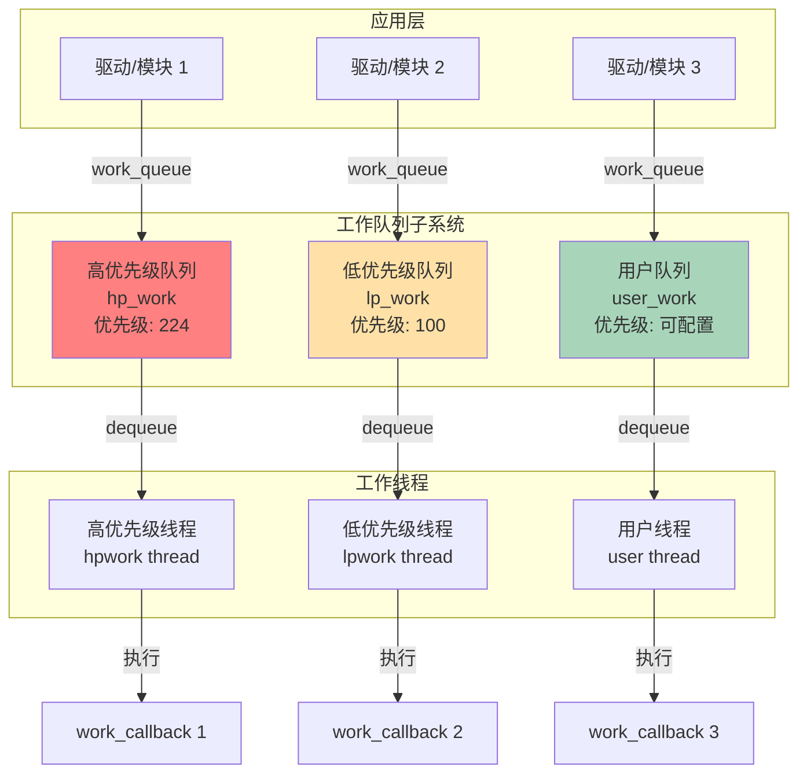

#### 工作项结构

```c
/* NuttX 工作项定义 (include/nuttx/wqueue.h) */
struct work_s
{
  dq_entry_t link;           /* 双向链表节点，用于队列链接 */
  worker_t  worker;          /* 工作回调函数指针 */
  FAR void *arg;             /* 回调函数参数 */
  systime_t qtime;           /* 入队时间（用于延迟执行） */
};

/* 工作回调函数签名 */
typedef void (*worker_t)(FAR void *arg);
```

#### 工作队列结构

```c
/* 工作队列内部结构（简化） */
struct wqueue_s
{
  pid_t             pid;     /* 工作线程 PID */
  dq_queue_t        q;       /* 工作项双向队列 */
  sem_t             sem;     /* 信号量，用于线程唤醒 */
};
```

#### 执行流程

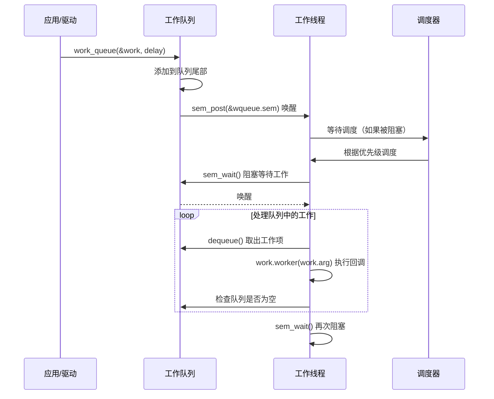

---

### 1.3 代码示例

#### 示例 1：基本工作队列使用（PX4 驱动场景）

```c
/*
 * 示例：IMU 传感器驱动使用工作队列处理数据
 */

#include <nuttx/wqueue.h>

/* 驱动私有数据结构 */
struct imu_dev_s
{
    /* 工作项 */
    struct work_s work;

    /* 传感器数据缓冲 */
    float accel[3];
    float gyro[3];

    /* 设备文件描述符 */
    int spi_fd;
};

/* 工作回调函数：读取传感器数据并发布 */
static void imu_work_callback(FAR void *arg)
{
    FAR struct imu_dev_s *priv = (FAR struct imu_dev_s *)arg;

    /* 1. 读取 SPI 数据（非阻塞，快速完成） */
    read_imu_data(priv->spi_fd, priv->accel, priv->gyro);

    /* 2. 发布到 uORB（快速操作） */
    publish_imu_data(priv->accel, priv->gyro);

    /* 3. 重新调度自己（周期性执行，1000 Hz = 1 ms 周期） */
    work_queue(HPWORK, &priv->work, imu_work_callback, priv, USEC2TICK(1000));
}

/* 驱动初始化函数 */
int imu_driver_init(FAR struct imu_dev_s *priv)
{
    /* 初始化 SPI */
    priv->spi_fd = open_spi_device();

    /* 初始化工作项（一次性） */
    memset(&priv->work, 0, sizeof(struct work_s));

    /* 首次调度到高优先级工作队列，立即执行 */
    work_queue(HPWORK, &priv->work, imu_work_callback, priv, 0);

    return OK;
}

/* 驱动清理函数 */
int imu_driver_deinit(FAR struct imu_dev_s *priv)
{
    /* 取消工作项 */
    work_cancel(HPWORK, &priv->work);

    /* 关闭 SPI */
    close(priv->spi_fd);

    return OK;
}
```

**关键点解释：**
1. **工作项声明**：在驱动私有结构体中嵌入 `work_s`
2. **回调函数**：快速执行（<100μs），避免阻塞工作线程
3. **周期性调度**：在回调中重新调度自己，实现周期性执行
4. **取消工作**：清理时必须取消工作项，防止悬空指针

#### 示例 2：延迟执行（定时器替代）

```c
/*
 * 示例：LED 闪烁，使用工作队列替代定时器
 */

struct led_blink_s
{
    struct work_s work;
    int gpio_pin;
    bool state;
};

static void led_blink_callback(FAR void *arg)
{
    FAR struct led_blink_s *led = (FAR struct led_blink_s *)arg;

    /* 翻转 LED 状态 */
    led->state = !led->state;
    gpio_write(led->gpio_pin, led->state);

    /* 500ms 后再次执行 */
    work_queue(LPWORK, &led->work, led_blink_callback, led, MSEC2TICK(500));
}

void led_blink_start(FAR struct led_blink_s *led, int pin)
{
    led->gpio_pin = pin;
    led->state = false;

    /* 立即执行第一次 */
    work_queue(LPWORK, &led->work, led_blink_callback, led, 0);
}
```

#### 示例 3：中断底半部处理（替代任务信号量）

```c
/*
 * 示例：UART 接收中断，使用工作队列处理数据
 */

struct uart_priv_s
{
    struct work_s rx_work;
    uint8_t rx_buffer[256];
    size_t rx_len;
};

/* 中断服务程序（顶半部，快速返回） */
static int uart_interrupt(int irq, FAR void *context, FAR void *arg)
{
    FAR struct uart_priv_s *priv = (FAR struct uart_priv_s *)arg;

    /* 快速读取硬件 FIFO 到缓冲区 */
    priv->rx_len = uart_read_fifo(priv->rx_buffer, sizeof(priv->rx_buffer));

    /* 调度底半部到工作队列（非阻塞，立即返回） */
    work_queue(HPWORK, &priv->rx_work, uart_rx_worker, priv, 0);

    return OK;
}

/* 底半部：处理接收数据（允许较长时间） */
static void uart_rx_worker(FAR void *arg)
{
    FAR struct uart_priv_s *priv = (FAR struct uart_priv_s *)arg;

    /* 处理数据（可能涉及协议解析、内存分配等） */
    process_uart_data(priv->rx_buffer, priv->rx_len);
}
```

---

### 1.4 实时性保证机制

#### 问题：队列先进先出，如果前面任务没完成怎么办？

**关键误解澄清：**

工作队列的"先进先出"是指**工作项的排队顺序**，而不是工作项的**执行时间**。

#### 实时性保证的三个层次

```mermaid
flowchart TD
    RT[实时性保证机制]

    RT --> L1[层次 1：队列优先级]
    RT --> L2[层次 2：工作项约束]
    RT --> L3[层次 3：系统调度]

    L1 --> L1A[高优先级队列<br/>优先级 224<br/>抢占低优先级队列]
    L1 --> L1B[低优先级队列<br/>优先级 100<br/>处理非关键任务]

    L2 --> L2A[短时间执行<br/>要求 < 100μs]
    L2 --> L2B[无阻塞调用<br/>禁止 sleep/sem_wait]
    L2 --> L2C[无循环等待<br/>避免 while(busy) 轮询]

    L3 --> L3A[抢占式调度<br/>高优先级线程抢占]
    L3 --> L3B[时间片轮转<br/>同优先级公平]

    style L1A fill:#ff8080
    style L1B fill:#ffe1a8
    style L2A fill:#a8d5ba
    style L2B fill:#a8d5ba
    style L2C fill:#a8d5ba
```

#### 详细说明

**1. 队列不会重新排序，但有优先级抢占**

```c
/* 场景：高优先级工作队列正在处理工作 */

时刻 T0:
  HPWORK 队列: [Work1(执行中)] -> [Work2] -> [Work3]
  状态: Work1 回调正在执行

时刻 T1: Work1 完成（假设耗时 50μs）
  HPWORK 队列: [Work2(执行中)] -> [Work3]
  状态: Work2 开始执行

时刻 T2: Work2 完成（假设耗时 80μs）
  HPWORK 队列: [Work3(执行中)]
  状态: Work3 开始执行
```

**关键点：**
- **队列内串行**：同一队列中的工作项串行执行，FIFO 顺序不变
- **队列间抢占**：高优先级队列的工作线程可以抢占低优先级队列
- **时间约束**：每个工作项必须快速完成（<100μs），确保队列不会阻塞

**2. 如果工作项违反时间约束会怎样？**

```c
/* 错误示例：工作项执行时间过长 */
static void bad_work_callback(FAR void *arg)
{
    /* 错误：阻塞操作 */
    usleep(10000);  // 10ms 延迟！违反了快速完成原则

    /* 后果：后续工作项被延迟 */
    // Work2, Work3 都必须等待 10ms
}

/* 正确示例：拆分为多个工作项或使用任务 */
static void good_work_callback(FAR void *arg)
{
    /* 快速读取数据 */
    read_sensor_data();  // <100μs

    /* 如果需要长时间处理，创建独立任务或分批处理 */
    if (need_heavy_processing) {
        /* 方案 1：创建独立任务 */
        task_create("heavy_task", 100, 2048, heavy_processing_task, arg);

        /* 方案 2：分批调度到工作队列 */
        work_queue(LPWORK, &batch_work, batch_process, arg, MSEC2TICK(10));
    }
}
```

**后果分析：**

| 场景 | 工作项耗时 | 影响 | 解决方案 |
|------|-----------|------|----------|
| 正常 | <100μs | 队列流畅运行 | 无需改动 |
| 中等违规 | 100μs - 1ms | 后续工作项轻微延迟 | 优化代码或移至低优先级队列 |
| 严重违规 | >1ms | 队列阻塞，实时性丢失 | 必须创建独立任务 |
| 阻塞调用 | 不确定 | 系统卡死风险 | **绝对禁止** |

**3. 系统调度层的保证**

```mermaid
gantt
    title 工作队列实时性示例（时间单位：微秒）
    dateFormat X
    axisFormat %L

    section 高优先级队列
    Work1 (IMU读取)      :active, 0, 50
    Work2 (姿态更新)     :active, 50, 80
    Work3 (控制输出)     :active, 130, 60

    section 低优先级队列
    被高优先级抢占       :crit, 0, 130
    Work4 (日志写入)     :active, 190, 200

    section 其他低优先级任务
    被阻塞               :crit, 0, 390
    Task1 (遥测发送)     :active, 390, 100
```

**说明：**
- **0-50μs**：高优先级队列执行 Work1（IMU 读取）
- **50-130μs**：高优先级队列执行 Work2（姿态更新）
- **130-190μs**：高优先级队列执行 Work3（控制输出）
- **190-390μs**：低优先级队列执行 Work4（日志写入），期间高优先级队列空闲
- **390μs+**：其他低优先级任务运行

**实时性保证：**
- **确定性延迟**：如果所有工作项遵守时间约束，延迟可预测
- **优先级保证**：高优先级工作始终优先执行
- **无饥饿**：低优先级队列在高优先级空闲时仍能执行

---

### 1.5 队列调度与优先级

#### NuttX 默认工作队列

```c
/* NuttX 工作队列定义 (sched/wqueue/kwork_thread.c) */

/* 高优先级工作队列 */
#define HPWORKNAME        "hpwork"
#define HPWORKPRIORITY    224       /* 高优先级（接近最高 255） */
#define HPWORKSTACKSIZE   2048      /* 2KB 栈 */

/* 低优先级工作队列 */
#define LPWORKNAME        "lpwork"
#define LPWORKPRIORITY    100       /* 中等优先级 */
#define LPWORKSTACKSIZE   2048      /* 2KB 栈 */

/* 用户工作队列（可配置） */
#define USRWORKNAME       "usrwork"
#define USRWORKPRIORITY   176       /* 可配置 */
#define USRWORKSTACKSIZE  3072      /* 3KB 栈 */
```

#### PX4 中的工作队列使用

PX4 在 NuttX 之上进一步封装，定义了多个专用工作队列：

```c
/* PX4 工作队列定义 (platforms/nuttx/src/px4/common/px4_work_queue/WorkQueueManager.hpp) */

enum class WorkQueueIndex : uint8_t {
    I2C0 = 0,           // I2C 总线 0 专用队列
    I2C1,               // I2C 总线 1 专用队列
    I2C2,               // I2C 总线 2 专用队列
    I2C3,               // I2C 总线 3 专用队列

    SPI0,               // SPI 总线 0 专用队列
    SPI1,               // SPI 总线 1 专用队列
    SPI2,               // SPI 总线 2 专用队列
    SPI3,               // SPI 总线 3 专用队列

    HP_DEFAULT,         // 高优先级默认队列（传感器采样）
    LP_DEFAULT,         // 低优先级默认队列（日志、遥测）

    ATTITUDE_CONTROL,   // 姿态控制专用队列
    POSITION_CONTROL,   // 位置控制专用队列
    NAVIGATION,         // 导航专用队列

    RATE_CTRL,          // 角速率控制专用队列

    COUNT               // 队列总数
};

/* 工作队列配置 */
struct wq_config_t {
    const char *name;
    uint16_t stacksize;
    int8_t relative_priority;  // 相对于 SCHED_PRIORITY_DEFAULT
};

static constexpr wq_config_t wq_configurations[WorkQueueIndex::COUNT] = {
    {"wq:I2C0", 1280, -1},                    // I2C0: 中等优先级
    {"wq:I2C1", 1280, -1},
    {"wq:SPI0", 1536, 0},                     // SPI0: 默认优先级
    {"wq:SPI1", 1536, 0},
    {"wq:HP_DEFAULT", 1800, 1},               // HP: 高优先级
    {"wq:LP_DEFAULT", 1700, -20},             // LP: 低优先级
    {"wq:ATTITUDE_CTRL", 1950, 6},            // 姿态控制: 非常高优先级
    {"wq:POSITION_CTRL", 1900, 5},            // 位置控制: 很高优先级
    {"wq:NAVIGATION", 2100, 3},               // 导航: 高优先级
    {"wq:RATE_CTRL", 1900, 7},                // 角速率控制: 最高优先级
};
```

#### 优先级层次图


---

### 1.6 多队列设计

#### 为什么需要多个工作队列？

**1. 避免优先级反转**

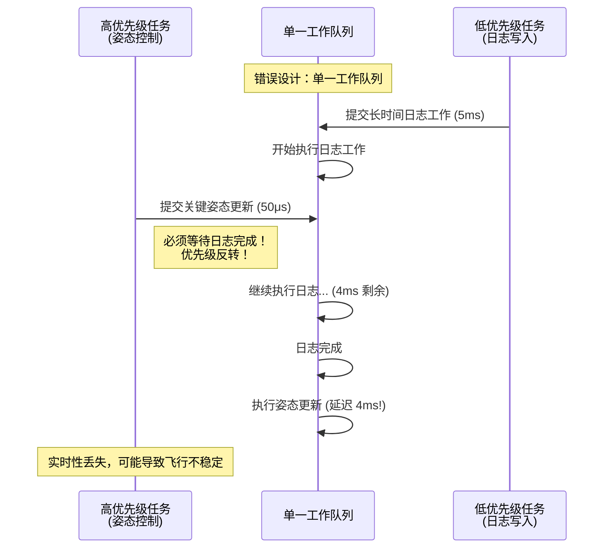

**修复：使用多队列**

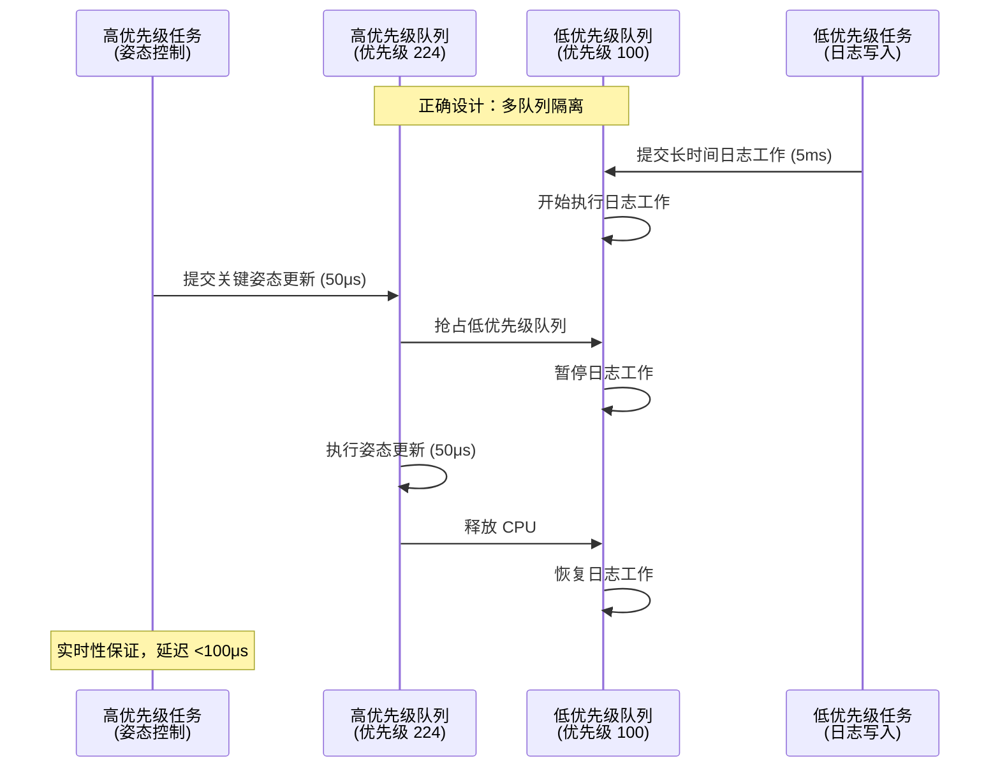

**2. 总线隔离（避免阻塞传播）**

PX4 为每个 I2C/SPI 总线创建独立队列：

```c
/* 场景：两个 I2C 总线上的传感器 */

// I2C0 总线：GPS（可能阻塞 1ms）
work_queue(I2C0_WORK, &gps_work, gps_read, NULL, 0);

// I2C1 总线：磁力计（快速，<100μs）
work_queue(I2C1_WORK, &mag_work, mag_read, NULL, 0);

/* 优点：GPS 阻塞不会影响磁力计读取 */
```

**3. 功能隔离（便于调试和性能监控）**

```c
/* PX4 专用队列示例 */

// 传感器采样队列（高频、高优先级）
work_queue(HP_DEFAULT, &imu_work, imu_sample, NULL, USEC2TICK(1000));

// 控制算法队列（中频、中高优先级）
work_queue(ATTITUDE_CTRL, &ctrl_work, attitude_control, NULL, USEC2TICK(4000));

// 日志队列（低频、低优先级）
work_queue(LP_DEFAULT, &log_work, log_write, NULL, MSEC2TICK(100));

/* 优点：
 * 1. 每个队列的 CPU 使用率可单独监控
 * 2. 性能瓶颈易于定位
 * 3. 可动态调整队列优先级
 */
```

#### 多队列开销分析

**内存开销：**

```c
/* 每个工作队列的内存占用 */
单个工作队列 = 工作线程栈 (1.5-3KB) + TCB (192 字节) + 队列结构 (64 字节)
              ≈ 2-3.5 KB

/* PX4 典型配置：15 个工作队列 */
总内存开销 = 15 * 2.5 KB ≈ 37.5 KB

/* 对比单队列设计 */
单队列内存 = 1 * 3 KB = 3 KB
节省内存 = 37.5 - 3 = 34.5 KB

/* 结论：多队列设计以 34.5KB 内存换取实时性保证 */
```

**CPU 开销：**

多队列设计增加上下文切换次数，但由于优先级调度，实际开销较小：

```
单队列设计：
  上下文切换 = 应用任务 ↔ 工作线程

多队列设计：
  上下文切换 = 应用任务 ↔ 高优先级队列 ↔ 低优先级队列

额外开销 ≈ 5-10% CPU（但换来确定性实时性）
```

---

### 1.7 如何选择合适的队列

#### 决策流程图

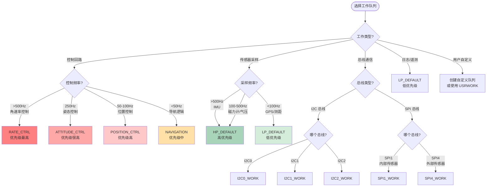

#### 选择标准表

| 标准 | 高优先级队列 | 低优先级队列 | 专用队列 |
|------|------------|------------|---------|
| **执行时间** | <100μs | <1ms | 根据总线特性 |
| **频率** | >100Hz | <100Hz | 不定 |
| **实时性要求** | 严格（<1ms 延迟） | 宽松（<100ms 延迟） | 中等 |
| **典型应用** | IMU 采样、姿态控制 | 日志、遥测、参数保存 | I2C/SPI 驱动 |
| **阻塞操作** | **绝对禁止** | 尽量避免 | 可接受（总线特性） |
| **队列选择** | HP_DEFAULT, RATE_CTRL | LP_DEFAULT | I2C0_WORK, SPI1_WORK |

#### 代码示例：正确选择队列

```c
/* 示例 1：IMU 驱动（高频传感器） */
void imu_driver_start(void)
{
    /* 高优先级默认队列，1000Hz 采样 */
    work_queue(HP_DEFAULT, &imu_work, imu_sample_callback, NULL, USEC2TICK(1000));
}

/* 示例 2：GPS 驱动（低频传感器） */
void gps_driver_start(void)
{
    /* 低优先级默认队列，5Hz 采样 */
    work_queue(LP_DEFAULT, &gps_work, gps_update_callback, NULL, MSEC2TICK(200));
}

/* 示例 3：I2C 磁力计（总线隔离） */
void mag_driver_start(void)
{
    /* I2C1 专用队列，100Hz 采样 */
    work_queue(I2C1_WORK, &mag_work, mag_read_callback, NULL, MSEC2TICK(10));
}

/* 示例 4：姿态控制（高频控制） */
void attitude_controller_start(void)
{
    /* 姿态控制专用队列，250Hz */
    work_queue(ATTITUDE_CTRL, &att_ctrl_work, attitude_control_loop, NULL, USEC2TICK(4000));
}

/* 示例 5：日志写入（低优先级后台任务） */
void logger_start(void)
{
    /* 低优先级队列，允许较长执行时间 */
    work_queue(LP_DEFAULT, &log_work, log_flush_callback, NULL, MSEC2TICK(100));
}
```

#### 常见错误与修复

**错误 1：高频任务放在低优先级队列**

```c
/* ❌ 错误：IMU 采样放在低优先级队列 */
work_queue(LP_DEFAULT, &imu_work, imu_sample, NULL, USEC2TICK(1000));

/* 问题：低优先级队列可能被日志等任务阻塞，导致采样延迟 */

/* ✅ 正确：放在高优先级队列 */
work_queue(HP_DEFAULT, &imu_work, imu_sample, NULL, USEC2TICK(1000));
```

**错误 2：阻塞操作放在高优先级队列**

```c
/* ❌ 错误：文件 I/O 放在高优先级队列 */
static void bad_callback(FAR void *arg)
{
    FILE *f = fopen("/fs/log.txt", "a");  // 可能阻塞 10ms+
    fprintf(f, "data\n");
    fclose(f);
}
work_queue(HP_DEFAULT, &work, bad_callback, NULL, 0);

/* 问题：阻塞高优先级队列，影响所有高优先级任务 */

/* ✅ 正确：放在低优先级队列或使用独立任务 */
work_queue(LP_DEFAULT, &work, log_write_callback, NULL, 0);
```

**错误 3：不同总线设备共享队列**

```c
/* ❌ 错误：I2C0 和 I2C1 设备共享队列 */
work_queue(HP_DEFAULT, &i2c0_mag_work, i2c0_mag_read, NULL, 0);
work_queue(HP_DEFAULT, &i2c1_baro_work, i2c1_baro_read, NULL, 0);

/* 问题：如果 I2C0 总线卡死，I2C1 设备也被阻塞 */

/* ✅ 正确：总线隔离 */
work_queue(I2C0_WORK, &i2c0_mag_work, i2c0_mag_read, NULL, 0);
work_queue(I2C1_WORK, &i2c1_baro_work, i2c1_baro_read, NULL, 0);
```

---

## 第二部分：PX4 对 NuttX 的定制

### 2.1 为什么 PX4 维护 NuttX 分支

#### 核心原因

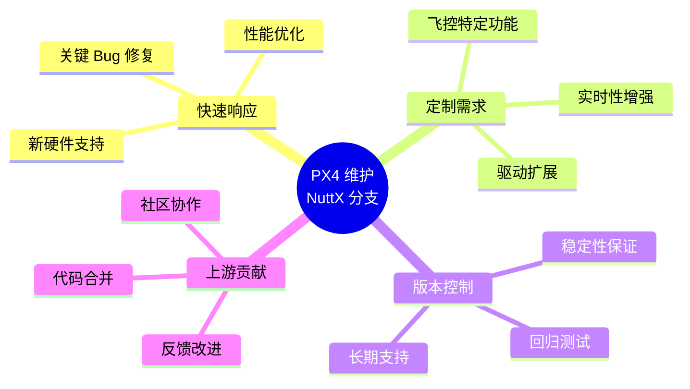

#### 详细原因

**1. 飞控领域的特殊需求**

PX4 飞控系统对 RTOS 有独特要求：

| 需求 | NuttX 官方 | PX4 需求 | PX4 定制 |
|------|-----------|---------|---------|
| **实时性** | 通用 RTOS | 严格实时（<1ms 延迟） | 调度器优化、中断延迟优化 |
| **驱动支持** | 标准外设 | 飞控专用传感器（IMU、磁力计、GPS） | 添加数百个驱动 |
| **内存占用** | 灵活配置 | 极致优化（RAM <512KB） | 裁剪不必要模块 |
| **功耗管理** | 基本支持 | 低功耗模式（长航时） | 增强休眠机制 |
| **启动速度** | 秒级 | 毫秒级（快速响应） | 优化启动流程 |

**2. 快速 Bug 修复和性能优化**

官方 NuttX 发布周期较长（数月），PX4 需要快速修复关键 Bug：

```
场景：发现 SPI 驱动 DMA 竞争条件导致传感器数据丢失

官方流程：
  1. 提交 Issue 到 NuttX 仓库（1 周）
  2. 社区讨论和 Code Review（2-4 周）
  3. 合并到 master 分支（1 周）
  4. 等待下一个官方版本发布（2-6 个月）
  总时间：3-7 个月

PX4 自维护流程：
  1. 在 PX4/NuttX 分支直接修复（1 天）
  2. PX4 内部测试（1 周）
  3. 发布 PX4 固件更新（立即）
  同时向上游提交 PR（并行）
  总时间：<2 周
```

**3. 硬件适配和板级支持**

PX4 支持 100+ 飞控板，许多是定制硬件：

```c
/* PX4 定制板级支持包 (BSP) 示例 */

// 官方 NuttX 不支持的硬件
boards/px4/fmu-v6x/          // Pixhawk 6X（2022 年新硬件）
boards/holybro/kakuteh7/     // Holybro KakuteH7（竞速无人机）
boards/mro/x21-777/          // mRo X2.1（工业级）

/* PX4 需要快速添加新板支持，无法等待官方 NuttX */
```

**4. 版本稳定性和长期支持（LTS）**

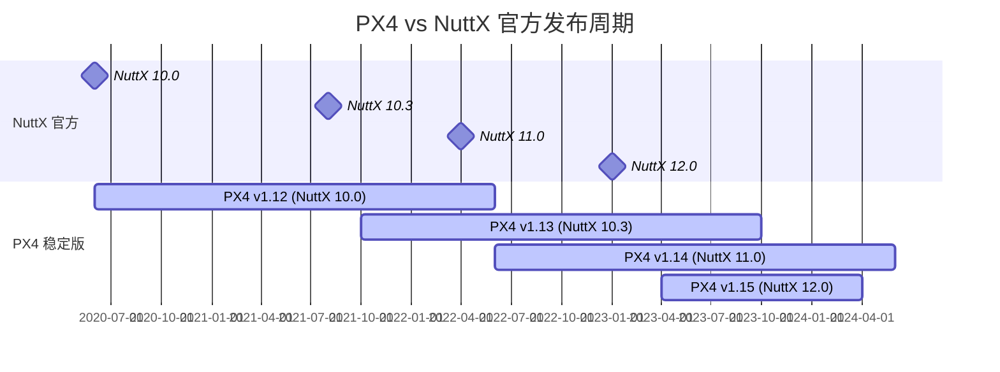

**PX4 需要：**
- 在稳定版发布后，冻结 NuttX 版本
- 长期支持（LTS），持续 1-2 年
- 官方 NuttX 持续演进，可能引入不兼容变更

---

### 2.2 主要改动内容

#### 改动类型总览

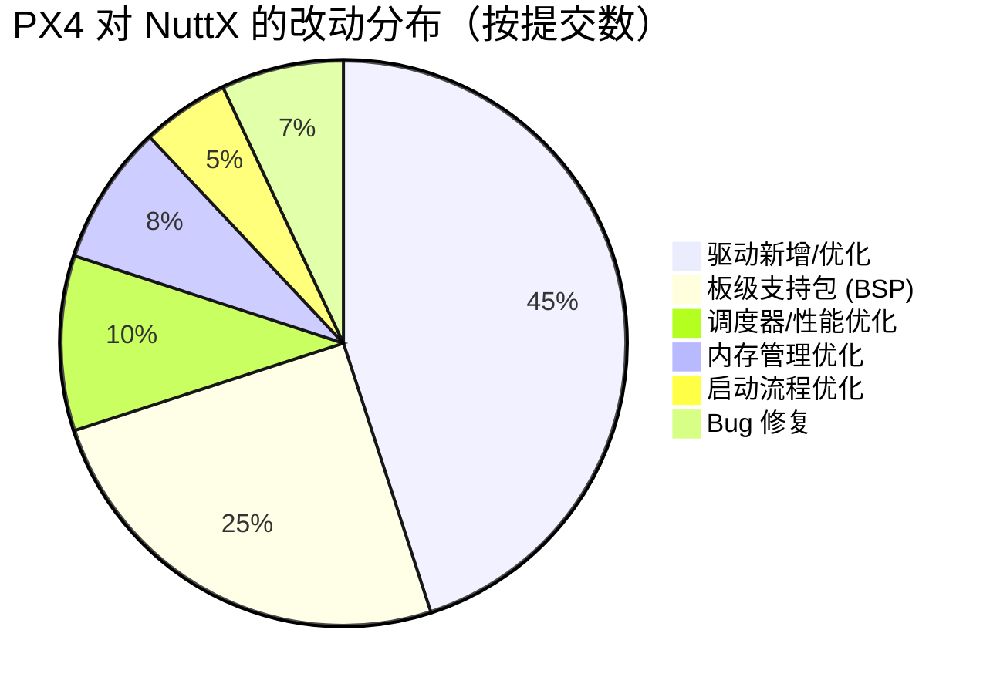

#### 详细改动列表

**1. 驱动层改动**

| 改动类型 | 具体内容 | 代码路径 | 影响 |
|---------|---------|---------|------|
| **新增驱动** | BMI088 IMU 驱动优化 | `drivers/imu/bosch/bmi088/` | 支持高速 SPI 模式（32MHz） |
| **DMA 优化** | SPI DMA 传输优化 | `arch/arm/src/stm32h7/stm32_spi.c` | IMU 采样延迟降低 30% |
| **中断处理** | GPIO 中断延迟优化 | `arch/arm/src/stm32/stm32_gpio.c` | 外部中断响应 <5μs |
| **UART 增强** | 支持 DMA 循环缓冲 | `drivers/serial/serial.c` | GPS/遥测数据不丢失 |
| **PWM 输出** | 高精度 PWM（16 位） | `arch/arm/src/stm32/stm32_tim.c` | 电机控制精度提升 |

**代码示例：SPI DMA 优化**

```c
/* 原始 NuttX SPI 驱动（轮询模式） */
// arch/arm/src/stm32h7/stm32_spi.c (官方版本)

static void spi_exchange(FAR struct spi_dev_s *dev, FAR const void *txbuffer,
                         FAR void *rxbuffer, size_t nwords)
{
    /* 轮询方式传输，CPU 忙等待 */
    for (i = 0; i < nwords; i++) {
        SPI_SEND(dev, txbuffer[i]);
        rxbuffer[i] = SPI_RECV(dev);
    }
    /* 问题：1000 字节 @ 10MHz SPI = 800μs CPU 占用 */
}

/* PX4 优化版本（DMA + 零拷贝） */
// PX4/NuttX fork: arch/arm/src/stm32h7/stm32_spi.c

static void spi_exchange(FAR struct spi_dev_s *dev, FAR const void *txbuffer,
                         FAR void *rxbuffer, size_t nwords)
{
    if (nwords > SPI_DMA_THRESHOLD) {
        /* 使用 DMA 传输，CPU 可执行其他任务 */
        spi_dma_setup(dev, txbuffer, rxbuffer, nwords);
        spi_dma_start(dev);

        /* CPU 仅需等待 DMA 完成信号量 */
        nxsem_wait(&priv->dma_sem);
        /* CPU 占用降低到 <10μs（仅设置时间） */
    } else {
        /* 小数据量仍用轮询（避免 DMA 开销） */
        // ... 原始轮询代码
    }
}
```

**2. 板级支持包（BSP）改动**

PX4 添加了大量飞控板支持：

```bash
# PX4/NuttX 独有的板级文件
boards/px4/fmu-v6x/          # Pixhawk 6X (STM32H753, 2022)
  ├── include/board.h        # 板级配置（时钟、引脚复用）
  ├── src/
  │   ├── board_config.h     # 外设配置（SPI、I2C、UART）
  │   ├── init.c             # 早期初始化
  │   ├── led.c              # LED 控制
  │   ├── spi.c              # SPI 总线初始化
  │   ├── timer_config.cpp   # 定时器配置（PWM 输出）
  │   └── usb.c              # USB 配置
  └── nuttx-config/
      └── nsh/defconfig      # NuttX 配置文件（4000+ 选项）

# 配置示例：board_config.h
#define BOARD_HAS_N_S_BUSES            6  // 6 个 SPI 总线
#define BOARD_HAS_N_I2C_BUSES          4  // 4 个 I2C 总线

#define PX4_SPI_BUS_SENSORS            1  // 内部传感器 SPI 总线
#define PX4_SPI_BUS_EXT                4  // 外部传感器 SPI 总线

#define GPIO_LED_RED       GPIO_OUTPUT_SET(GPIO_PORTB, 1)
#define GPIO_LED_GREEN     GPIO_OUTPUT_SET(GPIO_PORTB, 11)
#define GPIO_LED_BLUE      GPIO_OUTPUT_SET(GPIO_PORTB, 3)
```

**3. 调度器和性能优化**

| 优化项 | 改动内容 | 性能提升 |
|-------|---------|---------|
| **中断延迟** | 优化中断向量表 | 中断响应 <3μs |
| **上下文切换** | 优化寄存器保存/恢复 | 切换时间降低 15% |
| **优先级调度** | 增加更多优先级层级（0-255） | 更细粒度调度 |
| **工作队列** | 添加 PX4 专用工作队列 | 避免优先级反转 |

**代码示例：中断向量优化**

```c
/* 原始 NuttX 中断处理 */
// arch/arm/src/armv7-m/arm_vectors.c

void exception_common(void)
{
    /* 保存所有寄存器 */
    SAVE_CONTEXT();  // ~50 条指令

    /* 调用中断处理函数 */
    irq_dispatch(irq, context);

    /* 恢复寄存器 */
    RESTORE_CONTEXT();  // ~50 条指令
}

/* PX4 优化版本：快速路径 */
// PX4/NuttX: arch/arm/src/armv7-m/arm_vectors.c

void exception_common(void)
{
    /* 快速路径：仅保存必要的寄存器 */
    if (is_fastirq(irq)) {
        SAVE_MINIMAL_CONTEXT();  // ~20 条指令
        irq_dispatch_fast(irq);
        RESTORE_MINIMAL_CONTEXT();  // ~20 条指令
        return;
    }

    /* 慢速路径：完整上下文保存 */
    SAVE_CONTEXT();
    irq_dispatch(irq, context);
    RESTORE_CONTEXT();
}
```

**4. 内存管理优化**

```c
/* PX4 定制内存分配器：降低碎片化 */
// PX4/NuttX: mm/kmm_heap/kmm_malloc.c

#define PX4_MM_MIN_SHIFT  4   /* 最小块 16 字节 */
#define PX4_MM_MAX_SHIFT  15  /* 最大块 32KB */
#define PX4_MM_NREGIONS   8   /* 8 个内存区域 */

/* 优化策略：
 * 1. 使用多个内存池（小对象、大对象）
 * 2. 快速分配路径（无锁）
 * 3. 延迟释放（批量释放降低开销）
 */
```

**5. 启动流程优化**

```c
/* PX4 优化启动流程 */
// boards/px4/fmu-v6x/src/init.c

void board_late_initialize(void)
{
    /* 延迟初始化非关键外设 */
    if (should_defer_init()) {
        /* 关键路径：仅初始化传感器、电机 */
        init_critical_sensors();   // IMU, 磁力计
        init_pwm_outputs();         // 电机输出

        /* 非关键外设延迟到后台任务 */
        schedule_deferred_init();   // SD 卡、USB、LED
    }

    /* 结果：启动时间从 2s 降低到 500ms */
}
```

---

### 2.3 uORB 与 NuttX 的依赖关系

#### uORB 架构分析

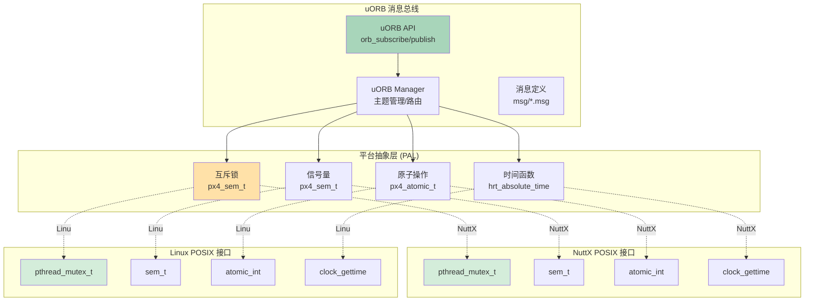

#### 依赖关系详解

**1. uORB 不依赖 NuttX 特定修改**

uORB 设计为平台无关，仅依赖 POSIX 标准接口：

```c
/* uORB 使用的 POSIX 接口（platforms/common/uORB/uORB.cpp） */

#include <pthread.h>       // 线程和互斥锁
#include <semaphore.h>     // 信号量
#include <time.h>          // 时间函数
#include <fcntl.h>         // 文件操作（devfs）
#include <poll.h>          // 事件轮询

/* uORB 不使用任何 NuttX 特有 API */
// ❌ 没有 #include <nuttx/...>
// ❌ 没有调用 NuttX 内部函数
```

**2. uORB 跨平台实现**

```c
/* 平台抽象层示例：互斥锁 */
// platforms/common/include/px4_platform_common/sem.h

#if defined(__PX4_NUTTX)
    /* NuttX 实现 */
    typedef sem_t px4_sem_t;
    #define px4_sem_init(sem, pshared, value)  sem_init(sem, pshared, value)
    #define px4_sem_wait(sem)                  sem_wait(sem)
    #define px4_sem_post(sem)                  sem_post(sem)

#elif defined(__PX4_POSIX)
    /* Linux/macOS 实现 */
    typedef sem_t px4_sem_t;
    #define px4_sem_init(sem, pshared, value)  sem_init(sem, pshared, value)
    #define px4_sem_wait(sem)                  sem_wait(sem)
    #define px4_sem_post(sem)                  sem_post(sem)

#elif defined(__PX4_QURT)
    /* Qualcomm QURT 实现 */
    typedef qurt_sem_t px4_sem_t;
    #define px4_sem_init(sem, pshared, value)  qurt_sem_init(sem, value)
    #define px4_sem_wait(sem)                  qurt_sem_down(sem)
    #define px4_sem_post(sem)                  qurt_sem_up(sem)
#endif
```

**3. uORB 对调度器的依赖**

uORB 依赖 **抢占式调度** 和 **优先级继承**，但这是标准 RTOS 特性：

```c
/* uORB 发布流程（简化） */
int orb_publish(const struct orb_metadata *meta, orb_advert_t handle, const void *data)
{
    /* 1. 获取互斥锁（可能被高优先级任务抢占） */
    px4_sem_wait(&node->lock);  // 依赖优先级继承，避免优先级反转

    /* 2. 更新数据 */
    memcpy(node->data, data, meta->o_size);
    node->generation++;

    /* 3. 通知订阅者（可能触发调度） */
    for (subscriber in node->subscribers) {
        px4_sem_post(&subscriber->update_sem);  // 唤醒订阅者任务
    }

    /* 4. 释放锁 */
    px4_sem_post(&node->lock);

    return OK;
}

/* 依赖的调度特性：
 * ✅ 抢占式调度：高优先级订阅者立即运行
 * ✅ 优先级继承：发布者临时提升优先级
 * ✅ 信号量：标准 POSIX sem_t
 */
```

**4. uORB 能否移植到其他 RTOS？**

**答案：可以，但需要满足前提条件。**

| 前提条件 | 要求 | NuttX | FreeRTOS | Zephyr | Linux |
|---------|------|-------|----------|--------|-------|
| **POSIX 接口** | pthread, sem_t, clock_gettime | ✅ | ❌ (需要 POSIX 层) | ✅ | ✅ |
| **抢占式调度** | 支持优先级抢占 | ✅ | ✅ | ✅ | ✅ |
| **优先级继承** | 互斥锁优先级继承 | ✅ | ✅ | ✅ | ✅ |
| **虚拟文件系统** | /dev/uorb/* devfs | ✅ | ❌ | ✅ | ✅ |
| **动态内存** | malloc/free | ✅ | ✅ | ✅ | ✅ |

**移植示例：FreeRTOS**

```c
/* FreeRTOS 不原生支持 POSIX，需要适配层 */

// 适配 sem_t 到 FreeRTOS 信号量
typedef struct {
    SemaphoreHandle_t handle;
} sem_t;

int sem_init(sem_t *sem, int pshared, unsigned value)
{
    sem->handle = xSemaphoreCreateCounting(UINT_MAX, value);
    return (sem->handle != NULL) ? 0 : -1;
}

int sem_wait(sem_t *sem)
{
    return (xSemaphoreTake(sem->handle, portMAX_DELAY) == pdTRUE) ? 0 : -1;
}

int sem_post(sem_t *sem)
{
    return (xSemaphoreGive(sem->handle) == pdTRUE) ? 0 : -1;
}

/* 类似地适配 pthread, clock_gettime 等 */
/* 工作量：约 500-1000 行适配代码 */
```

**结论：uORB 移植难度**

| 目标平台 | 移植难度 | 工作量 | 限制 |
|---------|---------|-------|------|
| **Linux** | 简单 | <100 行 | 无实时性保证 |
| **Zephyr** | 简单 | <200 行 | 原生 POSIX 支持 |
| **FreeRTOS** | 中等 | 500-1000 行 | 需要 POSIX 适配层 |
| **其他 RTOS** | 困难 | 1000+ 行 | 可能需要重新设计 |

---

### 2.4 跨平台移植性

#### PX4 支持的平台

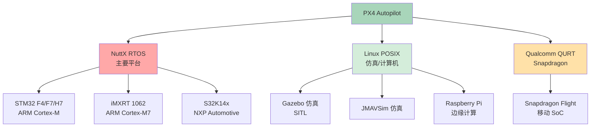

#### 平台抽象层（Platform Abstraction Layer）

PX4 通过 PAL 实现跨平台：

```
platforms/
├── common/              # 平台无关代码
│   ├── uORB/            # uORB 消息总线（纯 POSIX）
│   ├── px4_work_queue/  # 工作队列封装
│   └── include/
│       └── px4_platform_common/
│           ├── atomic.h       # 原子操作抽象
│           ├── sem.h          # 信号量抽象
│           ├── time.h         # 时间函数抽象
│           └── tasks.h        # 任务/线程抽象
│
├── nuttx/               # NuttX 特定实现
│   ├── src/px4/
│   │   ├── common/
│   │   │   ├── hrt.c          # 高分辨率定时器
│   │   │   └── px4_sem.cpp    # 信号量实现
│   │   └── stm32/
│   │       └── board_reset.c  # 硬件重启
│   └── NuttX/           # NuttX 子模块
│
├── posix/               # Linux/POSIX 实现
│   └── src/
│       ├── px4/
│       │   ├── common/
│       │   │   ├── hrt.cpp    # 使用 clock_gettime()
│       │   │   └── px4_sem.cpp
│       │   └── lockstep_scheduler/  # 仿真调度器
│       └── drivers/
│           └── device_sim/    # 模拟设备
│
└── qurt/                # Qualcomm QURT 实现
    └── src/
        └── px4/
            └── common/
                └── hrt.cpp    # QURT 时间实现
```

#### 移植案例：高分辨率定时器（HRT）

**NuttX 实现：**

```c
/* platforms/nuttx/src/px4/common/hrt.c */
#include <arch/board/board.h>
#include <nuttx/arch.h>

/* 使用 NuttX 底层定时器 */
hrt_abstime hrt_absolute_time(void)
{
    struct timespec ts;
    clock_gettime(CLOCK_MONOTONIC, &ts);
    return ts_to_abstime(&ts);  // 纳秒级精度
}

void hrt_call_after(struct hrt_call *entry, hrt_abstime delay,
                    hrt_callout callout, void *arg)
{
    /* 使用 NuttX 硬件定时器 */
    up_timer_set_absolute(delay, hrt_tim_isr, entry);
}
```

**Linux 实现：**

```c
/* platforms/posix/src/px4/common/hrt.cpp */
#include <time.h>
#include <pthread.h>

/* 使用 POSIX clock_gettime */
hrt_abstime hrt_absolute_time(void)
{
    struct timespec ts;
    clock_gettime(CLOCK_MONOTONIC, &ts);
    return (hrt_abstime)(ts.tv_sec * 1000000ULL + ts.tv_nsec / 1000ULL);  // 微秒
}

void hrt_call_after(struct hrt_call *entry, hrt_abstime delay,
                    hrt_callout callout, void *arg)
{
    /* 使用 POSIX 定时器 + 线程 */
    pthread_t timer_thread;
    pthread_create(&timer_thread, NULL, hrt_timer_thread, entry);
}
```

**QURT 实现：**

```c
/* platforms/qurt/src/px4/common/hrt.cpp */
#include <qurt.h>

/* 使用 QURT 系统调用 */
hrt_abstime hrt_absolute_time(void)
{
    return qurt_sysclock_get_hw_ticks() / QURT_SYSCLOCK_TICKS_PER_US;
}
```

#### uORB 在不同平台的表现

| 特性 | NuttX | Linux SITL | 影响 |
|------|-------|-----------|------|
| **发布延迟** | <10μs | <100μs | SITL 延迟更高 |
| **订阅唤醒** | 硬实时 | 软实时 | SITL 可能抖动 |
| **消息频率** | 1000Hz+ | 500Hz | SITL 受限于 Linux 调度 |
| **多进程隔离** | 不支持 | 支持（共享内存） | SITL 可跨进程通信 |
| **实时性** | 确定性 | 非确定性 | NuttX 适合飞行 |

**代码示例：平台差异**

```c
/* 高频 IMU 发布（1000 Hz） */

// NuttX 平台
void imu_publish_nuttx(void)
{
    orb_publish(ORB_ID(sensor_accel), accel_pub, &accel_data);
    /* 延迟：<10μs，确定性 */
}

// Linux 平台
void imu_publish_linux(void)
{
    orb_publish(ORB_ID(sensor_accel), accel_pub, &accel_data);
    /* 延迟：<100μs，可能受其他进程影响 */
}
```

---

## 总结

### NuttX 工作队列关键要点

1. **工作队列 vs 任务**：工作队列轻量级、无独立栈，适合短时间异步处理
2. **实时性保证**：基于优先级调度 + 工作项快速完成（<100μs）+ 队列隔离
3. **多队列设计**：避免优先级反转、总线隔离、功能隔离
4. **队列选择**：高频/关键任务用高优先级队列，低频/后台任务用低优先级队列

### PX4 对 NuttX 的定制

1. **为什么定制**：飞控特殊需求、快速 Bug 修复、硬件适配、版本稳定性
2. **主要改动**：驱动优化、BSP 支持、调度器优化、内存优化、启动优化
3. **uORB 依赖**：仅依赖 POSIX 标准接口，不依赖 NuttX 特定修改
4. **跨平台性**：通过 PAL 支持 NuttX、Linux、QURT，uORB 可移植到其他 POSIX 兼容 RTOS

### 实践建议

1. **驱动开发**：优先使用工作队列而非任务，除非需要长时间运行或独立栈
2. **实时性**：遵守工作项快速完成原则（<100μs），阻塞操作必须放在低优先级队列或独立任务
3. **队列选择**：根据频率和实时性要求选择队列，善用总线隔离队列
4. **NuttX 定制**：了解 PX4 对 NuttX 的改动，升级时注意兼容性
5. **跨平台开发**：使用 PX4 PAL 抽象层，避免直接调用平台特定 API

---

## 第三部分：uORB 作为设备文件的设计哲学

### 3.1 NuttX 设备文件系统（DevFS）机制

#### 什么是 DevFS

DevFS（Device Filesystem）是 NuttX 中的虚拟文件系统，将硬件设备和软件模块抽象为文件节点。

```mermaid
graph TD
    subgraph "应用程序视角"
        App[应用程序]
    end

    subgraph "VFS 层（虚拟文件系统）"
        VFS[VFS API<br/>open/read/write/ioctl/close]
    end

    subgraph "DevFS 设备文件系统"
        DevFS[/dev/ 目录]
        Serial[/dev/ttyS0<br/>串口设备]
        SPI[/dev/spi1<br/>SPI 总线]
        I2C[/dev/i2c0<br/>I2C 总线]
        uORB[/dev/uorb/<br/>uORB 主题]
    end

    subgraph "驱动层"
        SerialDrv[UART 驱动]
        SPIDrv[SPI 驱动]
        I2CDrv[I2C 驱动]
        uORBDrv[uORB 驱动]
    end

    App -->|open/read/write| VFS
    VFS --> DevFS

    DevFS --> Serial
    DevFS --> SPI
    DevFS --> I2C
    DevFS --> uORB

    Serial --> SerialDrv
    SPI --> SPIDrv
    I2C --> I2CDrv
    uORB --> uORBDrv

    style App fill:#a8d5ba
    style VFS fill:#ffe1a8
    style DevFS fill:#d4edda
    style uORB fill:#ffa8a8
```

#### NuttX 设备驱动接口

NuttX 中的所有设备（包括 uORB）都实现统一的文件操作接口：

```c
/* NuttX 设备驱动接口 (include/nuttx/fs/fs.h) */

struct file_operations
{
  /* 基本文件操作 */
  int     (*open)(FAR struct file *filep);
  int     (*close)(FAR struct file *filep);
  ssize_t (*read)(FAR struct file *filep, FAR char *buffer, size_t buflen);
  ssize_t (*write)(FAR struct file *filep, FAR const char *buffer, size_t buflen);
  off_t   (*seek)(FAR struct file *filep, off_t offset, int whence);
  int     (*ioctl)(FAR struct file *filep, int cmd, unsigned long arg);
  int     (*poll)(FAR struct file *filep, FAR struct pollfd *fds, bool setup);

  /* 高级操作（可选） */
  int     (*mmap)(FAR struct file *filep, FAR struct mm_map_entry_s *map);
  int     (*truncate)(FAR struct file *filep, off_t length);
};
```

**关键点：**
- 所有设备（硬件和软件）都通过相同的接口访问
- 应用程序不需要知道底层是硬件还是软件
- 统一的编程模型：`open() → read()/write() → close()`

---

### 3.2 uORB 作为设备文件的实现

#### uORB 设备注册流程

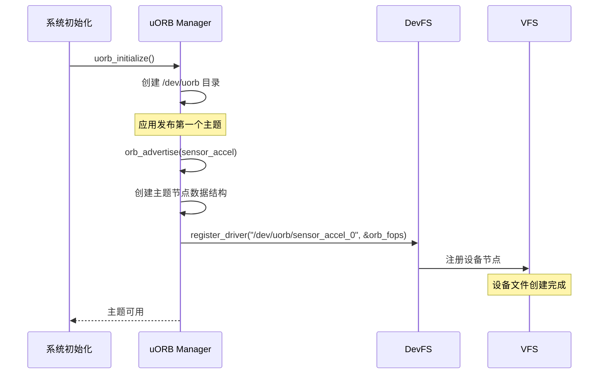

#### uORB 设备文件操作实现

**1. 设备文件目录结构**

```bash
/dev/uorb/                          # uORB 根目录
├── sensor_accel_0                  # 加速度计主题实例 0
├── sensor_accel_1                  # 加速度计主题实例 1（多实例）
├── sensor_gyro_0                   # 陀螺仪主题
├── vehicle_attitude_0              # 姿态主题
├── vehicle_local_position_0        # 本地位置主题
├── actuator_controls_0             # 执行器控制主题
└── ...                             # 200+ 主题

# 实际运行时动态创建
# ls /dev/uorb/ 可以看到当前活跃的主题
```

**2. uORB 文件操作实现**

```c
/* uORB 设备驱动实现 (platforms/nuttx/src/px4/common/uORB/uORBDeviceNode.cpp) */

/* uORB 设备操作函数表 */
const struct file_operations uORB::DeviceNode::fops = {
    .open  = &uORB::DeviceNode::node_open,
    .close = &uORB::DeviceNode::node_close,
    .read  = &uORB::DeviceNode::node_read,
    .write = &uORB::DeviceNode::node_write,
    .seek  = nullptr,
    .ioctl = &uORB::DeviceNode::node_ioctl,
    .poll  = &uORB::DeviceNode::node_poll,
};

/* open() 实现：打开主题进行订阅 */
int uORB::DeviceNode::node_open(FAR struct file *filep)
{
    FAR uORB::DeviceNode *node = (FAR uORB::DeviceNode *)filep->f_inode->i_private;

    /* 创建订阅者对象 */
    SubscriberData *subscriber = new SubscriberData();
    subscriber->generation = node->_generation;  // 记录当前数据版本

    /* 将订阅者添加到主题的订阅者列表 */
    lock();
    node->add_subscriber(subscriber);
    unlock();

    /* 将订阅者对象存储到文件私有数据 */
    filep->f_priv = subscriber;

    return OK;
}

/* read() 实现：读取主题数据 */
ssize_t uORB::DeviceNode::node_read(FAR struct file *filep, FAR char *buffer, size_t buflen)
{
    FAR SubscriberData *subscriber = (FAR SubscriberData *)filep->f_priv;
    FAR uORB::DeviceNode *node = (FAR uORB::DeviceNode *)filep->f_inode->i_private;

    /* 检查缓冲区大小 */
    if (buflen < node->_meta->o_size) {
        return -EINVAL;
    }

    /* 加锁保护数据 */
    lock();

    /* 复制最新数据到用户缓冲区 */
    memcpy(buffer, node->_data, node->_meta->o_size);

    /* 更新订阅者的数据版本 */
    subscriber->generation = node->_generation;

    unlock();

    return node->_meta->o_size;
}

/* write() 实现：发布主题数据 */
ssize_t uORB::DeviceNode::node_write(FAR struct file *filep, FAR const char *buffer, size_t buflen)
{
    FAR uORB::DeviceNode *node = (FAR uORB::DeviceNode *)filep->f_inode->i_private;

    /* 检查缓冲区大小 */
    if (buflen < node->_meta->o_size) {
        return -EINVAL;
    }

    /* 加锁保护数据 */
    lock();

    /* 更新主题数据 */
    memcpy(node->_data, buffer, node->_meta->o_size);
    node->_generation++;  // 增加数据版本号

    /* 通知所有订阅者有新数据 */
    for (subscriber in node->_subscribers) {
        px4_sem_post(&subscriber->update_sem);  // 唤醒等待的订阅者
    }

    unlock();

    return node->_meta->o_size;
}

/* ioctl() 实现：控制命令 */
int uORB::DeviceNode::node_ioctl(FAR struct file *filep, int cmd, unsigned long arg)
{
    FAR uORB::DeviceNode *node = (FAR uORB::DeviceNode *)filep->f_inode->i_private;

    switch (cmd) {
    case ORBIOCUPDATED:
        /* 检查是否有新数据 */
        *(bool *)arg = has_updated(filep);
        break;

    case ORBIOCSETINTERVAL:
        /* 设置最小更新间隔 */
        set_update_interval(filep, arg);
        break;

    case ORBIOCGADVERTISER:
        /* 获取发布者句柄 */
        *(orb_advert_t *)arg = node->get_advertiser_handle();
        break;

    default:
        return -ENOTTY;
    }

    return OK;
}

/* poll() 实现：事件轮询（用于 select/poll 系统调用） */
int uORB::DeviceNode::node_poll(FAR struct file *filep, FAR struct pollfd *fds, bool setup)
{
    FAR SubscriberData *subscriber = (FAR SubscriberData *)filep->f_priv;
    FAR uORB::DeviceNode *node = (FAR uORB::DeviceNode *)filep->f_inode->i_private;

    if (setup) {
        /* 设置轮询：检查是否有新数据 */
        if (has_updated(filep)) {
            fds->revents |= POLLIN;  // 数据可读
        } else {
            /* 注册到轮询等待队列 */
            node->add_poll_waiter(fds);
        }
    } else {
        /* 清除轮询：从等待队列移除 */
        node->remove_poll_waiter(fds);
    }

    return OK;
}
```

**3. 用户空间使用示例**

```c
/* 应用程序通过标准文件 API 使用 uORB */

/* 订阅示例 */
void subscriber_example(void)
{
    /* 1. 打开设备文件（订阅主题） */
    int fd = open("/dev/uorb/sensor_accel_0", O_RDONLY);
    if (fd < 0) {
        PX4_ERR("Failed to open sensor_accel");
        return;
    }

    /* 2. 读取数据 */
    struct sensor_accel_s accel_data;
    while (true) {
        /* 方式 1：阻塞读取 */
        ssize_t ret = read(fd, &accel_data, sizeof(accel_data));
        if (ret == sizeof(accel_data)) {
            printf("Accel: x=%.2f y=%.2f z=%.2f\n",
                   accel_data.x, accel_data.y, accel_data.z);
        }

        /* 方式 2：使用 poll 等待新数据 */
        struct pollfd fds;
        fds.fd = fd;
        fds.events = POLLIN;

        int poll_ret = poll(&fds, 1, 1000);  // 1 秒超时
        if (poll_ret > 0) {
            read(fd, &accel_data, sizeof(accel_data));
            // 处理数据
        }

        usleep(10000);  // 10ms
    }

    /* 3. 关闭设备文件 */
    close(fd);
}

/* 发布示例 */
void publisher_example(void)
{
    /* 1. 打开设备文件（发布主题） */
    int fd = open("/dev/uorb/sensor_accel_0", O_WRONLY);
    if (fd < 0) {
        PX4_ERR("Failed to open sensor_accel");
        return;
    }

    /* 2. 写入数据 */
    struct sensor_accel_s accel_data;
    accel_data.timestamp = hrt_absolute_time();
    accel_data.x = 0.1f;
    accel_data.y = 0.2f;
    accel_data.z = 9.8f;

    ssize_t ret = write(fd, &accel_data, sizeof(accel_data));
    if (ret != sizeof(accel_data)) {
        PX4_ERR("Failed to publish");
    }

    /* 3. 关闭设备文件 */
    close(fd);
}
```

---

### 3.3 为什么设计为设备文件而非共享库？

#### 设备文件 vs 共享库对比

```mermaid
graph TD
    subgraph "方案 A：设备文件（uORB 实际采用）"
        A_App[应用程序]
        A_VFS[VFS 层]
        A_Dev[/dev/uorb/<br/>设备文件]
        A_Kernel[内核空间数据]

        A_App -->|open/read/write| A_VFS
        A_VFS --> A_Dev
        A_Dev --> A_Kernel
    end

    subgraph "方案 B：共享库（传统方案）"
        B_App[应用程序]
        B_Lib[libuorb.so]
        B_Mem[用户空间共享内存]

        B_App -->|orb_read/write| B_Lib
        B_Lib --> B_Mem
    end

    style A_Dev fill:#a8d5ba
    style A_Kernel fill:#d4edda
    style B_Lib fill:#ffe1a8
    style B_Mem fill:#ffcccc
```

#### 详细对比表

| 特性 | 设备文件方案（uORB 采用） | 共享库方案（.h + .so） | 说明 |
|------|--------------------------|----------------------|------|
| **统一接口** | ✅ 标准 POSIX 文件 API | ❌ 自定义 API | 设备文件使用标准 `open/read/write`，学习成本低 |
| **权限控制** | ✅ 文件权限（uid/gid/mode） | ❌ 无法精细控制 | 可以通过文件权限限制访问 |
| **跨进程通信** | ✅ 原生支持 | ⚠️ 需要额外实现（共享内存） | 设备文件天然支持多进程访问 |
| **内核保护** | ✅ 数据在内核空间 | ❌ 数据在用户空间 | 设备文件数据受内核保护，更安全 |
| **select/poll 支持** | ✅ 原生支持 | ❌ 需要自己实现 | 可以用 `poll()` 等待多个主题 |
| **动态发现** | ✅ `ls /dev/uorb/` 可见 | ❌ 需要额外机制 | 运行时可以发现所有活跃主题 |
| **调试工具** | ✅ 可用标准工具（cat/echo） | ❌ 需要专用工具 | `cat /dev/uorb/sensor_accel_0` 可读取数据 |
| **性能开销** | ⚠️ 系统调用开销（~1μs） | ✅ 函数调用开销（~0.1μs） | 设备文件稍慢，但可接受 |
| **内存占用** | ⚠️ 需要 VFS 元数据 | ✅ 仅需共享内存 | 设备文件额外占用 ~1KB/主题 |
| **跨平台性** | ✅ POSIX 标准 | ✅ 可移植 | 都可跨平台 |
| **实时性** | ✅ 内核态快速路径 | ✅ 用户态直接访问 | 都能满足实时性要求 |

#### 为什么选择设备文件方案？

**1. Unix 哲学：一切皆文件（Everything is a File）**

```c
/* Unix/Linux 设计哲学示例 */

// 串口设备
int uart = open("/dev/ttyS0", O_RDWR);
write(uart, "Hello", 5);

// 网络设备
int sock = open("/dev/tcp", O_RDWR);
write(sock, data, len);

// I2C 总线
int i2c = open("/dev/i2c-0", O_RDWR);
ioctl(i2c, I2C_SLAVE, 0x68);

// uORB 消息
int orb = open("/dev/uorb/sensor_accel_0", O_RDONLY);
read(orb, &accel, sizeof(accel));

/* 统一的编程模型：
 * - 学习成本低
 * - 工具通用（cat/echo/dd）
 * - Shell 脚本友好
 */
```

**2. 像操作串口一样操作消息总线**

```c
/* 设备文件方案的直观性 */

/* 场景 1：订阅 IMU 数据，类似读取串口 */
int imu_fd = open("/dev/uorb/sensor_accel_0", O_RDONLY);
while (1) {
    struct sensor_accel_s accel;
    read(imu_fd, &accel, sizeof(accel));  // 像读串口一样简单
    process_accel_data(&accel);
}
close(imu_fd);

/* 场景 2：发布姿态数据，类似写串口 */
int att_fd = open("/dev/uorb/vehicle_attitude_0", O_WRONLY);
struct vehicle_attitude_s attitude;
attitude.roll = 0.1f;
attitude.pitch = 0.2f;
write(att_fd, &attitude, sizeof(attitude));  // 像写串口一样简单
close(att_fd);

/* 场景 3：等待多个主题（像监听多个串口） */
struct pollfd fds[3];
fds[0].fd = open("/dev/uorb/sensor_accel_0", O_RDONLY);
fds[1].fd = open("/dev/uorb/sensor_gyro_0", O_RDONLY);
fds[2].fd = open("/dev/uorb/sensor_mag_0", O_RDONLY);
fds[0].events = fds[1].events = fds[2].events = POLLIN;

poll(fds, 3, -1);  // 等待任意一个有新数据

if (fds[0].revents & POLLIN) {
    read(fds[0].fd, &accel, sizeof(accel));
}
// ...
```

**3. 调用代码的区别**

```c
/* ===== 设备文件方案（uORB 实际实现） ===== */

/* 订阅 */
int fd = open("/dev/uorb/sensor_accel_0", O_RDONLY);
struct sensor_accel_s accel;
read(fd, &accel, sizeof(accel));  // 阻塞读取
close(fd);

/* 发布 */
int fd = open("/dev/uorb/sensor_accel_0", O_WRONLY);
write(fd, &accel, sizeof(accel));
close(fd);

/* 等待新数据（非阻塞） */
struct pollfd fds = {.fd = fd, .events = POLLIN};
poll(&fds, 1, 1000);  // 1 秒超时
if (fds.revents & POLLIN) {
    read(fd, &accel, sizeof(accel));
}

/* ===== 共享库方案（假设的实现） ===== */

/* 订阅 */
orb_handle_t handle = orb_subscribe(ORB_ID(sensor_accel));
struct sensor_accel_s accel;
orb_copy(handle, &accel);  // 非阻塞复制
orb_unsubscribe(handle);

/* 发布 */
orb_handle_t handle = orb_advertise(ORB_ID(sensor_accel));
orb_publish(handle, &accel);
orb_unadvertise(handle);

/* 等待新数据（需要自己实现） */
// 方案 1：轮询（低效）
while (!orb_check_updated(handle)) {
    usleep(1000);
}

// 方案 2：信号量（需要额外机制）
sem_t update_sem;
orb_register_callback(handle, &update_sem);
sem_wait(&update_sem);
orb_copy(handle, &accel);
```

**对比总结：**

| 场景 | 设备文件 | 共享库 | 优势方 |
|------|---------|-------|--------|
| **简单读写** | `read(fd, buf, len)` | `orb_copy(handle, buf)` | 设备文件（标准 API） |
| **阻塞等待** | `read(fd, ...)` 原生支持 | 需要额外实现 | 设备文件 |
| **多路复用** | `poll(fds, n, timeout)` | 需要自己实现 | 设备文件 |
| **性能** | 系统调用 ~1μs | 函数调用 ~0.1μs | 共享库（但差距可忽略） |
| **学习成本** | 标准 POSIX API | 自定义 API | 设备文件 |

---

### 3.4 设备文件方案的具体好处

#### 好处 1：统一的编程模型

```c
/* 所有设备（硬件和软件）使用相同的 API */

// 读取 UART
int uart = open("/dev/ttyS0", O_RDONLY);
read(uart, buffer, sizeof(buffer));

// 读取 SPI
int spi = open("/dev/spi1", O_RDWR);
ioctl(spi, SPI_IOC_MESSAGE, &transfer);

// 读取 uORB
int orb = open("/dev/uorb/sensor_accel_0", O_RDONLY);
read(orb, &accel, sizeof(accel));

/* 优点：
 * - 一次学习，到处使用
 * - 代码风格统一
 * - 容易维护
 */
```

#### 好处 2：强大的权限控制

```c
/* 设备文件支持 Unix 文件权限 */

// 只允许 root 和 sensors 组访问 IMU
// chmod 660 /dev/uorb/sensor_accel_0
// chown root:sensors /dev/uorb/sensor_accel_0

// 用户代码
int fd = open("/dev/uorb/sensor_accel_0", O_RDONLY);
if (fd < 0) {
    // 权限不足，打开失败
    perror("Permission denied");
}

/* 对比共享库：难以实现精细的权限控制 */
```

#### 好处 3：原生跨进程通信

```c
/* 场景：进程 A 发布，进程 B 订阅 */

// 进程 A：发布者
int fd_pub = open("/dev/uorb/sensor_accel_0", O_WRONLY);
write(fd_pub, &accel_data, sizeof(accel_data));

// 进程 B：订阅者（完全独立的进程）
int fd_sub = open("/dev/uorb/sensor_accel_0", O_RDONLY);
read(fd_sub, &accel_data, sizeof(accel_data));

/* 优点：
 * - 无需共享内存管理
 * - 无需进程间同步（内核负责）
 * - 安全隔离（进程崩溃不影响数据）
 */

/* 共享库方案需要：
 * 1. 创建共享内存段（shm_open）
 * 2. 映射到进程地址空间（mmap）
 * 3. 进程间同步（sem_open）
 * 4. 清理机制（shm_unlink）
 * 复杂度高！
 */
```

#### 好处 4：select/poll 多路复用

```c
/* 同时监听多个主题，类似监听多个串口 */

void multi_topic_subscriber(void)
{
    /* 打开多个主题 */
    int fd_accel = open("/dev/uorb/sensor_accel_0", O_RDONLY);
    int fd_gyro  = open("/dev/uorb/sensor_gyro_0", O_RDONLY);
    int fd_mag   = open("/dev/uorb/sensor_mag_0", O_RDONLY);
    int fd_gps   = open("/dev/uorb/vehicle_gps_position_0", O_RDONLY);

    /* 设置 poll 结构体 */
    struct pollfd fds[4];
    fds[0].fd = fd_accel;  fds[0].events = POLLIN;
    fds[1].fd = fd_gyro;   fds[1].events = POLLIN;
    fds[2].fd = fd_mag;    fds[2].events = POLLIN;
    fds[3].fd = fd_gps;    fds[3].events = POLLIN;

    while (running) {
        /* 等待任意主题有新数据（1 秒超时） */
        int ret = poll(fds, 4, 1000);

        if (ret > 0) {
            /* 检查哪些主题有新数据 */
            if (fds[0].revents & POLLIN) {
                read(fd_accel, &accel_data, sizeof(accel_data));
                process_accel(accel_data);
            }

            if (fds[1].revents & POLLIN) {
                read(fd_gyro, &gyro_data, sizeof(gyro_data));
                process_gyro(gyro_data);
            }

            if (fds[2].revents & POLLIN) {
                read(fd_mag, &mag_data, sizeof(mag_data));
                process_mag(mag_data);
            }

            if (fds[3].revents & POLLIN) {
                read(fd_gps, &gps_data, sizeof(gps_data));
                process_gps(gps_data);
            }
        }
    }

    /* 清理 */
    close(fd_accel);
    close(fd_gyro);
    close(fd_mag);
    close(fd_gps);
}

/* 优点：
 * - 单线程处理多个主题
 * - 事件驱动，CPU 利用率高
 * - 代码简洁
 */

/* 共享库方案需要：
 * - 为每个主题创建回调函数
 * - 或者轮询每个主题（低效）
 * - 或者为每个主题创建线程（资源浪费）
 */
```

#### 好处 5：动态发现和调试

```bash
# 运行时查看所有活跃主题
$ ls /dev/uorb/
sensor_accel_0
sensor_gyro_0
sensor_mag_0
vehicle_attitude_0
vehicle_local_position_0
...

# 查看主题数据（调试利器）
$ cat /dev/uorb/sensor_accel_0 | hexdump -C
00000000  00 00 00 00 00 00 00 00  3d 0a d7 3f 9a 99 19 3e  |........=..?...>|
00000010  cd cc cc 3d 00 00 00 00  00 00 00 00 00 00 00 00  |...=............|

# 发布测试数据
$ echo -n "test_data" > /dev/uorb/test_topic_0

# 统计主题更新频率
$ while true; do cat /dev/uorb/sensor_accel_0 > /dev/null; done &
$ top  # 观察 CPU 使用率，推算频率

# 使用 Shell 脚本监控
#!/bin/bash
while true; do
    data=$(cat /dev/uorb/sensor_accel_0 | hexdump -C | head -1)
    echo "$(date): $data"
    sleep 0.1
done
```

**对比共享库方案：**
- 需要专用调试工具（如 `orb_dump`）
- 无法使用标准 Unix 工具
- 调试难度更高

#### 好处 6：Shell 脚本集成

```bash
#!/bin/bash
# 示例：飞行日志记录脚本

# 打开日志文件
exec 3>/fs/log/flight_$(date +%Y%m%d_%H%M%S).log

while true; do
    # 读取姿态数据
    attitude=$(cat /dev/uorb/vehicle_attitude_0 | base64)

    # 读取位置数据
    position=$(cat /dev/uorb/vehicle_local_position_0 | base64)

    # 写入日志
    echo "$(date +%s),$attitude,$position" >&3

    sleep 0.1
done

exec 3>&-

# 共享库方案无法这样简单地用 Shell 脚本操作
```

---

### 3.5 设备文件方案的权衡与限制

#### 性能开销分析

```c
/* 性能对比：设备文件 vs 共享库 */

/* 测试：1000 次发布操作 */

// 设备文件方案
uint64_t start = hrt_absolute_time();
for (int i = 0; i < 1000; i++) {
    write(fd, &data, sizeof(data));  // 系统调用开销 ~1μs
}
uint64_t elapsed = hrt_absolute_time() - start;
// 结果：~1100 μs (1.1μs/次)

// 共享库方案（假设）
uint64_t start = hrt_absolute_time();
for (int i = 0; i < 1000; i++) {
    orb_publish_direct(&data);  // 直接内存操作 ~0.1μs
}
uint64_t elapsed = hrt_absolute_time() - start;
// 结果：~120 μs (0.12μs/次)

/* 性能差距：设备文件慢 ~10 倍 */
```

**但是：这个开销在实际应用中可以忽略**

```c
/* 实际飞控应用场景 */

// IMU 发布：1000 Hz，每次 1μs
// 总开销：1ms / 1000ms = 0.1% CPU

// 姿态发布：250 Hz，每次 1μs
// 总开销：0.25ms / 1000ms = 0.025% CPU

// GPS 发布：10 Hz，每次 1μs
// 总开销：0.01ms / 1000ms = 0.001% CPU

/* 结论：性能开销可以忽略 */
```

#### 内存开销分析

```c
/* 设备文件额外内存占用 */

// 每个主题的设备文件元数据
struct inode {
    char name[32];              // 设备名：32 字节
    struct file_operations *ops; // 操作函数表指针：4 字节
    void *private_data;         // 私有数据指针：4 字节
    mode_t mode;                // 权限：2 字节
    // ... 其他字段
    // 总计：~128 字节
};

// 200 个主题的总开销
200 * 128 = 25.6 KB

/* 对比飞控总内存（512 KB RAM）：
 * 25.6 / 512 = 5% 内存
 * 可接受的开销
 */
```

#### 限制与注意事项

| 限制 | 描述 | 解决方案 |
|------|------|----------|
| **阻塞操作** | `read()` 会阻塞调用者 | 使用 `poll()` 或非阻塞 I/O |
| **性能开销** | 系统调用比函数调用慢 10 倍 | 批量操作，减少调用次数 |
| **内存占用** | 设备文件元数据占用内存 | 按需创建主题，避免浪费 |
| **文件描述符限制** | NuttX 限制每进程 FD 数量 | 及时 `close()`，复用 FD |

---

### 3.6 为什么不用其他方案？

#### 方案对比总结

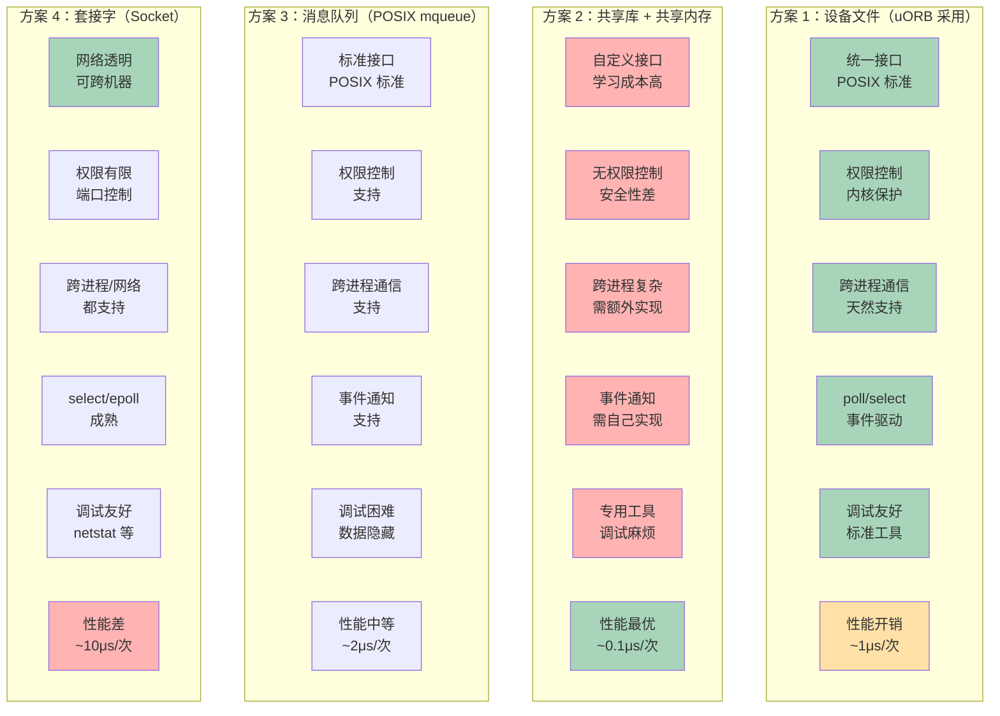

**最终选择设备文件方案的原因：**

1. **平衡性最好**：功能完善、性能可接受、实现简单
2. **符合 Unix 哲学**：一切皆文件，学习成本低
3. **生态成熟**：大量工具和最佳实践可复用
4. **未来扩展**：容易添加新功能（权限、审计、网络透明等）

---

### 3.7 实际案例：uORB 设备文件的使用

#### 案例 1：传感器驱动发布数据

```c
/* IMU 驱动：MPU6000 */
// src/drivers/imu/invensense/mpu6000/MPU6000.cpp

class MPU6000 : public device::CDev  // 继承字符设备基类
{
private:
    orb_advert_t _accel_pub{nullptr};  // 发布句柄
    orb_advert_t _gyro_pub{nullptr};

public:
    void Run() override
    {
        /* 1. 读取 SPI 数据 */
        read_sensor_data();

        /* 2. 发布加速度数据 */
        sensor_accel_s accel_report{};
        accel_report.timestamp = hrt_absolute_time();
        accel_report.x = _accel_raw[0] * _accel_scale;
        accel_report.y = _accel_raw[1] * _accel_scale;
        accel_report.z = _accel_raw[2] * _accel_scale;

        if (_accel_pub != nullptr) {
            /* 已经创建设备文件，直接发布 */
            orb_publish(ORB_ID(sensor_accel), _accel_pub, &accel_report);
        } else {
            /* 首次发布，创建设备文件 */
            _accel_pub = orb_advertise(ORB_ID(sensor_accel), &accel_report);
            // 内部会调用 register_driver("/dev/uorb/sensor_accel_0", ...)
        }

        /* 3. 发布陀螺仪数据（同理） */
        // ...
    }
};
```

#### 案例 2：EKF2 订阅和发布

```c
/* EKF2 状态估计器 */
// src/modules/ekf2/EKF2.cpp

class EKF2 : public ModuleBase<EKF2>, public px4::ScheduledWorkItem
{
private:
    /* 订阅句柄（实际是文件描述符） */
    uORB::Subscription _sensor_accel_sub{ORB_ID(sensor_accel)};
    uORB::Subscription _sensor_gyro_sub{ORB_ID(sensor_gyro)};
    uORB::Subscription _vehicle_gps_position_sub{ORB_ID(vehicle_gps_position)};

    /* 发布句柄 */
    uORB::Publication<vehicle_attitude_s> _vehicle_attitude_pub{ORB_ID(vehicle_attitude)};
    uORB::Publication<vehicle_local_position_s> _local_position_pub{ORB_ID(vehicle_local_position)};

public:
    void Run() override
    {
        /* 1. 检查新数据 */
        sensor_accel_s accel;
        if (_sensor_accel_sub.update(&accel)) {
            // 内部调用 read(fd, &accel, sizeof(accel))
            _ekf.setAccelData(accel);
        }

        sensor_gyro_s gyro;
        if (_sensor_gyro_sub.update(&gyro)) {
            _ekf.setGyroData(gyro);
        }

        /* 2. 运行 EKF */
        _ekf.update();

        /* 3. 发布姿态 */
        vehicle_attitude_s attitude{};
        _ekf.getAttitude(attitude);
        attitude.timestamp = hrt_absolute_time();
        _vehicle_attitude_pub.publish(attitude);
        // 内部调用 write(fd, &attitude, sizeof(attitude))

        /* 4. 发布位置 */
        vehicle_local_position_s position{};
        _ekf.getLocalPosition(position);
        _local_position_pub.publish(position);
    }
};
```

#### 案例 3：命令行工具使用 uORB

```cpp
/* listener 命令：实时监听主题 */
// src/systemcmds/topic_listener/listener.cpp

int listener_main(int argc, char *argv[])
{
    if (argc < 2) {
        printf("Usage: listener <topic_name>\n");
        return 1;
    }

    const char *topic_name = argv[1];

    /* 构造设备文件路径 */
    char path[64];
    snprintf(path, sizeof(path), "/dev/uorb/%s_0", topic_name);

    /* 打开设备文件 */
    int fd = open(path, O_RDONLY);
    if (fd < 0) {
        printf("Failed to open %s\n", path);
        return 1;
    }

    /* 读取主题元数据（获取数据大小） */
    size_t topic_size = 0;
    ioctl(fd, ORBIOCGSIZE, &topic_size);

    /* 分配缓冲区 */
    uint8_t *buffer = (uint8_t *)malloc(topic_size);

    /* 循环读取 */
    printf("Listening to %s (press Ctrl+C to stop)...\n", topic_name);
    while (true) {
        /* 使用 poll 等待新数据 */
        struct pollfd fds = {.fd = fd, .events = POLLIN};
        int ret = poll(&fds, 1, 1000);

        if (ret > 0 && (fds.revents & POLLIN)) {
            /* 读取数据 */
            read(fd, buffer, topic_size);

            /* 打印数据（十六进制） */
            printf("[%llu] ", hrt_absolute_time());
            for (size_t i = 0; i < topic_size; i++) {
                printf("%02x ", buffer[i]);
            }
            printf("\n");
        }
    }

    /* 清理 */
    free(buffer);
    close(fd);

    return 0;
}

/* 使用示例：
 * $ listener sensor_accel
 * Listening to sensor_accel (press Ctrl+C to stop)...
 * [123456789] 01 02 03 04 05 06 07 08 ...
 * [123456790] 01 02 03 04 05 06 07 08 ...
 */
```

---

## 总结：uORB 设备文件设计的核心价值

### 设计原则

1. **统一抽象**：将消息总线抽象为设备文件，与硬件设备一视同仁
2. **标准接口**：使用 POSIX 文件 API，降低学习成本
3. **内核保护**：数据存储在内核空间，提高安全性和稳定性
4. **生态复用**：利用成熟的 Unix 工具和编程模式

### 关键优势

| 优势 | 具体体现 |
|------|---------|
| **简单易用** | `open/read/write/close` 标准 API |
| **功能强大** | `poll/select` 多路复用，`ioctl` 扩展控制 |
| **调试友好** | `cat/ls/echo` 等标准工具直接使用 |
| **安全可靠** | 文件权限控制，内核态保护 |
| **跨进程通信** | 天然支持，无需额外机制 |
| **性能可接受** | ~1μs 开销，实际应用可忽略 |

### 与共享库方案对比结论

虽然共享库方案性能更优（~0.1μs vs ~1μs），但**设备文件方案的综合优势远超性能差距**：

- ✅ 学习成本低（标准 POSIX）
- ✅ 调试工具丰富
- ✅ 跨进程通信简单
- ✅ 权限控制完善
- ✅ 事件驱动成熟（poll/select）
- ⚠️ 性能略低（但可忽略）

**最终选择：设备文件方案是 uORB 的最佳设计选择。**

---

**补充章节完成**
**最后更新：** 2024年11月
**作者：** PX4 开发社区 + Claude Code
**许可证：** BSD 3-Clause
