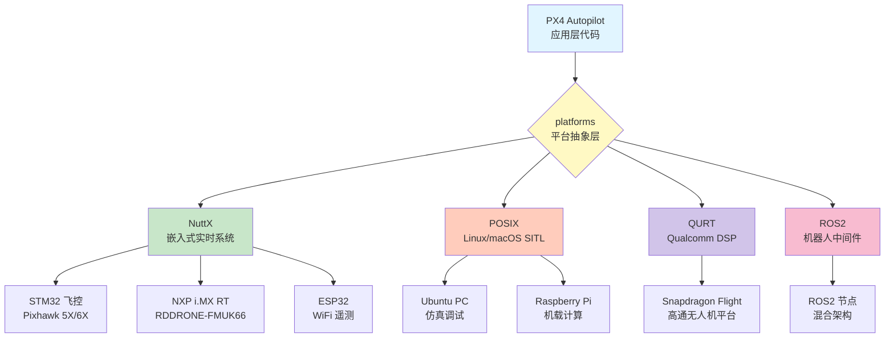
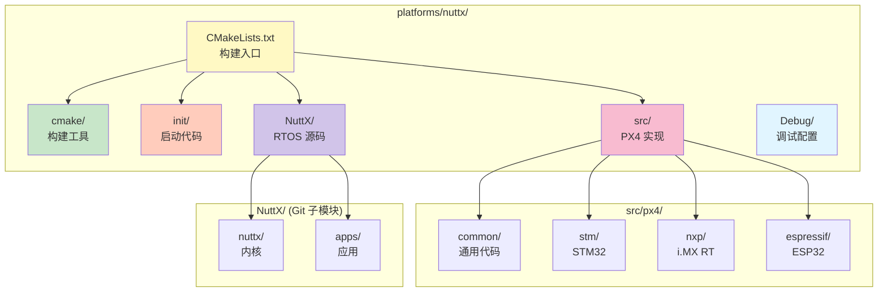
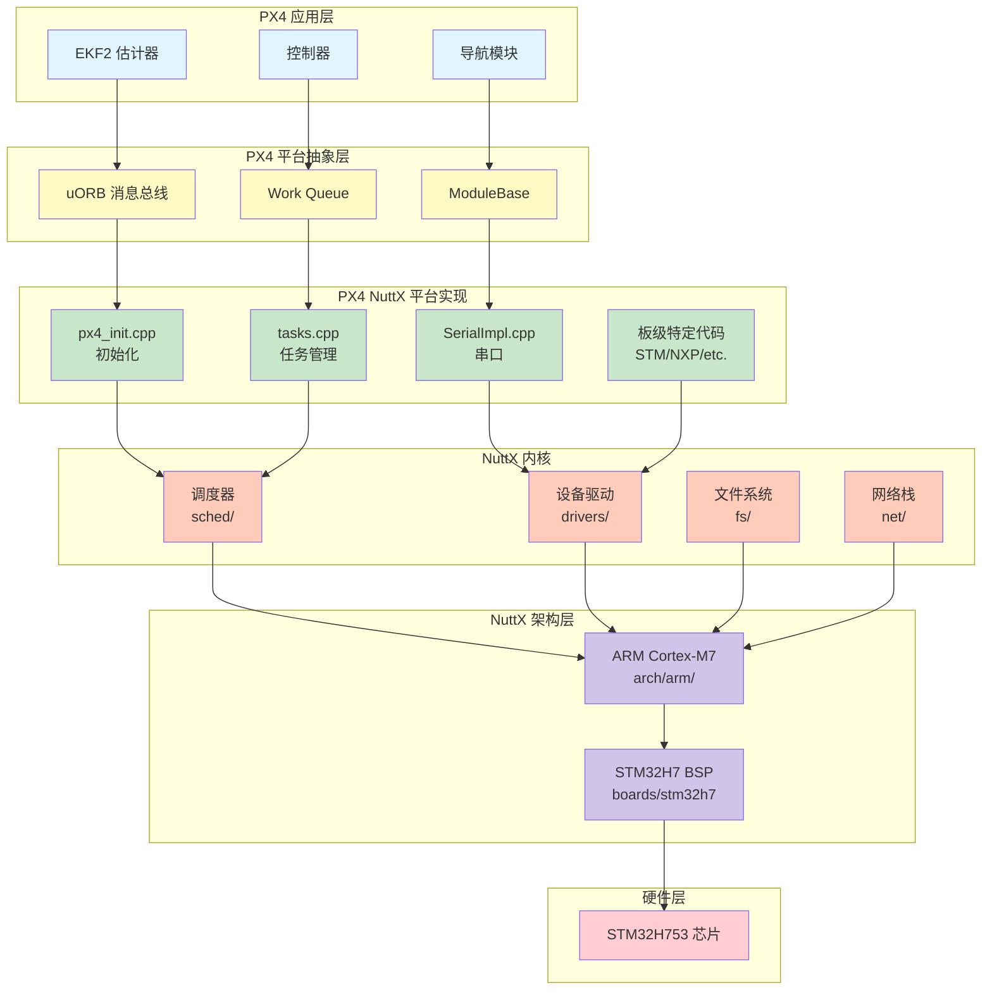
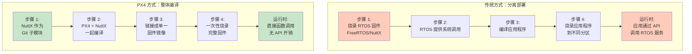
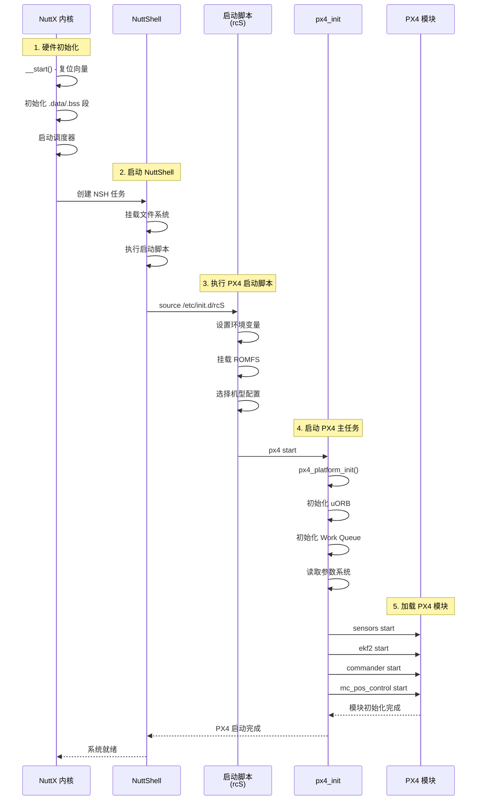
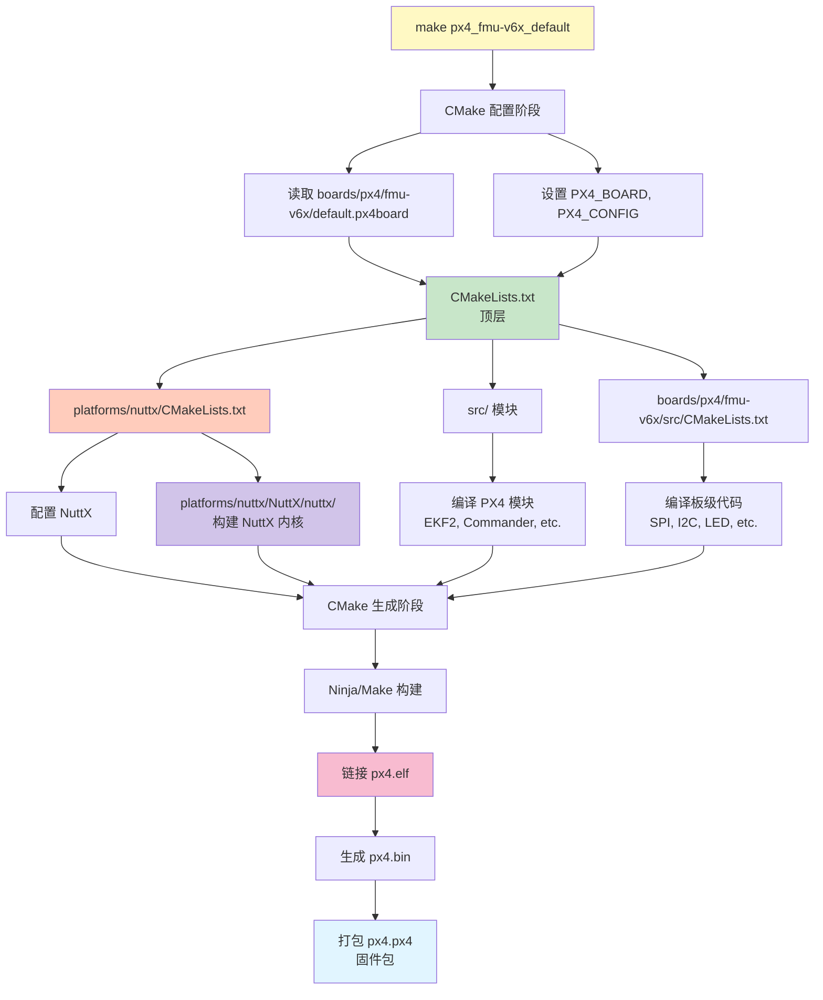
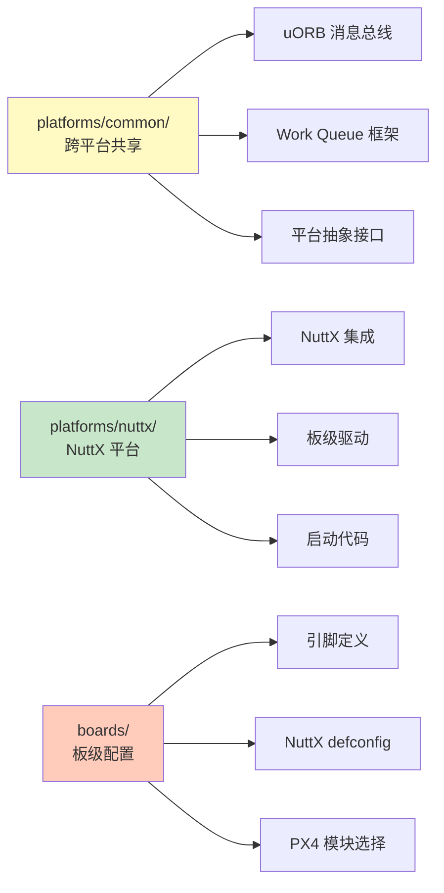

# PX4 平台架构与 NuttX 集成完全指南

> 深入剖析 PX4 Autopilot 的平台抽象层(platforms 目录)架构,以及如何集成 NuttX RTOS,从源码到固件的完整构建流程,并指导如何为自己的 STM32 硬件创建自定义平台。

---

## 目录

- [前言：为什么需要平台抽象](#前言为什么需要平台抽象)
- [第一部分：platforms 目录架构解析](#第一部分platforms-目录架构解析)
- [第二部分：NuttX RTOS 集成机制](#第二部分nuttx-rtos-集成机制)
- [第三部分：板级配置系统 (boards)](#第三部分板级配置系统-boards)
- [第四部分：构建系统详解](#第四部分构建系统详解)
- [第五部分：创建自定义 STM32 平台](#第五部分创建自定义-stm32-平台)
- [第六部分：固件编译与烧录](#第六部分固件编译与烧录)
- [总结：平台集成最佳实践](#总结平台集成最佳实践)

---

## 前言：为什么需要平台抽象

### PX4 的多平台支持

PX4 Autopilot 不仅运行在无人机飞控硬件上,还支持多种环境:



**关键目标:**
- ✅ **代码复用**: 核心算法(EKF2、控制器)跨平台共享
- ✅ **平台隔离**: 硬件差异封装在 platforms 层
- ✅ **灵活扩展**: 新增平台不影响应用层

### platforms 目录的作用

PX4 通过 `platforms/` 目录实现平台抽象层 (Platform Abstraction Layer, PAL):

| 目录 | 功能 | 使用场景 |
|------|------|----------|
| **common** | 跨平台共享代码 | uORB、Work Queue、通用头文件 |
| **nuttx** | NuttX RTOS 适配 | 所有实体飞控硬件 (STM32, i.MX RT, etc.) |
| **posix** | POSIX 适配 | SITL 仿真 (Linux/macOS/Windows WSL) |
| **qurt** | Qualcomm QURT 适配 | Snapdragon Flight 平台 |
| **ros2** | ROS2 集成 | 混合 PX4 + ROS2 架构 |

---

## 第一部分：platforms 目录架构解析

### 1.1 完整目录结构

```
PX4-Autopilot/
├── platforms/
│   ├── CMakeLists.txt                    # 平台层总入口
│   ├── Kconfig                           # 平台配置选项
│   │
│   ├── common/                           # 跨平台共享代码
│   │   ├── CMakeLists.txt
│   │   ├── include/                      # 公共头文件
│   │   │   └── px4_platform_common/
│   │   │       ├── atomic.h              # 原子操作抽象
│   │   │       ├── cli.h                 # 命令行接口
│   │   │       ├── getopt.h              # 参数解析
│   │   │       ├── log.h                 # 日志系统
│   │   │       ├── module.h              # 模块框架
│   │   │       ├── sem.h                 # 信号量抽象
│   │   │       ├── tasks.h               # 任务管理
│   │   │       ├── time.h                # 时间抽象
│   │   │       └── px4_work_queue/       # Work Queue 框架
│   │   │           ├── ScheduledWorkItem.hpp
│   │   │           ├── WorkItem.hpp
│   │   │           └── WorkQueue.hpp
│   │   ├── px4_work_queue/               # Work Queue 实现
│   │   │   ├── WorkItemExample.cpp
│   │   │   ├── WorkItemSingleList.cpp
│   │   │   ├── WorkQueue.cpp
│   │   │   └── WorkQueueManager.cpp
│   │   ├── uORB/                         # uORB 消息总线
│   │   │   ├── uORB.cpp                  # 核心实现
│   │   │   ├── uORBManager.cpp           # 管理器
│   │   │   ├── Publication.cpp
│   │   │   ├── Subscription.cpp
│   │   │   └── test/                     # 单元测试
│   │   └── work_queue/                   # 底层工作队列
│   │
│   ├── nuttx/                            # NuttX 平台
│   │   ├── CMakeLists.txt                # NuttX 构建配置
│   │   ├── cmake/                        # CMake 工具
│   │   │   └── Platform/
│   │   │       ├── NuttX.cmake           # NuttX 平台检测
│   │   │       └── toolchain_gnu-arm-none-eabi.cmake
│   │   ├── init/                         # 启动代码 (按芯片系列)
│   │   │   ├── stm32/                    # STM32F4 启动代码
│   │   │   ├── stm32f7/                  # STM32F7 启动代码
│   │   │   ├── stm32h7/                  # STM32H7 启动代码
│   │   │   ├── imxrt/                    # i.MX RT 启动代码
│   │   │   ├── kinetis/                  # Kinetis 启动代码
│   │   │   └── s32k1xx/                  # S32K1XX 启动代码
│   │   ├── NuttX/                        # NuttX 源码 (子模块)
│   │   │   ├── nuttx/                    # NuttX 内核
│   │   │   │   ├── arch/                 # 架构支持 (ARM, RISC-V, etc.)
│   │   │   │   ├── boards/               # 板级支持包 (BSP)
│   │   │   │   ├── drivers/              # 设备驱动
│   │   │   │   ├── fs/                   # 文件系统
│   │   │   │   ├── sched/                # 调度器
│   │   │   │   ├── mm/                   # 内存管理
│   │   │   │   └── net/                  # 网络栈
│   │   │   ├── apps/                     # NuttX 应用
│   │   │   │   ├── nshlib/               # NuttShell
│   │   │   │   ├── system/               # 系统工具
│   │   │   │   └── examples/             # 示例程序
│   │   │   └── tools/                    # 构建工具
│   │   ├── src/                          # PX4 NuttX 平台实现
│   │   │   ├── px4/                      # PX4 平台层代码
│   │   │   │   ├── common/               # 所有 NuttX 平台共享
│   │   │   │   │   ├── px4_init.cpp      # PX4 初始化
│   │   │   │   │   ├── board_crashdump.c # 崩溃转储
│   │   │   │   │   ├── cpuload.cpp       # CPU 负载监控
│   │   │   │   │   ├── SerialImpl.cpp    # 串口实现
│   │   │   │   │   ├── tasks.cpp         # 任务管理
│   │   │   │   │   └── px4_nuttx_impl.cpp # NuttX 接口实现
│   │   │   │   ├── stm/                  # STM32 特定代码
│   │   │   │   │   ├── adc/              # ADC 驱动
│   │   │   │   │   ├── board_hw_rev_ver.c
│   │   │   │   │   ├── io_pins/          # IO 引脚定义
│   │   │   │   │   ├── led_pwm/          # PWM LED
│   │   │   │   │   ├── tone_alarm/       # 蜂鸣器
│   │   │   │   │   └── timer/            # 硬件定时器
│   │   │   │   ├── nxp/                  # NXP 特定代码
│   │   │   │   ├── rpi/                  # 树莓派特定代码
│   │   │   │   └── espressif/            # ESP32 特定代码
│   │   │   ├── bootloader/               # Bootloader 实现
│   │   │   │   ├── common/               # 通用 bootloader
│   │   │   │   ├── stm/                  # STM32 bootloader
│   │   │   │   └── nxp/                  # NXP bootloader
│   │   │   └── canbootloader/            # CAN bootloader
│   │   └── Debug/                        # 调试配置
│   │       ├── gdbinit.in                # GDB 初始化脚本
│   │       └── launch.json.in            # VSCode 调试配置
│   │
│   ├── posix/                            # POSIX 平台 (SITL)
│   │   ├── CMakeLists.txt
│   │   ├── cmake/
│   │   ├── include/
│   │   └── src/
│   │       ├── px4/                      # POSIX PX4 实现
│   │       │   ├── common/               # POSIX 通用代码
│   │       │   ├── generic/              # 通用 POSIX
│   │       │   ├── rpi/                  # 树莓派
│   │       │   └── bebop/                # Parrot Bebop
│   │       └── px4_daemon/               # PX4 守护进程
│   │
│   ├── qurt/                             # QURT 平台 (Snapdragon)
│   │   ├── CMakeLists.txt
│   │   ├── cmake/
│   │   ├── include/
│   │   └── src/
│   │
│   └── ros2/                             # ROS2 集成
│       ├── CMakeLists.txt
│       ├── cmake/
│       ├── include/
│       └── src/
│
└── boards/                               # 板级配置 (与 platforms 配合)
    ├── px4/                              # PX4 官方板
    │   ├── fmu-v5/                       # Pixhawk 4 (STM32F7)
    │   ├── fmu-v6x/                      # Pixhawk 6X (STM32H7)
    │   ├── fmu-v6c/                      # Pixhawk 6C (STM32H7)
    │   └── sitl/                         # SITL 仿真
    ├── holybro/                          # Holybro 板
    ├── cubepilot/                        # CubePilot 板
    └── nxp/                              # NXP 板
```

### 1.2 common 目录：跨平台共享层

`platforms/common/` 包含所有平台共享的核心组件:

#### uORB 消息总线

```cpp
/* platforms/common/uORB/uORB.cpp - 核心实现 */

// uORB 是 PX4 的核心消息总线,所有平台共享
class uORB::Manager
{
public:
    // 订阅主题
    static int subscribe(const struct orb_metadata *meta, unsigned instance = 0);

    // 发布主题
    static orb_advert_t advertise(const struct orb_metadata *meta, const void *data);

    // 更新主题
    static int publish(const struct orb_metadata *meta, orb_advert_t handle, const void *data);

private:
    // 平台特定实现在 DeviceNode 中 (NuttX 使用 DevFS)
    DeviceNode *_device_nodes[ORB_MULTI_MAX_INSTANCES];
};
```

**关键特性:**
- **平台无关**: uORB 核心逻辑对所有平台一致
- **设备抽象**: NuttX 使用 DevFS,POSIX 使用文件,QURT 使用共享内存
- **零拷贝**: 发布者和订阅者共享内存

#### Work Queue 框架

```cpp
/* platforms/common/px4_work_queue/WorkQueue.cpp */

class WorkQueue
{
public:
    WorkQueue(const wq_config_t &config);

    // 添加工作项
    void Add(WorkItem *item);

    // 移除工作项
    void Remove(WorkItem *item);

    // 运行工作队列 (平台特定线程)
    void Run();

private:
    px4_sem_t _qlock;                     // 平台抽象信号量
    px4_sem_t _process_lock;
    WorkItemSingleList _work_items;       // 工作项链表
};
```

**平台抽象示例:**

```cpp
/* platforms/common/include/px4_platform_common/sem.h */

#if defined(__PX4_NUTTX)
    // NuttX 平台
    typedef sem_t px4_sem_t;
    #define px4_sem_init(sem, pshared, value)  sem_init(sem, pshared, value)
    #define px4_sem_wait(sem)  sem_wait(sem)
    #define px4_sem_post(sem)  sem_post(sem)

#elif defined(__PX4_POSIX)
    // POSIX 平台
    typedef sem_t px4_sem_t;
    #define px4_sem_init(sem, pshared, value)  sem_init(sem, pshared, value)
    #define px4_sem_wait(sem)  sem_wait(sem)
    #define px4_sem_post(sem)  sem_post(sem)

#elif defined(__PX4_QURT)
    // QURT 平台
    typedef qurt_sem_t px4_sem_t;
    #define px4_sem_init(sem, pshared, value)  qurt_sem_init(sem, value)
    #define px4_sem_wait(sem)  qurt_sem_down(sem)
    #define px4_sem_post(sem)  qurt_sem_up(sem)
#endif
```

### 1.3 NuttX 平台目录详解

`platforms/nuttx/` 是本文重点,包含 NuttX RTOS 的完整集成:

#### 目录职责划分



#### 平台特定代码组织

**common 目录** (`platforms/nuttx/src/px4/common/`):

所有 NuttX 平台共享的代码,不依赖具体芯片:

| 文件 | 功能 |
|------|------|
| `px4_init.cpp` | PX4 主初始化入口 |
| `tasks.cpp` | 任务管理 (创建、删除、列表) |
| `board_crashdump.c` | 崩溃日志记录 |
| `cpuload.cpp` | CPU 负载监控 |
| `SerialImpl.cpp` | 串口驱动抽象 |
| `px4_nuttx_impl.cpp` | NuttX 特定实现 (时间、随机数) |
| `console_buffer.cpp` | 控制台缓冲 |
| `print_load.cpp` | 负载打印 |

**STM32 特定代码** (`platforms/nuttx/src/px4/stm/`):

STM32 系列芯片特定功能:

| 目录/文件 | 功能 |
|----------|------|
| `adc/` | ADC 采样 (电池电压、电流检测) |
| `io_pins/` | GPIO 引脚定义和操作 |
| `led_pwm/` | PWM 驱动的 LED (状态指示) |
| `tone_alarm/` | PWM 蜂鸣器 (告警音) |
| `timer/` | 硬件定时器 (PWM 输出、输入捕获) |
| `board_hw_rev_ver.c` | 硬件版本检测 |

**NXP 特定代码** (`platforms/nuttx/src/px4/nxp/`):

i.MX RT 系列处理器特定功能 (类似 STM32 结构)。

---

## 第二部分：NuttX RTOS 集成机制

### 2.1 NuttX 作为 Git 子模块

PX4 通过 Git 子模块集成 NuttX:

```bash
# 查看子模块配置
$ cat .gitmodules

[submodule "platforms/nuttx/NuttX/nuttx"]
    path = platforms/nuttx/NuttX/nuttx
    url = https://github.com/PX4/NuttX.git
    branch = px4_firmware_nuttx-12.7+

[submodule "platforms/nuttx/NuttX/apps"]
    path = platforms/nuttx/NuttX/apps
    url = https://github.com/PX4/NuttX-apps.git
    branch = px4_firmware_nuttx-12.7+
```

**PX4 为什么 Fork NuttX?**

PX4 维护自己的 NuttX 分支,主要原因:

1. **定制修改**: 添加 PX4 特定驱动和优化
2. **版本控制**: 确保构建可重复性
3. **快速迭代**: 不依赖上游合并周期
4. **硬件支持**: 添加新飞控板的 BSP

**主要修改:**
- 新增 PX4 飞控板 BSP (在 `boards/` 下)
- 优化调度器性能
- 添加自定义驱动 (SPI, I2C, UART)
- Work Queue 优化

### 2.2 NuttX 与 PX4 的交互层次



### 2.3 为什么整体编译而非分离部署？

#### 传统嵌入式开发 vs PX4 方式

在传统的嵌入式开发中,通常采用**分离部署**模式:



#### 为什么 PX4 选择整体编译？

PX4 将 NuttX 完整包含在项目中而非分离部署,主要基于以下关键原因:

##### 1. 版本一致性保证

**问题场景:** 如果分离部署,可能出现:

```bash
# 硬件上运行的 NuttX 版本
NuttX 12.5.0 (2024-06)

# 开发者编译的 PX4 版本
PX4 v1.15.0 (期望 NuttX 12.7.0)

# 结果: API 不兼容,导致崩溃
ERROR: sem_timedwait() not found (NuttX 12.7+ 新增)
```

**PX4 解决方案:**

```bash
# PX4 项目锁定 NuttX 版本
$ cat .gitmodules
[submodule "platforms/nuttx/NuttX/nuttx"]
    url = https://github.com/PX4/NuttX.git
    branch = px4_firmware_nuttx-12.7+
    # ↑ 固定版本,所有开发者使用相同 NuttX

# 编译时自动匹配
$ make px4_fmu-v6x_default
# 使用 .gitmodules 中指定的 NuttX 12.7+
# 确保 100% 兼容
```

**优势:**
- ✅ 不同开发者编译出相同固件
- ✅ CI/CD 构建可重复
- ✅ 用户烧录的固件版本确定

##### 2. 全局编译优化 (LTO)

**整体编译允许跨模块优化:**

```cpp
/* platforms/nuttx/src/px4/common/px4_init.cpp (PX4 代码) */
extern "C" int px4_platform_init(void)
{
    // 调用 NuttX 函数
    sem_init(&_lock, 0, 1);
    task_create("wq:hp", 200, 2048, work_queue_run, NULL);
}

/* platforms/nuttx/NuttX/nuttx/sched/semaphore/sem_init.c (NuttX 代码) */
int sem_init(FAR sem_t *sem, int pshared, unsigned int value)
{
    sem->semcount = value;
    // ...
}
```

**编译器优化 (开启 LTO 后):**

```bash
# 传统方式 (分离编译)
px4_init.o:  CALL sem_init       # 函数调用开销
nuttx.a:     sem_init: { ... }   # 独立编译,无法内联

# PX4 整体编译 (LTO)
$ arm-none-eabi-gcc -flto ...
# 编译器看到完整源码:
px4_init.o + sem_init.o → 内联优化
# sem_init() 代码直接插入调用点,无函数调用开销
```

**性能提升:**
- ✅ 减少函数调用开销 (~5-10% 性能提升)
- ✅ 消除未使用代码 (可执行文件减小 15-20%)
- ✅ 更好的寄存器分配

##### 3. 深度定制 NuttX

PX4 需要修改 NuttX 源码以满足飞控需求:

**修改示例 1: 调度器优先级**

```c
/* platforms/nuttx/NuttX/nuttx/sched/sched/sched.h */
/* PX4 修改: 增加最高优先级范围 */
#define SCHED_PRIORITY_MAX  255  // 原始 NuttX: 224
```

**修改示例 2: 新增 PX4 特定驱动**

```c
/* platforms/nuttx/NuttX/nuttx/boards/arm/stm32h7/px4-fmu-v6x/ */
// PX4 新增的板级支持包 (BSP)
// 上游 NuttX 不包含这些飞控板
```

**修改示例 3: Work Queue 扩展**

```c
/* platforms/nuttx/src/px4/common/WorkQueueManager.cpp */
// PX4 定制的多优先级 Work Queue
static constexpr wq_config_t wq_hp_default{"wq:hp_default", 2336, -7};
static constexpr wq_config_t wq_SPI0{"wq:SPI0", 2336, -8};
// 这些是 PX4 特有的,不在标准 NuttX 中
```

**如果分离部署:**
- ❌ 无法修改 RTOS 源码 (只能通过配置)
- ❌ 新功能需要等待上游合并 (可能数月)
- ❌ 难以进行激进优化

##### 4. 简化用户部署

**传统分离方式的复杂性:**

```bash
# 用户需要执行多个步骤
# 步骤 1: 烧录 Bootloader
$ stm32flash -w bootloader.bin /dev/ttyUSB0

# 步骤 2: 烧录 NuttX RTOS (特定版本!)
$ stm32flash -w nuttx-12.7.0.bin -s 0x08008000 /dev/ttyUSB0

# 步骤 3: 烧录 PX4 应用
$ stm32flash -w px4_app.bin -s 0x08020000 /dev/ttyUSB0

# 步骤 4: 烧录 ROMFS (配置文件)
$ stm32flash -w romfs.bin -s 0x08100000 /dev/ttyUSB0

# 问题:
# - 用户容易搞错顺序
# - 版本不匹配导致无法启动
# - 需要知道精确的内存地址
```

**PX4 整体编译的简化:**

```bash
# 用户只需一个命令
$ make px4_fmu-v6x_default upload

# 或使用 QGroundControl 一键烧录
# 上传: px4_fmu-v6x_default.px4 (单一文件)

# 优势:
# ✅ 一个固件包含所有内容
# ✅ 不会出现版本不匹配
# ✅ 傻瓜式操作
```

##### 5. 统一调试符号表

**整体编译的调试优势:**

```bash
# GDB 调试时可以跨越 PX4/NuttX 边界
$ arm-none-eabi-gdb px4_fmu-v6x_default.elf

(gdb) break px4_init.cpp:45
Breakpoint 1 at 0x08012340

(gdb) continue
Breakpoint 1, px4_platform_init() at px4_init.cpp:45

(gdb) step
# 可以直接步进到 NuttX 源码
nuttx/sched/task/task_create.c:78

(gdb) backtrace
#0  task_create() at task_create.c:78
#1  px4_task_spawn_cmd() at px4_init.cpp:89
#2  WorkQueue::Run() at WorkQueue.cpp:123

# 完整的调用栈,包含 PX4 和 NuttX 代码
```

**如果分离编译:**
```bash
# 只有应用的符号表
(gdb) backtrace
#0  px4_task_spawn_cmd() at px4_init.cpp:89
#1  0x20001234 in ?? ()  # NuttX 函数,无符号信息
#2  0x20005678 in ?? ()  # 无法追踪
```

##### 6. 防止配置漂移

**问题:** 分离部署容易导致配置不一致

```bash
# 场景: 用户手动更新 NuttX
# 原始硬件: NuttX 12.5 + PX4 v1.14 (正常工作)

# 用户升级 NuttX
$ nuttx-update --version 12.7

# 结果: PX4 v1.14 期望的 API 改变了
ERROR: CONFIG_SCHED_LPWORK not found
# PX4 代码假设低优先级工作队列存在,但新 NuttX 默认禁用

# 系统无法启动
```

**PX4 整体编译避免此问题:**

```cmake
# platforms/nuttx/NuttX/nuttx/.config
# 由 PX4 构建系统强制设置
CONFIG_SCHED_LPWORK=y           # 必须启用
CONFIG_SCHED_HPWORK=y           # 必须启用
CONFIG_SCHED_WORKQUEUE_MAX=8    # 必须至少 8 个

# 用户无法单独更新 NuttX,避免配置漂移
```

##### 7. 固件签名与安全

**整体固件便于实施安全措施:**

```bash
# PX4 可以对整个固件签名
$ python Tools/px_mkfw.py \
    --prototype firmware.prototype \
    --image px4.bin \
    --sign private_key.pem \
    > px4_signed.px4

# Bootloader 验证整个固件的签名
# 如果 NuttX 和 PX4 分离:
# - 需要分别签名
# - 增加验证复杂度
# - 容易被中间人攻击替换 RTOS 部分
```

#### 对比总结

| 维度 | 分离部署 | PX4 整体编译 |
|------|---------|-------------|
| **版本控制** | ❌ 用户可能使用不兼容版本 | ✅ Git 子模块锁定版本 |
| **编译优化** | ❌ 无跨模块优化 | ✅ LTO 全局优化 (~10% 性能) |
| **定制能力** | ❌ 只能通过配置项 | ✅ 可修改 RTOS 源码 |
| **部署复杂度** | ❌ 多步骤,易出错 | ✅ 单一固件文件 |
| **调试能力** | ❌ 符号表分离 | ✅ 统一符号表,完整调用栈 |
| **固件大小** | ⚖️ 可能更小 (共享 RTOS) | ⚖️ 稍大,但 LTO 优化后相近 |
| **更新灵活性** | ✅ 可单独更新 RTOS | ❌ 必须整体更新 |
| **安全性** | ❌ 需分别签名验证 | ✅ 整体签名,防篡改 |
| **构建时间** | ✅ 首次慢,后续快 | ❌ 每次都需编译 RTOS |
| **适用场景** | 通用嵌入式应用 | **飞控等关键任务系统** |

#### 何时应该使用分离部署？

虽然 PX4 选择整体编译,但以下场景更适合分离部署:

1. **通用物联网设备**: RTOS 很少更新,应用频繁迭代
2. **多应用共享 RTOS**: 同一硬件运行不同应用
3. **OTA 更新**: 需要节省带宽,只更新应用层
4. **商业产品**: RTOS 供应商提供预编译二进制

**PX4 不适合分离的原因:**
- ✅ 飞控是**单一用途**系统
- ✅ 安全性要求高,需要**整体验证**
- ✅ 性能要求高,需要**全局优化**
- ✅ 需要**深度定制** RTOS

#### 实际影响示例

**场景: 开发者修复 NuttX Bug**

```cpp
/* 发现 NuttX 调度器 Bug */
// platforms/nuttx/NuttX/nuttx/sched/sched/sched_unlock.c

void sched_unlock(void)
{
    // Bug: 在某些情况下优先级反转
    // 原代码:
    // if (current_task->lockcount > 0) {
    //     current_task->lockcount--;
    // }

    // PX4 修复 (提交到 PX4 Fork):
    if (current_task->lockcount > 0) {
        current_task->lockcount--;
        if (current_task->lockcount == 0) {
            // 重新调度,修复优先级反转
            sched_process_delayed();
        }
    }
}
```

**整体编译的好处:**
1. 开发者立即修复并测试
2. 提交到 PX4 NuttX Fork
3. CI 自动测试所有飞控板
4. 下个版本直接包含修复
5. 无需等待上游 NuttX 合并 (可能 6 个月)

**如果分离部署:**
1. 向上游 NuttX 提交 Patch
2. 等待审核和合并 (数月)
3. 等待 NuttX 发布新版本
4. 用户手动更新 RTOS
5. 期间 PX4 用户仍受 Bug 影响

### 2.4 PX4 初始化流程

PX4 在 NuttX 上的启动过程:



#### 关键初始化代码

**px4_init.cpp - PX4 初始化入口**

```cpp
/* platforms/nuttx/src/px4/common/px4_init.cpp */

extern "C" __EXPORT int px4_platform_init(void)
{
    // 1. 初始化硬件抽象层
    board_initialize();

    // 2. 初始化 uORB 消息总线
    uORB::Manager::initialize();

    // 3. 初始化 Work Queue 管理器
    px4::WorkQueueManagerStart();

    // 4. 初始化参数系统
    param_init();

    // 5. 板级特定初始化 (在 boards/ 中定义)
    board_app_initialize();

    return OK;
}

__EXPORT int px4_task_spawn_cmd(const char *name, int scheduler, int priority,
                                 int stack_size, px4_main_t entry, char *const argv[])
{
    // 创建 NuttX 任务
    return task_create(name, priority, stack_size, entry, argv);
}
```

### 2.5 uORB 在 NuttX 中的实现

uORB 通过 NuttX DevFS 实现:

```cpp
/* platforms/common/uORB/uORBDeviceNode.cpp */

// 设备文件操作函数表
const struct file_operations uORB::DeviceNode::fops = {
    .open  = &uORB::DeviceNode::node_open,
    .close = &uORB::DeviceNode::node_close,
    .read  = &uORB::DeviceNode::node_read,
    .write = &uORB::DeviceNode::node_write,  // 发布数据
    .seek  = nullptr,
    .ioctl = &uORB::DeviceNode::node_ioctl,
    .poll  = &uORB::DeviceNode::node_poll,   // 等待新数据
};

// 在 NuttX 中注册设备
int uORB::DeviceNode::register_driver()
{
    char path[ORBUDEV_PATH_MAX];
    snprintf(path, ORBUDEV_PATH_MAX, "%s/%s%d",
             "/obj", _meta->o_name, _instance);

    // 注册字符设备
    return register_driver(path, &fops, 0666, this);
}
```

**用户空间使用:**

```cpp
// 发布者
int fd = orb_advertise(ORB_ID(sensor_accel), &data);
// 内部调用: open("/obj/sensor_accel0", O_WRONLY)

orb_publish(ORB_ID(sensor_accel), fd, &data);
// 内部调用: write(fd, &data, sizeof(data))

// 订阅者
int fd = orb_subscribe(ORB_ID(sensor_accel));
// 内部调用: open("/obj/sensor_accel0", O_RDONLY)

orb_copy(ORB_ID(sensor_accel), fd, &buffer);
// 内部调用: read(fd, &buffer, sizeof(buffer))

struct pollfd fds = { .fd = fd, .events = POLLIN };
poll(&fds, 1, timeout);  // 等待新数据
```

---

## 第三部分：板级配置系统 (boards)

### 3.1 boards 目录结构

`boards/` 目录包含所有硬件板的配置:

```
boards/
├── px4/                                  # PX4 官方板
│   ├── fmu-v6x/                          # Pixhawk 6X (示例)
│   │   ├── default.px4board              # 默认配置
│   │   ├── default-base.px4board         # 基础配置
│   │   ├── bootloader.px4board           # Bootloader 配置
│   │   ├── multicopter.px4board          # 多旋翼专用
│   │   ├── rover.px4board                # 地面车专用
│   │   ├── firmware.prototype            # 固件元数据
│   │   ├── init/                         # 启动脚本
│   │   │   └── rc.board_sensors          # 传感器初始化
│   │   ├── nuttx-config/                 # NuttX 配置
│   │   │   ├── include/                  # 板级头文件
│   │   │   │   ├── board.h               # 引脚定义
│   │   │   │   └── board_config.h        # 板级配置
│   │   │   ├── scripts/                  # 链接脚本
│   │   │   │   ├── memory.ld             # 内存布局
│   │   │   │   └── script.ld             # 链接器脚本
│   │   │   ├── src/                      # 板级驱动
│   │   │   │   ├── board_config.h
│   │   │   │   ├── init.c                # 板级初始化
│   │   │   │   ├── led.c                 # LED 驱动
│   │   │   │   ├── spi.c                 # SPI 总线配置
│   │   │   │   ├── i2c.cpp               # I2C 总线配置
│   │   │   │   ├── can.c                 # CAN 总线配置
│   │   │   │   ├── timer_config.cpp      # 定时器配置
│   │   │   │   └── manifest.c            # 外设清单
│   │   │   ├── nsh/                      # NSH 配置
│   │   │   │   └── defconfig             # NuttX 配置文件
│   │   │   ├── bootloader/               # Bootloader 配置
│   │   │   │   └── defconfig
│   │   │   └── Kconfig                   # 配置选项
│   │   ├── src/                          # PX4 板级代码
│   │   │   ├── CMakeLists.txt
│   │   │   ├── board_config.h
│   │   │   ├── init.c
│   │   │   ├── led.c
│   │   │   ├── spi.cpp
│   │   │   ├── i2c.cpp
│   │   │   ├── can.c
│   │   │   ├── usb.c
│   │   │   ├── sdio.c
│   │   │   └── manifest.c
│   │   └── cmake/
│   │       └── upload.cmake              # 上传脚本
│   │
│   ├── fmu-v5/                           # Pixhawk 4 (STM32F7)
│   ├── fmu-v6c/                          # Pixhawk 6C (STM32H7)
│   ├── fmu-v4/                           # Pixhawk 3 (STM32F4)
│   └── sitl/                             # SITL 仿真
│
├── holybro/                              # Holybro 厂商板
│   ├── durandal-v1/
│   └── kakute-h7/
│
├── cubepilot/                            # CubePilot 厂商板
│   ├── cubeorange/
│   └── cubeblack/
│
└── nxp/                                  # NXP 厂商板
    └── rddrone-fmuk66/
```

### 3.2 .px4board 配置文件

`.px4board` 文件定义板级编译选项:

**示例: boards/px4/fmu-v6x/default.px4board**

```bash
# 工具链和架构
CONFIG_BOARD_TOOLCHAIN="arm-none-eabi"         # GCC 工具链
CONFIG_BOARD_ARCHITECTURE="cortex-m7"          # ARM Cortex-M7

# 外设配置
CONFIG_BOARD_ETHERNET=y                        # 启用以太网
CONFIG_BOARD_SERIAL_GPS1="/dev/ttyS0"          # GPS1 串口
CONFIG_BOARD_SERIAL_TEL1="/dev/ttyS6"          # 遥测1 串口

# 驱动使能
CONFIG_DRIVERS_ADC_BOARD_ADC=y                 # 板载 ADC
CONFIG_DRIVERS_BAROMETER_BMP388=y              # BMP388 气压计
CONFIG_DRIVERS_BAROMETER_MS5611=y              # MS5611 气压计
CONFIG_DRIVERS_IMU_BOSCH_BMI088=y              # BMI088 IMU
CONFIG_DRIVERS_IMU_INVENSENSE_ICM42688P=y      # ICM42688P IMU
CONFIG_DRIVERS_GPS=y                           # GPS 驱动
CONFIG_DRIVERS_POWER_MONITOR_INA226=y          # INA226 电源监控

# PX4 模块使能
CONFIG_MODULES_EKF2=y                          # EKF2 估计器
CONFIG_MODULES_COMMANDER=y                     # 指挥官模块
CONFIG_MODULES_MC_POS_CONTROL=y                # 多旋翼位置控制
CONFIG_MODULES_LOGGER=y                        # 日志记录
CONFIG_MODULES_MAVLINK=y                       # MAVLink 通信

# 系统命令
CONFIG_SYSTEMCMDS_PARAM=y                      # 参数命令
CONFIG_SYSTEMCMDS_PERF=y                       # 性能统计
CONFIG_SYSTEMCMDS_TOP=y                        # 任务列表
CONFIG_SYSTEMCMDS_UORB=y                       # uORB 命令
```

### 3.3 NuttX defconfig 配置

**boards/px4/fmu-v6x/nuttx-config/nsh/defconfig** (精简示例):

```makefile
# 架构配置
CONFIG_ARCH="arm"
CONFIG_ARCH_CHIP="stm32h7"
CONFIG_ARCH_CHIP_STM32H753II=y                 # STM32H753 芯片
CONFIG_ARCH_CORTEXM7=y
CONFIG_ARCH_FPU=y                               # 启用 FPU
CONFIG_ARCH_DPFPU=y                             # 双精度 FPU

# 板级配置
CONFIG_ARCH_BOARD_CUSTOM=y
CONFIG_ARCH_BOARD_CUSTOM_NAME="px4_fmu-v6x"
CONFIG_ARCH_BOARD_CUSTOM_DIR="../../../../boards/px4/fmu-v6x/nuttx-config"
CONFIG_ARCH_BOARD_CUSTOM_DIR_RELPATH=y

# 内存配置
CONFIG_RAM_SIZE=524288                          # 512KB SRAM
CONFIG_RAM_START=0x24000000

# 时钟配置
CONFIG_BOARD_LOOPSPERMSEC=16717
CONFIG_STM32H7_HSE_CLOCK=16000000               # 16MHz 外部晶振
CONFIG_STM32H7_SYSCLK=480000000                 # 480MHz 系统时钟

# 外设使能
CONFIG_STM32H7_SPI1=y                           # SPI1 (传感器总线)
CONFIG_STM32H7_SPI2=y                           # SPI2
CONFIG_STM32H7_SPI4=y                           # SPI4
CONFIG_STM32H7_SPI5=y                           # SPI5
CONFIG_STM32H7_I2C1=y                           # I2C1 (磁力计等)
CONFIG_STM32H7_I2C2=y                           # I2C2
CONFIG_STM32H7_USART1=y                         # UART1 (GPS)
CONFIG_STM32H7_USART2=y                         # UART2
CONFIG_STM32H7_UART4=y                          # UART4 (遥测)
CONFIG_STM32H7_UART7=y                          # UART7
CONFIG_STM32H7_SDMMC1=y                         # SD 卡
CONFIG_STM32H7_ETHMAC=y                         # 以太网

# 文件系统
CONFIG_FS_FAT=y                                 # FAT 文件系统
CONFIG_FS_ROMFS=y                               # ROMFS (启动脚本)
CONFIG_FS_BINFS=y                               # 二进制文件系统
CONFIG_FS_PROCFS=y                              # /proc 文件系统

# NuttShell
CONFIG_NSH_LIBRARY=y
CONFIG_NSH_READLINE=y
CONFIG_NSH_LINELEN=128
CONFIG_NSH_MAXARGUMENTS=15

# 调试
CONFIG_DEBUG_SYMBOLS=y
CONFIG_DEBUG_TCBINFO=y                          # 任务控制块信息 (GDB)
```

### 3.4 板级引脚定义

**boards/px4/fmu-v6x/nuttx-config/include/board.h** (精简):

```c
/* GPIO 引脚定义 */

/* SPI1 - 传感器总线 1 */
#define GPIO_SPI1_SCK   GPIO_SPI1_SCK_1        /* PA5 */
#define GPIO_SPI1_MISO  GPIO_SPI1_MISO_1       /* PA6 */
#define GPIO_SPI1_MOSI  GPIO_SPI1_MOSI_1       /* PA7 */

/* SPI1 片选信号 */
#define GPIO_SPI1_CS_ICM42688    (GPIO_OUTPUT|GPIO_PUSHPULL|GPIO_SPEED_50MHz|\
                                  GPIO_OUTPUT_SET|GPIO_PORTF|GPIO_PIN2)  /* PF2 */
#define GPIO_SPI1_CS_BMI088_ACCEL (GPIO_OUTPUT|GPIO_PUSHPULL|GPIO_SPEED_50MHz|\
                                   GPIO_OUTPUT_SET|GPIO_PORTF|GPIO_PIN4) /* PF4 */

/* I2C1 - 磁力计/气压计 */
#define GPIO_I2C1_SCL   GPIO_I2C1_SCL_2        /* PB8 */
#define GPIO_I2C1_SDA   GPIO_I2C1_SDA_2        /* PB9 */

/* UART1 - GPS */
#define GPIO_USART1_TX  GPIO_USART1_TX_1       /* PA9 */
#define GPIO_USART1_RX  GPIO_USART1_RX_1       /* PA10 */

/* LED */
#define GPIO_nLED_RED   (GPIO_OUTPUT|GPIO_OPENDRAIN|GPIO_SPEED_50MHz|\
                         GPIO_OUTPUT_SET|GPIO_PORTE|GPIO_PIN12)  /* PE12 */
#define GPIO_nLED_GREEN (GPIO_OUTPUT|GPIO_OPENDRAIN|GPIO_SPEED_50MHz|\
                         GPIO_OUTPUT_SET|GPIO_PORTB|GPIO_PIN1)   /* PB1 */
#define GPIO_nLED_BLUE  (GPIO_OUTPUT|GPIO_OPENDRAIN|GPIO_SPEED_50MHz|\
                         GPIO_OUTPUT_SET|GPIO_PORTB|GPIO_PIN3)   /* PB3 */

/* 数据就绪中断引脚 */
#define GPIO_DRDY_ICM42688  (GPIO_INPUT|GPIO_FLOAT|GPIO_EXTI|GPIO_PORTD|GPIO_PIN15)  /* PD15 */
```

### 3.5 板级驱动实现

**boards/px4/fmu-v6x/src/spi.cpp** (精简):

```cpp
/* SPI 总线配置 */

#include <px4_platform_common/px4_config.h>
#include <stdint.h>
#include <stm32_gpio.h>
#include <stm32_spi.h>

// SPI1 设备表 (传感器总线)
static const px4_spi_bus_device_t spi1_devices[] = {
    {
        .cs_gpio = GPIO_SPI1_CS_ICM42688,
        .cs_mode = SPI_MODE3,
        .frequency = 24 * 1000 * 1000,    // 24MHz
        .drdy_gpio = GPIO_DRDY_ICM42688,
    },
    {
        .cs_gpio = GPIO_SPI1_CS_BMI088_ACCEL,
        .cs_mode = SPI_MODE3,
        .frequency = 10 * 1000 * 1000,    // 10MHz
        .drdy_gpio = 0,                   // 无 DRDY
    },
};

// 初始化 SPI1
void stm32_spidev_initialize(void)
{
    // 配置 CS 引脚
    for (auto &dev : spi1_devices) {
        stm32_configgpio(dev.cs_gpio);
    }

    // 初始化 SPI 总线
    stm32_spibus_initialize(1);  // SPI1
}

// SPI 设备选择
void stm32_spi1select(FAR struct spi_dev_s *dev, uint32_t devid, bool selected)
{
    for (auto &device : spi1_devices) {
        if (device.cs_gpio != 0 && matches(devid, device)) {
            stm32_gpiowrite(device.cs_gpio, !selected);  // CS 低电平有效
            return;
        }
    }
}
```

---

## 第四部分：构建系统详解

### 4.1 CMake 构建流程

PX4 使用 CMake 作为构建系统:



### 4.2 核心 CMakeLists.txt 解析

**platforms/nuttx/CMakeLists.txt** (关键部分):

```cmake
# 创建可执行文件
add_executable(px4 ${PX4_SOURCE_DIR}/platforms/common/empty.c)
set(FW_NAME ${PX4_BOARD_VENDOR}_${PX4_BOARD_MODEL}_${PX4_BOARD_LABEL}.elf)
set_target_properties(px4 PROPERTIES OUTPUT_NAME ${FW_NAME})

# 构建 NuttX
add_subdirectory(NuttX ${PX4_BINARY_DIR}/NuttX)

# NuttX 库列表
set(nuttx_libs
    nuttx_boards       # 板级支持包
    nuttx_drivers      # 设备驱动
    nuttx_fs           # 文件系统
    nuttx_sched        # 调度器
    nuttx_arch         # 架构层
    nuttx_mm           # 内存管理
    nuttx_c            # C 库
    nuttx_xx           # C++ 库
)

# 链接 PX4 与 NuttX
target_link_libraries(px4 PRIVATE
    -nostartfiles                # 不使用标准启动文件
    -nodefaultlibs               # 不使用标准库
    -nostdlib
    -nostdinc++

    -fno-exceptions
    -fno-rtti

    # 链接脚本 (定义内存布局)
    -Wl,--script=${NUTTX_CONFIG_DIR}/scripts/script.ld
    -L${NUTTX_CONFIG_DIR}/scripts
    -Wl,-Map=${PX4_CONFIG}.map
    -Wl,--warn-common
    -Wl,--gc-sections

    # 库组
    -Wl,--start-group
        ${nuttx_libs}          # NuttX 库
        ${module_libraries}    # PX4 模块
    -Wl,--end-group

    m                          # libm (数学库)
    gcc                        # libgcc (编译器支持库)
)

# 生成 .bin 文件
add_custom_command(OUTPUT ${PX4_BINARY_DIR}/${PX4_CONFIG}.bin
    COMMAND ${CMAKE_OBJCOPY} -O binary
            ${PX4_BINARY_DIR}/${FW_NAME}
            ${PX4_BINARY_DIR}/${PX4_CONFIG}.bin
    DEPENDS px4
)

# 生成 .px4 固件包 (包含元数据)
add_custom_command(OUTPUT ${fw_package}
    COMMAND ${PYTHON_EXECUTABLE} ${PX4_SOURCE_DIR}/Tools/px_mkfw.py
        --prototype ${PX4_BOARD_DIR}/firmware.prototype
        --git_identity ${PX4_SOURCE_DIR}
        --parameter_xml ${PX4_BINARY_DIR}/parameters.xml
        --airframe_xml ${PX4_BINARY_DIR}/airframes.xml
        --image ${PX4_BINARY_DIR}/${PX4_CONFIG}.bin
        > ${fw_package}
    DEPENDS ${PX4_BINARY_DIR}/${PX4_CONFIG}.bin
)
```

### 4.3 内存布局与链接脚本

**boards/px4/fmu-v6x/nuttx-config/scripts/memory.ld**:

```ld
/* STM32H753II 内存布局 */

MEMORY
{
    /* Flash 内存 - 2MB */
    flash (rx)  : ORIGIN = 0x08000000, LENGTH = 2048K

    /* DTCM RAM - 128KB (数据紧耦合内存,最快) */
    dtcm (rwx)  : ORIGIN = 0x20000000, LENGTH = 128K

    /* SRAM1 - 128KB */
    sram1 (rwx) : ORIGIN = 0x30000000, LENGTH = 128K

    /* SRAM2 - 128KB */
    sram2 (rwx) : ORIGIN = 0x30020000, LENGTH = 128K

    /* SRAM3 - 32KB */
    sram3 (rwx) : ORIGIN = 0x30040000, LENGTH = 32K

    /* SRAM4 - 64KB */
    sram4 (rwx) : ORIGIN = 0x38000000, LENGTH = 64K

    /* Backup SRAM - 4KB */
    bkpsram (rwx) : ORIGIN = 0x38800000, LENGTH = 4K
}

OUTPUT_ARCH(arm)
ENTRY(_stext)

SECTIONS
{
    /* 代码段 (Flash) */
    .text : {
        _stext = .;
        *(.vectors)              /* 中断向量表 */
        *(.text .text.*)         /* 代码 */
        *(.rodata .rodata.*)     /* 只读数据 */
        _etext = .;
    } > flash

    /* 数据段 (DTCM RAM) */
    .data : {
        _sdata = .;
        *(.data .data.*)
        _edata = .;
    } > dtcm AT > flash

    /* BSS 段 (未初始化数据) */
    .bss : {
        _sbss = .;
        *(.bss .bss.*)
        *(COMMON)
        _ebss = .;
    } > sram1

    /* 堆栈 */
    .heap : {
        _sheap = .;
        . += 64K;                /* 64KB 堆 */
        _eheap = .;
    } > sram1

    .stack : {
        . = ALIGN(8);
        . += 16K;                /* 16KB 栈 */
        _estack = .;
    } > dtcm
}
```

### 4.4 NuttX 配置生成

NuttX 使用 Kconfig 配置系统:

```bash
# 配置 NuttX
$ cd platforms/nuttx/NuttX/nuttx
$ make distclean
$ ./tools/configure.sh ../../../../boards/px4/fmu-v6x/nuttx-config/nsh

# 查看配置
$ cat .config

# 自定义配置 (可选)
$ make menuconfig

# 保存配置
$ cp .config ../../../../boards/px4/fmu-v6x/nuttx-config/nsh/defconfig
```

---

## 第五部分：创建自定义 STM32 平台

### 5.1 需求分析

假设你有一个自定义的 STM32H743 飞控板,命名为 "MyFC-H7":

**硬件规格:**
- MCU: STM32H743VIT6 (100 脚, 2MB Flash, 1MB RAM)
- IMU: ICM42688P (SPI1)
- 磁力计: IST8310 (I2C1)
- 气压计: MS5611 (SPI2)
- GPS: UART1
- 遥测: UART3
- RC 输入: UART6
- SD 卡: SDMMC1
- 8 路 PWM 输出 (定时器 TIM1/TIM4)

### 5.2 创建板级目录结构

```bash
# 1. 创建板级目录
mkdir -p boards/mycompany/myfc-h7

cd boards/mycompany/myfc-h7

# 2. 创建配置文件
touch default.px4board
touch firmware.prototype

# 3. 创建 NuttX 配置目录
mkdir -p nuttx-config/{include,scripts,src,nsh,bootloader}

# 4. 创建 PX4 源码目录
mkdir -p src
mkdir -p init
mkdir -p cmake
```

**最终结构:**

```
boards/mycompany/myfc-h7/
├── default.px4board              # PX4 配置
├── bootloader.px4board           # Bootloader 配置
├── firmware.prototype            # 固件元数据
├── init/
│   └── rc.board_sensors          # 传感器初始化脚本
├── nuttx-config/
│   ├── include/
│   │   ├── board.h               # 引脚定义
│   │   └── board_config.h        # 板级配置
│   ├── scripts/
│   │   ├── memory.ld             # 内存布局
│   │   └── script.ld             # 链接脚本
│   ├── src/
│   │   ├── init.c                # NuttX 板级初始化
│   │   └── Makefile              # NuttX 板级构建
│   ├── nsh/
│   │   └── defconfig             # NuttX 配置
│   ├── bootloader/
│   │   └── defconfig
│   └── Kconfig
├── src/
│   ├── CMakeLists.txt            # PX4 板级构建
│   ├── board_config.h            # PX4 板级配置
│   ├── init.c                    # PX4 板级初始化
│   ├── led.c                     # LED 驱动
│   ├── spi.cpp                   # SPI 配置
│   ├── i2c.cpp                   # I2C 配置
│   ├── usb.c                     # USB 配置
│   ├── sdio.c                    # SD 卡配置
│   ├── timer_config.cpp          # 定时器配置
│   └── manifest.c                # 传感器清单
└── cmake/
    └── upload.cmake              # 烧录脚本
```

### 5.3 编写配置文件

#### default.px4board

```bash
# boards/mycompany/myfc-h7/default.px4board

# 工具链
CONFIG_BOARD_TOOLCHAIN="arm-none-eabi"
CONFIG_BOARD_ARCHITECTURE="cortex-m7"

# 串口映射
CONFIG_BOARD_SERIAL_GPS1="/dev/ttyS0"          # UART1
CONFIG_BOARD_SERIAL_TEL1="/dev/ttyS2"          # UART3
CONFIG_BOARD_SERIAL_RC="/dev/ttyS5"            # UART6

# 启用驱动
CONFIG_DRIVERS_ADC_BOARD_ADC=y
CONFIG_DRIVERS_BAROMETER_MS5611=y
CONFIG_DRIVERS_IMU_INVENSENSE_ICM42688P=y
CONFIG_DRIVERS_MAGNETOMETER_IST8310=y
CONFIG_DRIVERS_GPS=y
CONFIG_DRIVERS_PWM_OUT=y
CONFIG_DRIVERS_TONE_ALARM=y

# PX4 模块
CONFIG_MODULES_COMMANDER=y
CONFIG_MODULES_EKF2=y
CONFIG_MODULES_MC_POS_CONTROL=y
CONFIG_MODULES_MC_ATT_CONTROL=y
CONFIG_MODULES_MC_RATE_CONTROL=y
CONFIG_MODULES_LOGGER=y
CONFIG_MODULES_MAVLINK=y

# 系统命令
CONFIG_SYSTEMCMDS_PARAM=y
CONFIG_SYSTEMCMDS_PERF=y
CONFIG_SYSTEMCMDS_TOP=y
CONFIG_SYSTEMCMDS_UORB=y
```

#### NuttX defconfig

从现有板 (如 fmu-v6x) 复制并修改:

```bash
# 复制参考配置
cp boards/px4/fmu-v6x/nuttx-config/nsh/defconfig \
   boards/mycompany/myfc-h7/nuttx-config/nsh/defconfig

# 编辑配置
nano boards/mycompany/myfc-h7/nuttx-config/nsh/defconfig
```

**关键修改:**

```makefile
# 芯片型号
CONFIG_ARCH_CHIP_STM32H743VI=y                 # STM32H743VIT6

# 板名
CONFIG_ARCH_BOARD_CUSTOM_NAME="myfc-h7"
CONFIG_ARCH_BOARD_CUSTOM_DIR="../../../../boards/mycompany/myfc-h7/nuttx-config"

# Flash/RAM 大小
CONFIG_STM32H7_FLASH_CONFIG_I=y                # 2MB Flash
CONFIG_RAM_SIZE=524288                          # 512KB RAM (可用部分)

# 时钟配置
CONFIG_STM32H7_HSE_CLOCK=25000000               # 25MHz 外部晶振 (根据硬件)
CONFIG_STM32H7_SYSCLK=480000000                 # 480MHz 系统时钟

# 外设启用 (根据硬件连接)
CONFIG_STM32H7_SPI1=y                           # ICM42688P
CONFIG_STM32H7_SPI2=y                           # MS5611
CONFIG_STM32H7_I2C1=y                           # IST8310
CONFIG_STM32H7_USART1=y                         # GPS
CONFIG_STM32H7_USART3=y                         # 遥测
CONFIG_STM32H7_UART6=y                          # RC
CONFIG_STM32H7_SDMMC1=y                         # SD 卡
CONFIG_STM32H7_TIM1=y                           # PWM 输出
CONFIG_STM32H7_TIM4=y                           # PWM 输出
```

### 5.4 引脚定义

**boards/mycompany/myfc-h7/nuttx-config/include/board.h**:

```c
#ifndef __BOARDS_MYCOMPANY_MYFC_H7_INCLUDE_BOARD_H
#define __BOARDS_MYCOMPANY_MYFC_H7_INCLUDE_BOARD_H

#include <nuttx/config.h>
#include "stm32_gpio.h"

/* 时钟配置 */
#define STM32_BOARD_XTAL        25000000ul      /* 25MHz 外部晶振 */
#define STM32_SYSCLK_FREQUENCY  480000000ul     /* 480MHz 系统时钟 */
#define STM32_HCLK_FREQUENCY    240000000ul     /* 240MHz AHB */
#define STM32_PCLK1_FREQUENCY   120000000ul     /* 120MHz APB1 */
#define STM32_PCLK2_FREQUENCY   120000000ul     /* 120MHz APB2 */

/* SPI1 - ICM42688P IMU */
#define GPIO_SPI1_SCK           GPIO_SPI1_SCK_1       /* PA5 */
#define GPIO_SPI1_MISO          GPIO_SPI1_MISO_1      /* PA6 */
#define GPIO_SPI1_MOSI          GPIO_SPI1_MOSI_1      /* PA7 */
#define GPIO_SPI1_CS_ICM42688   (GPIO_OUTPUT|GPIO_PUSHPULL|GPIO_SPEED_50MHz|\
                                 GPIO_OUTPUT_SET|GPIO_PORTC|GPIO_PIN2)  /* PC2 */
#define GPIO_DRDY_ICM42688      (GPIO_INPUT|GPIO_FLOAT|GPIO_EXTI|\
                                 GPIO_PORTD|GPIO_PIN10)  /* PD10 */

/* SPI2 - MS5611 气压计 */
#define GPIO_SPI2_SCK           GPIO_SPI2_SCK_1       /* PB13 */
#define GPIO_SPI2_MISO          GPIO_SPI2_MISO_1      /* PB14 */
#define GPIO_SPI2_MOSI          GPIO_SPI2_MOSI_1      /* PB15 */
#define GPIO_SPI2_CS_MS5611     (GPIO_OUTPUT|GPIO_PUSHPULL|GPIO_SPEED_50MHz|\
                                 GPIO_OUTPUT_SET|GPIO_PORTD|GPIO_PIN7)  /* PD7 */

/* I2C1 - IST8310 磁力计 */
#define GPIO_I2C1_SCL           GPIO_I2C1_SCL_2       /* PB8 */
#define GPIO_I2C1_SDA           GPIO_I2C1_SDA_2       /* PB9 */

/* UART1 - GPS */
#define GPIO_USART1_TX          GPIO_USART1_TX_1      /* PA9 */
#define GPIO_USART1_RX          GPIO_USART1_RX_1      /* PA10 */

/* UART3 - 遥测 */
#define GPIO_USART3_TX          GPIO_USART3_TX_1      /* PB10 */
#define GPIO_USART3_RX          GPIO_USART3_RX_1      /* PB11 */

/* UART6 - RC 输入 */
#define GPIO_UART6_TX           GPIO_UART6_TX_1       /* PC6 */
#define GPIO_UART6_RX           GPIO_UART6_RX_1       /* PC7 */

/* LED (共阳极,低电平点亮) */
#define GPIO_nLED_RED           (GPIO_OUTPUT|GPIO_OPENDRAIN|GPIO_SPEED_50MHz|\
                                 GPIO_OUTPUT_SET|GPIO_PORTE|GPIO_PIN3)  /* PE3 */
#define GPIO_nLED_GREEN         (GPIO_OUTPUT|GPIO_OPENDRAIN|GPIO_SPEED_50MHz|\
                                 GPIO_OUTPUT_SET|GPIO_PORTE|GPIO_PIN4)  /* PE4 */
#define GPIO_nLED_BLUE          (GPIO_OUTPUT|GPIO_OPENDRAIN|GPIO_SPEED_50MHz|\
                                 GPIO_OUTPUT_SET|GPIO_PORTE|GPIO_PIN5)  /* PE5 */

/* PWM 输出 (TIM1 CH1-4, TIM4 CH1-4) */
#define GPIO_TIM1_CH1           GPIO_TIM1_CH1_2       /* PE9 */
#define GPIO_TIM1_CH2           GPIO_TIM1_CH2_2       /* PE11 */
#define GPIO_TIM1_CH3           GPIO_TIM1_CH3_2       /* PE13 */
#define GPIO_TIM1_CH4           GPIO_TIM1_CH4_2       /* PE14 */
#define GPIO_TIM4_CH1           GPIO_TIM4_CH1_2       /* PB6 */
#define GPIO_TIM4_CH2           GPIO_TIM4_CH2_2       /* PB7 */
#define GPIO_TIM4_CH3           GPIO_TIM4_CH3_2       /* PB8 (复用) */
#define GPIO_TIM4_CH4           GPIO_TIM4_CH4_2       /* PB9 (复用) */

/* SD 卡 */
#define GPIO_SDMMC1_D0          GPIO_SDMMC1_D0_1      /* PC8 */
#define GPIO_SDMMC1_D1          GPIO_SDMMC1_D1_1      /* PC9 */
#define GPIO_SDMMC1_D2          GPIO_SDMMC1_D2_1      /* PC10 */
#define GPIO_SDMMC1_D3          GPIO_SDMMC1_D3_1      /* PC11 */
#define GPIO_SDMMC1_CLK         GPIO_SDMMC1_CK_1      /* PC12 */
#define GPIO_SDMMC1_CMD         GPIO_SDMMC1_CMD_1     /* PD2 */

#endif /* __BOARDS_MYCOMPANY_MYFC_H7_INCLUDE_BOARD_H */
```

### 5.5 板级驱动实现

**boards/mycompany/myfc-h7/src/spi.cpp**:

```cpp
#include <px4_platform_common/px4_config.h>
#include <stdint.h>
#include <stm32_gpio.h>
#include <stm32_spi.h>
#include "board_config.h"

/* SPI1 设备表 */
static const px4_spi_bus_device_t spi1_devices[] = {
    {
        .cs_gpio = GPIO_SPI1_CS_ICM42688,
        .cs_mode = SPI_MODE3,
        .frequency = 24 * 1000 * 1000,    // 24MHz
        .drdy_gpio = GPIO_DRDY_ICM42688,
    },
};

/* SPI2 设备表 */
static const px4_spi_bus_device_t spi2_devices[] = {
    {
        .cs_gpio = GPIO_SPI2_CS_MS5611,
        .cs_mode = SPI_MODE0,
        .frequency = 11 * 1000 * 1000,    // 11MHz
        .drdy_gpio = 0,
    },
};

__EXPORT void board_spi_init(void)
{
    /* 配置 CS 引脚为输出高电平 */
    for (auto &dev : spi1_devices) {
        stm32_configgpio(dev.cs_gpio);
    }
    for (auto &dev : spi2_devices) {
        stm32_configgpio(dev.cs_gpio);
    }

    /* 配置 DRDY 引脚为输入 */
    stm32_configgpio(GPIO_DRDY_ICM42688);
}

__EXPORT void stm32_spi1select(FAR struct spi_dev_s *dev, uint32_t devid, bool selected)
{
    for (auto &device : spi1_devices) {
        if (device.cs_gpio != 0 && /* 匹配 devid */) {
            stm32_gpiowrite(device.cs_gpio, !selected);
            return;
        }
    }
}

__EXPORT void stm32_spi2select(FAR struct spi_dev_s *dev, uint32_t devid, bool selected)
{
    for (auto &device : spi2_devices) {
        if (device.cs_gpio != 0 && /* 匹配 devid */) {
            stm32_gpiowrite(device.cs_gpio, !selected);
            return;
        }
    }
}
```

**boards/mycompany/myfc-h7/src/init.c**:

```c
#include <px4_platform_common/px4_config.h>
#include <nuttx/board.h>
#include <arch/board/board.h>

__EXPORT void board_app_initialize(uintptr_t arg)
{
    /* 初始化 SPI */
    board_spi_init();

    /* 初始化 I2C */
    board_i2c_init();

    /* 初始化 LED */
    board_led_initialize();

    /* 初始化 ADC */
    board_adc_init();
}
```

**boards/mycompany/myfc-h7/src/manifest.c** (传感器清单):

```c
#include <px4_platform_common/px4_manifest.h>

constexpr px4_i2c_bus_t px4_i2c_buses[I2C_BUS_MAX_BUS_ITEMS] = {
    {
        .bus = 1,
        .is_external = false,
    },
};

constexpr px4_spi_bus_t px4_spi_buses[SPI_BUS_MAX_BUS_ITEMS] = {
    {
        .bus = 1,
        .is_external = false,
        .requires_locking = false,
    },
    {
        .bus = 2,
        .is_external = false,
        .requires_locking = false,
    },
};

/* IMU 列表 */
static const px4_spi_dev_t icm42688 = {
    .bus = 1,
    .cs_gpio = GPIO_SPI1_CS_ICM42688,
    .drdy_gpio = GPIO_DRDY_ICM42688,
    .devid = SPIDEV_ACCELEROMETER(0),
    .devtype_driver = DRV_IMU_DEVTYPE_ICM42688P,
};

constexpr px4_spi_bus_devices_t px4_spi_bus_devices[] = {
    {
        .bus = 1,
        .num_devices = 1,
        .devices = {icm42688},
    },
    {
        .bus = 2,
        .num_devices = 0,
        .devices = {},
    },
};
```

### 5.6 CMakeLists.txt

**boards/mycompany/myfc-h7/src/CMakeLists.txt**:

```cmake
px4_add_board(
    PLATFORM nuttx
    VENDOR mycompany
    MODEL myfc-h7
    LABEL default

    TOOLCHAIN arm-none-eabi
    ARCHITECTURE cortex-m7

    ROMFSROOT px4fmu_common
    IO px4_io-v2_default

    SERIAL_PORTS
        GPS1:/dev/ttyS0
        TEL1:/dev/ttyS2
        TEL2:/dev/ttyS3
        RC:/dev/ttyS5

    DRIVERS
        adc/board_adc
        barometer/ms5611
        gps
        imu/invensense/icm42688p
        magnetometer/ist8310
        pwm_out
        tone_alarm

    MODULES
        commander
        ekf2
        flight_mode_manager
        land_detector
        load_mon
        logger
        mavlink
        mc_att_control
        mc_pos_control
        mc_rate_control
        navigator
        sensors

    SYSTEMCMDS
        dmesg
        hardfault_log
        led_control
        mft
        mtd
        param
        perf
        reboot
        top
        tune_control
        uorb
        ver
        work_queue
)

# 板级源文件
target_sources(drivers_board
    PRIVATE
        init.c
        led.c
        spi.cpp
        i2c.cpp
        usb.c
        sdio.c
        timer_config.cpp
        manifest.c
)

target_include_directories(drivers_board
    PRIVATE
        ${PX4_SOURCE_DIR}/boards/mycompany/myfc-h7/src
)
```

### 5.7 传感器初始化脚本

**boards/mycompany/myfc-h7/init/rc.board_sensors**:

```bash
#!/bin/sh
#
# MyFC-H7 传感器初始化脚本
#

# ICM42688P IMU (SPI1)
icm42688p -s -b 1 -R 0 start

# MS5611 气压计 (SPI2)
ms5611 -s -b 2 start

# IST8310 磁力计 (I2C1)
ist8310 -I -b 1 start
```

---

## 第六部分：固件编译与烧录

### 6.1 编译固件

```bash
# 1. 清理构建目录
make distclean

# 2. 初始化 NuttX 子模块
git submodule update --init --recursive

# 3. 编译固件
make mycompany_myfc-h7_default

# 输出:
# Build files have been written to: /path/to/PX4-Autopilot/build/mycompany_myfc-h7_default
# [  1%] Building C object ...
# ...
# [100%] Linking CXX executable mycompany_myfc-h7_default.elf
# Memory region         Used Size  Region Size  %age Used
#            flash:     1834456 B         2 MB     87.59%
#             dtcm:       96872 B       128 KB     73.91%
#            sram1:       52648 B       128 KB     40.16%
# [100%] Built target px4

# 固件位置:
# build/mycompany_myfc-h7_default/mycompany_myfc-h7_default.elf  # ELF 可执行文件
# build/mycompany_myfc-h7_default/mycompany_myfc-h7_default.bin  # 二进制固件
# build/mycompany_myfc-h7_default/mycompany_myfc-h7_default.px4  # 固件包
```

### 6.2 烧录固件

#### 方法 1: 使用 STM32CubeProgrammer

```bash
# 1. 启动 STM32CubeProgrammer

# 2. 连接 ST-Link
#    - 选择 ST-LINK
#    - Port: SWD
#    - Frequency: 4000 kHz
#    - Mode: Normal
#    - 点击 Connect

# 3. 烧录固件
#    - 选择 Erasing & Programming
#    - File path: build/mycompany_myfc-h7_default/mycompany_myfc-h7_default.bin
#    - Start address: 0x08000000
#    - 点击 Start Programming
```

#### 方法 2: 使用 OpenOCD

**创建 boards/mycompany/myfc-h7/cmake/upload.cmake**:

```cmake
# OpenOCD 烧录脚本

find_program(OPENOCD openocd)

if(OPENOCD)
    add_custom_target(upload
        COMMAND ${OPENOCD}
            -f interface/stlink.cfg
            -f target/stm32h7x.cfg
            -c init
            -c "reset halt"
            -c "flash write_image erase ${PX4_BINARY_DIR}/${PX4_CONFIG}.bin 0x08000000"
            -c "reset run"
            -c shutdown
        DEPENDS px4
        WORKING_DIRECTORY ${PX4_BINARY_DIR}
        USES_TERMINAL
        COMMENT "Uploading ${PX4_CONFIG}.bin via OpenOCD"
    )
endif()
```

**使用:**

```bash
make mycompany_myfc-h7_default upload
```

#### 方法 3: 使用 DFU (USB Bootloader)

```bash
# 1. 进入 DFU 模式
#    - 按住 BOOT0 按钮
#    - 按下 RESET 按钮
#    - 释放 RESET
#    - 释放 BOOT0

# 2. 检查 DFU 设备
dfu-util -l

# Found DFU: [0483:df11] ver=2200, devnum=12, cfg=1, intf=0, path="1-2", alt=0, name="@Internal Flash  /0x08000000/16*128Kg", serial="12345678"

# 3. 烧录固件
dfu-util -a 0 -s 0x08000000:leave -D build/mycompany_myfc-h7_default/mycompany_myfc-h7_default.bin
```

### 6.3 首次启动验证

```bash
# 1. 连接串口 (UART3 / TEL1)
screen /dev/ttyUSB0 57600

# 或使用 minicom
minicom -D /dev/ttyUSB0 -b 57600

# 2. 按 RESET 按钮,查看启动日志
NuttShell (NSH) NuttX-12.7.0
nsh>

INFO  [px4] Starting system...
INFO  [px4] mlockall() succeeded
INFO  [dataman] data manager file './dataman' size is 62080 bytes
INFO  [init] Startup script: /etc/init.d/rcS

# 3. 检查模块状态
nsh> commander status
INFO  [commander] arming: valid, ready
INFO  [commander] home: 0.0000, 0.0000, 0.0
INFO  [commander] position: lat 0.0000000, lon 0.0000000, alt 0.00

# 4. 检查传感器
nsh> listener sensor_accel
TOPIC: sensor_accel
    timestamp: 123456789
    x: -0.123
    y: 0.456
    z: -9.805
    temperature: 25.3

nsh> listener sensor_gyro
TOPIC: sensor_gyro
    timestamp: 123456790
    x: 0.001
    y: -0.002
    z: 0.000

# 5. 检查 uORB 频率
nsh> uorb top
sensor_accel:     8000.0 Hz
sensor_gyro:      8000.0 Hz
sensor_mag:        100.0 Hz
sensor_baro:        50.0 Hz

# 6. 检查任务
nsh> top
  PID   PRIO  USED  TYPE   NPX NAME
    1    100     0  KTHREAD N   Idle Task
    2    200     0  KTHREAD N   lpwork 0x200051b0 0x200053b0
    3    200     0  KTHREAD N   hpwork 0x200053b0 0x200055b0
   ...
```

### 6.4 参数调整

```bash
# 查看参数
nsh> param show

# 设置参数
nsh> param set MC_ROLLRATE_P 0.15
nsh> param set MC_PITCHRATE_P 0.15

# 保存参数 (写入 SD 卡)
nsh> param save
```

### 6.5 飞行日志

```bash
# 查看 SD 卡
nsh> ls /fs/microsd
log/
params

# 日志位置
nsh> ls /fs/microsd/log
2025-01-28
2025-01-29

# 下载日志 (通过 MAVLink)
# 使用 QGroundControl: Analyze Tools -> Log Download

# 上传到 Flight Review
# https://logs.px4.io
```

---

## 总结：平台集成最佳实践

### 核心要点回顾

#### 1. platforms 目录职责



#### 2. 集成层次

| 层次 | 目录 | 职责 | 修改频率 |
|------|------|------|----------|
| **应用层** | `src/modules/` | 算法实现 (EKF2, 控制器) | 低 |
| **平台抽象层** | `platforms/common/` | 跨平台接口 | 极低 |
| **RTOS 集成层** | `platforms/nuttx/src/px4/common/` | NuttX 通用实现 | 低 |
| **芯片适配层** | `platforms/nuttx/src/px4/stm/` | STM32 特定代码 | 中 |
| **板级配置层** | `boards/VENDOR/MODEL/` | 引脚、外设配置 | **高** |
| **RTOS 内核** | `platforms/nuttx/NuttX/nuttx/` | NuttX 内核 | 极低 |

#### 3. 创建新板的步骤

1. **准备阶段**
   - ✅ 确定芯片型号 (STM32H743, etc.)
   - ✅ 绘制原理图,确定引脚分配
   - ✅ 选择传感器型号

2. **配置阶段**
   - ✅ 创建 `boards/VENDOR/MODEL/` 目录
   - ✅ 编写 `.px4board` 配置
   - ✅ 复制并修改 `defconfig`
   - ✅ 定义引脚 (`board.h`)

3. **实现阶段**
   - ✅ 实现 SPI/I2C/UART 配置
   - ✅ 实现 LED/蜂鸣器驱动
   - ✅ 实现传感器清单 (`manifest.c`)
   - ✅ 编写初始化代码 (`init.c`)

4. **测试阶段**
   - ✅ 编译固件 (`make VENDOR_MODEL_default`)
   - ✅ 烧录固件
   - ✅ 验证启动日志
   - ✅ 测试传感器数据
   - ✅ 调整参数

5. **优化阶段**
   - ✅ 性能调优 (`perf top`)
   - ✅ 内存优化
   - ✅ 飞行测试
   - ✅ 日志分析

### 关键优势

**为什么这样设计很好?**

1. **代码复用**
   - PX4 核心算法 (25 万行代码) 跨平台共享
   - 新板只需配置 ~1000 行代码

2. **模块化**
   - 更换芯片只影响 `platforms/nuttx/src/px4/stm/` 或 `nxp/`
   - 更换板只影响 `boards/VENDOR/MODEL/`
   - 更换 RTOS 只影响 `platforms/nuttx/` → `platforms/freertos/`

3. **可维护性**
   - 清晰的目录结构
   - 职责分离
   - 版本控制友好

4. **可扩展性**
   - 新增平台 (如 Zephyr): 创建 `platforms/zephyr/`
   - 新增芯片系列 (如 ESP32): 添加 `platforms/nuttx/src/px4/espressif/`
   - 新增板: 创建 `boards/mycompany/myboard/`

### 常见问题解答

**Q: 为什么 PX4 不直接使用 NuttX 原生构建系统?**

A: PX4 使用 CMake 而非 NuttX 的 Makefile 系统,因为:
- CMake 更适合大型 C++ 项目
- 支持模块化构建
- 更好的跨平台支持 (SITL/QURT)
- 现代 IDE 集成 (VSCode, CLion)

**Q: 我能用 FreeRTOS 替换 NuttX 吗?**

A: 可以,但需要:
- 创建 `platforms/freertos/` 目录
- 实现平台抽象接口 (信号量、线程、时间)
- 实现 uORB 设备层 (FreeRTOS 无 DevFS,需用其他机制)
- 工作量约 5000+ 行代码

**Q: 如何调试平台集成问题?**

A: 按层次排查:
1. NuttX 启动失败 → 检查 `defconfig` 和链接脚本
2. PX4 初始化失败 → 检查 `px4_init.cpp` 日志
3. 传感器无数据 → 检查引脚定义、SPI 配置
4. 性能问题 → 使用 `perf top`, `top`, `uorb top`

**Q: boards 和 platforms 的关系?**

A:
- **platforms** = 操作系统抽象 (NuttX/POSIX/QURT)
- **boards** = 具体硬件配置 (引脚/外设/传感器)
- 一个 platform 支持多个 boards
- 例如: `platforms/nuttx` 支持 100+ 个 `boards/*/`

### 后续学习资源

**PX4 官方文档:**
- [Board Support](https://docs.px4.io/main/en/hardware/porting_guide.html)
- [NuttX Build](https://docs.px4.io/main/en/dev_setup/building_px4.html)

**NuttX 文档:**
- [NuttX Documentation](https://nuttx.apache.org/docs/latest/)
- [NuttX Board Porting](https://nuttx.apache.org/docs/latest/quickstart/porting.html)

**STM32 参考:**
- [STM32H7 Reference Manual](https://www.st.com/resource/en/reference_manual/rm0433-stm32h742-stm32h743753-and-stm32h750-value-line-advanced-armbased-32bit-mcus-stmicroelectronics.pdf)
- [STM32CubeMX](https://www.st.com/en/development-tools/stm32cubemx.html) - 用于引脚配置参考

**示例板参考:**
- Pixhawk 6X (STM32H7, 100 脚): `boards/px4/fmu-v6x/`
- Pixhawk 4 (STM32F7, 144 脚): `boards/px4/fmu-v5/`
- Holybro Kakute H7 (小型板): `boards/holybro/kakute-h7/`

---

**恭喜!** 你现在已经完全理解了 PX4 的平台架构,知道如何集成 NuttX RTOS,以及如何为自己的 STM32 硬件创建完整的飞控固件。

这套架构设计代表了嵌入式系统工程的最佳实践:**通过分层抽象实现代码复用和可维护性**。

祝你的飞控开发之旅顺利! 🚁
