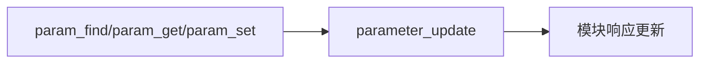

# 参数系统

参数用于配置算法/驱动/模块行为，支持持久化与更新通知。

- API 入口：`src/lib/parameters/param.h:89-99, 198-200`
- 实现与更新通知：`src/lib/parameters/parameters.cpp:129-152, 155-180`
- 板载存储与自动保存：`src/lib/parameters/flashparams/*`、`autosave.*`

实践要点：
- 读取参数后缓存并监控 `parameter_update` 主题，按需刷新模块内部配置。
- 使用生成的 `px4_parameters.hpp` 保持类型安全与枚举化访问。

