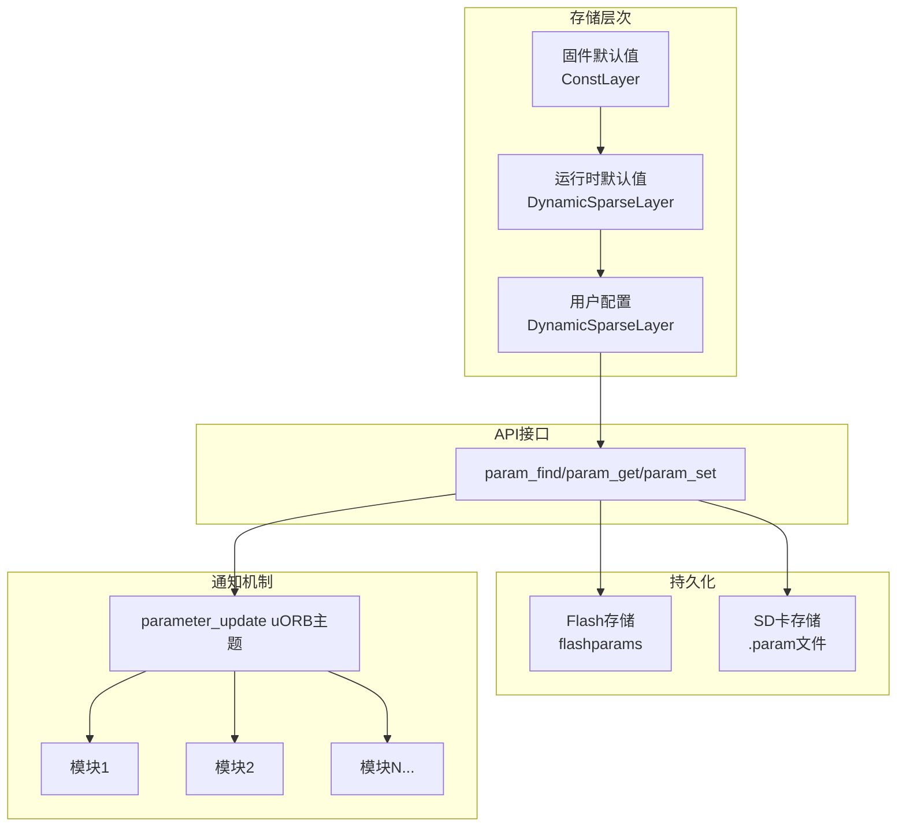

# PX4 参数系统完整教材

## 第一章：概述与设计理念

### 1.1 什么是参数系统

参数系统是PX4的核心配置管理机制，用于在运行时配置算法、驱动和模块的行为。它提供：

- **统一的配置接口**：所有模块使用相同的API访问参数
- **持久化存储**：参数值可保存到Flash或SD卡
- **实时更新通知**：参数变化时通过uORB通知所有订阅者
- **类型安全**：支持INT32和FLOAT两种类型
- **版本兼容**：支持参数翻译和升级

### 1.2 核心设计理念



**关键代码位置**：
- 核心API：`src/lib/parameters/param.h:89-242`
- 实现主体：`src/lib/parameters/parameters.cpp`
- 存储层：`parameters.cpp:103-105` (ConstLayer, DynamicSparseLayer)
- 更新通知：`parameters.cpp:156-180`

---

## 第二章：数据结构与存储架构

### 2.1 参数句柄（Handle）

```cpp
// src/lib/parameters/param.h:73-78
typedef uint16_t param_t;  // 参数句柄，实际是参数数组的索引

#define PARAM_INVALID ((uint16_t)0xffff)  // 无效句柄
#define PARAM_HASH    ((uint16_t)INT16_MAX)  // 哈希检查参数的魔术句柄
```

**设计要点**：
- 参数句柄是`uint16_t`类型，支持最多65535个参数
- 句柄本质是全局参数数组的索引，查找后可高效访问
- `PARAM_INVALID` 用于表示查找失败

### 2.2 参数类型

```cpp
// src/lib/parameters/param.h:60-64
#define PARAM_TYPE_UNKNOWN  0
#define PARAM_TYPE_INT32    1
#define PARAM_TYPE_FLOAT    2

typedef uint8_t param_type_t;
```

**类型系统**：
- PX4仅支持两种参数类型：32位整数和32位浮点
- 类型在编译时确定，运行时不可改变
- 类型信息存储在全局参数元数据数组中

### 2.3 三层存储架构

PX4使用分层设计存储参数值：

```cpp
// src/lib/parameters/parameters.cpp:103-105
static ConstLayer firmware_defaults;              // 第1层：固件默认值（只读）
static DynamicSparseLayer runtime_defaults{&firmware_defaults};  // 第2层：运行时默认值
DynamicSparseLayer user_config{&runtime_defaults};              // 第3层：用户配置
```

#### 第1层：ConstLayer - 固件默认值
- 编译时确定，存储在ROM/Flash代码段
- 包含所有参数的初始默认值
- 由CMake构建系统自动生成（从`.c`参数定义文件）
- **位置**：`build/<target>/src/lib/parameters/px4_parameters.c`

#### 第2层：DynamicSparseLayer - 运行时默认值
- 存储airframe或脚本设置的默认值覆盖
- 例如：机型配置文件会设置特定机型的默认PID值
- 稀疏存储：仅保存被修改的参数
- **典型场景**：`rcS`脚本中的`param set-default`命令

#### 第3层：DynamicSparseLayer - 用户配置
- 存储用户修改的参数值
- 这一层的值会持久化到Flash/SD卡
- 优先级最高：`param_get()`首先查找此层

**查找顺序**（从高到低）：
```
用户配置 → 运行时默认值 → 固件默认值
```

### 2.4 参数元数据数组

每个参数由元数据描述，编译时生成：

```cpp
// build/<target>/parameters/px4_parameters.hpp (自动生成)
struct param_info_s {
    const char *name;         // 参数名称（如 "MPC_Z_VEL_MAX_UP"）
    param_type_t type;        // 参数类型
    uint16_t volatile_param:1;  // 是否易失（不保存到Flash）
    uint16_t padding:15;
};

extern const param_info_s param_info_table[];
extern const uint16_t param_info_count;
```

**示例（编译后生成）**：
```cpp
const param_info_s param_info_table[] = {
    {"BAT_A_PER_V", PARAM_TYPE_FLOAT, 0},
    {"BAT_CAPACITY", PARAM_TYPE_FLOAT, 0},
    {"MPC_Z_VEL_MAX_UP", PARAM_TYPE_FLOAT, 0},
    // ... 数百个参数
};
```

---

## 第三章：核心API详解

### 3.1 初始化：param_init()

```cpp
// src/lib/parameters/parameters.cpp:129-152
void param_init()
{
    // 1. 初始化性能计数器
    param_export_perf = perf_alloc(PC_ELAPSED, "param: export");
    param_find_perf = perf_alloc(PC_COUNT, "param: find");
    param_get_perf = perf_alloc(PC_COUNT, "param: get");
    param_set_perf = perf_alloc(PC_ELAPSED, "param: set");

    // 2. 注册IOCTL接口（NuttX Protected Build）
#if defined(__PX4_NUTTX) && !defined(CONFIG_BUILD_FLAT)
    px4_register_boardct_ioctl(_PARAMIOCBASE, param_ioctl);
#endif

    // 3. 初始化主从节点支持（多核系统）
#if defined(CONFIG_PARAM_PRIMARY)
    param_primary_init();
#endif
#if defined(CONFIG_PARAM_REMOTE)
    param_remote_init();
#endif

    // 4. 创建自动保存实例
#if not defined(CONFIG_PARAM_REMOTE)
    autosave_instance = new ParamAutosave();
#endif
}
```

**调用时机**：
- 在NuttX平台：`platforms/nuttx/src/px4/common/px4_init.cpp`
- 在POSIX平台：`platforms/posix/src/px4/common/main.cpp`
- **必须在任何参数操作前调用**

### 3.2 查找参数：param_find()

```cpp
// src/lib/parameters/param.h:99
param_t param_find(const char *name);

// 实现：src/lib/parameters/parameters.cpp:182-211
static param_t param_find_internal(const char *name, bool notification)
{
    perf_count(param_find_perf);  // 性能统计

    param_t middle;
    param_t front = 0;
    param_t last = param_info_count;

    // 二分查找（参数名已按字母序排列）
    while (front <= last) {
        middle = front + (last - front) / 2;
        int ret = strcmp(name, param_name(middle));

        if (ret == 0) {
            if (notification) {
                param_set_used(middle);  // 标记为"已使用"
            }
            return middle;  // 返回索引（句柄）

        } else if (front == last) {
            break;

        } else if (ret < 0) {
            last = middle;

        } else {
            front = middle + 1;
        }
    }

    return PARAM_INVALID;  // 未找到
}
```

**使用示例**：
```cpp
param_t handle = param_find("MPC_Z_VEL_MAX_UP");
if (handle != PARAM_INVALID) {
    // 找到参数，可以进行后续操作
}
```

**性能优化**：
- **O(log n) 时间复杂度**：二分查找
- **建议**：模块初始化时查找一次，缓存句柄
- **避免**：在高频循环中反复调用`param_find()`

### 3.3 读取参数：param_get()

```cpp
// src/lib/parameters/param.h:215
int param_get(param_t param, void *val);
```

**实现逻辑**（简化）：
```cpp
int param_get(param_t param, void *val)
{
    perf_count(param_get_perf);

    // 1. 先查找用户配置层
    if (user_config.get(param, val)) {
        return 0;  // 找到用户值
    }

    // 2. 查找运行时默认值层
    if (runtime_defaults.get(param, val)) {
        return 0;
    }

    // 3. 最后使用固件默认值
    if (firmware_defaults.get(param, val)) {
        return 0;
    }

    return -1;  // 失败
}
```

**使用示例**：
```cpp
// 读取浮点参数
param_t handle = param_find("MPC_Z_VEL_MAX_UP");
float max_velocity = 0.0f;

if (param_get(handle, &max_velocity) == 0) {
    PX4_INFO("最大上升速度: %.2f m/s", (double)max_velocity);
} else {
    PX4_ERR("读取参数失败");
}

// 读取整数参数
param_t int_handle = param_find("COM_ARM_MAG_STR");
int32_t mag_strength = 0;
param_get(int_handle, &mag_strength);
```

**类型安全**：
- `val`指针必须指向正确类型的变量
- INT32参数 → `int32_t*`
- FLOAT参数 → `float*`
- **错误类型会导致内存损坏**

### 3.4 设置参数：param_set()

```cpp
// src/lib/parameters/param.h:242
int param_set(param_t param, const void *val);
```

**实现要点**：
```cpp
int param_set(param_t param, const void *val)
{
    perf_begin(param_set_perf);

    // 1. 更新用户配置层
    int result = user_config.set(param, val);

    if (result == 0) {
        // 2. 标记参数为"未保存"
        param_set_used(param);
        params_unsaved.set(param);

        // 3. 触发自动保存机制（如果启用）
        if (autosave_instance != nullptr) {
            autosave_instance->signal();
        }
    }

    perf_end(param_set_perf);
    return result;
}
```

**使用示例**：
```cpp
param_t handle = param_find("MPC_Z_VEL_MAX_UP");
float new_value = 5.0f;

if (param_set(handle, &new_value) == 0) {
    // 设置成功，但还未持久化到Flash
    PX4_INFO("参数已更新（内存）");

    // 手动保存到Flash/SD卡
    param_save_default();

    // 或者等待自动保存（默认2秒后）
} else {
    PX4_ERR("设置参数失败");
}
```

**重要**：
- `param_set()`仅修改RAM中的值
- 需调用`param_save_default()`才会持久化
- 自动保存：修改后2秒自动触发（可配置）

### 3.5 参数更新通知：param_notify_changes()

```cpp
// src/lib/parameters/parameters.cpp:156-180
void param_notify_changes()
{
    // 构造更新消息
    parameter_update_s pup {};
    pup.instance = param_instance++;  // 递增的实例计数器
    pup.get_count = perf_event_count(param_get_perf);
    pup.set_count = perf_event_count(param_set_perf);
    pup.find_count = perf_event_count(param_find_perf);
    pup.active = params_active.count();      // 使用中的参数数量
    pup.changed = user_config.size();        // 已修改的参数数量
    pup.custom_default = runtime_defaults.size();
    pup.timestamp = hrt_absolute_time();

    // 发布到uORB主题
    if (param_topic == nullptr) {
        param_topic = orb_advertise(ORB_ID(parameter_update), &pup);
    } else {
        orb_publish(ORB_ID(parameter_update), param_topic, &pup);
    }
}
```

**触发时机**：
- 调用`param_set()`后
- 调用`param_set_default()`后
- 从Flash/SD卡加载参数后
- RC遥控器参数调谐操作后

**订阅示例**（模块中）：
```cpp
#include <uORB/Subscription.hpp>
#include <uORB/topics/parameter_update.h>

class MyModule
{
private:
    uORB::Subscription _parameter_update_sub{ORB_ID(parameter_update)};

    float _my_param_value{0.0f};
    param_t _my_param_handle{PARAM_INVALID};

public:
    void init() {
        _my_param_handle = param_find("MY_PARAM");
        update_params();  // 初次加载
    }

    void run() {
        // 检查参数更新
        if (_parameter_update_sub.updated()) {
            parameter_update_s update;
            _parameter_update_sub.copy(&update);
            update_params();  // 重新加载参数
        }

        // 使用参数
        float result = compute(_my_param_value);
    }

    void update_params() {
        param_get(_my_param_handle, &_my_param_value);
    }
};
```

---

## 第四章：参数持久化

### 4.1 存储后端

PX4支持两种持久化后端：

#### Flash存储（FLASH_BASED_PARAMS）
```cpp
// src/lib/parameters/flashparams/flashparams.h
int flash_param_save(param_filter_func filter);
int flash_param_load();
```

- **平台**：STM32 MCU（板载Flash）
- **位置**：Flash的专用扇区（通常是最后几个扇区）
- **优点**：无需外部存储，启动快
- **缺点**：擦写次数有限（~10K-100K次）
- **实现**：`src/lib/parameters/flashparams/`

#### 文件存储（SD卡）
```cpp
// src/lib/parameters/parameters.cpp
static char *param_default_file = nullptr;  // "/fs/microsd/params"
static char *param_backup_file = nullptr;   // "/fs/microsd/params_backup"
```

- **平台**：带SD卡的飞控
- **格式**：TinyBSON二进制格式
- **文件**：`/fs/microsd/params`（主文件）+ `params_backup`（备份）
- **优点**：无擦写限制，易于调试
- **缺点**：依赖SD卡，启动稍慢

### 4.2 保存参数：param_save_default()

```cpp
int param_save_default()
{
    int result = -1;

    // 1. 获取文件锁（防止并发保存）
    pthread_mutex_lock(&file_mutex);

    // 2. 尝试保存到Flash
#if defined(FLASH_BASED_PARAMS)
    result = flash_param_save(nullptr);
#endif

    // 3. 如果Flash不可用或失败，保存到SD卡
    if (result != 0 && param_default_file != nullptr) {
        result = param_export(param_default_file, nullptr);

        // 同时更新备份文件
        if (result == 0 && param_backup_file != nullptr) {
            param_export(param_backup_file, nullptr);
        }
    }

    pthread_mutex_unlock(&file_mutex);
    return result;
}
```

**调用场景**：
- 用户在地面站修改参数后
- 脚本中执行`param save`命令
- 自动保存定时器触发（2秒延迟）

### 4.3 加载参数：param_load_default()

```cpp
int param_load_default()
{
    int result = -1;

    pthread_mutex_lock(&file_mutex);

    // 1. 尝试从Flash加载
#if defined(FLASH_BASED_PARAMS)
    result = flash_param_load();
#endif

    // 2. 如果Flash加载失败，从SD卡加载
    if (result != 0 && param_default_file != nullptr) {
        result = param_import(param_default_file);

        // 如果主文件损坏，尝试备份文件
        if (result != 0 && param_backup_file != nullptr) {
            result = param_import(param_backup_file);
        }
    }

    pthread_mutex_unlock(&file_mutex);

    // 3. 加载后通知所有模块
    if (result == 0) {
        param_notify_changes();
    }

    return result;
}
```

**启动流程**：
```
系统启动 → param_init() → param_load_default()
→ 加载Flash/SD参数 → param_notify_changes() → 模块更新参数
```

### 4.4 自动保存机制

```cpp
// src/lib/parameters/autosave.h
class ParamAutosave
{
private:
    static constexpr hrt_abstime DELAY = 2_s;  // 延迟2秒
    hrt_abstime _last_change{0};
    bool _scheduled{false};

public:
    void signal() {
        _last_change = hrt_absolute_time();
        if (!_scheduled) {
            _scheduled = true;
            work_queue(LPWORK, &_work, save_callback, this, DELAY);
        }
    }

private:
    static void save_callback(void *arg) {
        param_save_default();
        ((ParamAutosave*)arg)->_scheduled = false;
    }
};
```

**工作原理**：
1. 参数修改时调用`signal()`
2. 启动2秒延迟的工作队列任务
3. 如果2秒内有新修改，重新计时（防止频繁保存）
4. 延迟到期后，执行`param_save_default()`

**优点**：
- 避免每次修改都写Flash（延长Flash寿命）
- 批量保存多个参数修改
- 异步执行，不阻塞主逻辑

---

## 第五章：高级主题

### 5.1 参数翻译与版本升级

当参数名称改变或废弃时，PX4使用参数翻译机制保持兼容性：

```cpp
// src/lib/parameters/param_translation.cpp
static const px4_param_conversion_v1_t  param_conversion_v1[] = {
    // 旧参数名 → 新参数名
    {"ATT_ACC_COMP", "ATT_ACC_COMP"},  // 重命名示例
    {"MC_PITCH_P", "MC_PITCHRATE_P"},  // 结构调整
    // ...
};

bool param_modify_on_import(const char *name, int32_t &value);
bool param_modify_on_import(const char *name, float &value);
```

**应用场景**：
- 参数重命名（如`ATT_*` → `FW_ATT_*`）
- 参数合并/拆分
- 单位换算（如度数→弧度）
- 废弃参数的默认值设置

**导入时自动翻译**：
```
param_import() → 读取BSON文件 → param_modify_on_import()
→ 查找翻译表 → 更新为新参数名/值
```

### 5.2 ModuleParams基类

PX4提供C++基类简化参数管理：

```cpp
// src/lib/parameters/param.h
class ModuleParams
{
public:
    ModuleParams(ModuleParams *parent);
    virtual ~ModuleParams();

    // 子类必须实现：定义参数列表
    virtual void updateParams();

protected:
    void updateParamsSubclass();  // 更新所有子类参数
};

// 宏：定义参数列表
#define DEFINE_PARAMETERS(params...) \
    void updateParams() override { \
        updateParamsSubclass(); \
        const ParamHandleSet param_handles = { params }; \
        for (auto &p : param_handles) p.update(); \
    }
```

**使用示例**：
```cpp
// src/modules/mc_pos_control/PositionControl/PositionControl.hpp
class PositionControl : public ModuleParams
{
public:
    PositionControl(ModuleParams *parent);

private:
    DEFINE_PARAMETERS(
        (ParamFloat<px4::params::MPC_Z_P>) _mpc_z_p,
        (ParamFloat<px4::params::MPC_Z_VEL_P>) _mpc_z_vel_p,
        (ParamFloat<px4::params::MPC_Z_VEL_I>) _mpc_z_vel_i
    )
};

// 使用参数
void PositionControl::run()
{
    updateParams();  // 检查并更新所有参数

    float p_gain = _mpc_z_p.get();  // 获取当前值
    // ... 使用 p_gain
}
```

**优势**：
- 自动订阅`parameter_update`主题
- 批量更新参数
- 类型安全的参数访问
- 父子模块参数继承

### 5.3 易失参数（Volatile Parameters）

某些参数不应持久化保存：

```cpp
// 参数定义文件中标记
/**
 * @volatile
 */
PARAM_DEFINE_FLOAT(CAL_GYRO0_XOFF, 0.0f);
```

**特性**：
- 每次启动恢复为默认值
- 不保存到Flash/SD卡
- 用于校准偏移、临时调试参数

**实现**：
```cpp
// param_info_s 结构中的 volatile_param 位
struct param_info_s {
    uint16_t volatile_param:1;  // 1=易失, 0=持久
    // ...
};

// 保存时跳过易失参数
int param_export(const char *filename, param_filter_func filter)
{
    for (unsigned i = 0; i < param_info_count; i++) {
        if (param_is_volatile(i)) continue;  // 跳过
        // ... 导出参数
    }
}
```

### 5.4 参数组与过滤器

可以选择性保存/加载参数子集：

```cpp
typedef bool (*param_filter_func)(param_t param);

// 示例：仅保存姓名以"MPC_"开头的参数
bool filter_mc_params(param_t param)
{
    const char *name = param_name(param);
    return (strncmp(name, "MPC_", 4) == 0);
}

// 选择性保存
param_export("/fs/microsd/mc_params", filter_mc_params);
```

**应用**：
- 导出特定模块的配置
- 机型迁移（仅导出机型相关参数）
- 备份关键参数

---

## 第六章：实战指南

### 6.1 定义新参数

#### 步骤1：创建参数定义文件

```bash
# 在模块目录下创建 <module>_params.c
# 例如：src/modules/my_module/my_module_params.c
```

```c
/**
 * @file my_module_params.c
 * My Module parameters.
 */

/**
 * Maximum altitude
 *
 * Maximum altitude in meters.
 *
 * @unit m
 * @min 0.0
 * @max 1000.0
 * @decimal 1
 * @increment 1.0
 * @group My Module
 */
PARAM_DEFINE_FLOAT(MYMOD_ALT_MAX, 100.0f);

/**
 * Enable debug mode
 *
 * @boolean
 * @group My Module
 */
PARAM_DEFINE_INT32(MYMOD_DEBUG, 0);
```

#### 步骤2：在CMakeLists.txt中注册

```cmake
# src/modules/my_module/CMakeLists.txt
px4_add_module(
    MODULE modules__my_module
    MAIN my_module
    SRCS
        my_module.cpp
    DEPENDS
        # ...
    PARAMS
        my_module_params.c  # 添加这一行
)
```

#### 步骤3：重新编译

```bash
make px4_fmu-v6x_default
# 或
make px4_sitl_default
```

构建系统会：
1. 解析参数定义文件
2. 生成`parameters/px4_parameters.hpp`
3. 生成参数元数据数组
4. 生成文档（XML/Markdown）

### 6.2 在模块中使用参数

#### 方法1：使用ModuleParams基类（推荐）

```cpp
// my_module.hpp
#include <px4_platform_common/module.h>
#include <px4_platform_common/module_params.h>
#include <parameters/px4_parameters.hpp>

class MyModule : public ModuleBase<MyModule>, public ModuleParams
{
public:
    MyModule();

    void run() override;

private:
    DEFINE_PARAMETERS(
        (ParamFloat<px4::params::MYMOD_ALT_MAX>) _max_altitude,
        (ParamInt<px4::params::MYMOD_DEBUG>) _debug_mode
    )
};

// my_module.cpp
MyModule::MyModule() :
    ModuleParams(nullptr)  // 无父模块
{
}

void MyModule::run()
{
    while (!should_exit()) {
        // 定期检查参数更新
        updateParams();

        // 使用参数
        if (_debug_mode.get()) {
            PX4_INFO("Max altitude: %.1f", (double)_max_altitude.get());
        }

        px4_usleep(100000);  // 100ms
    }
}
```

#### 方法2：手动管理（传统方式）

```cpp
class MyModule
{
private:
    param_t _max_alt_handle{PARAM_INVALID};
    float _max_altitude{100.0f};

    uORB::Subscription _param_update_sub{ORB_ID(parameter_update)};

public:
    void init() {
        // 查找参数
        _max_alt_handle = param_find("MYMOD_ALT_MAX");

        // 初次加载
        update_params();
    }

    void run() {
        // 检查参数更新
        if (_param_update_sub.updated()) {
            parameter_update_s update;
            _param_update_sub.copy(&update);
            update_params();
        }

        // 使用 _max_altitude
    }

private:
    void update_params() {
        if (_max_alt_handle != PARAM_INVALID) {
            param_get(_max_alt_handle, &_max_altitude);
        }
    }
};
```

### 6.3 从地面站修改参数

#### 使用QGroundControl

1. 连接飞控
2. 打开"Parameters"页面
3. 搜索参数名称（如`MYMOD_ALT_MAX`）
4. 修改值并点击"Save"
5. QGC自动调用MAVLink参数协议更新参数

#### 通过MAVLink Shell

```bash
# 进入PX4 shell
pxh> param show MYMOD_ALT_MAX
MYMOD_ALT_MAX: curr: 100.0 default: 100.0

pxh> param set MYMOD_ALT_MAX 150.0
MYMOD_ALT_MAX: curr: 150.0 default: 100.0

pxh> param save
Parameters saved
```

#### 通过脚本设置

```bash
# ROMFS/px4fmu_common/init.d/rcS 或机型配置文件
param set MYMOD_ALT_MAX 150.0
param set-default MYMOD_DEBUG 1  # 仅设置默认值，不覆盖用户配置
```

### 6.4 调试参数系统

#### 查看所有参数

```bash
pxh> param show
# 输出所有参数（数百个）

pxh> param show MPC_*
# 仅显示以MPC_开头的参数
```

#### 性能统计

```bash
pxh> param show -s
Parameter statistics:
  Total parameters: 867
  Used parameters:  234
  Changed:          15
  Custom defaults:  8
  Get calls:        12345
  Set calls:        67
  Find calls:       890
```

#### 导出/导入参数

```bash
# 导出所有参数到文件
pxh> param export /fs/microsd/my_params.txt

# 导入参数
pxh> param import /fs/microsd/my_params.txt

# 重置为固件默认值
pxh> param reset_all
```

---

## 第七章：常见问题与最佳实践

### 7.1 性能优化

#### ❌ 错误做法
```cpp
// 高频循环中重复查找和读取
void control_loop()  // 400Hz
{
    param_t handle = param_find("MPC_Z_P");  // 每次400次查找！
    float p_gain;
    param_get(handle, &p_gain);  // 每次400次读取！

    // 使用 p_gain...
}
```

#### ✅ 正确做法
```cpp
class Controller
{
private:
    param_t _p_gain_handle{PARAM_INVALID};
    float _p_gain{1.0f};

public:
    void init() {
        // 仅查找一次
        _p_gain_handle = param_find("MPC_Z_P");
        param_get(_p_gain_handle, &_p_gain);
    }

    void control_loop()  // 400Hz
    {
        // 直接使用缓存值，零开销
        float output = error * _p_gain;
    }

    void on_param_update() {
        // 仅在参数更新时重新读取
        param_get(_p_gain_handle, &_p_gain);
    }
};
```

### 7.2 参数命名规范

PX4参数命名遵循严格的约定：

**格式**：`<GROUP>_<SUBGROUP>_<NAME>`

**示例**：
- `MPC_Z_VEL_MAX_UP` - MultiCopter, Z轴, 速度, 最大值, 向上
- `FW_PSP_OFF` - FixedWing, Pitch Setpoint, Offset
- `EKF2_AID_MASK` - EKF2, Aid, Mask

**规则**：
- 全部大写
- 使用下划线分隔
- 前缀表示模块/组
- 避免缩写（除非广泛认可）
- 长度 ≤ 16字符

### 7.3 参数文档

完整的参数文档自动生成，包含：

```c
/**
 * Altitude setpoint slew rate limit
 *
 * Limit for vertical velocity setpoint change rate in manual modes and applied in auto modes.
 *
 * @unit m/s^2
 * @min 0.1
 * @max 50.0
 * @decimal 1
 * @increment 0.1
 * @group Multicopter Position Control
 */
PARAM_DEFINE_FLOAT(MPC_Z_VEL_D_ACC, 5.0f);
```

**标签说明**：
- `@unit` - 单位（m, m/s, deg, rad等）
- `@min/@max` - 有效范围
- `@decimal` - 小数位数（地面站显示）
- `@increment` - 调整步长
- `@group` - 在QGC中的分组
- `@boolean` - 布尔参数（0/1）
- `@reboot_required` - 修改后需重启
- `@volatile` - 不持久化

### 7.4 多核/主从参数同步

在多核系统（如骁龙平台）中，参数系统支持主从模式：

**主节点（Primary）**：
```cpp
#define CONFIG_PARAM_PRIMARY 1
// 拥有参数存储，负责加载/保存
```

**从节点（Remote）**：
```cpp
#define CONFIG_PARAM_REMOTE 1
// 通过共享内存或RPC访问主节点参数
```

**实现**：
- 主节点：`src/lib/parameters/parameters_primary.cpp`
- 从节点：`src/lib/parameters/parameters_remote.cpp`

---

## 第八章：总结

### 核心要点回顾

1. **分层架构**：固件默认值 → 运行时默认值 → 用户配置
2. **句柄系统**：查找一次，缓存句柄，高效访问
3. **更新通知**：订阅`parameter_update`主题，响应参数变化
4. **自动保存**：修改后2秒自动保存，减少Flash写入
5. **类型安全**：使用`ModuleParams`基类，避免类型错误

### 开发流程


### 进一步学习

- **源码阅读**：`src/lib/parameters/`（核心实现）
- **示例模块**：`src/examples/px4_simple_app/`（简单示例）
- **参数文档生成**：`Tools/msg/px4_metadata.py`
- **MAVLink参数协议**：`src/modules/mavlink/mavlink_parameters.cpp`

---

**文档版本**：v1.0
**适用PX4版本**：v1.14+
**最后更新**：2025-11-24
**作者**：基于PX4源码编写
