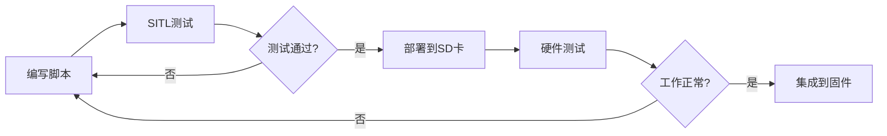

# PX4 启动脚本系统完整教材

## 第一章：概述与架构

### 1.1 什么是PX4启动脚本

PX4使用NSH (NuttShell) 脚本系统来管理系统启动、模块加载和配置。脚本系统基于Unix Shell语法，但专门针对嵌入式环境进行了精简和优化。

**核心特点**：
- **POSIX-like语法**：支持if/then/else、循环、函数等
- **嵌入式优化**：注释在构建时被移除以节省ROM空间
- **模块化设计**：通过include机制组织大型启动流程
- **机型自动配置**：基于SYS_AUTOSTART参数自动选择机型配置

### 1.2 脚本系统架构

```mermaid
flowchart TB
    subgraph 启动入口
        START[系统启动] --> rcS[rcS主脚本<br/>ROMFS/px4fmu_common/init.d/rcS]
    end

    subgraph 核心初始化
        rcS --> MOUNT[挂载SD卡<br/>加载参数]
        MOUNT --> AUTOSTART[机型自动识别<br/>SYS_AUTOSTART]
        AUTOSTART --> VEHICLE[加载机型配置<br/>/init.d/airframes/*]
    end

    subgraph 模块加载
        VEHICLE --> CORE[rc.base_core<br/>核心模块]
        CORE --> SENSORS[rc.sensors<br/>传感器]
        SENSORS --> APPS[rc.<vehicle>_apps<br/>应用模块]
    end

    subgraph 用户自定义
        APPS --> EXTRAS[/fs/microsd/etc/extras.txt<br/>用户自定义脚本]
        EXTRAS --> COMPLETE[启动完成]
    end
```

**关键脚本位置**：
- 主入口：`ROMFS/px4fmu_common/init.d/rcS`
- 核心模块：`ROMFS/px4fmu_common/init.d/rc.base_core`
- 传感器初始化：`ROMFS/px4fmu_common/init.d/rc.sensors`
- 机型配置：`ROMFS/px4fmu_common/init.d/airframes/`
- 用户自定义：`/fs/microsd/etc/extras.txt`（SD卡上）

---

## 第二章：NSH脚本语法

### 2.1 基础语法

#### 变量定义与使用

```bash
# 设置变量（无空格）
set MYVAR value

# 使用变量
echo $MYVAR
echo ${MYVAR}  # 推荐：明确变量边界

# 特殊变量
set R /  # 根目录
echo ${R}etc/config  # 输出: /etc/config
```

**注意事项**：
- **不要在等号周围加空格**：PX4脚本为节省Flash，变量赋值无空格
- **美元符号**：`$VAR` 或 `${VAR}` 引用变量
- **字符串无需引号**：除非包含空格

#### 条件判断

```bash
# if-then-else 语句
if [ $STORAGE_AVAILABLE = yes ]
then
    echo "SD card available"
else
    echo "No SD card"
fi

# 参数比较（使用param命令）
if param greater SYS_AUTOSTART 0
then
    echo "Autostart enabled"
fi

# 文件存在性检查
if [ -f /fs/microsd/etc/config.txt ]
then
    echo "Config file found"
fi

# 设备存在性检查
if [ -b "/dev/mmcsd0" ]
then
    echo "SD card device present"
fi
```

**测试运算符**：
| 运算符 | 含义 | 示例 |
|--------|------|------|
| `-f` | 文件存在 | `if [ -f /path/file ]` |
| `-d` | 目录存在 | `if [ -d /path/dir ]` |
| `-b` | 块设备存在 | `if [ -b /dev/mmcsd0 ]` |
| `=` | 字符串相等 | `if [ $VAR = value ]` |
| `!=` | 字符串不等 | `if [ $VAR != value ]` |
| `-o` | 逻辑或 | `if [ $A = yes -o $B = yes ]` |

#### 包含其他脚本

```bash
# 使用 . (点) 命令包含脚本
. ${R}etc/init.d/rc.sensors

# 等价于 source 命令（在支持的shell中）
source ${R}etc/init.d/rc.sensors
```

**包含机制**：
- 被包含的脚本在当前shell环境中执行
- 变量在包含的脚本间共享
- 类似C语言的`#include`

### 2.2 PX4特有命令

#### param - 参数操作

```bash
# 读取参数
param show SYS_AUTOSTART

# 设置参数（仅在RAM中）
param set SYS_AUTOSTART 4001

# 设置默认值（不覆盖用户配置）
param set-default MPC_Z_VEL_MAX_UP 3.0

# 比较参数
if param greater SYS_AUTOSTART 0
then
    echo "Autostart is positive"
fi

if param compare SYS_AUTOSTART 4001
then
    echo "Generic Quadcopter"
fi

# 参数范围检查
if param greater -s SENS_EN_MB12XX 0  # -s: 静默模式
then
    mb12xx start
fi

# 保存参数到SD卡/Flash
param save
```

**param子命令**：
| 子命令 | 功能 | 示例 |
|--------|------|------|
| `show` | 显示参数值 | `param show SYS_*` |
| `set` | 设置参数 | `param set COM_ARM_WO_GPS 1` |
| `set-default` | 设置默认值 | `param set-default RTL_RETURN_ALT 30.0` |
| `compare` | 比较相等 | `param compare SYS_AUTOSTART 4001` |
| `greater` | 大于比较 | `param greater SENS_EN_MB12XX 0` |
| `save` | 保存到存储 | `param save` |
| `import` | 导入参数文件 | `param import /fs/microsd/params` |

#### 模块启动命令

```bash
# 启动模块
sensors start
ekf2 start
mc_pos_control start

# 带参数启动
mavlink start -d /dev/ttyS3 -b 921600 -m onboard -r 200000

# 检查模块是否运行
if mavlink status
then
    echo "MAVLink running"
fi

# 停止模块
ekf2 stop
```

#### 设备挂载与文件系统

```bash
# 挂载SD卡
mount -t vfat /dev/mmcsd0 /fs/microsd

# 格式化FAT32
mkfatfs -F 32 /dev/mmcsd0

# 卸载
umount /fs/microsd

# 创建目录
mkdir /fs/microsd/log

# 删除文件
rm /fs/microsd/old_log.ulg

# 递归删除目录
rm -r /fs/microsd/old_logs
```

### 2.3 调试技巧

#### 启用脚本跟踪

```bash
# 在rcS开头添加
set -x  # 打印每条执行的命令

# 禁用退出错误
set +e  # 忽略命令失败（默认）
set -e  # 遇到错误立即退出
```

**示例输出**（set -x）：
```
+ set STORAGE_AVAILABLE yes
+ param select /fs/microsd/params
+ param import
+ param set SYS_AUTOSTART 4001
```

#### 添加调试信息

```bash
# 使用echo打印调试信息
echo "INFO [init] Starting vehicle setup"
echo "DEBUG [init] SYS_AUTOSTART=$SYS_AUTOSTART"

# 条件调试
if [ $DEBUG = yes ]
then
    echo "Detailed debug info..."
fi
```

---

## 第三章：rcS主启动脚本详解

### 3.1 脚本结构概览

```bash
#!/bin/sh
# ROMFS/px4fmu_common/init.d/rcS

set +e  # 忽略命令失败

# ========== 第1阶段：环境初始化 ==========
set R /
set FCONFIG /fs/microsd/etc/config.txt
set FEXTRAS /fs/microsd/etc/extras.txt
# ... 更多变量

# ========== 第2阶段：存储挂载 ==========
if [ -b "/dev/mmcsd0" ]
then
    mount -t vfat /dev/mmcsd0 /fs/microsd
    # ...
fi

# ========== 第3阶段：参数加载 ==========
param select $PARAM_FILE
param import

# ========== 第4阶段：机型自动配置 ==========
if ! param compare SYS_AUTOSTART 0
then
    . ${R}etc/init.d/rc.autostart
fi

# ========== 第5阶段：模块启动 ==========
. ${R}etc/init.d/rc.base_core
. ${R}etc/init.d/rc.vehicle_setup

# ========== 第6阶段：用户自定义 ==========
if [ -f $FEXTRAS ]
then
    . $FEXTRAS
fi

# ========== 第7阶段：启动完成 ==========
mavlink boot_complete
```

### 3.2 第1阶段：环境初始化

```bash
# ROMFS/px4fmu_common/init.d/rcS:23-37
set R /
set FCONFIG /fs/microsd/etc/config.txt
set FEXTRAS /fs/microsd/etc/extras.txt
set FRC /fs/microsd/etc/rc.txt
set IOFW "/etc/extras/px4_io-v2_default.bin"
set LOGGER_ARGS ""
set LOGGER_BUF 8
set PARAM_FILE ""
set PARAM_BACKUP_FILE ""
set RC_INPUT_ARGS ""
set STORAGE_AVAILABLE no
set SDCARD_EXT_PATH /fs/microsd/ext_autostart
set SDCARD_FORMAT no
set STARTUP_TUNE 1
set VEHICLE_TYPE none
```

**关键变量**：
| 变量 | 用途 | 默认值 |
|------|------|--------|
| `R` | 根目录路径 | `/` |
| `FEXTRAS` | 用户自定义脚本路径 | `/fs/microsd/etc/extras.txt` |
| `STORAGE_AVAILABLE` | SD卡可用标志 | `no` |
| `VEHICLE_TYPE` | 机型类型 | `none` (mc/fw/vtol/...) |
| `PARAM_FILE` | 参数文件路径 | 动态设置 |

### 3.3 第2阶段：存储挂载

```bash
# ROMFS/px4fmu_common/init.d/rcS:53-95
if [ -b "/dev/mmcsd0" ]
then
    if mount -t vfat /dev/mmcsd0 /fs/microsd
    then
        if [ -f "/fs/microsd/.format" ]
        then
            # 用户请求格式化
            echo "INFO [init] format /dev/mmcsd0 requested"
            set SDCARD_FORMAT yes
            rm /fs/microsd/.format
            umount /fs/microsd
        else
            set STORAGE_AVAILABLE yes
        fi
    fi

    # 如果挂载失败或需要格式化
    if [ $STORAGE_AVAILABLE = no -o $SDCARD_FORMAT = yes ]
    then
        echo "INFO [init] formatting /dev/mmcsd0"

        if mkfatfs -F 32 /dev/mmcsd0
        then
            if mount -t vfat /dev/mmcsd0 /fs/microsd
            then
                set STORAGE_AVAILABLE yes
                set STARTUP_TUNE 14  # SD_INIT成功提示音
            fi
        fi
    fi
else
    # 检查是否有MTD存储设备
    if mft query -q -k MTD -s MTD_PARAMETERS -v /mnt/microsd
    then
        set STORAGE_AVAILABLE yes
    fi
fi
```

**存储策略**：
1. 优先尝试挂载SD卡（`/dev/mmcsd0`）
2. 如果存在`.format`标记文件，自动格式化
3. 挂载失败时尝试格式化并重新挂载
4. 检查MTD Flash存储作为后备方案

**用户操作**：
```bash
# 在SD卡根目录创建.format文件可触发格式化
touch /fs/microsd/.format
# 重启后SD卡会被格式化
```

### 3.4 第3阶段：参数加载

```bash
# ROMFS/px4fmu_common/init.d/rcS:142-160
if mft query -q -k MTD -s MTD_CALDATA -v /fs/mtd_caldata
then
    param load /fs/mtd_caldata  # 加载出厂校准数据
fi

param select $PARAM_FILE  # 选择参数文件（SD卡或Flash）

if ! param import
then
    # 导入失败，尝试备份文件
    if [ -f $PARAM_BACKUP_FILE ]
    then
        echo "WARN [init] importing from param backup"
        param import $PARAM_BACKUP_FILE
    fi
fi
```

**参数加载优先级**：
```
1. /fs/mtd_caldata        (出厂校准数据 - MTD Flash)
2. /fs/microsd/params     (用户参数 - SD卡)
3. /fs/microsd/parameters_backup.bson  (备份参数)
4. 固件默认值             (编译时内置)
```

### 3.5 第4阶段：机型自动配置

```bash
# ROMFS/px4fmu_common/init.d/rcS:271-285
if ! param compare SYS_AUTOSTART 0
then
    . ${R}etc/init.d/rc.autostart  # 加载机型配置脚本
fi

# rc.autostart 的核心逻辑
if param compare SYS_AUTOSTART 4001
then
    . ${R}etc/init.d/airframes/4001_quad_x  # 加载具体机型文件
fi
```

**机型编号规则**：
| 范围 | 类型 | 示例 |
|------|------|------|
| 1000-1999 | 仿真机型 | 1001: Gazebo Iris |
| 2000-2999 | 固定翼 | 2100: Plane AERT |
| 3000-3999 | VTOL | 3030: Tailsitter |
| 4000-4999 | 多旋翼 | 4001: Quad X |
| 5000-5999 | Rover | 5001: Rover |
| 6000-6999 | 水下机器人 | 6001: UUV |
| 10000+ | 自定义机型 | 10000: My Custom |

**机型配置文件结构**：
```bash
# ROMFS/px4fmu_common/init.d/airframes/4001_quad_x
#!/bin/sh
#
# @name Generic Quadcopter
# @type Quadcopter
# @class Copter
#

# 设置机型类型
set VEHICLE_TYPE mc

# 设置混控器
set MIXER quad_x

# 设置默认参数
param set-default MPC_XY_P 0.95
param set-default MPC_Z_P 1.0
param set-default MPC_XY_VEL_P_ACC 1.8
# ... 更多参数

# PWM输出配置
set PWM_OUT 1234  # 电机输出通道
```

### 3.6 第5阶段：模块启动

#### rc.base_core - 核心模块

```bash
# ROMFS/px4fmu_common/init.d/rc.base_core
set +e
set R /

# 加载串口配置
. ${R}etc/init.d/rc.serial

# 加载并启动传感器
. ${R}etc/init.d/rc.sensors
sensors start

# USB自动连接（地面站）
if param greater -s SYS_USB_AUTO -1
then
    if ! cdcacm_autostart start
    then
        sercon  # 启用串口控制台
        mavlink start -d /dev/ttyACM0
    fi
fi

mavlink boot_complete  # 通知启动完成
```

#### rc.vehicle_setup - 机型特定模块

```bash
# 根据VEHICLE_TYPE加载对应的应用
if [ $VEHICLE_TYPE = mc ]
then
    . ${R}etc/init.d/rc.mc_apps
elif [ $VEHICLE_TYPE = fw ]
then
    . ${R}etc/init.d/rc.fw_apps
elif [ $VEHICLE_TYPE = vtol ]
then
    . ${R}etc/init.d/rc.vtol_apps
fi
```

**rc.mc_apps - 多旋翼应用**：
```bash
# ROMFS/px4fmu_common/init.d/rc.mc_apps

# 估计器（EKF2）
if param compare SYS_MC_EST_GROUP 2
then
    ekf2 start
fi

# 位置控制
mc_pos_control start

# 姿态控制
mc_att_control start

# 速率控制
mc_rate_control start

# 控制分配器
control_allocator start
```

### 3.7 第6阶段：用户自定义脚本

```bash
# ROMFS/px4fmu_common/init.d/rcS 末尾
if [ -f $FEXTRAS ]
then
    echo "Running extras: $FEXTRAS"
    . $FEXTRAS
fi
```

**extras.txt示例**（SD卡上创建）：
```bash
# /fs/microsd/etc/extras.txt
# 用户自定义启动脚本

# 启动额外的传感器
ms5837 start -b 1

# 配置UART4高速MAVLink输出（我们的项目）
. ${R}etc/init.d/rc.uart4_mavlink

# 设置自定义参数
param set MPC_Z_VEL_MAX_UP 5.0

# 启动自定义模块
my_custom_module start

echo "User extras loaded"
```

---

## 第四章：机型配置系统

### 4.1 机型配置文件结构

```bash
#!/bin/sh
#
# @name Custom Quadcopter X
# @type Quadcopter
# @class Copter
#
# @maintainer Your Name <email@example.com>
#
# @board px4_fmu-v2 exclude  # 排除不兼容的板子
# @board px4_fmu-v5 exclude
#

# ========== 机型类型设置 ==========
set VEHICLE_TYPE mc

# ========== 混控器选择 ==========
set MIXER quad_x  # quad_x, quad_w, quad_+, octa_x, ...

# ========== 几何参数 ==========
param set-default CA_AIRFRAME 0  # 0=多旋翼
param set-default CA_ROTOR_COUNT 4

# ========== 控制参数 ==========
# 位置控制增益
param set-default MPC_XY_P 0.95
param set-default MPC_Z_P 1.0

# 速度控制增益
param set-default MPC_XY_VEL_P_ACC 1.8
param set-default MPC_XY_VEL_I_ACC 0.4
param set-default MPC_Z_VEL_P_ACC 4.0
param set-default MPC_Z_VEL_I_ACC 2.0

# 速度限制
param set-default MPC_XY_VEL_MAX 12.0  # m/s
param set-default MPC_Z_VEL_MAX_DN 1.5
param set-default MPC_Z_VEL_MAX_UP 3.0

# ========== PWM输出配置 ==========
set PWM_OUT 1234  # 主通道1-4输出到电机

# 如果需要AUX输出
# set PWM_AUX_OUT 1234

# PWM频率（可选）
# param set-default PWM_MAIN_MIN 1000
# param set-default PWM_MAIN_MAX 2000

# ========== 传感器配置 ==========
# 启用特定传感器（如果默认未启用）
# param set-default SENS_EN_MB12XX 1  # 超声波

# ========== 失效保护 ==========
param set-default COM_ARM_MAG_STR 1  # 磁力计校准强度
param set-default RTL_RETURN_ALT 30.0  # 返航高度

# ========== 电池参数 ==========
param set-default BAT1_CAPACITY 5200  # mAh
param set-default BAT1_V_EMPTY 3.4
param set-default BAT1_V_CHARGED 4.2
param set-default BAT1_N_CELLS 4
```

### 4.2 创建自定义机型

#### 步骤1：创建机型配置文件

```bash
# 文件位置：ROMFS/px4fmu_common/init.d/airframes/10015_my_custom_quad
# 或外部：/fs/microsd/ext_autostart/10015_my_custom_quad
```

```bash
#!/bin/sh
#
# @name My Custom Racing Quad
# @type Quadcopter
# @class Copter
#
# @maintainer John Doe <john@example.com>
#

set VEHICLE_TYPE mc
set MIXER quad_x

# 竞速四旋翼高增益配置
param set-default MPC_XY_P 1.2
param set-default MPC_Z_P 1.5
param set-default MPC_XY_VEL_MAX 15.0
param set-default MPC_Z_VEL_MAX_UP 5.0

# 高转速电机
param set-default MOT_SLEW_MAX 50

set PWM_OUT 1234
```

#### 步骤2：CMakeLists注册（内置机型）

```cmake
# ROMFS/px4fmu_common/init.d/airframes/CMakeLists.txt
px4_add_romfs_files(
    # ... 现有机型
    10015_my_custom_quad
)
```

#### 步骤3：外部机型（无需编译）

```bash
# 1. 在SD卡创建目录
mkdir -p /fs/microsd/ext_autostart

# 2. 复制机型文件
cp 10015_my_custom_quad /fs/microsd/ext_autostart/

# 3. 设置参数
param set SYS_AUTOSTART 10015
param set SYS_AUTOCONFIG 1  # 强制应用默认值
param save

# 4. 重启
reboot
```

### 4.3 混控器（Mixer）

混控器定义了如何将控制命令映射到执行器输出。

**常见混控器**：
| 混控器文件 | 机型 | 布局 |
|-----------|------|------|
| `quad_x` | 四旋翼X型 | ```<br/>  1   2<br/>   \ /<br/>    X<br/>   / \<br/>  4   3<br/>``` |
| `quad_+` | 四旋翼+型 | ```<br/>    1<br/>    |<br/> 4--+--2<br/>    |<br/>    3<br/>``` |
| `quad_w` | 四旋翼W型 | 宽体四旋翼 |
| `octa_x` | 八旋翼X型 | 8电机X布局 |
| `hexa_x` | 六旋翼X型 | 6电机X布局 |
| `vtol_generic` | 通用VTOL | 固定翼+多旋翼 |

**混控器文件位置**：
- 内置：`ROMFS/px4fmu_common/mixers/`
- 自定义：`/fs/microsd/etc/mixers/`

---

## 第五章：高级脚本技巧

### 5.1 条件执行与参数检查

#### 安全启动模块

```bash
# 仅当参数启用时启动传感器
if param greater -s SENS_EN_MS5837 0
then
    ms5837 start -b ${SENS_EN_MS5837}

    if ! ms5837 status
    then
        echo "ERROR: MS5837 failed to start"
        set STARTUP_TUNE 2  # 错误提示音
    fi
fi
```

#### 机型特定配置

```bash
# 根据SYS_AUTOSTART范围执行不同逻辑
if param compare -s SYS_AUTOSTART 4001 4050
then
    # 4001-4050: 通用多旋翼系列
    echo "Generic multicopter configuration"
    param set-default MPC_XY_VEL_MAX 12.0

elif param compare -s SYS_AUTOSTART 4100 4150
then
    # 4100-4150: 竞速多旋翼系列
    echo "Racing multicopter configuration"
    param set-default MPC_XY_VEL_MAX 20.0
fi
```

### 5.2 串口配置自动化

**rc.serial示例**：
```bash
# ROMFS/px4fmu_common/init.d/rc.serial

# UART1: GPS
if param greater -s SER_GPS1_BAUD 0
then
    gps start -d /dev/ttyS0 -b ${SER_GPS1_BAUD} -p ubx
fi

# UART2: TELEM1 (MAVLink)
if param greater -s SER_TEL1_BAUD 0
then
    mavlink start -d /dev/ttyS1 -b ${SER_TEL1_BAUD} -m onboard -r 4000
fi

# UART3: TELEM2
if param greater -s SER_TEL2_BAUD 0
then
    mavlink start -d /dev/ttyS2 -b ${SER_TEL2_BAUD} -m onboard
fi

# UART4: GPS2 或 自定义
if param compare SER_GPS2_BAUD 0
then
    # 未配置为GPS2，检查自定义脚本
    if [ -f ${R}etc/init.d/rc.uart4_mavlink ]
    then
        . ${R}etc/init.d/rc.uart4_mavlink
    fi
else
    # 配置为GPS2
    gps start -d /dev/ttyS3 -b ${SER_GPS2_BAUD} -p ubx -e /dev/ttyS0
fi
```

### 5.3 日志系统配置

```bash
# rc.logging - 日志配置
if [ $STORAGE_AVAILABLE = yes ]
then
    # 设置日志参数
    set LOGGER_BUF 12  # KB

    if param greater SDLOG_PROFILE 0
    then
        set LOGGER_ARGS "-f"  # 全速日志
    fi

    # 启动logger
    logger start -b ${LOGGER_BUF} -t ${LOGGER_ARGS}

    # 配置日志主题
    if param compare SDLOG_PROFILE 1
    then
        # 高频率日志
        logger on -a
    elif param compare SDLOG_PROFILE 2
    then
        # 调试日志
        logger on
    fi
fi
```

### 5.4 多实例传感器

```bash
# 启动多个同类型传感器
set IMU_INSTANCES 3

set IMU_ID 0
while [ $IMU_ID -lt $IMU_INSTANCES ]
do
    # 启动ICM20689实例
    icm20689 start -R $IMU_ID

    set IMU_ID `expr $IMU_ID + 1`
done

# 启动传感器投票器
sensors start
```

### 5.5 错误处理与恢复

```bash
# 尝试启动模块，失败时回退
if ! ekf2 start
then
    echo "WARN: EKF2 failed, trying EKF (deprecated)"

    if ! ekf2 start
    then
        echo "ERROR: All estimators failed"
        set STARTUP_TUNE 2

        # 进入安全模式（最小功能）
        set SAFE_MODE yes
    fi
fi

# 安全模式处理
if [ $SAFE_MODE = yes ]
then
    # 仅启动必要模块
    sensors start
    commander start
    # 不启动控制器，仅允许参数配置
fi
```

---

## 第六章：调试与测试

### 6.1 SITL中测试脚本

```bash
# 在SITL中运行自定义启动脚本
make px4_sitl_default

# PX4启动后
pxh> . /path/to/my_test_script.sh
```

**测试脚本示例**：
```bash
# test_uart_config.sh
echo "Testing UART4 configuration"

# 检查参数
param show SER_TEL4_BAUD

# 启动MAVLink
mavlink start -d /dev/ttyS3 -b 921600 -m onboard -r 200000

# 验证启动
if mavlink status -d /dev/ttyS3
then
    echo "SUCCESS: UART4 MAVLink running"
else
    echo "FAIL: UART4 MAVLink not running"
fi

# 检查消息流
mavlink stream -d /dev/ttyS3 -s HIGHRES_IMU
```

### 6.2 实时调试

```bash
# 在运行中的系统上执行脚本
pxh> . /fs/microsd/debug.sh
```

**debug.sh示例**：
```bash
# 查看所有运行中的模块
ps

# 检查uORB主题
uorb top

# 查看参数变化
param show -c  # 仅显示修改过的

# 查看传感器状态
sensors status

# 查看估计器状态
ekf2 status
```

### 6.3 启动时间分析

```bash
# 在rcS中添加时间戳
echo "[$(date +%s.%N)] Stage 1: Init"
# ... 初始化代码
echo "[$(date +%s.%N)] Stage 2: Mount storage"
# ... 挂载代码
echo "[$(date +%s.%N)] Stage 3: Load params"
```

**输出示例**：
```
[1234567.001] Stage 1: Init
[1234567.052] Stage 2: Mount storage
[1234567.248] Stage 3: Load params
[1234567.389] Stage 4: Autostart
```

### 6.4 错误诊断

**常见启动错误**：

| 错误信息 | 原因 | 解决方案 |
|---------|------|----------|
| `mount: mount failed: Invalid argument` | SD卡文件系统损坏 | 创建`.format`文件触发格式化 |
| `param: import failed` | 参数文件损坏 | 使用`param reset_all`重置 |
| `ekf2: start failed` | IMU传感器未就绪 | 检查`sensors status` |
| `Mixer file not found` | 混控器文件缺失 | 检查SYS_AUTOSTART和混控器路径 |

---

## 第七章：实战案例

### 7.1 案例1：UART4高速数据输出

**需求**：在UART4上以200Hz输出IMU和姿态数据

**解决方案**：
```bash
# /fs/microsd/etc/extras.txt
echo "Configuring UART4 high-speed output"

# 启动MAVLink实例
mavlink start -d /dev/ttyS3 -b 921600 -m onboard -r 200000

# 等待MAVLink就绪
sleep 1

# 配置消息流
mavlink stream -d /dev/ttyS3 -s HIGHRES_IMU -r 200
mavlink stream -d /dev/ttyS3 -s ATTITUDE_QUATERNION -r 200

# 验证
if mavlink status -d /dev/ttyS3
then
    echo "UART4 MAVLink: OK (200Hz IMU+ATT)"
else
    echo "ERROR: UART4 MAVLink failed"
fi
```

### 7.2 案例2：多GPS配置

**需求**：同时使用两个GPS模块进行融合

**解决方案**：
```bash
# /fs/microsd/etc/extras.txt

# GPS1 on UART1 (主GPS - UBlox)
gps start -d /dev/ttyS0 -b 115200 -p ubx

# GPS2 on UART4 (备份GPS - UBlox)
gps start -d /dev/ttyS3 -b 115200 -p ubx -e /dev/ttyS0

# 配置GPS融合参数
param set GPS_1_CONFIG 201  # UART1
param set GPS_2_CONFIG 401  # UART4

param set EKF2_GPS_CTRL 7  # 启用双GPS融合
param set EKF2_GPS_CHECK 21  # GPS检查项

echo "Dual GPS configuration complete"
```

### 7.3 案例3：条件性模块启动

**需求**：根据硬件配置动态启动传感器

**解决方案**：
```bash
# /fs/microsd/etc/extras.txt

# 检测MS5837深度传感器（水下机器人）
if param greater SENS_EN_MS5837 0
then
    echo "Starting MS5837 depth sensor"
    ms5837 start -b 1

    if ms5837 status
    then
        # 配置深度控制参数
        param set UUV_DEPTH_MODE 1
        echo "MS5837: OK"
    else
        echo "MS5837: FAIL"
        param set SENS_EN_MS5837 0
    fi
fi

# 检测光流传感器（室内飞行）
if param greater SENS_EN_PX4FLOW 0
then
    echo "Starting PX4Flow"
    px4flow start -b 1

    if px4flow status
    then
        param set EKF2_OF_CTRL 1  # 启用光流融合
        echo "PX4Flow: OK"
    fi
fi
```

### 7.4 案例4：自定义调试模式

**需求**：开发时启用详细日志和调试输出

**解决方案**：
```bash
# /fs/microsd/etc/extras.txt

# 检查调试参数
if param compare DEBUG_MODE 1
then
    echo "===== DEBUG MODE ENABLED ====="

    # 启用详细日志
    param set SDLOG_PROFILE 2  # 调试日志
    param set SDLOG_MODE 0  # 从启动开始记录

    # 增加日志缓冲
    set LOGGER_BUF 32  # 32KB

    # 重启logger应用新配置
    logger stop
    logger start -b ${LOGGER_BUF} -t
    logger on  # 启用所有主题

    # 启用MAVLink调试消息
    mavlink start -d /dev/ttyACM0 -m debug -r 100000
    mavlink stream -d /dev/ttyACM0 -s DEBUG -r 10
    mavlink stream -d /dev/ttyACM0 -s DEBUG_VECT -r 10

    # 打印系统状态
    echo "=== System Status ==="
    free
    ps
    uorb top -1  # 单次输出

    echo "===== DEBUG MODE ACTIVE ====="
fi
```

---

## 第八章：最佳实践与陷阱

### 8.1 脚本编写最佳实践

#### ✅ 推荐做法

```bash
# 1. 使用set +e避免命令失败导致脚本终止
set +e

# 2. 变量名清晰明确
set MY_SENSOR_ID 1
set ENABLE_DEBUG yes

# 3. 检查关键操作的返回值
if ! ekf2 start
then
    echo "ERROR: EKF2 failed"
    # 恢复措施
fi

# 4. 添加注释说明复杂逻辑
# 检查是否为VTOL机型（3000-3999）
if param compare -s SYS_AUTOSTART 3000 3999
then
    set VEHICLE_TYPE vtol
fi

# 5. 使用静默模式避免无用输出
if param greater -s SENS_EN_MS5837 0
then
    ms5837 start
fi

# 6. 参数修改前保存原值
set ORIGINAL_VALUE $(param show -q MPC_Z_P)
param set MPC_Z_P 2.0
# ... 测试
param set MPC_Z_P $ORIGINAL_VALUE
```

#### ❌ 避免的错误

```bash
# 1. 变量赋值时加空格（会失败）
set VAR = value  # ❌ 错误
set VAR=value    # ✅ 正确

# 2. 忘记检查模块启动状态
ekf2 start  # ❌ 可能失败但脚本继续
# 应该：
if ! ekf2 start
then
    echo "ERROR"
fi

# 3. 在循环中启动耗时模块
for i in 1 2 3 4
do
    my_heavy_module start  # ❌ 可能导致启动超时
done

# 4. 硬编码设备路径
mavlink start -d /dev/ttyS3  # ❌ 不同板子可能不同
# 应该使用参数：
mavlink start -d $(param show -q SER_TEL4_DEV)

# 5. 不保存关键参数修改
param set SYS_AUTOSTART 4001  # ❌ 重启后丢失
param save  # ✅ 保存到存储
```

### 8.2 性能优化

#### 减少启动时间

```bash
# 1. 并行启动独立模块（使用后台运行）
sensors start &
ekf2 start &
wait  # 等待后台任务完成

# 2. 延迟启动非关键模块
{
    sleep 5
    camera_trigger start
} &

# 3. 条件跳过未使用的初始化
if [ $VEHICLE_TYPE != uuv ]
then
    # 跳过水下传感器初始化
    continue
fi
```

#### 减少Flash占用

```bash
# 1. 移除注释（构建系统会自动做）
# 注释会在编译时被移除

# 2. 简化变量名（在不影响可读性的前提下）
set S yes  # 而不是 set STORAGE_AVAILABLE yes

# 3. 合并条件判断
if [ $A = yes -a $B = yes ]  # 而不是嵌套if
```

### 8.3 调试困难问题的技巧

#### 启动卡住

```bash
# 在关键点添加LED指示或蜂鸣器
led_control blink -c blue -l 1  # 蓝灯闪1次 = 阶段1
# ... 代码
led_control blink -c blue -l 2  # 蓝灯闪2次 = 阶段2
```

#### 参数不生效

```bash
# 检查参数是否被后续脚本覆盖
param set MPC_Z_P 2.0
echo "After set: $(param show -q MPC_Z_P)"

# 在extras.txt末尾再次检查
echo "Final value: $(param show -q MPC_Z_P)"
```

#### 模块启动失败

```bash
# 增加详细输出
my_module start -v  # verbose模式（如果支持）

# 检查依赖
if ! sensors status
then
    echo "ERROR: Sensors not ready, cannot start estimator"
fi
```

---

## 第九章：工具与命令参考

### 9.1 系统命令

| 命令 | 功能 | 示例 |
|------|------|------|
| `echo` | 打印消息 | `echo "Hello"` |
| `sleep` | 延迟（秒） | `sleep 2` |
| `usleep` | 延迟（微秒） | `usleep 100000` (100ms) |
| `ps` | 查看进程 | `ps` |
| `free` | 查看内存 | `free` |
| `reboot` | 重启系统 | `reboot` |
| `shutdown` | 关机 | `shutdown` |
| `work_queue` | 工作队列状态 | `work_queue status` |
| `dmesg` | 内核消息 | `dmesg` |

### 9.2 文件操作

| 命令 | 功能 | 示例 |
|------|------|------|
| `ls` | 列出文件 | `ls /fs/microsd` |
| `cat` | 显示文件内容 | `cat /fs/microsd/log.txt` |
| `mount` | 挂载文件系统 | `mount -t vfat /dev/mmcsd0 /fs/microsd` |
| `umount` | 卸载 | `umount /fs/microsd` |
| `mkdir` | 创建目录 | `mkdir /fs/microsd/logs` |
| `rm` | 删除文件 | `rm /fs/microsd/old.txt` |
| `mv` | 移动/重命名 | `mv old.txt new.txt` |
| `cp` | 复制 | `cp file.txt backup.txt` |

### 9.3 参数命令

| 命令 | 功能 | 示例 |
|------|------|------|
| `param show` | 显示参数 | `param show SYS_*` |
| `param set` | 设置参数 | `param set COM_ARM_WO_GPS 1` |
| `param get` | 获取参数值 | `param get MPC_Z_P` |
| `param compare` | 比较参数 | `param compare SYS_AUTOSTART 4001` |
| `param greater` | 大于比较 | `param greater SENS_EN_MB12XX 0` |
| `param save` | 保存参数 | `param save` |
| `param reset` | 重置单个参数 | `param reset MPC_Z_P` |
| `param reset_all` | 重置所有 | `param reset_all` |

---

## 第十章：总结

### 核心知识点

1. **启动流程**：rcS → 挂载存储 → 加载参数 → 机型配置 → 模块启动 → 用户脚本
2. **机型系统**：通过SYS_AUTOSTART参数选择机型配置文件
3. **模块化设计**：使用include机制组织复杂启动逻辑
4. **用户自定义**：通过/fs/microsd/etc/extras.txt扩展功能
5. **错误处理**：使用set +e和返回值检查确保鲁棒性

### 开发工作流



### 进一步学习

- **NuttShell文档**：`platforms/nuttx/NuttX/nuttx/Documentation/NuttShell.html`
- **机型配置**：`ROMFS/px4fmu_common/init.d/airframes/`
- **系统命令**：`src/systemcmds/`
- **MAVLink配置**：`src/modules/mavlink/`

---

**文档版本**：v1.0
**适用PX4版本**：v1.14+
**最后更新**：2025-11-24
**作者**：基于PX4源码编写
