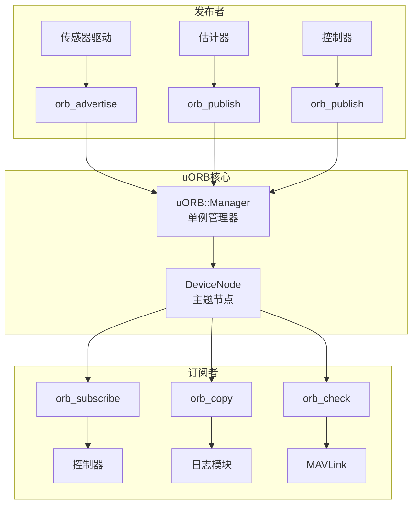
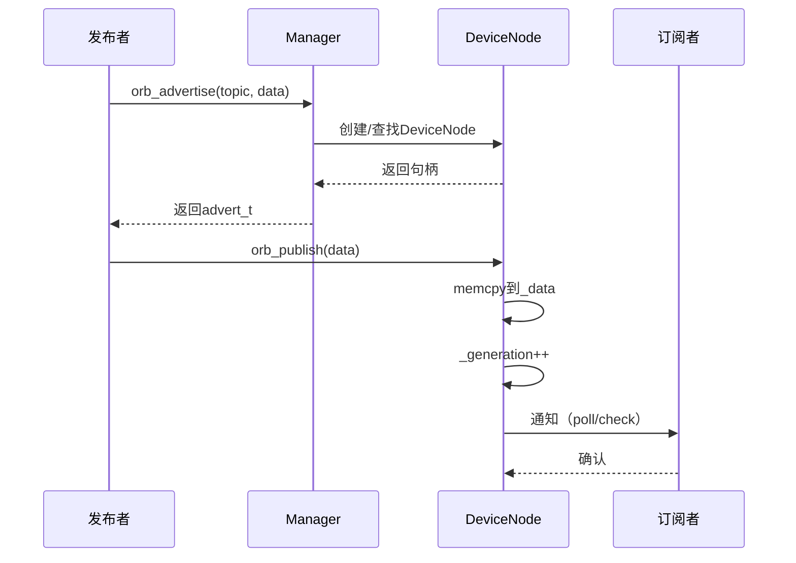

# PX4 uORB消息总线完整教材

## 第一章：概述

### 1.1 什么是uORB

uORB (Micro Object Request Broker) 是PX4的核心进程间通信(IPC)机制，提供异步发布/订阅消息传递。

**核心特点**：
- **发布/订阅模式**：松耦合的模块通信
- **零拷贝**：订阅者直接读取共享内存
- **类型安全**：编译时生成强类型消息
- **多实例支持**：同一主题可有多个实例
- **优先级队列**：支持可配置的消息队列深度

### 1.2 系统架构



**关键代码位置**：
- 管理器：`platforms/common/uORB/uORBManager.cpp:55-67`
- 设备节点：`platforms/common/uORB/uORBDeviceNode.cpp`
- API接口：`platforms/common/uORB/uORB.h`
- 消息定义：`msg/*.msg`

---

## 第二章：消息定义

### 2.1 消息文件格式

```python
# msg/vehicle_attitude.msg

# 时间戳（微秒） - 必须是第一个字段
uint64 timestamp

# 四元数姿态 [w, x, y, z]
float32[4] q

# 保留字段
float32[4] delta_q_reset

# 四元数重置计数器
uint8 quat_reset_counter
```

**消息文件规则**：
1. **timestamp字段**：必须是第一个字段，类型为`uint64`
2. **类型支持**：`bool`, `int8/16/32/64`, `uint8/16/32/64`, `float32/64`
3. **数组**：固定长度数组 `float32[3]`，变长数组 `uint8[]`
4. **注释**：使用`#`开头

### 2.2 生成的C++代码

编译时从`.msg`生成C++头文件：

```cpp
// build/px4_fmu-v6x_default/uORB/topics/vehicle_attitude.h

struct vehicle_attitude_s {
    uint64_t timestamp;       // 微秒时间戳
    float q[4];              // 四元数 [w,x,y,z]
    float delta_q_reset[4];
    uint8_t quat_reset_counter;
    uint8_t _padding0[7];    // 对齐填充

    // 编译时常量
    static constexpr uint8_t ORB_QUEUE_LENGTH = 1;
};
```

**生成工具**：
- `Tools/msg/px_generate_uorb_topic_files.py`
- CMake自动调用：`msg/CMakeLists.txt`

### 2.3 多实例消息

某些主题允许多个实例（如多IMU）：

```python
# msg/sensor_accel.msg

# 时间戳
uint64 timestamp
uint64 timestamp_sample

# 设备ID（区分不同实例）
uint32 device_id

# 加速度数据
float32 x  # m/s^2
float32 y
float32 z

uint8 ORB_QUEUE_LENGTH = 4  # 队列深度
```

**实例标识**：
- 通过`orb_advertise_multi()`发布
- `device_id`字段区分不同硬件
- 最多支持4个实例（可配置）

---

## 第三章：核心API

### 3.1 发布者API

#### 广告主题

```cpp
#include <uORB/uORB.h>
#include <uORB/topics/vehicle_attitude.h>

// 1. 广告主题（首次发布前）
orb_advert_t attitude_pub = orb_advertise(
    ORB_ID(vehicle_attitude),
    &attitude_data
);

// 2. 多实例广告
int instance;
orb_advert_t accel_pub = orb_advertise_multi(
    ORB_ID(sensor_accel),
    &accel_data,
    &instance,
    ORB_PRIO_DEFAULT
);
```

**参数说明**：
- `ORB_ID(topic)`：主题标识符宏
- `instance`：返回的实例编号（0,1,2...）
- `ORB_PRIO_DEFAULT/HIGH/LOW/VERY_LOW`：优先级

#### 发布消息

```cpp
// 填充数据
vehicle_attitude_s attitude;
attitude.timestamp = hrt_absolute_time();
attitude.q[0] = 1.0f;  // w
attitude.q[1] = 0.0f;  // x
attitude.q[2] = 0.0f;  // y
attitude.q[3] = 0.0f;  // z

// 发布
int ret = orb_publish(ORB_ID(vehicle_attitude), attitude_pub, &attitude);
if (ret != PX4_OK) {
    PX4_ERR("publish failed");
}
```

**性能要点**：
- `orb_publish()`是**零拷贝**操作
- 仅更新共享内存中的数据
- 通知所有订阅者有新数据

### 3.2 订阅者API

#### 订阅主题

```cpp
// 1. 订阅主题
int attitude_sub = orb_subscribe(ORB_ID(vehicle_attitude));

// 2. 订阅特定实例
int accel_sub = orb_subscribe_multi(ORB_ID(sensor_accel), 0); // 实例0
```

#### 检查更新

```cpp
// 方法1：轮询检查
bool updated;
orb_check(attitude_sub, &updated);

if (updated) {
    // 有新数据
}

// 方法2：阻塞等待（带超时）
px4_pollfd_struct_t fds[] = {
    { .fd = attitude_sub, .events = POLLIN }
};

int ret = px4_poll(fds, 1, 1000); // 1秒超时

if (ret > 0 && fds[0].revents & POLLIN) {
    // 有新数据
}
```

#### 读取数据

```cpp
vehicle_attitude_s attitude;

// 拷贝最新数据
orb_copy(ORB_ID(vehicle_attitude), attitude_sub, &attitude);

// 使用数据
float roll, pitch, yaw;
euler_from_quat(attitude.q, &roll, &pitch, &yaw);
```

#### 取消订阅

```cpp
orb_unsubscribe(attitude_sub);
```

### 3.3 C++ Wrapper类

PX4提供C++包装简化使用：

```cpp
#include <uORB/Subscription.hpp>
#include <uORB/Publication.hpp>

class MyModule
{
private:
    // 订阅（自动管理生命周期）
    uORB::Subscription _attitude_sub{ORB_ID(vehicle_attitude)};

    // 发布
    uORB::Publication<vehicle_attitude_setpoint_s> _att_sp_pub{ORB_ID(vehicle_attitude_setpoint)};

public:
    void run() {
        // 检查更新
        if (_attitude_sub.updated()) {
            vehicle_attitude_s att;
            _attitude_sub.copy(&att);  // 读取数据

            // 处理...

            // 发布
            vehicle_attitude_setpoint_s sp{};
            sp.timestamp = hrt_absolute_time();
            // ... 填充数据
            _att_sp_pub.publish(sp);
        }
    }
};
```

**优势**：
- RAII自动管理订阅生命周期
- 无需手动`orb_subscribe/unsubscribe`
- 类型安全的发布/订阅

---

## 第四章：高级特性

### 4.1 消息队列

某些主题支持消息队列（保留历史数据）：

```python
# msg/sensor_gyro.msg
uint64 timestamp
# ...
uint8 ORB_QUEUE_LENGTH = 8  # 保留最近8条消息
```

**订阅者读取**：
```cpp
sensor_gyro_s gyro;
while (orb_copy(ORB_ID(sensor_gyro), gyro_sub, &gyro) == PX4_OK) {
    // 处理历史数据
    process(gyro);
}
```

### 4.2 更新间隔限制

```cpp
#include <uORB/SubscriptionInterval.hpp>

// 每100ms最多检查一次
uORB::SubscriptionInterval _param_update_sub{ORB_ID(parameter_update), 100_ms};

void run() {
    if (_param_update_sub.updated()) {
        // 至少间隔100ms才会返回true
    }
}
```

### 4.3 订阅回调

```cpp
#include <uORB/SubscriptionCallback.hpp>

class MyModule : public ModuleBase<MyModule>
{
    uORB::SubscriptionCallback _attitude_sub{this, ORB_ID(vehicle_attitude)};

public:
    void Run() override {
        // 当有新数据时自动调用
        vehicle_attitude_s att;
        _attitude_sub.copy(&att);
        process(att);
    }
};
```

### 4.4 主题优先级

发布时可指定优先级：

```cpp
int instance;
orb_advert_t pub = orb_advertise_multi_queue(
    ORB_ID(sensor_accel),
    &data,
    &instance,
    ORB_PRIO_HIGH,  // 高优先级
    8               // 队列深度
);
```

**优先级用途**：
- 传感器融合时优先选择高优先级源
- 冗余传感器的主备切换

---

## 第五章：实现原理

### 5.1 数据结构

#### DeviceNode - 主题节点

```cpp
// platforms/common/uORB/uORBDeviceNode.hpp
class uORB::DeviceNode
{
private:
    const struct orb_metadata *_meta;  // 主题元数据
    uint8_t *_data;                    // 消息数据（共享内存）
    hrt_abstime _last_update;          // 最后更新时间
    uint8_t _queue_size;               // 队列深度
    uint8_t _generation;               // 更新计数器

    SubscriberData *_subscriber_list;  // 订阅者链表

public:
    int publish(const void *data);     // 发布数据
    int copy(void *dst);               // 拷贝数据
    bool appears_updated(SubscriberData *sd);
};
```

**关键点**：
- `_data`：存储实际消息的缓冲区
- `_generation`：每次发布递增，订阅者用此判断是否有新数据
- 订阅者链表：跟踪所有订阅者

#### Manager - 全局管理器

```cpp
// platforms/common/uORB/uORBManager.hpp
class uORB::Manager
{
private:
    static Manager *_Instance;  // 单例

    DeviceMaster *_device_master;  // 设备管理器
    List<DeviceNode *> _node_list; // 所有主题节点

public:
    static bool initialize();
    orb_advert_t orb_advertise(const struct orb_metadata *meta, const void *data);
    int orb_subscribe(const struct orb_metadata *meta);
};
```

### 5.2 发布流程



**代码路径**：
```cpp
// platforms/common/uORB/uORB.cpp
int orb_publish(orb_advert_t handle, const void *data)
{
    return uORB::Manager::get_instance()->orb_publish(handle, data);
}

// uORBManager.cpp
int Manager::orb_publish(orb_advert_t handle, const void *data)
{
    DeviceNode *node = (DeviceNode *)handle;
    return node->publish(data);
}

// uORBDeviceNode.cpp
int DeviceNode::publish(const void *data)
{
    // 1. 拷贝数据到共享内存
    memcpy(_data, data, _meta->o_size);

    // 2. 更新时间戳和计数器
    _last_update = hrt_absolute_time();
    _generation++;

    // 3. 通知订阅者（poll_notify）
    poll_notify(POLLIN);

    return PX4_OK;
}
```

### 5.3 订阅与读取

```cpp
// platforms/common/uORB/uORB.cpp
int orb_subscribe(const struct orb_metadata *meta)
{
    return uORB::Manager::get_instance()->orb_subscribe(meta);
}

// uORBDeviceNode.cpp
int DeviceNode::copy(void *dst, SubscriberData *sd)
{
    // 检查是否有新数据
    if (!appears_updated(sd)) {
        return -ENOENT;
    }

    // 拷贝数据
    memcpy(dst, _data, _meta->o_size);

    // 更新订阅者的generation
    sd->generation = _generation;

    return PX4_OK;
}

bool DeviceNode::appears_updated(SubscriberData *sd)
{
    return sd->generation != _generation;
}
```

---

## 第六章：性能优化

### 6.1 避免高频轮询

❌ **错误做法**：
```cpp
void high_freq_loop() // 1000Hz
{
    bool updated;
    orb_check(attitude_sub, &updated);

    if (updated) {
        orb_copy(...);  // 仅在updated时拷贝
    }
}
```

✅ **正确做法**：
```cpp
void run()
{
    px4_pollfd_struct_t fds[] = {
        { .fd = attitude_sub, .events = POLLIN }
    };

    while (!should_exit()) {
        int ret = px4_poll(fds, 1, 100); // 阻塞等待

        if (ret > 0 && fds[0].revents & POLLIN) {
            orb_copy(...);
        }
    }
}
```

### 6.2 批量读取队列

```cpp
sensor_gyro_s gyro_buffer[8];
int count = 0;

while (orb_copy(ORB_ID(sensor_gyro), gyro_sub, &gyro_buffer[count]) == PX4_OK) {
    count++;
    if (count >= 8) break;
}

// 批量处理
process_batch(gyro_buffer, count);
```

### 6.3 使用SubscriptionData

```cpp
#include <uORB/SubscriptionData.hpp>

// 自动缓存最新数据
uORB::SubscriptionData<vehicle_attitude_s> _attitude_sub{ORB_ID(vehicle_attitude)};

void run() {
    // 直接访问，无需orb_copy
    float qw = _attitude_sub.get().q[0];

    // 或更新后访问
    if (_attitude_sub.update()) {
        float qw = _attitude_sub.get().q[0];
    }
}
```

---

## 第七章：调试工具

### 7.1 listener命令

```bash
# 实时监听主题
pxh> listener vehicle_attitude

# 输出示例
TOPIC: vehicle_attitude
    timestamp: 123456789
    q[0]: 1.000000
    q[1]: 0.001234
    q[2]: -0.002345
    q[3]: 0.000456

# 监听N条消息后退出
pxh> listener vehicle_attitude -n 10

# 监听多个主题
pxh> listener sensor_accel sensor_gyro
```

### 7.2 uorb top

```bash
pxh> uorb top

# 输出示例（类似Linux top）
TOPIC                   INST #SUB #MSG RATE(Hz) BANDWIDTH
vehicle_attitude           0    5  1234   200.1      6.2KB/s
sensor_accel               0    3  2000   400.0     12.5KB/s
sensor_gyro                0    3  2000   400.0     12.5KB/s
vehicle_local_position     0    8   500   100.0      4.0KB/s
```

**列说明**：
- `INST`：实例编号
- `#SUB`：订阅者数量
- `#MSG`：消息总数
- `RATE`：发布频率
- `BANDWIDTH`：估算带宽

### 7.3 uorb status

```bash
pxh> uorb status

# 输出
  Topic               #SUB  #MSG    Rate(Hz)
  vehicle_attitude       5   1234      200
  sensor_accel           3   2000      400
  Total topics: 87
  Total subscriptions: 234
```

---

## 第八章：最佳实践

### 8.1 消息设计

✅ **推荐**：
```python
# 紧凑的消息结构
uint64 timestamp
float32 x
float32 y
float32 z
uint8 quality
```

❌ **避免**：
```python
# 过大的消息（浪费内存）
uint64 timestamp
float64[100] large_array  # 800字节！
```

### 8.2 发布频率

```cpp
// 高频传感器（400Hz）
sensor_gyro_s gyro;
// ...
orb_publish(ORB_ID(sensor_gyro), pub, &gyro);

// 低频状态（10Hz）
if (hrt_elapsed_time(&last_pub) > 100_ms) {
    vehicle_status_s status;
    // ...
    orb_publish(ORB_ID(vehicle_status), pub, &status);
    last_pub = hrt_absolute_time();
}
```

### 8.3 线程安全

uORB是**线程安全**的：
- `orb_publish()`可从任意线程调用
- 内部使用互斥锁保护
- 无需外部同步

---

## 第九章：实战案例

### 案例1：自定义传感器驱动

```cpp
#include <uORB/Publication.hpp>
#include <uORB/topics/sensor_accel.h>

class MyAccelDriver
{
private:
    uORB::Publication<sensor_accel_s> _accel_pub{ORB_ID(sensor_accel)};

public:
    void publishData() {
        sensor_accel_s accel{};
        accel.timestamp = hrt_absolute_time();
        accel.timestamp_sample = accel.timestamp;
        accel.device_id = get_device_id();

        // 读取硬件
        read_hardware(&accel.x, &accel.y, &accel.z);

        _accel_pub.publish(accel);
    }
};
```

### 案例2：数据融合模块

```cpp
class SensorFusion
{
private:
    uORB::Subscription _accel_sub{ORB_ID(sensor_accel)};
    uORB::Subscription _gyro_sub{ORB_ID(sensor_gyro)};
    uORB::Publication<vehicle_attitude_s> _attitude_pub{ORB_ID(vehicle_attitude)};

public:
    void run() {
        px4_pollfd_struct_t fds[] = {
            { .fd = _accel_sub.get_fd(), .events = POLLIN },
            { .fd = _gyro_sub.get_fd(), .events = POLLIN }
        };

        px4_poll(fds, 2, 100);

        sensor_accel_s accel;
        sensor_gyro_s gyro;

        if (fds[0].revents & POLLIN) _accel_sub.copy(&accel);
        if (fds[1].revents & POLLIN) _gyro_sub.copy(&gyro);

        // 融合算法
        vehicle_attitude_s att = fuse(accel, gyro);

        _attitude_pub.publish(att);
    }
};
```

---

## 第十章：总结

### 核心要点

1. **发布/订阅**：松耦合、异步通信
2. **零拷贝**：高性能共享内存
3. **类型安全**：编译时生成代码
4. **多实例**：支持冗余传感器
5. **C++ Wrapper**：RAII自动管理

### 进一步学习

- **源码**：`platforms/common/uORB/`
- **消息定义**：`msg/*.msg`
- **示例**：`src/examples/px4_simple_app/`

---

**文档版本**：v1.0
**适用PX4版本**：v1.14+
**最后更新**：2025-11-24
**作者**：基于PX4源码编写
