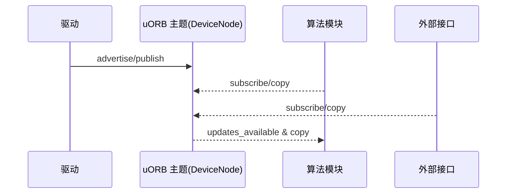

# uORB 消息总线

PX4 的内核内发布/订阅机制，贯穿驱动、模块与接口。

核心实现与引用：
- 管理器单例与初始化：`platforms/common/uORB/uORBManager.cpp:55-68`
- 主题存在与广告：`platforms/common/uORB/uORBManager.cpp:240-266, 268-334`
- 发布与订阅：`platforms/common/uORB/uORBManager.cpp:365-376, 349-359`
- 更新检查与回调：`platforms/common/uORB/uORBManager.cpp:396-413, 462-471`
- 消息定义：`msg/*.msg`、版本化消息 `msg/versioned/*.msg`
- 调试命令：`src/systemcmds/uorb/uorb.cpp`

设计要点：
- 单发布者/多订阅者，同步拷贝与可配置队列深度，避免锁竞争与复杂缓存一致性问题。
- 在 NuttX（内核/用户）支持通过 ioctl 进行设备化交互：`uORBManager.cpp:117-237`。
- 与 ROS2/DDS 的桥接通过中间层翻译（见接口章节）。

