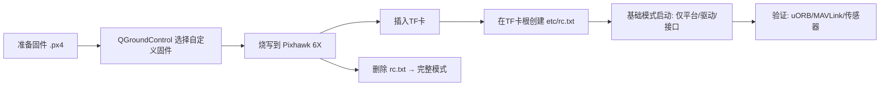

# 通过地面站烧写 PX4 固件与基础启动脚本配置教程



## 前置准备

* 安装 QGroundControl（桌面版），并安装 USB 驱动（Windows 会自动安装 CDC ACM 驱动）。

* 准备固件 `.px4` 文件：

  * 完整模式：`make px4_fmu-v6x_default`

  * 基础模式（我们新增的变体）：`make px4_fmu-v6x_default-base`

  * 产物路径示例：`build/px4_fmu-v6x_default-base/px4_fmu-v6x_default-base.px4`

## 通过地面站烧写固件

1. USB 线直连 Pixhawk 6X 与电脑。
2. 打开 QGroundControl → “Firmware”/“固件”选项。
3. 选择“自定义固件文件”，浏览到你的 `.px4` 文件并确认。
4. 按提示烧写，完成后设备会自动重启。若未进入引导模式，重新插拔 USB 后重试。

## 配置基础启动脚本（避免完整自动启动）

PX4 在启动时会优先检查 TF 卡上的 `/fs/microsd/etc/rc.txt`（入口脚本 `rcS`：`ROMFS/px4fmu_common/init.d/rcS` 中搜索注释 "Look for an init script on the microSD card"）。若存在该文件，则执行你自定义的流程，默认自动机型/控制/导航不再加载。

步骤：

1. 格式化 TF 卡为 FAT32（建议在电脑上完成）。
2. 在 TF 卡根目录创建文件夹 `etc`。
3. 在 `etc` 目录下创建文件 `rc.txt`，示例内容如下（基础模式最小链路）：

```sh
set R /
. ${R}etc/init.d/rc.serial
. ${R}etc/init.d/rc.sensors
sensors start
# 如需 GNSS/RTK 原始数据，按硬件端口与协议启用：
# gps start -d /dev/ttyS0 -p ubx
if param greater -s SYS_USB_AUTO -1
then
    if ! cdcacm_autostart start
    then
        sercon
        mavlink start -d /dev/ttyACM0
    fi
fi
param set EKF2_EN 0
mavlink boot_complete
```

说明：

* 文件路径为 TF 卡根的 `etc/rc.txt`；PX4 启动时挂载为 `/fs/microsd` 并从 `/fs/microsd/etc/rc.txt` 加载。

* `EKF2_EN=0` 用于防止状态估计器启动；如需只获取原始传感器数据，请不要启用控制/导航模块。

* 若需要 GNSS/RTK：启用 `gps start` 并通过 MAVLink 注入 `GPS_RTCM_DATA`（`src/modules/mavlink/mavlink_receiver.cpp:2603-2620`），驱动通过 `gps_inject_data` 处理。

## 启动与验证

1. 插入 TF 卡，USB 连接设备，启动后 QGroundControl 应能收到 MAVLink 心跳。
2. 在 QGC 的 MAVLink 控制台（或串口终端）运行：

   * `uorb top` 查看话题更新率

   * `listener sensor_imu` / `listener sensor_gps` 验证原始数据
3. 确认未运行飞控算法：`top`/`ps` 任务列表中不应出现 `ekf2/mc_*/fw_*/navigator`。

## 切换回完整模式

* 删除 TF 卡上的 `etc/rc.txt`，或将其内容改为 `. ${R}etc/init.d/rc.autostart`。

* 重启设备，恢复完整自动机型/控制/导航启动流程。

## 进阶：外部机型脚本目录

* 若希望以外部目录替换机型脚本，可使用 `/fs/microsd/ext_autostart`；入口脚本会在自动机型失败时尝试加载（`rcS:231-244`）。

* 支持热更新：将新内容放入 `/fs/microsd/ext_autostart_new`，启动时会自动替换为 `ext_autostart`（`rcS:108-114`）。

## 常见问题

* QGC 识别不到设备：更换 USB 线或端口，确保直连；如需引导模式，重新插拔或根据板卡提示进入 Bootloader。

* 烧写失败：确认 `.px4` 文件来自对应的 `px4_fmu-v6x_*` 构建目标；切换到另一台电脑或使用脚本 `Tools/px_uploader.py`。

* 基础模式无定位流：这是预期行为（不启动 EKF2/导航/控制）；可通过 `sensor_*` 原始话题与自研消息实现你的管道。

## 参考代码位置

* 入口脚本与覆盖：`ROMFS/px4fmu_common/init.d/rcS`
  - rc.txt 检查: 搜索 "Look for an init script on the microSD card"
  - 机型配置加载: 搜索 "Load airframe configuration based on SYS_AUTOSTART"
  - 外部自动启动: 搜索 "Check for an update of the ext_autostart folder"

* 传感器启动：`ROMFS/px4fmu_common/init.d/rcS` (搜索 "Sensors System") 与 `ROMFS/px4fmu_common/init.d/rc.sensors`

* 估计器选择：`ROMFS/px4fmu_common/init.d/rcS` (搜索 "state estimator selection")

* MAVLink 与串口：`ROMFS/px4fmu_common/init.d/rcS`（搜索 "Start UART/Serial device drivers"）；串口生成 `Tools/serial/generate_config.py`

* RTCM 注入链：`src/modules/mavlink/mavlink_receiver.cpp`（搜索函数 `handle_message_gps_rtcm_data`）→ 驱动 `src/drivers/gps/devices/src/gps_helper.h`（搜索 `gotRTCMMessage`）

