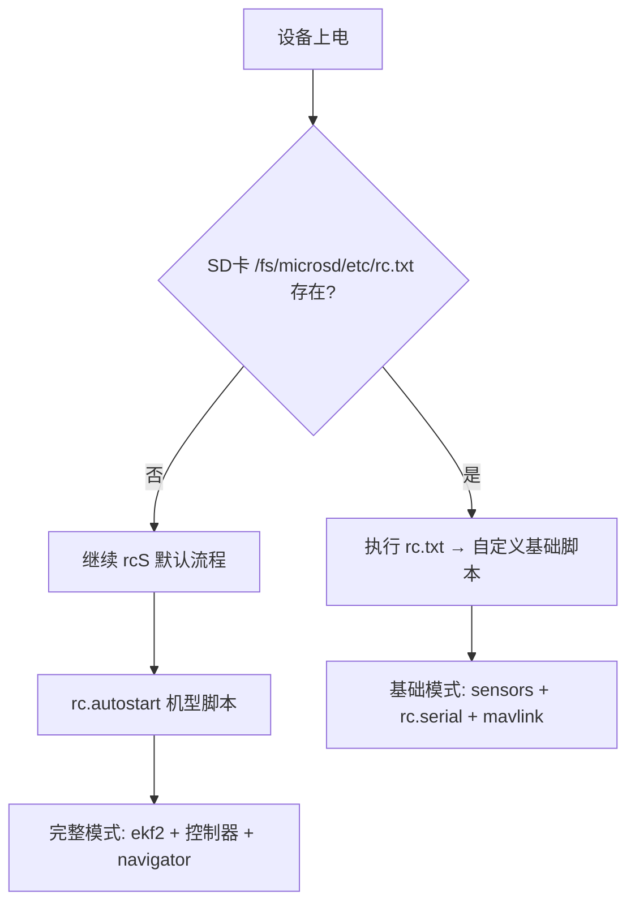

# 通用基础系统开发计划（切换与编译补充）

- 入口与覆盖：`ROMFS/px4fmu_common/init.d/rcS`（搜索 "Look for an init script on the microSD card"，优先执行 `/fs/microsd/etc/rc.txt`）
- 传感器启动：`ROMFS/px4fmu_common/init.d/rcS`（搜索 "Sensors System"）+ `rc.sensors`
- 估计器选择：`ROMFS/px4fmu_common/init.d/rcS`（搜索 "state estimator selection"）
- MAVLink 与串口：`ROMFS/px4fmu_common/init.d/rcS`（搜索 "Start UART/Serial device drivers"）；串口生成器 `Tools/serial/generate_config.py`
- Pixhawk 6X 目标：`boards/px4/fmu-v6x/`；构建 `make px4_fmu-v6x_default`
- RTCM 注入链：`src/modules/mavlink/mavlink_receiver.cpp`（搜索函数 `handle_message_gps_rtcm_data`）；驱动处理 `src/drivers/gps/devices/src/gps_helper.h`（搜索 `gotRTCMMessage` 和 `shouldInjectRTCM`）

## 模式说明
- 完整模式：默认 `rcS` → 自动机型/控制/导航/估计器等全栈。
- 基础模式：仅平台/驱动/外部接口，不加载 EKF2/控制器/导航（便于自研管道）。

## 运行时切换（SD 卡覆盖）
- 切到基础模式：在 SD 卡创建 `/fs/microsd/etc/rc.txt`，内容示例见《基础层启动脚本设计.md》。
- 切回完整模式：删除 `/fs/microsd/etc/rc.txt` 或将其内容改为 `. ${R}etc/init.d/rc.autostart`。
- 外部机型目录：`/fs/microsd/ext_autostart`（`rcS:231-244, 108-114`）可替换机型脚本。

## 编译固件（Pixhawk 6X）
- 完整固件：
  - 构建：`make px4_fmu-v6x_default`
  - 上传：`make px4_fmu-v6x_default upload`
  - 交互裁剪检查：`make px4_fmu-v6x_default boardconfig`
- 基础固件方案：
  - A. ROMFS 内嵌基础脚本（推荐调试）
    - 在 `ROMFS/px4fmu_common/init.d/` 添加 `rc.base_core` 并在其 `CMakeLists.txt` 使用 `px4_add_romfs_files(...)` 打包。
    - 通过 SD `rc.txt` 执行 `rc.base_core`，无需改 `rcS`，构建仍用 `make px4_fmu-v6x_default`。
  - B. 新 `.px4board` 变体（适合量产）
    - 在 `boards/px4/fmu-v6x/` 复制现有 `.px4board` 为新变体，仅启用平台/驱动/接口模块，禁用 EKF2/控制器/导航等。
    - 构建：`make px4_fmu-v6x_<your_variant>`。

## GPS/RTK 与接口最小配置
- 需要 GNSS 原始/RTK：
  - 启动 GPS 驱动（脚本层）：`gps start -d /dev/ttySx -p ubx`（设备/协议依硬件）。
  - MAVLink 注入 RTCM：外部发 `GPS_RTCM_DATA` → `mavlink_receiver.cpp:2603-2620` 发布 `gps_inject_data` → 驱动处理（`gps_helper.h:288-297`、`septentrio.cpp:352`）。
- MAVLink：`. ${R}etc/init.d/rc.serial` 后，若 `cdcacm_autostart` 失败回退 `sercon` 并 `mavlink start -d /dev/ttyACM0`（`rcS:514-523`）。

## 验证步骤（基础模式）
- 传感器：`listener sensor_imu`、`listener sensor_gps`；`uorb top` 看更新率。
- 估计器：确认未运行 `ekf2/lpe/attitude_estimator_q`；`top`/`ps` 浏览任务。
- 控制/导航：确认未运行 `mc_*`/`fw_*`/`navigator`。
- MAVLink：检查心跳/参数交互；RTCM 注入后看 `sensor_gnss_relative`。

## 仿真（可选）
- 构建：`make px4_sitl jmavsim` 或 `make px4_sitl gz_iris`；POSIX 下也支持外部脚本覆盖。

## 风险与注意
- 不启 EKF2/控制器/导航：位置/姿态类 MAVLink 流缺失属预期；日志/检查行为不同。
- 串口设备名与波特率由 `rc.serial` 自动生成与硬件布线决定；基础脚本须在其后启动驱动与 MAVLink。
- SD 卡运行时切换便于调试；量产或无 SD 推荐 ROMFS 内嵌方案。
