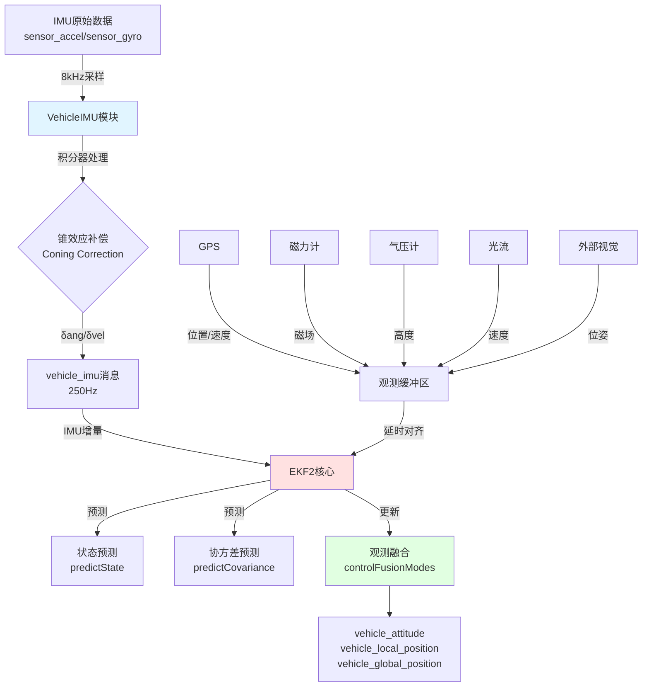
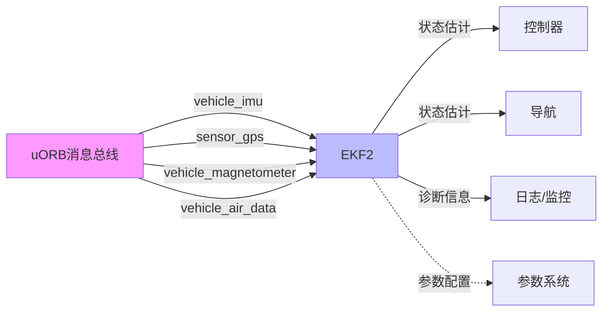
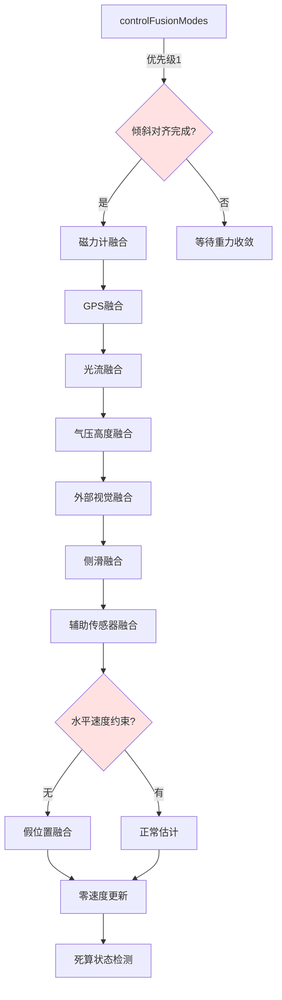
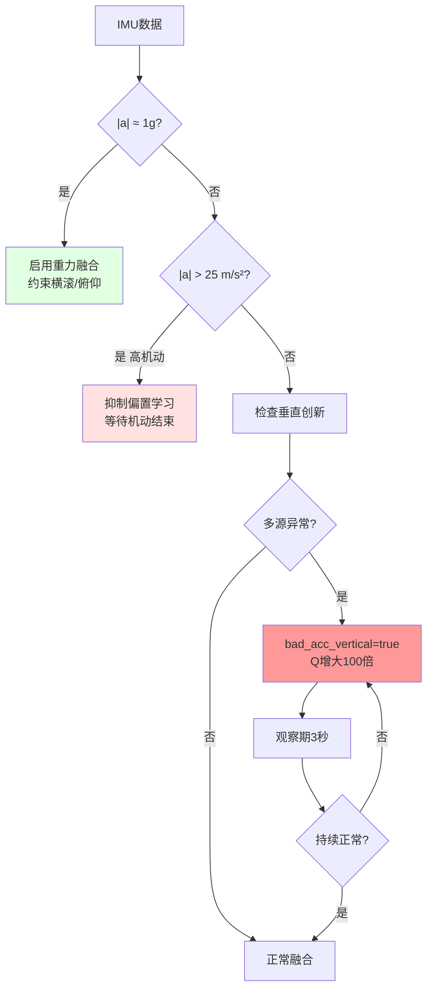
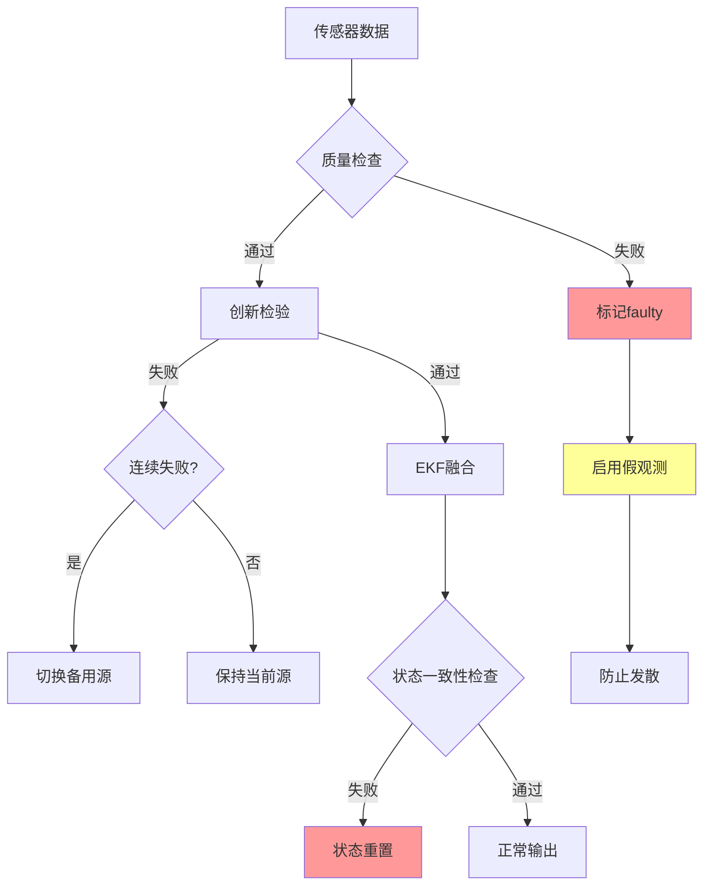

# PX4 EKF2 扩展卡尔曼滤波器算法详解

## 目录
- [1. 概述](#1-概述)
- [2. 系统架构](#2-系统架构)
- [3. IMU数据处理](#3-imu数据处理)
- [4. EKF2核心算法](#4-ekf2核心算法)
- [5. 协方差预测](#5-协方差预测)
- [6. 观测融合](#6-观测融合)
- [7. 比力倾斜误差处理](#7-比力倾斜误差处理) ⭐ 新增
- [8. 算法创新点](#8-算法创新点)
- [9. 总结](#9-总结)

---

## 1. 概述

PX4的EKF2（Extended Kalman Filter 2）是一个24状态量（可扩展至更多）的扩展卡尔曼滤波器，用于多传感器融合的姿态与位置估计。

### 1.1 核心模块定位

```
src/modules/ekf2/                    # EKF2主模块
├── EKF2.cpp/hpp                     # 模块封装层（uORB接口）
├── EKF/                             # 核心算法实现
│   ├── ekf.h                        # EKF类定义
│   ├── common.h                     # 公共数据结构
│   ├── estimator_interface.cpp     # 估计器接口
│   ├── covariance.cpp               # 协方差初始化/预测
│   ├── control.cpp                  # 融合模式控制
│   ├── imu_down_sampler/            # IMU降采样
│   ├── aid_sources/                 # 辅助观测源融合
│   ├── bias_estimator/              # 偏置估计器
│   └── python/ekf_derivation/       # 符号推导（自动生成代码）
└── src/modules/sensors/vehicle_imu/ # IMU数据预处理
    ├── VehicleIMU.cpp/hpp           # 加速度/陀螺积分与质量监控
    └── Integrator.hpp               # 积分器（含圆锥补偿）
```

### 1.2 状态向量定义

EKF2的24维状态向量（可选扩展至29维）：

| 状态索引 | 符号 | 维度 | 描述 |
|---------|------|------|------|
| 0-3 | q₀, q₁, q₂, q₃ | 4 | 四元数（机体到NED坐标系旋转） |
| 4-6 | vₙ, vₑ, vᵈ | 3 | NED坐标系速度 (m/s) |
| 7-9 | pₙ, pₑ, pᵈ | 3 | NED坐标系位置 (m) |
| 10-12 | δθₓ, δθᵧ, δθᵤ | 3 | 陀螺仪偏置 (rad/s) |
| 13-15 | δvₓ, δvᵧ, δvᵤ | 3 | 加速度计偏置 (m/s²) |
| 16-18 | magₙ, magₑ, magᵈ | 3 | 地磁场（NED） (Gauss) |
| 19-21 | magₓ, magᵧ, magᵤ | 3 | 机体磁偏置 (Gauss) |
| 22-23 | wₙ, wₑ | 2 | 风速度（NED水平） (m/s) |
| 24 | hₜₑᵣᵣₐᵢₙ | 1 | 地形高度 (m) |

---

## 2. 系统架构

### 2.1 整体数据流



### 2.2 模块间关系



---

## 3. IMU数据处理

### 3.1 VehicleIMU模块职责

**代码位置**: `src/modules/sensors/vehicle_imu/VehicleIMU.cpp`

#### 核心功能

1. **原始数据积分**：将高频采样的角速度和加速度积分为角度增量(δang)和速度增量(δvel)
2. **圆锥效应补偿**：使用圆锥积分算法降低姿态积分误差
3. **振动监控**：统计加速度/角速度变化率，发布振动指标
4. **剪切检测**：检测传感器饱和/削波，通知EKF增加过程噪声

#### 积分器流程

```mermaid
graph TD
    A[8kHz IMU原始数据] -->|采样| B{积分周期<br/>5ms}

    B -->|累积| C[加速度积分器<br/>Integrator]
    B -->|累积| D[陀螺积分器<br/>IntegratorConing]

    C -->|计算| E[δvel = Σ(a·dt)]
    D -->|圆锥补偿| F[δang = Σ(ω·dt) + coning_correction]

    E --> G{积分周期到?}
    F --> G

    G -->|是| H[发布vehicle_imu<br/>250Hz]
    G -->|否| B

    H --> I[EKF2消费]

    style C fill:#e1f5ff
    style D fill:#ffe1f5
```

#### 圆锥效应补偿原理

当飞行器同时存在俯仰和滚转角速度时，简单的角度积分会产生**圆锥误差**。

**补偿公式**：
```
δθ_compensated = δθ_integrated + (1/12)·(δθₖ₋₁ × δθₖ)
```

其中：
- `δθ_integrated`：简单积分的角度增量
- `δθₖ₋₁`：上一个积分周期的角度增量
- `×`：叉乘运算

**物理意义**：
- 叉乘项捕捉旋转矢量的非交换性（旋转顺序敏感）
- 系数1/12来自于二阶泰勒展开

### 3.2 降采样与时序对齐

**代码位置**: `src/modules/ekf2/EKF/imu_down_sampler/`

#### 为什么需要降采样？

1. **计算效率**：EKF协方差预测复杂度O(n³)，降低更新率可减少计算负担
2. **噪声抑制**：多次采样平均可降低高频噪声
3. **时序一致**：观测源（GPS/磁力计）频率通常<50Hz，IMU需匹配

#### 降采样策略

```cpp
// 目标积分周期：10ms (100Hz)
int32_t target_dt_us = 10000;

// 累积N个原始样本（N = target_dt / sensor_dt）
for (int i = 0; i < required_samples; i++) {
    // 四元数乘法累积角度（非线性累加）
    delta_angle_accumulated = delta_angle_accumulated * Quatf(delta_ang_new);

    // 线性累积速度增量
    delta_vel_accumulated += delta_vel_new;
}

// 发布降采样后的IMU样本
imu_downsampled.delta_ang = delta_angle_accumulated.to_axis_angle();
imu_downsampled.delta_vel = delta_vel_accumulated;
```

---

## 4. EKF2核心算法

### 4.1 预测步骤（Prediction）

#### 状态预测方程

**代码位置**: `src/modules/ekf2/EKF/estimator_interface.cpp::predictState()`

**四元数更新**（使用四元数微分方程）：
```
q̇ = 0.5 · q ⊗ ω_body
```

实现细节：
```cpp
// 从IMU增量计算旋转增量四元数
const Vector3f delta_ang_corrected = imu.delta_ang - _state.gyro_bias * imu.delta_ang_dt;
const Quatf dq(AxisAnglef(delta_ang_corrected));

// 更新四元数姿态
_state.quat_nominal = (_state.quat_nominal * dq).normalized();

// 更新DCM（方向余弦矩阵）
_R_to_earth = Dcmf(_state.quat_nominal);
```

**速度预测**（考虑重力与科里奥利力）：
```
v̇ = R(q)·(a_body - b_accel) + g - 2Ω_earth × v
```

实现代码：
```cpp
// 加速度修正（去除偏置）
const Vector3f delta_vel_corrected = imu.delta_vel - _state.accel_bias * imu.delta_vel_dt;

// 转换到NED坐标系并减去重力
const Vector3f vel_last = _state.vel;
_state.vel += _R_to_earth * delta_vel_corrected;
_state.vel(2) += _gravity_mss * imu.delta_vel_dt; // 重力补偿（NED坐标系下向下为正）

// 科里奥利修正（高速/高纬度场景）
if ((_params.ekf2_imu_ctrl & static_cast<int32_t>(ImuCtrl::GyroBias))) {
    _state.vel -= 2.f * _earth_rate_NED.cross(0.5f * (vel_last + _state.vel)) * imu.delta_vel_dt;
}
```

**位置预测**（梯形积分）：
```
p = p + 0.5·(v_k + v_k+1)·dt
```

```cpp
_state.pos += (_state.vel + vel_last) * 0.5f * imu.delta_vel_dt;
```

### 4.2 协方差预测

**代码位置**: `src/modules/ekf2/EKF/covariance.cpp::predictCovariance()`

#### 离散时间协方差传播

标准EKF协方差预测公式：
```
P_k+1|k = F·P_k|k·F^T + Q
```

其中：
- `F`：状态转移雅可比矩阵
- `Q`：过程噪声协方差矩阵

#### PX4的符号推导方法

使用**SymPy符号计算**自动生成雅可比矩阵：

```python
# python/ekf_derivation/main.py
from sympy import *

# 定义符号状态变量
q0, q1, q2, q3 = symbols('q0 q1 q2 q3')  # 四元数
vn, ve, vd = symbols('vn ve vd')          # 速度
# ... 其他状态

# 定义状态预测方程
state_pred = predict_state(q, v, p, gyro_bias, accel_bias, ...)

# 计算雅可比矩阵
F = state_pred.jacobian([q0, q1, q2, q3, vn, ve, vd, ...])

# 生成C++代码
generate_cpp_code(F, 'predict_covariance.h')
```

生成的代码位置：`src/modules/ekf2/EKF/python/ekf_derivation/generated/predict_covariance.h`

#### 过程噪声模型

**陀螺噪声**（影响姿态不确定度）：
```cpp
float gyro_var = sq(_params.ekf2_gyr_noise); // 默认0.015 rad/s
```

**加速度噪声**（影响速度/位置不确定度）：
```cpp
Vector3f accel_var;
for (int i = 0; i < 3; i++) {
    if (imu.delta_vel_clipping[i] || _fault_status.flags.bad_acc_vertical) {
        // 剪切/故障时增大噪声（降低对IMU的信任）
        accel_var(i) = sq(BADACC_BIAS_PNOISE); // 4.9 m/s²
    } else {
        accel_var(i) = sq(_params.ekf2_acc_noise); // 默认0.35 m/s²
    }
}
```

**偏置过程噪声**（建模传感器漂移）：
```cpp
// 陀螺偏置：慢变随机游走模型
float gyro_bias_var = sq(dt * _params.ekf2_gyr_b_noise); // 默认1e-3 rad/s²

// 加速度偏置
float accel_bias_var = sq(dt * _params.ekf2_acc_b_noise); // 默认1e-2 m/s³
```

**风速过程噪声**（随高度率自适应）：
```cpp
const float height_rate = _state.vel(2);
const float wind_vel_nsd_scaled = _params.ekf2_wind_nsd *
                                   (1.0f + _params.wind_vel_nsd_scaler * fabsf(height_rate));
float wind_var = sq(wind_vel_nsd_scaled) * dt;
```

#### 协方差限幅策略

**问题**：数值累积可能导致协方差发散或退化。

**解决方案**：
1. **下限**：防止过度自信（如`P_gyro_bias >= 1e-9`）
2. **上限**：通过融合零创新观测而非直接截断（避免破坏一致性）

```cpp
void Ekf::constrainStateVar(const IdxDof &state, float min, float max) {
    for (unsigned i = state.idx; i < (state.idx + state.dof); i++) {
        if (P(i, i) > max) {
            // 融合零创新虚拟观测（R = 10·P，使卡尔曼增益K ≈ 0.1）
            const float innov = 0.f;
            const float R = 10.f * P(i, i);
            fuseDirectStateMeasurement(innov, innov_var, R, i);
        }
    }
}
```

---

## 5. 观测融合

### 5.1 融合控制总览

**代码位置**: `src/modules/ekf2/EKF/control.cpp::controlFusionModes()`



### 5.2 磁力计融合详解

#### 融合模式

1. **3D磁场融合**（精度高，受干扰大）：融合磁场三轴分量
2. **航向融合**（鲁棒性强）：仅融合偏航角（适合大俯仰场景）
3. **自动模式**：根据机动强度自动切换

#### 创新检验

```cpp
bool Ekf::fuseMag(const Vector3f &mag, const float R_MAG, VectorState &H, estimator_aid_source3d_s &aid_src) {
    // 预测磁场（NED坐标系）
    const Vector3f mag_pred = _R_to_earth.transpose() * (_state.mag_I + _state.mag_B);

    // 创新（残差）
    Vector3f innov = mag - mag_pred;

    // 创新协方差
    const float innov_var = H.transpose() * P * H + R_MAG;

    // 创新检验（马氏距离）
    const float test_ratio = sq(innov) / (sq(_params.ekf2_mag_gate) * innov_var);

    if (test_ratio < 1.0f) {
        // 计算卡尔曼增益
        VectorState K = P * H / innov_var;

        // 状态更新
        _state.vector() += K * innov;

        // 协方差更新（Joseph形式）
        P = (I - K*H) * P * (I - K*H).transpose() + K*R_MAG*K.transpose();

        return true;
    }
    return false; // 拒绝异常观测
}
```

### 5.3 GPS融合详解

#### 质量检查

**代码位置**: `src/modules/ekf2/EKF/aid_sources/gnss/gnss_checks.cpp`

```cpp
struct GpsCheckFailStatus {
    bool nsats_fail          : 1; // 卫星数 < 6
    bool pdop_fail           : 1; // PDOP > 2.0
    bool hacc_fail           : 1; // 水平精度 > 5m
    bool vacc_fail           : 1; // 垂直精度 > 8m
    bool sacc_fail           : 1; // 速度精度 > 1m/s
    bool hdrift_fail         : 1; // 水平漂移 > 0.3m/s
    bool vdrift_fail         : 1; // 垂直漂移 > 0.5m/s
    bool hspeed_fail         : 1; // 速度不一致
    bool spoofed             : 1; // 欺骗检测
};
```

#### 速度融合

```cpp
void Ekf::updateGnssVel(const gnssSample &gnss, estimator_aid_source3d_s &aid_src) {
    // 创新
    Vector3f innov = gnss.vel - _state.vel;

    // 观测雅可比（速度状态直接观测）
    VectorState H;
    H.setZero();
    H.slice<3, 1>(State::vel.idx, 0) = Vector3f(1, 0, 0); // vN
    H.slice<3, 1>(State::vel.idx, 1) = Vector3f(0, 1, 0); // vE
    H.slice<3, 1>(State::vel.idx, 2) = Vector3f(0, 0, 1); // vD

    // 观测噪声
    const float R = sq(fmaxf(gnss.sacc, _params.ekf2_gps_v_noise));

    // 标准EKF更新
    fuseVelocity(aid_src);
}
```

#### 位置融合

**难点**：GPS提供经纬度，需转换到局部NED坐标系。

```cpp
Vector2f Ekf::computeDeltaHorizontalPosition(const double &new_lat, const double &new_lon) const {
    // WGS84椭球参数
    const double a = 6378137.0; // 赤道半径
    const double b = 6356752.314245; // 极半径

    // 纬度差转NED距离（Vincenty公式简化）
    const double dlat = (new_lat - _lat_ref) * M_PI / 180.0;
    const double dlon = (new_lon - _lon_ref) * M_PI / 180.0;

    const float delta_N = dlat * (a * (1 - e²) / pow(1 - e² * sin²(lat), 1.5));
    const float delta_E = dlon * (a / sqrt(1 - e² * sin²(lat))) * cos(lat);

    return Vector2f(delta_N, delta_E);
}
```

### 5.4 高度融合切换策略

支持动态切换高度源：气压计 → GPS → 激光测距 → 外部视觉

```cpp
void Ekf::controlHeightFusion(const imuSample &imu) {
    // 优先级：用户设定 > 当前可用源
    HeightSensor primary_source = static_cast<HeightSensor>(_params.ekf2_hgt_ref);

    // 健康检查
    if (primary_source == HeightSensor::BARO && _baro_hgt_faulty) {
        // 切换到备用源
        if (_gps_data_ready && !_gps_hgt_intermittent) {
            switchHeightSource(HeightSensor::GNSS);
        } else if (_rng_data_ready) {
            switchHeightSource(HeightSensor::RANGE);
        }
    }

    // 融合当前激活源
    switch (_height_sensor_ref) {
        case HeightSensor::BARO:
            fuseBaroHgt();
            break;
        case HeightSensor::GNSS:
            fuseGnssHgt();
            break;
        // ...
    }
}
```

---

## 6. 比力倾斜误差处理 ⭐

### 6.1 问题本质

**您提出的担心完全正确！**加速度计测量的是**比力 (Specific Force)**，无法区分惯性加速度和重力：

```
f_measured = a_inertial - g

关键问题：无法分离 a_inertial 和 g 的贡献！
```

**急停场景示例**：
```
场景：10 m/s → 急停（-5 m/s²水平减速）
├─ 真实姿态：水平（横滚=0°）
├─ 加速度计：测到 [-5, 0, 9.81] m/s²
├─ ❌ 错误推断：重力倾斜 atan(5/9.81) ≈ 27°
└─ 导致：姿态估计错误27°！
```

**学术术语**：
- **Specific Force Tilt Error** (比力倾斜误差)
- **Linear Acceleration Contamination** (线性加速度污染)
- **Observability Deficiency** (观测不可观性)

### 6.2 PX4的四层防御机制

#### 机制1：加速度偏置学习抑制

**代码**: `ekf_helper.cpp::updateIMUBiasInhibit()`

```cpp
// 包络线滤波器检测高机动
_accel_magnitude_filt = fmaxf(accel.norm(),
                               beta * _accel_magnitude_filt);

// 机动检测
bool is_manoeuvre_high =
    (_ang_rate > 3 rad/s) || (_accel > 25 m/s²);

// 高机动时禁止偏置学习（避免误学习惯性加速度）
if (is_manoeuvre_high || bad_acc_vertical) {
    _accel_bias_inhibit = true;
}
```

**效果**：防止将惯性加速度误学习为传感器偏置

#### 机制2：垂直加速度健康检查

**代码**: `height_control.cpp::checkVerticalAccelerationHealth()`

```cpp
// 多源交叉验证
Likelihood falling = estimateInertialNavFallingLikelihood();
// ├─ 气压高度创新
// ├─ GPS高度/速度创新
// ├─ 激光测距创新
// └─ 外部视觉创新

// 综合判断：多个独立源确认IMU异常
if ((剪切 && falling==MEDIUM) || falling==HIGH) {
    bad_acc_vertical = true;  // 标记故障
}
```

**关键设计**：不同类型源同时失败才确认（避免误判单一传感器故障）

#### 机制3：重力向量融合

**代码**: `gravity_fusion.cpp::controlGravityFusion()`

```cpp
// 启用条件（严格）
bool enable = (|a| ≈ 1g ± 10%)           // 接近静止或悬停
              && !isHorizontalAidingActive()  // 无GPS等
              && !accel_clipping;             // 无剪切

if (enable) {
    // 融合归一化加速度 → 约束横滚/俯仰
    Vector3f gravity_meas = accel.unit();
    Vector3f gravity_pred = quat.inverse() * [0,0,-1];

    innovation = gravity_pred - gravity_meas;
    fuseSequential(innovation); // 序贯融合3轴
}
```

**效果**：
- 类似"数字水平仪"
- 仅在|a|≈1g时启用（排除高机动）
- 不约束偏航角（重力无方位信息）

#### 机制4：自适应过程噪声

**代码**: `covariance.cpp::predictCovariance()`

```cpp
if (bad_acc_vertical || clipping) {
    // 过程噪声增大100倍！
    Q_accel = 4.9² ≈ 24 m²/s⁴  (正常0.35²)

    // 卡尔曼增益公式：K = P·H^T / (H·P·H^T + Q)
    // Q增大 → 分母增大更快 → K减小
    // 效果：减少对加速度的依赖
}
```

### 6.3 综合防御流程



### 6.4 实际案例：多旋翼急停

```
t=0.0s  刹车开始（-8 m/s²）
        ├─ |a| = 12.6 m/s² > 1.1g
        ├─ 重力融合关闭 ✓
        └─ 抑制偏置学习 ✓

t=0.1s  持续刹车
        ├─ 依赖：陀螺+GPS速度
        └─ 姿态主要由陀螺积分（短期精度高）

t=1.0s  减速完成
        ├─ |a| 恢复到 ≈1g
        ├─ 重新启用重力融合
        └─ 横滚/俯仰快速收敛 ✓

t=3.0s  完全恢复
        └─ 恢复偏置学习 ✓
```

### 6.5 相关参数

| 参数 | 默认值 | 作用 | 调优建议 |
|-----|--------|------|---------|
| `EKF2_ABL_ACCLIM` | 25 m/s² | 加速度抑制阈值 | 竞速→50, 航拍→25 |
| `EKF2_ABL_GYRLIM` | 3 rad/s | 角速度抑制阈值 | 特技→10, 常规→3 |
| `EKF2_GRAV_NOISE` | 1.0 m/s² | 重力观测噪声 | 振动大→3.0 |
| `EKF2_IMU_CTRL` | bit 2 | 重力融合使能 | GPS好→可禁用 |

**详细解析文档**: `比力倾斜误差处理机制.md`

---

## 7. 算法创新点

### 6.1 相比标准EKF的增强

| 特性 | 标准EKF | PX4 EKF2 |
|-----|---------|---------|
| **状态维度** | 固定 | 动态（24-29维）|
| **传感器融合** | 单一源 | 多源自动切换 |
| **故障处理** | 无 | 创新检验+偏置估计+健康监控 |
| **计算效率** | 全矩阵运算 | 符号推导+稀疏优化 |
| **非线性处理** | 一阶线性化 | 四元数非线性更新+锥效应补偿 |
| **地磁建模** | 常量 | 地球场+机体偏置双状态 |
| **风估计** | 无 | 自适应过程噪声 |

### 6.2 符号推导自动化

**优势**：
1. **精度**：避免手工推导雅可比矩阵的错误
2. **维护性**：状态扩展时自动重新生成
3. **优化**：编译期常量折叠，生成高效C++代码

**示例**（磁场融合雅可比）：
```python
# python/ekf_derivation/derivation.py
from sympy import *

# 定义观测方程
mag_meas = R_body_to_ned.T * (mag_earth + mag_body_bias)

# 对状态求偏导
H_mag = mag_meas.jacobian([q0, q1, q2, q3, mag_I, mag_B])

# 输出C++代码
codegen(('compute_mag_innov_and_h', H_mag), 'C99', header=False)
```

### 6.3 自适应过程噪声

#### 动态调整策略

1. **加速度故障检测**：
   ```cpp
   if (_fault_status.flags.bad_acc_vertical) {
       accel_noise = BADACC_BIAS_PNOISE; // 提高100倍
   }
   ```

2. **风速噪声高度自适应**：
   ```cpp
   wind_nsd = base_nsd * (1 + scale_factor * |climb_rate|)
   ```

   **原理**：爬升/下降时穿越风层，不确定度增大。

3. **地形梯度自适应**：
   ```cpp
   terrain_var_增长 = sq(grad) * (vₙ² + vₑ²) * dt²
   ```

   **原理**：高速飞越起伏地形时，地形估计不确定度按梯度平方增长。

### 6.4 多层故障容错



---

## 8. 关键参数调优指南

### 7.1 噪声参数

| 参数 | 默认值 | 物理意义 | 调优建议 |
|-----|--------|---------|---------|
| `EKF2_GYR_NOISE` | 0.015 rad/s | 陀螺测量噪声 | 高振动环境增大 |
| `EKF2_ACC_NOISE` | 0.35 m/s² | 加计测量噪声 | 振动大时增大 |
| `EKF2_GYR_B_NOISE` | 0.001 rad/s² | 陀螺偏置漂移率 | 温漂严重时增大 |
| `EKF2_ACC_B_NOISE` | 0.01 m/s³ | 加计偏置漂移率 | 高温变化时增大 |
| `EKF2_MAG_NOISE` | 0.05 Gauss | 磁场测量噪声 | 电磁干扰大时增大 |

### 7.2 门限参数

| 参数 | 默认值 | 作用 |
|-----|--------|------|
| `EKF2_GPS_P_GATE` | 5.0σ | GPS位置创新门限 |
| `EKF2_GPS_V_GATE` | 5.0σ | GPS速度创新门限 |
| `EKF2_MAG_GATE` | 3.0σ | 磁场创新门限 |
| `EKF2_BARO_GATE` | 5.0σ | 气压高度门限 |

### 7.3 融合控制

| 参数 | 功能 |
|-----|------|
| `EKF2_IMU_CTRL` | IMU偏置估计使能（位掩码）|
| `EKF2_GPS_CTRL` | GPS融合控制（位置/速度/航向）|
| `EKF2_MAG_TYPE` | 磁融合模式（自动/3D/航向/禁用）|
| `EKF2_RNG_CTRL` | 激光测距融合条件 |

---

## 9. 总结

### 9.1 PX4 EKF2的核心优势

1. **多传感器鲁棒融合**：
   - 支持GPS/磁力计/气压/激光/光流/外部视觉多源自动切换
   - 质量门控 + 创新检验双重保障

2. **高效数值实现**：
   - 符号推导自动生成雅可比矩阵（避免手工错误）
   - 四元数姿态表示（无奇异点）
   - 锥效应补偿降低积分误差

3. **自适应噪声建模**：
   - 传感器故障时自动增大过程噪声
   - 风速/地形噪声随飞行状态动态调整

4. **完善的故障容错**：
   - 多级质量检查（传感器级→创新级→状态级）
   - 备用传感器无缝切换
   - 假观测防发散机制

### 9.2 与学术标准EKF的对比

| 方面 | 学术EKF | PX4 EKF2 |
|-----|---------|---------|
| **理论基础** | 最小均方误差估计 | 同左 |
| **工程实现** | 简化假设 | 完整非线性模型 |
| **鲁棒性** | 依赖调参 | 自适应+多重容错 |
| **实时性** | 关注较少 | 250Hz稳定运行 |
| **传感器融合** | 单一或简单组合 | 多源智能切换 |

### 9.3 典型应用场景

- **多旋翼**：GPS + 气压 + 磁力计（标准配置）
- **固定翼**：GPS + 气压 + 空速 + 磁力计
- **室内飞行**：光流 + 激光测距 + 外部视觉
- **GNSS拒止**：惯导 + 视觉 + 激光SLAM

### 9.4 持续演进方向

1. **AI辅助故障检测**：机器学习识别传感器异常模式
2. **多IMU融合**：冗余IMU实现容错
3. **紧耦合视觉**：直接融合特征点而非位姿
4. **自适应参数调优**：在线学习最优噪声参数

---

## 参考文献

1. PX4 Developer Guide: https://docs.px4.io/main/en/advanced_config/tuning_the_ecl_ekf.html
2. ECL EKF Source Code: https://github.com/PX4/PX4-ECL
3. 《State Estimation for Robotics》- Timothy D. Barfoot
4. 《Quaternion Kinematics for the Error-State Kalman Filter》- Joan Solà

---

**文档版本**: v1.0
**生成时间**: 2025-11-15
**适用PX4版本**: v1.14+
